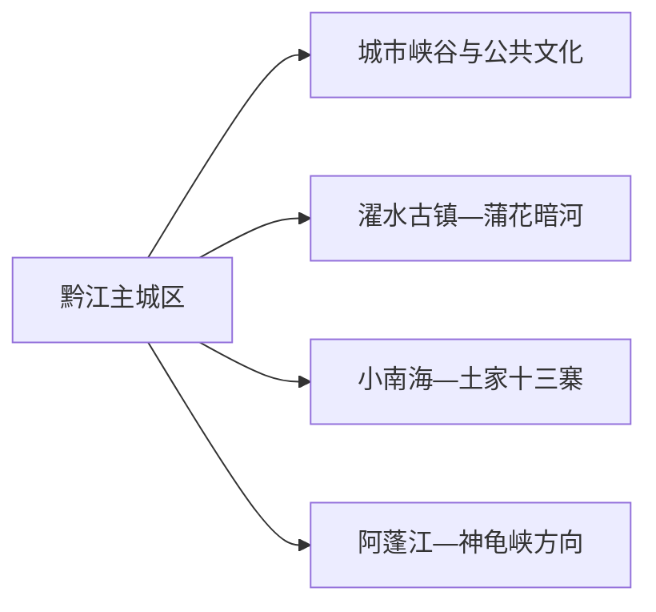
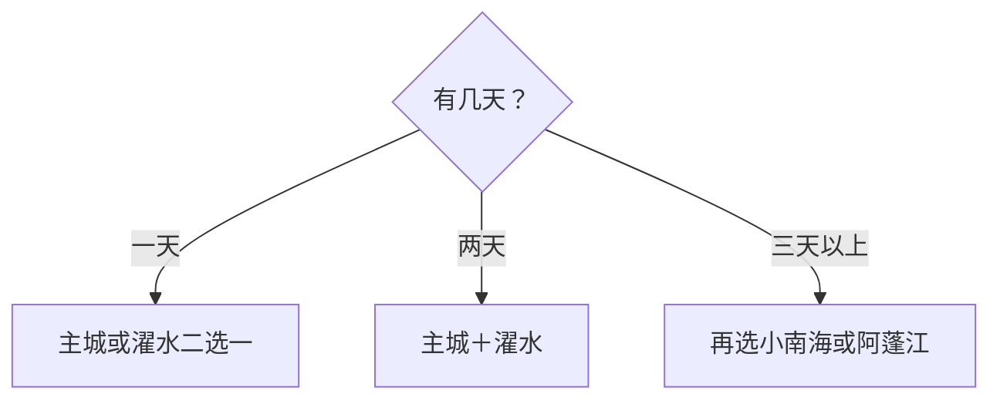

# 黔江旅行指南

黔江适合按“城市峡谷—濯水古镇—山水远线”来选。首日用黔江城区和城市大峡谷适应山地节奏，第二天完整安排濯水古镇及蒲花暗河，第三天再从小南海、土家十三寨或阿蓬江方向选一条远线。

> 建议停留：2–4 天 
> 旅行关键词：濯水古镇、蒲花暗河、城市峡谷、小南海、土家文化 
> 主要体力：城区中等；峡谷、洞穴与远线中高 
> 最近研究：2026-08-12

## 城市速览

| 项目 | 旅行信息 |
|---|---|
| 主要旅行价值 | 山城、峡谷、古镇廊桥、地下河与土家村寨在同一区域形成多层山地体验 |
| 建议停留 | 2 天覆盖城区与濯水；3–4 天增加一条山水远线 |
| 较舒适季节 | 春秋适合步行；夏季关注暴雨和洞穴温差，冬季关注低温、雾和道路 |
| 预算特点 | 主城较平实，景区门票、远线车辆和换宿是主要增量 |
| 步行强度 | 城市有坡道，峡谷、古镇石板、洞穴和山地提高体力 |
| 主要天气风险 | 暴雨、山洪、滑坡、雷电、浓雾、低温与河流水位 |
| 独行旅行 | 主城和濯水易组织，远线先锁返程 |
| 亲子旅行 | 古镇和文化场景较友好，峡谷、洞穴与水边按年龄缩短 |
| 长者与低体力旅行 | 选主城文化空间加濯水核心短线，车辆分段接驳 |
| 无障碍信息 | 新建游客设施可先问询；古镇、峡谷和洞穴的设施连续性需向官方确认 |

## 城市格局与游览区域

黔江主城区是交通住宿基地，城市峡谷与城南公共空间可作抵达线。濯水位于主城外，是古镇、风雨廊桥与蒲花暗河共同组成的 5A 父景区；小南海、土家十三寨和阿蓬江各在不同远线方向，第三天选一条即可。

| 区域 | 主要内容 | 游览特点 | 与其他区域的关系 |
|---|---|---|---|
| 黔江主城区 | 住宿、交通、城市峡谷、公共文化 | 坡地城市，适合抵达日 | 是全部远线基地 |
| 濯水片区 | 古镇、廊桥、蒲花暗河 | 古镇与洞穴组合为完整一日 | 可住一晚体验早晚 |
| 小南海—土家十三寨 | 地震堰塞湖、村寨与土家文化 | 山路与天气影响明显 | 适合独立一日 |
| 阿蓬江方向 | 河谷、湿地与神龟峡等正式项目 | 水位、船务和保护要求重要 | 与小南海方向二选一 |

GeoNames `8408334` 与 Wikidata `Q713946` 的 `P1566` 精确对应黔江，现行代码 `500114`。黔江是重庆市辖区，本页按独立山地旅行尺度组织；重庆中心城区另作跨区联程。

## 主要景点

### 主城与濯水

| 景点 | 区域 | 类型 | 主要看点 | 建议用时 | 室内外 | 体力 | 预约风险 | 天气影响 | 优先级 |
|---|---|---|---|---:|---|---|---|---|---|
| 黔江城市大峡谷 | 主城区 | 城市峡谷、步道 | 峡谷地貌与山城关系 | 2–3 小时 | 室外 | 中高 | 中；步道开放需核 | 高 | A |
| 濯水景区（古镇、风雨廊桥、蒲花暗河） | 濯水 | 5A景区、古镇、洞穴 | 古镇街巷、廊桥、地下河与山水 | 1 天 | 混合 | 中高 | 高；各子项开放与票务需核 | 高 | A |
| 黔江公共文化场馆 | 主城区 | 博物馆／文化馆 | 地方历史、民族文化与临展 | 1.5–2 小时 | 室内 | 低 | 中；场馆开放需核 | 低 | B |

### 山水远线

| 景点 | 区域 | 类型 | 主要看点 | 建议用时 | 室内外 | 体力 | 预约风险 | 天气影响 | 优先级 |
|---|---|---|---|---:|---|---|---|---|---|
| 小南海景区 | 小南海 | 湖泊、地质 | 地震堰塞湖与山地水景 | 3–4 小时 | 室外 | 中 | 高；交通与开放需核 | 高 | B |
| 土家十三寨 | 小南海方向 | 村寨、民族文化 | 聚落、生活文化与乡村景观 | 2–3 小时 | 混合 | 中 | 高；接待与活动需核 | 高 | B |
| 阿蓬江国家重要湿地开放观察点 | 阿蓬江 | 河流湿地、生态 | 河谷、水鸟和生态环境 | 1–2 小时 | 室外 | 低至中 | 高；开放观察点需核 | 高 | C |
| 神龟峡等正式运营河谷项目 | 阿蓬江方向 | 峡谷、水上体验 | 河谷景观与船行视角 | 3–4 小时 | 室外 | 中 | 高；水位、船务和运营需核 | 极高 | C |

濯水古镇、风雨廊桥与蒲花暗河按一个完整父景区计，不拆成多座“景区”。阿蓬江湿地、河岸和水域优先使用正式观景点与持证项目；汛期依据水情和交通公告调整。

## 美食与餐饮

| 菜品或餐饮类型 | 常见区域 | 一个人用餐与常见份量 | 风味、过敏原与饮食限制 | 排队风险与替代方法 |
|---|---|---|---|---|
| 黔江鸡杂 | 主城区、濯水 | 多人共享，一人问小锅 | 内脏、辣椒、花椒和油脂 | 可调辣度或换清淡家常菜 |
| 绿豆粉与米面 | 主城区、镇区 | 单人友好 | 汤底、肉类、辣椒和大豆 | 早餐高峰换同类小店 |
| 土家腊味与家常菜 | 濯水、村寨正规餐馆 | 适合共享 | 盐分、烟熏肉、辣椒；素食先问 | 选明码菜单和时蔬 |
| 河鲜 | 正规餐馆 | 先问重量与总价 | 鱼类过敏和刺；来源与禁渔要求优先 | 换陆地熟食或养殖来源菜品 |

## 经典行程

### 一日经典路线

**路线**：黔江主城 → 城市大峡谷开放段 → 午餐 → 公共文化场馆或城市慢行

- **串联逻辑**：以主城为单位，先看地貌再用室内场馆收束。
- **预约锚点**：峡谷步道和场馆开放。
- **休息安排**：午餐长休，下午减少坡道。
- **时间不足时**：保留峡谷短线和一个室内点。

### 两日城市路线

**第 1 天**：主城与城市峡谷。 
**第 2 天**：濯水景区完整一日。

- **串联逻辑**：山城与古镇洞穴分日，避免同日跨区赶场。
- **预约锚点**：濯水各子项、交通和返程。
- **休息安排**：濯水午间安排室内或餐饮休息。
- **时间不足时**：第二天保留古镇和廊桥，洞穴按开放取舍。

### 三日深度路线

**第 1 天**：主城。 
**第 2 天**：濯水。 
**第 3 天**：小南海—土家十三寨或阿蓬江方向二选一。

- **串联逻辑**：前两天完成核心，第三天只走一条山地远线。
- **预约锚点**：第三天车辆、景区、船务或村寨接待。
- **休息安排**：远线午餐与返程各留缓冲。
- **时间不足时**：删除第三天。

### 雨天路线

**路线**：主城公共文化场馆 → 午餐 → 濯水古镇可开放短段或城区室内活动

- **适用条件**：普通降雨；暴雨、山洪和地灾预警时留在安全城区。
- **串联逻辑**：室内优先，古镇段按水情和道路决定。
- **预约锚点**：场馆、景区和交通公告。
- **休息安排**：馆内与餐饮区分段坐休。
- **时间不足时**：只保留主城场馆。

### 亲子或低体力路线

**亲子路线**：公共文化场馆 → 午餐 → 濯水古镇核心短线。 
**低体力路线**：车辆到濯水核心入口 → 廊桥观景 → 午餐 → 早返。

- **减负方式**：亲子线减少洞穴与水边时长；低体力线避开峡谷长坡和多次换乘。
- **预约锚点**：下客点、卫生间、座椅和洞穴年龄规则。
- **休息安排**：午餐长休，下午只保留一个点。
- **时间不足时**：均保留濯水核心或主城场馆之一。

### 远郊一日路线

**路线**：主城 → 小南海 → 土家十三寨 → 返回主城

- **适用条件**：道路、天气、景区和村寨接待明确。
- **串联逻辑**：湖泊地质与邻近村寨组成同方向一日。
- **预约锚点**：车辆、开放、讲解和返程。
- **休息安排**：正规服务点午休，返程前补水。
- **时间不足时**：在小南海和村寨中二选一。

## 住宿区域

| 区域 | 优点 | 缺点 | 适合人群 | 交通特点 |
|---|---|---|---|---|
| 黔江主城区 | 铁路、机场、餐饮和远线发车方便 | 到濯水和远线均需车辆 | 首访、多日基地、公共交通 | 优先靠近次日出发点 |
| 濯水古镇 | 便于体验早晚街景 | 到其他远线需重新接驳 | 古镇慢旅行、摄影 | 先核住宿资质、停车和返程 |
| 小南海等远线周边 | 清晨进入景区方便 | 服务与选择较少 | 自驾、深度旅行 | 仅选正式接待住宿 |

## 市内交通

| 场景 | 建议与取舍 | 行前需要重查的内容 |
|---|---|---|
| 铁路／航空抵达 | 黔江站和黔江武陵山机场分别接入主城 | 车次、航班、机场接驳和末班 |
| 主城—濯水 | 公共交通、客运或预约车辆 | 班次、施工、返程与夜间接驳 |
| 小南海与阿蓬江 | 自驾或预约车辆更易留缓冲 | 山路、地灾、水位、信号和返程 |
| 主城步行 | 坡地路线分段，车辆连接较大高差 | 步道关闭、道路管制和高温 |

## 不同旅行者须知

| 旅行维度 | 可行条件 | 主要取舍 | 需额外核对 |
|---|---|---|---|
| 独行旅行 | 主城与濯水线路成熟 | 远线先锁返程 | 夜间接驳、信号、最低成团 |
| 亲子旅行 | 古镇与文化场馆友好 | 洞穴、水边和峡谷缩短 | 年龄、救生、卫生间 |
| 长者或低体力旅行 | 车辆直达核心入口 | 坡道、石板和换乘是主要负担 | 下客点、座椅、索道／接驳 |
| 无障碍需求 | 新建游客设施优先咨询 | 古镇、峡谷和洞穴连续性有限 | 设施连续性需向官方确认 |
| 摄影旅行 | 山城、廊桥、峡谷和村寨题材丰富 | 宗教、民俗活动和无人机规则优先 | 三脚架、无人机、商业拍摄 |
| 水域旅行 | 正式运营且水情稳定时选择 | 船务和湿地保护边界优先 | 水位、救生、停航和封闭区 |
| 特殊天气 | 路线可退改并留城区方案 | 暴雨时远线整体后移 | 地灾、山洪、道路和景区公告 |

## 行前核对

| 核对事项 | 为什么需要重查 | 建议核对时间 | 官方入口 |
|---|---|---|---|
| 濯水景区 | 子项、票务和洞穴开放会调整 | 排路线前及前一日 | [重庆市政府：濯水景区](https://www.cq.gov.cn/zjcq/cycq/zmjd/zqaaaaajjq/202606/t20260604_15729051.html) |
| 小南海与阿蓬江 | 道路、水位、船务和保护要求变化 | 出发前三日及当天 | [重庆市文化和旅游发展委员会](https://whlyw.cq.gov.cn/) |
| 铁路与航空 | 班次、航班和接驳变化 | 购票前及当天 | [中国铁路12306](https://www.12306.cn/) |
| 天气与地灾 | 暴雨、山洪、滑坡和浓雾影响山路 | 出发前三日及当天 | [重庆市气象局](https://cq.cma.gov.cn/) |
| 湿地与河流活动 | 开放观察点、禁入区和水上项目随管理调整 | 到访前 | [阿蓬江国家重要湿地资料](https://www.cq.gov.cn/zjcq/lszq/stpz/gjjsdgy/202606/t20260604_15728233.html) |

## 来源与更新记录

### 主要来源

| 来源 | 类型 | 支持内容 | 核验日期 |
|---|---|---|---|
| [濯水景区资料](https://www.cq.gov.cn/zjcq/cycq/zmjd/zqaaaaajjq/202606/t20260604_15729051.html) | 重庆市人民政府 | 5A景区、古镇、廊桥和蒲花暗河父项关系 | 2026-08-12 |
| [黔江文旅资料](https://whlyw.cq.gov.cn/zwxx_221/ztzl/wlcy/wlsqczq/202601/t20260115_15323142.html) | 重庆市文旅委 | 区域文旅资源与文化线索 | 2026-08-12 |
| [黔江生态保护资料](https://www.cq.gov.cn/zwgk/zfxxgkml/zdlyxxgk/stbh/hjbh/202605/t20260508_15660808.html) | 重庆市人民政府 | 生态、水域与保护边界 | 2026-08-12 |
| [阿蓬江国家重要湿地](https://www.cq.gov.cn/zjcq/lszq/stpz/gjjsdgy/202606/t20260604_15728233.html) | 重庆市人民政府 | 湿地属性与生态方向 | 2026-08-12 |
| [Wikidata Q713946](https://www.wikidata.org/wiki/Special:EntityData/Q713946.json) | 开放结构化数据 | 黔江与 GeoNames 精确交叉核验 | 2026-08-12 |
| [GeoNames 8408334](https://sws.geonames.org/8408334/about.rdf) | 开放地名数据 | 固定黔江城市记录 | 2026-08-12 |
| [民政部行政区划代码查询](https://dmfw.mca.gov.cn/xzqh/getList?code=500114&trimCode=false&maxLevel=3) | 国家行政区划数据 | 现行代码 500114 | 2026-08-12 |

### 更新记录

| 日期 | 更新内容 |
|---|---|
| 2026-08-12 | 首次完成黔江指南，核验濯水父景区、三条远线、生态水域与区级边界 |
