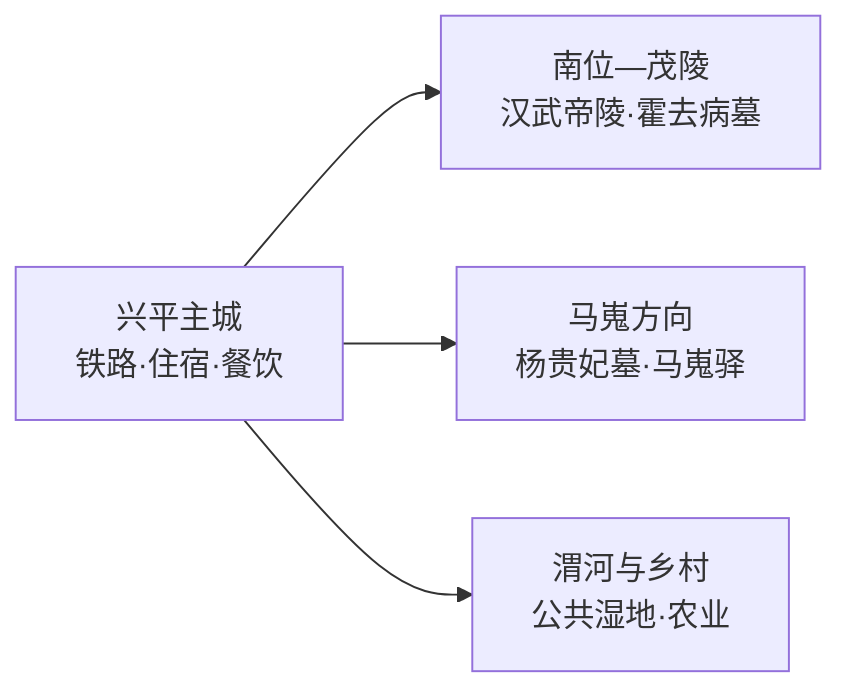
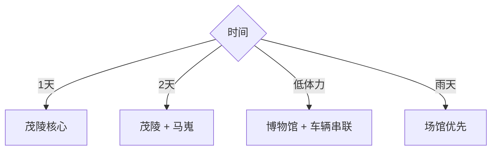

# 兴平旅行指南

兴平位于关中平原、咸阳以西，主城承担铁路和住宿，茂陵—霍去病墓在东部南位方向，杨贵妃墓—马嵬驿在西部马嵬方向，两条历史线适合分日。固定快照中的 **Xicheng / GeoNames 7063942** 锚定兴平主城西城街道；景点虽常纳入西安—咸阳西线旅行，行政与交通仍按兴平县级市独立组织。

> 建议停留：2 天\
> 旅行关键词：茂陵、霍去病墓、西汉石刻、马嵬、关中平原\
> 主要体力：低至中等\
> 最近研究：2026-09-03

## 城市速览

| 项目 | 旅行信息 |
|---|---|
| 主要旅行价值 | 以茂陵陵区和霍去病墓石刻理解西汉帝陵，再用马嵬线补充唐代叙事与关中民俗 |
| 建议停留 | 茂陵1天，马嵬方向1天；只看核心可安排一日 |
| 较舒适季节 | 春秋适合遗址与乡村步行；夏季注意高温和雷雨，冬季注意雾霾与寒风 |
| 预算特点 | 门票与城郊车辆是主要支出，主城餐饮住宿较温和 |
| 步行强度 | 陵区尺度大但坡度有限；马嵬街区以平缓步行为主 |
| 主要天气风险 | 高温、雷雨、大风、低温与能见度下降 |
| 独行旅行 | 主城与铁路方便，城郊返程提前落实 |
| 亲子旅行 | 茂陵博物馆和石刻直观，陵区日晒与步行需控量 |
| 长者与低体力旅行 | 选择博物馆核心展区与车辆串联，减少陵区外围步行 |
| 无障碍信息 | 博物馆主体设施可优先选择，墓园与乡村街区连续性需确认 |

## 城市格局与游览区域

| 区域 | 主要内容 | 游览特点 | 与其他区域的关系 |
|---|---|---|---|
| 兴平主城 | 城市生活、车站与补给 | 平缓易行 | 两条远线的共同基地 |
| 南位—茂陵 | 茂陵博物馆、汉武帝陵与陪葬墓体系 | 遗址分散，需车辆和较多室外时间 | 适合独立一天 |
| 马嵬方向 | 杨贵妃墓、马嵬驿公开区 | 历史叙事与民俗商业并存 | 与茂陵分处主城两侧 |
| 渭河乡村 | 湿地、农业与季节活动 | 只选正式开放公共点 | 作为弹性半日 |

## 主要景点

| 景点 | 区域 | 类型 | 主要看点 | 建议用时 | 室内外 | 体力 | 预约风险 | 天气影响 | 优先级 |
|---|---|---|---|---:|---|---|---|---|---|
| 茂陵博物馆与霍去病墓园 | 南位镇 | 博物馆与陵墓 | 西汉史、霍去病墓和大型石刻 | 3–4小时 | 混合 | 中 | 节假日中 | 中 | A |
| 汉武帝茂陵园区公开区 | 茂陵 | 帝陵遗址 | 帝陵尺度、陵园格局与关中地形 | 2–3小时 | 室外 | 中 | 中 | 高 | A |
| 杨贵妃墓博物馆 | 马嵬方向 | 墓园与博物馆 | 唐代历史叙事、墓园与相关展陈 | 1.5–2小时 | 混合 | 低 | 中 | 中 | B |
| 马嵬驿民俗文化体验园公开区 | 马嵬 | 民俗街区 | 关中饮食、农耕展示与马嵬叙事 | 2–3小时 | 混合 | 低 | 活动期中 | 中 | B |
| 兴平城市公共文化空间 | 主城 | 城市与公共文化 | 地方史补充、城市生活与休息 | 1–2小时 | 室内为主 | 低 | 中 | 低 | B |
| 渭河公开湿地与公园 | 市域南部 | 湿地与公共空间 | 平原河流、季节植物与城市生态 | 2–3小时 | 室外 | 低 | 低 | 高 | C |

## 美食与餐饮

| 菜品或餐饮类型 | 常见区域 | 一个人用餐与常见份量 | 风味、过敏原与饮食限制 | 排队风险与替代方法 |
|---|---|---|---|---|
| 关中面食 | 主城 | 单碗方便 | 麸质、辣椒和肉臊子按需求选择 | 午餐高峰换同类面馆 |
| 臊子面 | 主城、乡镇 | 一人可点，部分店按小碗续添 | 常含猪肉、醋和辣椒 | 先问计价与份量 |
| 锅盔与面点 | 主城、马嵬 | 单份适合加餐 | 含麸质，夹馅可能含肉 | 选现做、明码标价摊点 |
| 辣子与关中小吃 | 马嵬公开商业区 | 适合少量多样 | 辛辣、油脂与花生需注意 | 热门区排队时回主城用餐 |

## 经典行程

### 一日经典路线

**路线**：主城 → 茂陵博物馆与霍去病墓园 → 午餐 → 汉武帝茂陵园区 → 主城

- **串联逻辑**：围绕西汉陵区集中安排，先看展陈和石刻，再理解帝陵空间。
- **预约锚点**：两处开放、票务和讲解。
- **休息安排**：博物馆服务区或返回主城午餐。
- **时间不足时**：保留茂陵博物馆与霍去病墓园，删外围停留。

### 两日城市路线

**第 1 天**：茂陵—霍去病墓。\
**第 2 天**：杨贵妃墓 → 马嵬驿公开区。

- **串联逻辑**：汉唐两条历史线分日，减少横穿主城。
- **预约锚点**：博物馆开放与第二日活动。
- **休息安排**：主城连住。
- **时间不足时**：第二日只保留杨贵妃墓。

### 三日深度路线

**第 1 天**：主城与公共文化。\
**第 2 天**：茂陵线。\
**第 3 天**：马嵬线与公开乡村点。

- **串联逻辑**：加入城市背景后再分读汉唐遗产。
- **预约锚点**：场馆、讲解和乡村接待。
- **休息安排**：全程住主城。
- **时间不足时**：删第一天主城，保留两条遗产线。

### 雨天路线

**路线**：茂陵博物馆室内展陈 → 主城午餐 → 城市公共文化空间

- **适用条件**：普通降雨采用场馆线；雷暴与强对流时减少墓园空旷区停留。
- **预约锚点**：闭馆和最晚入场。
- **休息安排**：博物馆与主城。
- **时间不足时**：保留茂陵博物馆。

### 亲子或低体力路线

**亲子路线**：茂陵博物馆 → 石刻核心 → 主城休息。\
**低体力路线**：车辆抵达博物馆 → 核心展陈 → 霍去病墓近段 → 返回。

- **减负方式**：亲子线控制日晒；低体力线减少陵区外围距离。
- **预约锚点**：无障碍入口、讲解与停车。
- **休息安排**：博物馆服务区。
- **时间不足时**：两线都保留室内展陈。

### 远郊一日路线

**路线**：主城 → 杨贵妃墓 → 马嵬驿公开区 → 正规乡村体验 → 返回

- **适用条件**：适合已完成茂陵线且落实返程的旅行者。
- **预约锚点**：场馆、活动与车辆。
- **休息安排**：马嵬正规商业区。
- **时间不足时**：删乡村延伸，保留前两点。

### 西安咸阳联游路线

**路线**：西安或咸阳出发 → 兴平茂陵单一主线 → 兴平主城或原城住宿

- **串联逻辑**：城际交通可联游，但茂陵用完整半日以上更利于理解。
- **预约锚点**：铁路、公路和茂陵票务。
- **休息安排**：兴平或出发城市择一住宿。
- **时间不足时**：只保留茂陵博物馆，不追加马嵬线。

## 住宿区域

| 区域 | 优点 | 缺点 | 适合人群 | 交通特点 |
|---|---|---|---|---|
| 兴平主城 | 餐饮、铁路和车辆方便 | 景点均需接驳 | 首访与公共交通旅行者 | 两条远线共同基地 |
| 茂陵周边正规住宿 | 方便早到陵区 | 选择少于主城 | 历史摄影与慢游 | 确认具体位置和接送 |
| 咸阳或西安 | 住宿选择多 | 当日往返增加通勤 | 只安排茂陵单点者 | 核对返程班次 |

## 市内交通

| 场景 | 建议与取舍 | 行前需要重查的内容 |
|---|---|---|
| 抵达主城 | 铁路或公路进入兴平，先确认到达站 | 车次、站点与末班 |
| 前往茂陵 | 公交、出租或合规车辆按博物馆入口导航 | 公交、停车与景区接驳 |
| 前往马嵬 | 与茂陵分方向，另行安排车辆 | 返程、活动交通与道路 |
| 自驾 | 两条城郊线更灵活 | 停车、节假日拥堵与文保管制 |

## 不同旅行者须知

| 旅行维度 | 可行条件 | 主要取舍 | 需额外核对 |
|---|---|---|---|
| 独行旅行 | 主城交通方便 | 城郊返程需计划 | 最晚班次与车辆 |
| 亲子旅行 | 博物馆与石刻直观 | 日晒和陵区步行 | 儿童票、讲解与休息点 |
| 长者或低体力旅行 | 车辆可连接核心点 | 外围陵区尺度大 | 无障碍入口与停车 |
| 无障碍需求 | 优先博物馆核心 | 墓园地面连续性有限 | 坡道、卫生间与轮椅路线 |
| 摄影旅行 | 石刻、封土与平原景观鲜明 | 文物和墓园拍摄受管理 | 三脚架、航拍与商业拍摄 |
| 预算有限 | 主城食宿温和 | 多次打车增加成本 | 公交与联程票务 |
| 晚出发或紧凑行程 | 茂陵博物馆单点可行 | 两条历史线无法同日细看 | 最晚入场与返程 |
| 特殊天气或自然条件 | 场馆线易调整 | 高温、雷雨和低能见度影响室外遗址 | 气象与场馆公告 |

帝陵、陪葬墓、考古区与文物保护范围按正式入口和开放线路参观；封土、田间遗址、发掘区、渭河行洪空间、农业生产区和铁路设施保留明确限制。

## 行前核对

| 核对事项 | 为什么需要重查 | 建议核对时间 | 官方入口 |
|---|---|---|---|
| 茂陵票务与开放 | 展陈、考古和维护会调整游线 | 预约前及到访前一日 | [茂陵博物馆](https://www.maoling.com/) |
| 杨贵妃墓与马嵬活动 | 改造和节庆影响开放 | 排入路线前 | [兴平市人民政府](http://www.snxingping.gov.cn/) |
| 城际与市内交通 | 班次、道路和末班变化 | 出发前及当天 | [中国铁路12306](https://www.12306.cn/) |
| 天气与文保规则 | 高温、雷雨和保护工程影响室外游览 | 出发前三日及当天 | [陕西省文物局](https://wwj.shaanxi.gov.cn/) |

## 来源与更新记录

### 主要来源

| 来源 | 类型 | 支持内容 | 核验日期 |
|---|---|---|---|
| [茂陵博物馆](https://www.maoling.com/) | 场馆 | 茂陵、霍去病墓、石刻群与陵区尺度 | 2026-09-03 |
| [文化和旅游部乡村线路：马嵬驿](https://zhuanti.mct.gov.cn/csxz2022/shanxi1/detail_g7yU_730/4450.html) | 政府 | 马嵬驿位置、景区等级与民俗体验 | 2026-09-03 |
| [GeoNames 7063942](https://www.geonames.org/7063942/) | 开放数据 | Xicheng 固定人口点、坐标与行政代码 | 2026-09-03 |

### 更新记录

| 日期 | 更新内容 |
|---|---|
| 2026-09-03 | 首次完成资料研究、汉唐双线、七条路线与县级市映射 |
