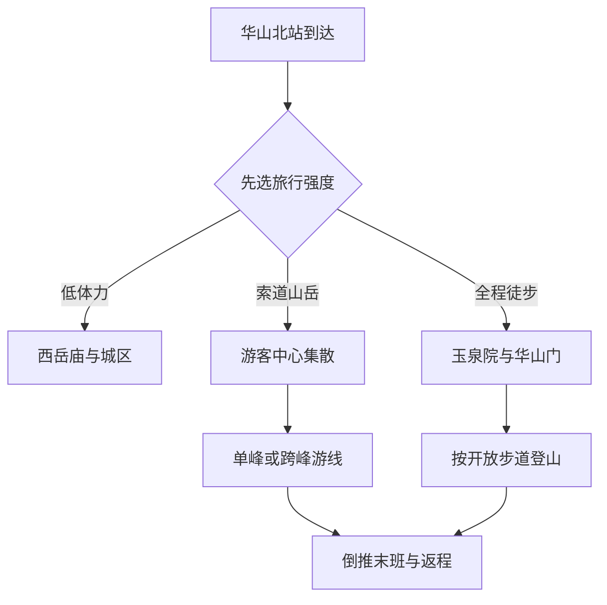
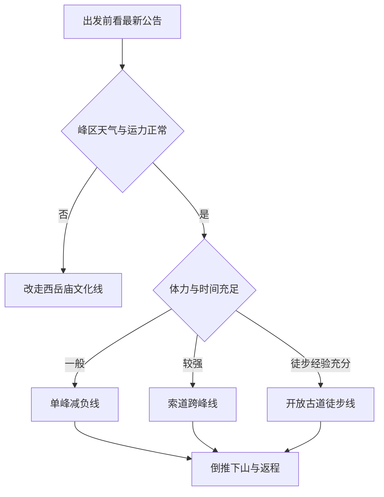

# 华阴旅行指南

华阴位于关中平原东端、秦岭北麓，华山是这里最醒目的旅行主题，但城市并不等于一条登山路线。华山北站、华山游客中心、玉泉院徒步入口、东西两条索道进山通道和华阴城区分处不同位置；西岳庙又在城区北侧。真正可执行的安排，应先决定“登山强度”，再选择住宿地、进山方式和离开时间，而不是到站后才临时拼接峰区。

> 建议停留：华山与城市文化共 2 天；只做低体力城市线可安排 1 天；全程徒步或等待天气窗口宜预留 2–3 天 
> 旅行关键词：华山、西岳庙、秦岭北麓、道教文化、魏长城、关中东府 
> 主要体力：城区低至中等；索道山岳线中高；全程徒步高至极高 
> 最近研究：2026-08-12

## 城市速览

| 项目 | 旅行信息 |
|---|---|
| 主要旅行价值 | 把华山的花岗岩峰林、古代山岳信仰和西岳庙的国家祭祀空间连起来理解；再用华阴城区与魏长城开放段补足关中东端的城市和边防历史。 |
| 建议停留 | 1 天可选择“华山减负线”或“西岳庙加城区文化线”，两者不要硬塞；2 天最适合分别安排山岳与文化；全程徒步、日出或天气不稳时宜增加缓冲日。 |
| 较舒适季节 | 春秋通常更适合登山，但春季大风、沙尘和快速降温并不少见，秋季可能出现连阴雨。夏季防高温、雷电和短时强降雨；冬季关注积雪、结冰、索道与步道停运。 |
| 预算特点 | 城区餐饮和住宿较易控制；华山门票、景交车、索道、山上补给和旺季住宿是主要增量。不同索道与进山车不是天然包含在同一种票里。 |
| 步行强度 | 西岳庙和城区为低至中等；即使索道上下，峰区仍有长台阶、坡道、狭窄路段与高差；从玉泉院徒步登山属于高强度长时山岳活动。 |
| 主要天气风险 | 华山峰区的风、雾、雷电、降温、雨雪和结冰可远强于山下。山顶观景条件不能用华阴城区天气替代判断，景区停运与封闭通知优先于原计划。 |
| 独行旅行 | 城区、正规场馆和成熟游线可独立安排；夜间、恶劣天气或长距离徒步不应在没有返程、通信、照明和体力余量时勉强进行。 |
| 亲子旅行 | 西岳庙、游客中心和短线索道方案较易取舍；峰区护栏、陡阶和拥挤路段需要持续看护，长空栈道、鹞子翻身等高风险体验不能作为亲子必做项目。 |
| 长者与低体力旅行 | 城区文化线最容易减负；索道只能减少部分爬升，不能把峰区变成平地。可将目标缩至单一峰区，并在进山前确认接驳、台阶、休息点和末班时间。 |
| 无障碍信息 | 官方公开资料能证明部分人群享有票务优惠，却不足以证明游客中心、景交车、索道上下站、峰区步道和古建院落构成连续无障碍动线。轮椅通行、陪同、无障碍卫生间和设备尺寸需逐点确认。 |

第一次来华阴，最重要的选择不是“看几个峰”，而是确定自己的山岳方式：只在山下理解华山文化、索道到单一峰区、索道跨峰，或从玉泉院徒步。四种方式的耗时、风险和返程边界差异很大。

## 城市格局与游览区域

华阴旅行空间沿秦岭北麓和关中平原展开。华山风景名胜区位于城市南部，游客中心承担乘索进山的集散；玉泉院—华山门是传统徒步入口；西峰与北峰索道各有自己的进山车和上下站。华阴城区位于山前平原，西岳庙在城区北侧，华山北站则是主要高铁到达点。各节点名称相近，但不能用步行时间互相替代。

| 区域 | 主要内容 | 游览特点 | 与其他区域的关系 |
|---|---|---|---|
| 华山游客中心—乘索集散区 | 实名核验、景区咨询、北峰或西峰进山车换乘 | 乘索路线从这里分流；具体票种、检票口、进山车和索道组合必须按当期页面确认 | 距华山北站和城区都需地面接驳，不是到站即可登峰 |
| 玉泉院—华山门徒步口 | 玉泉院、传统登山入口及华山峪方向 | 适合准备充分的徒步者；夜间开放、检票、照明与途中服务均服从当期公告 | 与游客中心乘索入口不是同一个检票口，不能买错路线后默认现场互换 |
| 华山峰区 | 北峰、中峰、东峰、南峰、西峰及连接步道 | 高差、台阶、狭窄路段和天气暴露显著；五峰和内部体验都属于同一华山景区 | 是否跨峰由体力、客流、索道末班和天气共同决定，不以“来都来了”为理由追加 |
| 华阴城区—西岳庙 | 西岳庙、城区公共服务、居民餐饮与住宿 | 适合低体力、雨天或登山前后的半日至一日 | 可与华山北站、游客中心分别用车连接；不把古庙院落视为华山峰区的顺路出口 |
| 魏长城城南公开展示方向 | 魏长城华阴城南段及关中东端历史线索 | 属文物展示方向，实际入口、开放段和接待条件需临行核对 | 不沿遗址线、农田、铁路或村道自行穿越，不与潼关县景点混算 |
| 黄河湿地与生产边界 | 华阴北部湿地、河滩、农业、罗敷工业园及交通设施 | 保护地、滩涂、灌渠、厂区和铁路作业区不是一般观景道路 | 只有正式开放的公园、道路或经营项目可进入；地图上的便道不代表公众准入 |

**行政与数据范围。**本页对应法定县级市华阴市，行政代码为 **610582**，由渭南市代管。GeoNames `1806988` 是名为 Huayin 的居民点记录，类型为 `P/PPL`；Wikidata `Q785966` 的 GeoNames 属性与法定代码均与本页精确对应。华阴属于渭南市域，但拥有独立法定城市代码与完整旅行体系；华州区、华阴市和潼关县是不同目的地。

**景区去重。**华山主峰、华山峪、黄甫峪、瓮峪、仙峪、华麓、五峰、索道、步道和山上体验都在华山风景名胜区的统一管理框架内。本页把它们作为一个完整大景区安排，不拆成多个景点提高数量。西岳庙虽属于华山文化体系，因位于城区、具有独立古建游览空间，可单独安排。

**保护与生产边界。**华山景区禁止在非指定区域吸烟用火，也禁止开山、采石、开矿、挖沙、取土等破坏活动。游客同样不能以“探路”为由进入封闭步道、施工区、索道设备区、林场防火区、矿山、工业园、铁路专用线、河滩和湿地保护范围。罗敷工业园是生产空间，不是工业旅游项目。

## 主要景点

优先级用于安排时间，不代表绝对排名：**A** 为首访核心，**B** 为城市文化补充，**C** 为开放条件更不稳定或适合专题兴趣的方向。车站、游客中心和餐饮街区标记为“路线节点”，不计入景点完成率。

### 华山完整景区

| 景点 | 区域 | 类型 | 主要看点 | 建议用时 | 室内外 | 体力 | 预约风险 | 天气影响 | 优先级 |
|---|---|---|---|---:|---|---|---|---|---|
| 华山风景名胜区 | 华阴南部秦岭北麓 | 山岳、文化遗产、风景名胜区 | 花岗岩峰林、五峰关系、山岳信仰、古道与现代索道游线；峰区、索道和内部体验整体计一次 | 索道线 6–10 小时；徒步线常需更久 | 以室外为主 | 中高至极高 | 很高 | 很高 | A |

华山不是“乘索道就不用走路”的景点。北峰、西峰与其他峰之间仍有明显高差；湿滑、拥挤、风大或结冰时，平时可走的台阶也会显著增加风险。长空栈道、鹞子翻身属于额外高风险体验，不是主游线的必经证明，也不应在恐高、疲劳、饮酒、服药影响反应或天气不稳时参加。

华山官网会发布路线、票务和临时公告，但旧页面可能保留已被后续通知替代的优惠或防疫文字。本页不固化票价、优惠年龄、健康码要求、夜爬开放或索道时刻；出发前应按日期查看最新公告，并以更晚发布的规则为准。

### 城区古建与历史

| 景点 | 区域 | 类型 | 主要看点 | 建议用时 | 室内外 | 体力 | 预约风险 | 天气影响 | 优先级 |
|---|---|---|---|---:|---|---|---|---|---|
| 西岳庙 | 华阴城区北侧 | 古建筑、碑刻、山岳祭祀 | 明清宫殿式院落、中轴空间、御碑与华山祭祀文化；全院按一个古建群游览 | 2–3 小时 | 混合 | 低至中 | 中 | 中 | B |
| 魏长城华阴城南公开展示段 | 华阴城南方向 | 土遗址、边防史 | 战国魏长城遗存与关中东端地理关系；只进入当期公布开放范围 | 1–2 小时，另加接驳 | 室外 | 中 | 高 | 高 | C |
| 华阴城区公共街区 | 岳庙街、太华路等生活区域 | 城市观察、餐饮 | 山岳旅游城市的日常生活、关中面食和登山补给 | 1–2 小时 | 以室外为主 | 低 | 低 | 中 | 路线节点 |

西岳庙的院落门槛、石阶和古建保护要求与现代场馆不同，不能因为整体地势平缓就推定轮椅可连续通行。魏长城的“已建成开放”只证明存在公开展示段，不表示整条遗址线、周边村道和田野都可进入；没有现场标识或管理方确认时，不沿土墙遗迹自行追踪。

### 集散与当期活动

| 景点 | 区域 | 类型 | 主要看点 | 建议用时 | 室内外 | 体力 | 预约风险 | 天气影响 | 优先级 |
|---|---|---|---|---:|---|---|---|---|---|
| 华山游客中心 | 华山景区山前 | 综合服务、交通集散 | 当期票务、咨询、检票和进山车分流；用于确认路线，不作为独立景点计数 | 30–60 分钟，旺季另留排队 | 室内为主 | 低 | 很高 | 中 | 路线节点 |
| 华山北站 | 城区东南交通节点 | 铁路集散 | 高铁抵离、城市与景区接驳起点 | 30–60 分钟换乘 | 室内为主 | 低 | 高 | 中 | 路线节点 |
| 景区当期演出、露营或冰雪项目 | 官方公布地点 | 季节活动 | 只有当期明确运营、可售票且与主行程不冲突时才加入 | 依项目 | 混合 | 依项目 | 很高 | 高 | 活动节点 |

华山北站到游客中心、华阴城区和西岳庙是三个不同方向的接驳任务。列车到达时间接近入园截止时间时，不应把车站换乘、取票核验和排队时间压缩成零。

## 美食与餐饮

华阴饮食属于关中东府面食体系。登山日前后，选择容易判断份量、盐油和过敏原的居民餐饮，比追逐单一热门店更实用。景区官网列出的商户只能说明山前与城区存在餐饮选择，不构成长期品质背书。

| 菜品或餐饮类型 | 常见区域 | 一个人用餐与常见份量 | 风味、过敏原与饮食限制 | 排队风险与替代方法 |
|---|---|---|---|---|
| 华阴大刀面与手工宽面 | 华阴城区、岳庙街与居民餐饮区 | 多为一人一碗，可先要小份或少面 | 含小麦麸质，常配辣椒、醋、葱蒜与肉臊子；素食需确认汤底和浇头 | 饭点热门门店可能排队；换同片区现做面馆即可，不必追单店 |
| 牛肉面、羊肉泡馍与羊肉汤 | 城区、车站连接道路与山前服务区 | 一人可点一碗；泡馍份量通常较大，可询问是否自行掰馍 | 馍和面含小麦；牛羊肉不自动代表清真，汤底、辣油、香菜和共用厨具需另问 | 登山前避免因排队耽误检票；选择明码标价、出餐稳定的正规店 |
| 肉夹馍与早餐馍类 | 城区早餐店、车站与游客中心周边 | 适合单人和赶车，可搭配粥、豆浆或汤 | 含小麦；肉馅可能较油咸，豆浆含大豆，芝麻和花生配料需确认 | 早晨集中出行时可能售罄；准备独立包装替代补给 |
| 豆花、凉皮与米皮 | 城区居民餐饮区 | 适合单人，也可作为登山后轻食 | 豆花含大豆；凉皮、米皮的调味可能含小麦酱油、芝麻、花生和辣椒 | 夏季注意冷食储存和操作卫生；无法确认时改点热食 |
| 山上简餐与包装补给 | 华山正式服务点 | 价格与选择受运输条件影响；按路线准备饮水和易消化补给 | 包装食品查看坚果、乳、蛋和麸质标识；不因节省重量而少带必要饮水 | 旺季服务点排队或缺货时使用自备补给，但不在步道遗留垃圾 |

全程徒步前不宜用大量饮酒、过辣或过油的一餐“补能量”。需要清真、严格素食或严重过敏控制时，应让门店说明肉源、汤底、调料和共锅情况；远离城区后选择明显减少，最好携带成分清楚的备用食物。

## 经典行程

华阴路线先按体力和天气分流，再决定峰区范围。以下每条路线都保留预约、休息和删减位置，避免把“完成五峰”误当作唯一成功标准。

### 一日城区文化线

**路线**：西岳庙 → 城区午餐与长休 → 华阴城区公共街区 → 魏长城华阴城南公开展示段（仅在开放、交通明确时）

- **串联逻辑**：先在西岳庙理解国家祭祀与华山文化，再用城区饮食和魏长城补足城市历史，不承担峰区天气和索道压力。
- **适合谁**：低体力、雨天备选、带幼儿、对古建和碑刻兴趣更高的旅行者。
- **减负办法**：西岳庙与城南方向用车连接；若遗址入口不明确，午后只保留城区短线。
- **预约锚点**：西岳庙当日开放、停止入场及魏长城公开展示段的实际接待状态。
- **休息安排**：西岳庙后在城区正规餐饮区完成午餐和长休，避免在古建台阶旁临时席地休息。
- **时间不足时**：直接删除魏长城方向，保留西岳庙；不要为凑点位沿遗址野路寻找入口。

### 一日华山减负线

**路线**：华山游客中心 → 当期开放的进山车与索道 → 单一峰区短游 → 原索道或官方建议路线下山 → 返回游客中心

- **串联逻辑**：把目标限定为一个峰区，减少跨峰高差和错过末班风险；上下山方式在进山前一次决定。
- **适合谁**：首次登华山、长者、亲子或体力一般但能够应对台阶者。
- **减负办法**：优先选择官方当日建议的短线，放弃远峰和额外高风险体验；行李留在山下合规寄存处。
- **预约锚点**：实名入园时段、对应进山车与索道票、索道末班、峰区步道和返程列车。
- **休息安排**：进山前在游客中心补水；到达峰区先休息再决定延伸，不在末班前才开始跨峰。
- **时间不足时**：只保留索道到达峰和最近观景段，提前下山；不以奔跑、插队或走封闭捷径追回时间。

### 一日索道跨峰线

**路线**：游客中心 → 一侧索道上山 → 按开放主游线经过部分峰区 → 另一侧索道下山 → 游客中心

- **串联逻辑**：利用两条索道形成不完全回头的山岳日，但五峰不是强制清单，沿途按体力设返回阈值。
- **适合谁**：体力中上、能持续走台阶、无严重恐高且行程只有一个稳定天气日的旅行者。
- **减负办法**：减少峰顶停留和额外体验，只走护栏、标识和开放状态明确的主线；拥挤时主动缩短。
- **预约锚点**：上下行索道组合、各自进山车、入园时段、两侧末班和实时停运通知。
- **休息安排**：每到主要分岔先短休并检查时间；午间用自备补给或正式服务点完成不少于 30 分钟的恢复。
- **时间不足时**：在官方人员建议的最近返回点回撤，取消远峰；绝不把最后索道当作计划中的“刚好赶上”。

### 两日华阴经典线

**第 1 天**：西岳庙 → 华阴城区午餐 → 游客中心核对次日路线与接驳 → 早休 
**第 2 天**：按当日天气选择华山减负线、索道跨峰线或取消峰区

- **串联逻辑**：先完成城市文化和现场核对，再把完整白天留给华山，避免高铁到达后直接追赶末班。
- **适合谁**：多数首访者、携带行李者，以及希望保留天气调整空间的人。
- **减负办法**：两晚住同一片区，减少换宿；第 2 天只选一种进山方式，不临时叠加夜爬。
- **预约锚点**：第 1 天确认次日票务、天气、索道和行李安排；第 2 天再次查看临时公告。
- **休息安排**：第 1 天下午不安排高强度活动，晚餐后补水、整理衣物与备用电源；第 2 天午间固定长休。
- **时间不足时**：第 1 天删城区散步，第 2 天改为单峰；若天气不合适，宁可只看西岳庙，也不强登。

### 开放条件下的徒步线

**路线**：玉泉院 → 华山门 → 当期开放传统登山道 → 北峰或更高峰区 → 按官方开放路线下山

- **串联逻辑**：传统徒步承担完整爬升，路线成败取决于开放、体力、照明、天气与下山余量，而非到达某一峰的照片。
- **适合谁**：有长距离爬升经验、装备与补给充分、能够在中途主动折返的旅行者。
- **减负办法**：可在官方允许时用索道完成下山；不背大件行李，不参加高风险支线，不把夜间视作减少恐惧的办法。
- **预约锚点**：徒步检票口、开放时段、实名预约、沿途服务、下山索道或步道状态以及日落时间。
- **休息安排**：按固定时间而不是“累到走不动”才休息；每小时评估腿部、饮水、温度、头灯电量和返程余量。
- **时间不足时**：在最近安全节点原路或按工作人员指引返回；不要翻越护栏、穿越封闭线或临时转入不熟悉的夜路。

### 恶劣天气替代线

**路线**：查看景区停运公告 → 西岳庙开放院落或缩短参观 → 城区午餐 → 提前离开或保留下一天气窗口

- **串联逻辑**：峰区大风、雷电、雨雪、浓雾或结冰时，把旅行目标从“登顶”改为“理解华山文化并安全离开”。
- **适合谁**：所有遇到停运、预警或现场劝返的旅行者。
- **减负办法**：减少露天古建停留，使用车辆连接；不在景区外围寻找所谓免票野路。
- **预约锚点**：华山最新公告、西岳庙开放、列车退改和住宿取消规则。
- **休息安排**：把等待放在有服务的城区或车站，不在游客中心外长时间淋雨、受冻或曝晒。
- **时间不足时**：取消全部山岳内容并离开；天气风险不通过加快脚步解决。

## 住宿区域

| 住宿区域 | 优点 | 局限 | 适合行程 | 订房前核对 |
|---|---|---|---|---|
| 华山游客中心周边 | 便于早班进山车、票务核验和山岳日早出发 | 餐饮和夜间生活不如城区稳定；热门日期价格波动大 | 索道山岳、两日经典线 | 到实际检票口距离、早餐时间、夜间前台、行李寄存、供暖制冷和取消规则 |
| 玉泉院—传统徒步口周边 | 方便早起从徒步入口出发，山下氛围明确 | 与游客中心乘索入口不同；拖行李、晚到和雨雪天不一定方便 | 开放条件下的徒步线 | 徒步口是否开放、步行照明、车辆能否抵达、噪声、寄存和退房时间 |
| 华阴城区 | 居民餐饮、生活服务和西岳庙方向更方便 | 前往游客中心和两种登山入口都需接驳 | 城区文化、低体力、天气缓冲 | 到西岳庙和车站的实际距离、早出车辆、电梯、无障碍客房和停车 |
| 华山北站周边 | 晚到、早车和短暂停留方便 | 不等于住在景区入口；夜间餐饮与街区体验可能有限 | 到达夜或离开前一晚 | 车站出口、酒店接送、前台时间、早餐、噪声和次日首段交通 |
| 山上官方住宿 | 可服务日出或两日峰区计划 | 价格、床位、供水、洗浴、取暖和取消条件受山地运营限制；仍需走台阶 | 只有在官方开放且确认床位时 | 真实位置、从索道或步道到住宿的高差、行李、供暖、卫生间、退改和恶劣天气处置 |

不把“华山脚下”“华山景区附近”当作准确地址。订房前应把住宿点分别与华山北站、游客中心、玉泉院徒步口、西岳庙核对；地图直线距离不能代替夜间可达性。

## 市内交通

华阴没有覆盖各旅行区域的城市轨道交通。主要依靠铁路到达后的公交、景区专线、出租车、网约车和步行。华山北站是高铁站，华山站主要承担普速列车到发；票面站名、检票车站和住宿地址不能混用。

| 场景 | 推荐方式与边界 | 出发前核对 |
|---|---|---|
| 华山北站到游客中心 | 使用当期公交、景区接驳或合规车辆；旧攻略中的免费车、票价和班次可能已经调整 | 站外上车点、票价、首末班、行李、实名票时段和预计排队 |
| 华山站到景区 | 先确认到游客中心或玉泉院的实际线路；普速站不等于徒步入口 | 列车实际停靠、公交线路、出租车上客点、夜间抵达和备选住宿 |
| 游客中心到索道下站 | 必须使用与所购索道对应的景区进山车或官方安排 | 北峰与西峰票种、检票口、进山车、停运和末班 |
| 游客中心—城区—西岳庙 | 公交或车辆连接，避免把三个区域当作连续步行线 | 西岳庙停止入场、路况、返程车辆与晚餐区域 |
| 华阴到渭南、西安或潼关 | 以 12306 正式售票列车和当期公路客运为准；华阴属于渭南市域不代表景点间有城市公交直达 | 到发站、换乘余量、末班、道路管制和跨城住宿 |

高峰期散场时，游客中心和索道下站可能同时出现排队。返程车票应留出下山、景交、出园、取行李和进站安检时间；不要把索道到站时间当成华山北站可检票时间。

## 不同旅行者须知

| 旅行者 | 更合适的安排 | 主要风险 | 可执行的减负方法 |
|---|---|---|---|
| 独行者 | 白天成熟游线、西岳庙与单峰索道线 | 夜间徒步、通信不稳、末班和受伤后求助 | 共享行程与预计下山时间；不走封闭线，保留返程电量和应急联系人 |
| 亲子家庭 | 城区文化线、游客中心与当期允许的单峰短线 | 台阶、护栏、拥挤、气温骤变与走失 | 一名成人只负责一名低龄儿童；取消高风险体验，缩短峰区 |
| 长者与低体力者 | 西岳庙、城区餐饮、单峰索道 | 索道排队、上下站台阶、峰区高差和高风 | 车辆点到点；现场确认电梯、景交和休息点；到峰后不再跨峰 |
| 轮椅使用者 | 优先核对游客中心、西岳庙和山下公共空间 | 古建门槛、景交上下车、索道设备尺寸和峰区断点 | 出发前直接询问各运营单元，不把票务优惠当作通行证明；准备可取消方案 |
| 恐高者 | 西岳庙、山下文化线，或仅在可接受范围内的短线 | 狭窄台阶、悬崖视野和拥挤带来的紧张 | 不参加长空栈道等体验；出现眩晕立即在安全宽阔处停止前进 |
| 摄影者 | 日间山岳或西岳庙建筑线 | 为机位越界、峰区大风、无人机限制和错过末班 | 只在开放平台拍摄；无人机以管理方当期规定为准，不跨护栏架设设备 |
| 预算有限者 | 城区住宿与文化线，或只选一种索道方案 | 临时改票、重复景交、山上补给和旺季房价 | 先锁定进出山组合，准备补给；不购买无法理解使用范围的套票 |

## 行前核对

| 核对事项 | 为什么会变化 | 核对时间 | 官方入口 |
|---|---|---|---|
| 华山实名预约、门票与入园时段 | 客流上限、淡旺季和活动会调整 | 订票前、出发前一日、到达日 | [华山官网](https://www.chinahuashan.com/)、[陕西省人民政府](https://www.shaanxi.gov.cn/xw/ldx/ds/202411/t20241111_3181995.html) |
| 北峰、西峰索道与景交车 | 风力、检修、客流和季节影响运行 | 购票前及进山当日 | [华山官网路线与服务](https://www.chinahuashan.com/front/wzhs.htm) |
| 徒步入口、夜间开放与峰区步道 | 森林防火、雨雪结冰、地灾和施工会关闭部分线路 | 出发前一日及检票前 | [华山官网公告](https://www.chinahuashan.com/) |
| 西岳庙与魏长城展示段 | 文物维修、活动和接待条件会变化 | 到访前一日 | [陕西省文物局](https://wwj.shaanxi.gov.cn/) |
| 华山峰区天气 | 峰区风、雾、雷电和温度与城区差异大 | 出发前 72 小时滚动查看，当日复核 | [陕西省气象局](https://sn.cma.gov.cn/) |
| 铁路与跨城换乘 | 车次、停靠站和检票规则动态变化 | 购票时及出发日 | [中国铁路 12306](https://www.12306.cn/) |
| 无障碍与特殊协助 | 不同场馆、车辆、索道和步道衔接能力不同 | 订票和订房前 | 各场馆、景区、车站与住宿方官方客服 |
| 森林防火、保护地和地灾边界 | 高火险、强降雨和生态保护会触发管控 | 进山前及现场 | [陕西省林业局](https://lyj.shaanxi.gov.cn/)、[陕西省应急管理厅](https://yjt.shaanxi.gov.cn/) |

优惠政策尤其需要看发布日期。华山官网旧通用页与后续专项公告曾出现年龄和折扣口径变化，本页不复述具体优惠；现场办理前应确认当前有效文件、证件要求和适用票种。

## 来源与更新记录

### 主要来源

| 来源 | 类型 | 用途 | 核验日期 |
|---|---|---|---|
| [GeoNames 固定快照：CN inventory](../../../coverage/geonames/2026-07-30/inventory/CN.csv) | 项目数据 | `1806988` 的名称、要素类型、人口、坐标与清单归属 | 2026-08-12 |
| [民政法定城市固定清单](../../../coverage/legal-cities/2025-12-31/inventory/CN-legal-cities.csv) | 项目数据、政府源快照 | 华阴市代码 `610582`、县级市层级与渭南市隶属 | 2026-08-12 |
| [Wikidata：华阴市 Q785966](https://www.wikidata.org/wiki/Q785966) | 结构化数据 | `P1566=1806988` 与法定代码交叉核验 | 2026-08-12 |
| [陕西省人民政府：华阴依托华山做强旅游市场](https://www.shaanxi.gov.cn/xw/ldx/ds/202411/t20241111_3181995.html) | 政府 | 华山属地、峰区、限量预约、客流与天气核对原则 | 2026-08-12 |
| [华山官网](https://www.chinahuashan.com/) | 景区运营方 | 当期公告、路线、票务与临时调整入口 | 2026-08-12 |
| [华山官网：路线与票务服务](https://www.chinahuashan.com/front/wzhs.htm) | 景区运营方 | 游客中心、索道、景交、徒步入口和路线结构；动态数值不直接固化 | 2026-08-12 |
| [华山官网：生态广场与游客中心](https://www.chinahuashan.com/front/viewtouristattractions.htm?id=33) | 景区运营方 | 游客中心的集散与服务功能 | 2026-08-12 |
| [华山景区新增优惠政策公告](https://www.chinahuashan.com/front/notification.htm?id=1376261) | 景区管理方 | 识别后续公告会替代旧通用页，避免固化冲突优惠 | 2026-08-12 |
| [陕西省华山风景名胜区条例](https://www.shaanxi.gov.cn/zfxxgk/zcwjk/dfxfg/202402/W020240226372070395729.pdf) | 地方性法规 | 景区管理范围、容量、生态、文物、森林防火、地灾和禁止行为 | 2026-08-12 |
| [陕西省文物局：西岳庙文物管理处](https://wwj.shaanxi.gov.cn/ztzl/ndzt/2016n/zgcyksxtbggbxk/kbwgjshmfkf/200606/t20060621_2142820.html) | 文物主管部门 | 西岳庙历史、院落格局、碑刻与文保身份 | 2026-08-12 |
| [陕西省文物局：渭南文物保护工作](https://wwj.shaanxi.gov.cn/wwsx/jcdt/202206/t20220607_2223784.html) | 文物主管部门 | 魏长城华阴城南段公开展示状态与文物保护背景 | 2026-08-12 |
| [陕西省文物局文物保护单位名录](https://wwj.shaanxi.gov.cn/wbxx/bkydww/wwbhdw/index_55.html) | 文物主管部门 | 华阴东岳庙、关帝庙等文物点的存在；未据此推定稳定开放 | 2026-08-12 |
| [陕西省气象局：2025 年十大天气气候事件](https://sn.cma.gov.cn/xwmk/gzdt/202601/t20260109_7536709.html) | 气象主管部门 | 华山极端大风、强对流、雨雪与高温风险 | 2026-08-12 |
| [陕西省森林管理条例](https://www.shaanxi.gov.cn/zfxxgk/zcwjk/dfxfg/202402/t20240226_2320683.html) | 地方性法规 | 森林防火期、林区用火管制与秦岭森林保护边界 | 2026-08-12 |
| [华山官网：周边玩乐](https://www.chinahuashan.com/front/funAround.htm) | 景区运营方 | 城区与山前餐饮类型和服务区域线索，不作为单店推荐 | 2026-08-12 |
| [中国铁路 12306](https://www.12306.cn/) | 铁路官方 | 华山北站、华山站车次与跨城交通动态核对 | 2026-08-12 |

### 数据映射说明

GeoNames `1806988` 在项目固定日期清单中名为 Huayin，坐标约为北纬 34.56528、东经 110.06639，要素类型为 `P/PPL`。法定华阴市代码为 `610582`，属于渭南市代管县级市；Wikidata `Q785966` 同时保存 `P1566=1806988` 与相同法定代码，因此本页采用精确映射。城市点用于定位华阴城市居民点，不表示华山峰区、黄河湿地和全部市域设施均集中在该坐标。

### 更新记录

- 2026-08-12：首次完成公众旅行指南；建立华山完整景区、西岳庙与城区、魏长城公开展示方向的空间结构；将五峰、索道和内部体验统一去重；明确华州区、华阴市与潼关县边界；补充山岳天气、森林防火、文物、湿地、工业与无障碍核对要求；识别旧票务及防疫页面与后续公告的时效冲突，不固化动态优惠。
