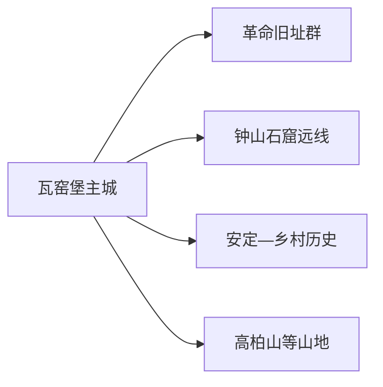
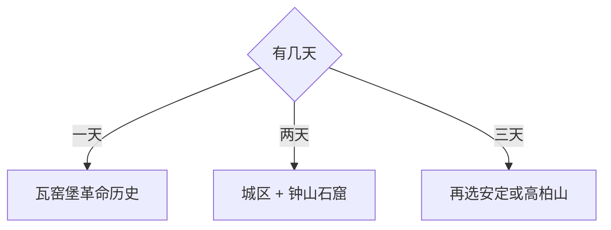

# 子长旅行指南

子长的旅行主线很清楚：在瓦窑堡城区读懂中央红军长征落脚陕北后的重要决策，再用完整一天前往钟山石窟。若有第三天，可从高柏山、安定古镇或一条明确开放的乡村红色线路中选一项；煤矿与油气生产区则按公路和接待边界避开。

> 建议停留：城区 1 天；钟山石窟另留 1 天 
> 旅行关键词：瓦窑堡会议、革命旧址、钟山石窟、陕北窑洞、黄土高原 
> 主要体力：城区中等；石窟与山地中至高 
> 最近研究：2026-08-13

## 城市速览

| 项目 | 旅行信息 |
|---|---|
| 主要旅行价值 | 以瓦窑堡革命旧址认识 1935 年前后历史，再以钟山石窟补足陕北石窟艺术 |
| 建议停留 | 1 天城区；2 天加入钟山石窟；3 天再选一条山地或古镇线 |
| 较舒适季节 | 春秋更适合步行；夏季防暴雨山洪，冬季防寒与道路结冰 |
| 预算特点 | 城区中低；石窟与乡镇车辆、讲解和住宿为增量 |
| 步行强度 | 瓦窑堡旧址群可分段步行，石窟与山地依赖车辆并有坡道台阶 |
| 主要天气风险 | 暴雨、山洪、滑坡、黄土边坡、大风扬尘、严寒和森林草原火险 |
| 独行旅行 | 城区方便；远线先锁定车辆、入口和返程 |
| 亲子旅行 | 革命历史场馆与钟山石窟可结合讲解，控制连续车程和台阶 |
| 长者与低体力旅行 | 城区一至两处场馆或车辆到石窟核心展示区 |
| 无障碍信息 | 城区场馆可咨询，窑洞、旧址和石窟的设施连续性需向官方确认 |

## 城市格局与游览区域

子长市是延安市代管的县级市，法定代码 `610681`。固定 GeoNames `1791706` 名为 Wayaobu，是瓦窑堡主城居民点；法定子长市实体为 Wikidata `Q198383`，其 P1566 关联较广行政记录 `1783748`。本页用固定点锁定主要旅行门户，用法定代码和市域资料确定钟山石窟、乡镇和生产空间边界。

| 区域 | 主要内容 | 怎么安排 | 与其他区域的关系 |
|---|---|---|---|
| 瓦窑堡主城 | 革命旧址、城市文博与服务 | 半日至一天，作为住宿基地 | 旧址分散在生活街区，按开放场馆组合 |
| 钟山石窟方向 | 国保石窟与陕北山地 | 独立一天，先核开放和车辆 | 与城区不是步行关系 |
| 安定及乡村 | 古镇、传统村落与红色遗存 | 只选有公开接待的一条线 | 村庄首先是生活和生产空间 |
| 高柏山等山地 | 山地景观、纪念与季节活动 | 天气稳定时做一日替换 | 不与石窟同日赶场 |

子长矿区、油气井场、集输站、排土场、铁路专用线和生态修复区承担生产与安全功能。旅行使用公共道路、正式纪念场馆与明确开放的景区入口；矿区道路和封闭井场不作为观景捷径。

## 主要景点

### 瓦窑堡城区

| 景点 | 区域 | 类型 | 主要看点 | 建议用时 | 室内外 | 体力 | 预约风险 | 天气影响 | 优先级 |
|---|---|---|---|---:|---|---|---|---|---|
| 瓦窑堡革命旧址群 | 主城 | 革命旧址 | 瓦窑堡会议及中共中央在陕北时期的相关旧址 | 3–5 小时 | 混合 | 中 | 高 | 中 | A |
| 子长革命烈士纪念设施公开区 | 主城 | 纪念地 | 陕北革命历史与人物纪念 | 1–2 小时 | 混合 | 中 | 中 | 中 | B |
| 子长市公共文化与地方展陈 | 主城 | 地方文博 | 市域历史、民俗与地方文化 | 1–2 小时 | 室内 | 低 | 高 | 低 | B |
| 瓦窑堡城市生活与窑洞街区公开段 | 主城 | 城市观察 | 黄土沟壑中的建成区、窑洞与当代生活 | 1–2 小时 | 室外 | 中 | 低 | 高 | B |

### 石窟与远线

| 景点 | 区域 | 类型 | 主要看点 | 建议用时 | 室内外 | 体力 | 预约风险 | 天气影响 | 优先级 |
|---|---|---|---|---:|---|---|---|---|---|
| 钟山石窟 | 安定方向 | 国保石窟寺 | 宋代石窟造像、题记与石刻艺术 | 半日至 1 天 | 混合 | 中高 | 很高 | 高 | A |
| 安定古镇公开街区 | 安定镇 | 古镇与地方历史 | 镇区格局、陕北民居和商路历史 | 2–3 小时 | 室外为主 | 中 | 高 | 高 | B |
| 高柏山正式开放游线 | 市域山地 | 山地与纪念主题 | 黄土高原视野、纪念空间与季节活动 | 1 天 | 室外 | 高 | 很高 | 很高 | B |
| 石家湾等公开革命遗址 | 乡镇 | 革命旧址 | 陕北革命活动与乡村历史 | 半日 | 混合 | 中 | 很高 | 高 | C |

瓦窑堡旧址群按历史主题和实际步行关系组合，不把每处窑洞都列为独立必到点。钟山石窟的开放洞窟、摄影和讲解以管理方公告为准，文物保护区内采用规定游线。

## 美食与餐饮

子长适合用杂粮、面食、羊肉和陕北家常菜补充长途行程。城区最容易控制份量和过敏原；远线先在镇区或接待点解决正餐。

| 类型 | 常见区域 | 一人份量 | 饮食提示 | 选择方法 |
|---|---|---|---|---|
| 荞面、杂面与饸饹 | 城区 | 一人一碗 | 小麦、荞麦、羊肉汤和辣椒常见 | 先问汤底与辣度 |
| 羊肉与炖菜 | 城区、乡镇 | 合菜偏多人 | 羊肉、动物油、盐分和香辛料 | 单人选羊肉面或小碗汤 |
| 黄馍馍、油糕与杂粮点心 | 城区市场 | 小份购买 | 糜子、黍米、糖和油炸 | 选现制少量或有标签包装 |
| 洋芋擦擦等家常菜 | 城区 | 一人易点 | 土豆、小麦粉、油和辣椒 | 与蔬菜、汤搭配降低油盐 |

## 经典行程

### 一日经典路线

**路线**：瓦窑堡革命旧址群 → 城区午餐 → 子长公共文化或纪念设施 → 城市短段

- **串联逻辑**：用同一历史时期的旧址构成主线，下午补地方背景。
- **预约锚点**：旧址开放、讲解和团体接待。
- **休息安排**：城区午餐与场馆坐席。
- **时间不足时**：保留瓦窑堡会议核心旧址和一座展馆。

### 两日城市路线

**第 1 天**：瓦窑堡城区历史线 
**第 2 天**：钟山石窟完整日

- **串联逻辑**：革命史与石窟艺术分日，车辆和讲解各自独立落实。
- **预约锚点**：钟山石窟开放、票务、讲解和返程。
- **休息安排**：第二天在镇区或游客服务点休息。
- **时间不足时**：石窟日只保留核心开放区。

### 三日深度路线

**第 1 天**：城区 
**第 2 天**：钟山石窟 
**第 3 天**：安定古镇与一处公开乡村遗址，或高柏山正式游线二选一

- **串联逻辑**：第三天按人文或山地兴趣选一条，不跨方向拼接。
- **预约锚点**：乡村接待、山地入口、车辆和天气。
- **休息安排**：安定镇区或正式服务点。
- **时间不足时**：删除第三天。

### 雨雪天路线

**路线**：瓦窑堡核心旧址 → 城区午餐 → 室内公共文化场馆

- **适用条件**：城区道路正常；暴雨、暴雪或地灾预警时缩短到住宿附近。
- **预约锚点**：场馆开放与交通。
- **休息安排**：室内坐席为主。
- **时间不足时**：只保留一座展馆。

### 亲子与低体力路线

**亲子路线**：革命历史展陈 → 午休 → 城区短段 
**低体力路线**：车辆到核心旧址 → 坐席讲解 → 城区午餐

- **减负方式**：亲子控制单次讲解时长；低体力路线减少窑洞坡道和连续步行。
- **预约锚点**：儿童讲解、坡道、轮椅、卫生间与下客点。
- **休息安排**：展馆和餐厅。
- **时间不足时**：两条路线都保留一座馆。

### 远郊一日路线

**路线**：子长城区 → 钟山石窟官方入口 → 核心开放洞窟 → 镇区午餐 → 返回

- **适用条件**：道路、天气、开放与车辆均确认。
- **预约锚点**：石窟票务、讲解、摄影和最晚离场。
- **休息安排**：游客服务点和镇区。
- **时间不足时**：减少外围停留，保持完整返程余量。

## 住宿区域

| 区域 | 优点 | 取舍 | 适合人群 | 交通特点 |
|---|---|---|---|---|
| 瓦窑堡主城 | 铁路、公路、餐饮和医疗集中 | 到石窟仍需车辆 | 首访与两日游 | 默认基地 |
| 安定镇区正规住宿 | 靠近石窟和乡村线 | 服务少于主城 | 石窟深度与清晨出发 | 先确认入住、供暖和返程 |
| 山地接待点 | 便于单一山地主题 | 天气、通信和医疗有限 | 有组织远线 | 只选资质和接驳清楚的地点 |

## 市内交通

| 场景 | 建议与取舍 | 行前核对 |
|---|---|---|
| 铁路抵达 | 子长站等按票面进入主城 | 12306 车次、站口、公交与夜间接驳 |
| 城区旧址 | 步行、公交与短程出租组合 | 开放点、街道施工、坡道和停车 |
| 钟山石窟 | 正规车辆到官方入口 | 道路、停车、最后入场与返程 |
| 山地乡村 | 一次只走一条已确认线路 | 天气、通信、加油、救援与接待 |

## 不同旅行者须知

| 旅行者 | 怎么选 | 主要取舍 | 额外核对 |
|---|---|---|---|
| 独行 | 城区加钟山石窟正规往返 | 乡村和山地临时交通少 | 车辆、返程、通信与住宿 |
| 亲子 | 革命历史场馆和石窟讲解 | 长车程与台阶按年龄缩短 | 儿童票、讲解、护栏和卫生间 |
| 长者或低体力 | 城区核心旧址、车辆点到点 | 石窟坡道与窑洞门槛 | 下客点、座椅、轮椅与折返 |
| 摄影 | 黄土城市、旧址和石窟题材 | 文物、居民院落和矿区拍摄规则不同 | 三脚架、闪光灯、无人机和商业拍摄 |
| 预算有限 | 城区公共文化加单一远线 | 车辆和讲解保留必要预算 | 门票、优惠、接驳和退改 |

## 行前核对

| 事项 | 何时核对 | 官方入口 | 怎么处理 |
|---|---|---|---|
| 钟山石窟 | 订车前及当天 | [钟山石窟官方网站](https://zczssk.cn/) | 按开放洞窟和票务安排 |
| 瓦窑堡旧址 | 出发前一周及前一日 | [陕西省文物局名录](https://wwj.shaanxi.gov.cn/wbxx/bkydww/wwbhdw/index_60.html) | 逐馆确认开放与讲解 |
| 铁路与客运 | 购票时及当天 | [中国铁路 12306](https://www.12306.cn/) | 按票面和末班安排 |
| 天气与地灾 | 前三日及当天 | [陕西省气象局](https://sn.cma.gov.cn/) | 暴雨、降雪或大风时调整远线 |

## 来源与更新记录

### 主要来源

| 来源 | 类型 | 支持内容 | 核验日期 |
|---|---|---|---|
| [钟山石窟官方网站](https://zczssk.cn/) | 文物景区管理方 | 当前开放、票务与参观入口 | 2026-08-13 |
| [陕西省文物局文保名录](https://wwj.shaanxi.gov.cn/wbxx/bkydww/wwbhdw/index_60.html) | 省级文物部门 | 瓦窑堡会议旧址与钟山石窟国保身份 | 2026-08-13 |
| [陕西省革命文物名录](https://wwj.shaanxi.gov.cn/sy/dtyw/tzgg/jgsw/202101/P020210107617474216847.pdf) | 省级文物部门 | 子长市革命旧址分布 | 2026-08-13 |
| [陕西省子长矿区总体规划](https://sndrc.shaanxi.gov.cn/sy/xwxx/gggg/202304/P020241105661298820072.pdf) | 省级规划 | 矿区、城区、石窟和生态红线关系 | 2026-08-13 |
| [GeoNames 1791706](https://www.geonames.org/1791706/) | 开放地理数据 | 瓦窑堡固定主城点 | 2026-08-13 |
| [Wikidata Q198383](https://www.wikidata.org/wiki/Q198383) | 开放结构化数据 | 法定子长市与行政记录 | 2026-08-13 |

### 更新记录

| 日期 | 更新内容 |
|---|---|
| 2026-08-13 | 首次完成子长独立旅行研究，拆分瓦窑堡、钟山石窟与山地乡村路线，并补充固定城市点、法定市域、矿区和地灾边界 |
