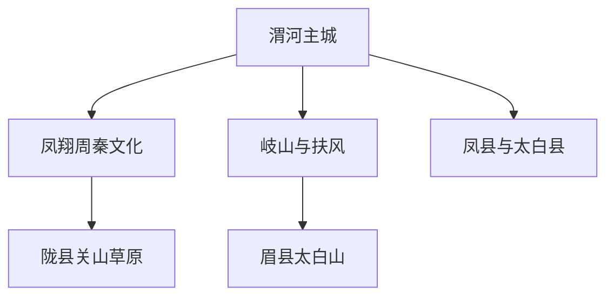

# 宝鸡旅行指南

宝鸡位于关中平原西端，主城区沿渭河谷地东西展开，青铜器、周秦遗址、抗战工业遗产和西府饮食构成城市文化主线。宝鸡青铜器博物院能在半天内建立清晰的周秦历史框架；法门寺、周原、太白山和关山草原则分散在扶风、岐山、眉县和陇县，均不是从主城顺路“加一站”的近郊。安排宝鸡旅行时，最重要的取舍是把渭河主城与各县域目的地分开计算交通和住宿。

> 建议停留：2–5 天；只看主城区可用 1–2 天，增加一个县域方向通常再加 1 天\
> 旅行关键词：青铜器、周秦文明、渭河、抗战工业遗产、西府小吃、秦岭山地\
> 主要体力：主城区中等步行；太白山、关山草原和秦岭县域路线为中高强度\
> 最近研究：2026-07-30

## 城市速览

| 项目 | 旅行信息 |
|---|---|
| 主要旅行价值 | 在宝鸡青铜器博物院认识何尊、青铜铭文和周秦文明，以长乐塬补充近代工业史；再按兴趣选择扶风法门寺、岐山—扶风周原、眉县太白山或陇县关山草原 |
| 建议停留 | 1 天可完成青铜器博物院与一处主城项目；2 天可覆盖主城文博和工业遗产；3–5 天只宜逐日增加一至三个县域方向，不把所有远郊压在同一天 |
| 较舒适季节 | 春季和秋季通常适合主城及低海拔历史景区，但春季天气多变、秋季可能连阴雨；山地开放范围、积雪和温差不按主城季节判断 |
| 预算特点 | 主城区公交、小吃和公共文化场馆可控制在中低至中等预算；县域往返、景区交通、索道、门票和山区住宿是主要增量成本 |
| 步行强度 | 青铜器博物院和城区短线为低至中等；长乐塬、西府老街涉及坡地；法门寺景区尺度较大；太白山和关山草原受海拔、风、温差及长距离景区交通影响 |
| 主要天气风险 | 主城夏季高温、暴雨和短时强对流，秋季连阴雨；秦岭山区还要防范雷电、山洪、地质灾害、低温、积雪、结冰和低能见度 |
| 独行旅行 | 主城区小吃多为一人份，公交和叫车较方便；县域单人接驳成本较高，山区返程和手机信号不稳定处不宜临时独行 |
| 亲子旅行 | 青铜器博物院、工业遗产和民俗工艺可按年龄组合；大型景区的长车程、高海拔、骑乘项目和山地步道需按儿童规则与体力取舍 |
| 长者与低体力旅行 | 可采用“一座场馆＋坐席午餐＋车辆接驳”的结构；不要把法门寺全园、太白山高处或关山草原多个片区设为当天必须全部完成的任务 |
| 无障碍信息 | 宝鸡青铜器博物院公布了残障人士服务热线和部分长者入馆安排，但公开资料不足以证明车站、历史建筑、景区车辆与核心游线全过程连续无障碍；需逐点向运营方确认 |

## 城市格局与游览区域

宝鸡主城是一座沿渭河展开的带状城市。宝鸡站位于较成熟的渭滨老城，宝鸡南站在主城东南侧的高新区方向；石鼓园与青铜器博物院在渭河南岸，金台区的长乐塬、西府老街和金台观分处北侧塬地及老城。地图上看似相邻的南北两岸，实际还要计算过桥、坡道和进出场馆时间。

离开主城后，目的地沿不同方向分散：岐山、扶风和眉县大致位于渭河谷地向东的文化与山地门户；凤翔在主城北侧，陇县继续向西北；凤县和太白县位于秦岭山地。下面的关系图只表示旅行分支，不表示各点可以连续步行。

主城适合连续安排文博、餐饮和一段城市公共空间；图中其余每个分支都应按独立半天至一天、部分按一晚以上计算。

| 区域 | 主要内容 | 游览特点 | 与其他区域的关系 |
|---|---|---|---|
| 渭滨老城—宝鸡站 | 经二路生活商业、传统餐饮、宝鸡站及渭河城市空间 | 服务密集，适合到达日、晚餐和短距离步行；繁忙路口与过街会拉长时间 | 可用公交或车辆连接石鼓园、金台区；不与宝鸡南站混用 |
| 石鼓园—青铜器博物院—陈仓老街 | 中华石鼓园、宝鸡青铜器博物院、滨河公共空间与餐饮街区 | 博物院和园区宜作为一个核心文化单元；陈仓老街主要承担餐饮和休息，不另算文博景点 | 靠近宝鸡南站方向，可与高新区住宿组合；过河去老城或长乐塬需接驳 |
| 金台老城—长乐塬 | 金台观、老城街巷、长乐塬抗战工业遗址 | 景点分散在塬坡与城市道路之间，不能只按直线距离串联；遗址兼有室内展陈与室外建筑 | 可与宝鸡站一带同日，但长乐塬本身应保留完整半天 |
| 北塬—西府老街 | 西府民俗、非遗展示、餐饮和城市眺望 | 商业与文化体验并存，节假日拥挤；坡地和停车接驳增加体力 | 可在长乐塬或金台观之后作为晚餐段，不值得为“打卡”跨城折返 |
| 陈仓区虢镇与西部山地 | 虢镇生活区，以及大水川、九龙山、西镇吴山等远端景区 | 陈仓区范围很大，虢镇与香泉镇、新街镇等山地目的地不是同一个游览片区 | “位于陈仓区”不等于靠近主城；山地项目逐个按独立景区和一日交通计算 |
| 凤翔区 | 凤翔东湖、古雍城文化、秦公一号大墓、民间工艺与豆花泡馍 | 凤翔已是宝鸡市辖区，但与渭河主城之间仍需公路接驳；县城生活、墓葬遗址和六营村并不连续 | 可独立一日；不与凤县混淆，凤县在秦岭南麓，是另一条路线 |
| 岐山县 | 周公庙所在的岐山周文化景区、蔡家坡、五丈原与臊子面 | 凤鸣县城、蔡家坡和周原遗址节点分散；周文化景区与周原遗址不是同一运营边界 | 可与扶风形成周文化主题，但不宜默认同日再加法门寺全园 |
| 扶风县 | 法门文化景区、法门寺博物馆、周原遗址东部及周原博物院 | 法门寺与周原共享周秦唐文化主题，实际入口、开放时间和交通节点不同 | 法门寺宜独立一日；周原遗址横跨扶风、岐山，不能归入单一县域完成项 |
| 眉县 | 太白山景区入口、汤峪度假区、红河谷、张载祠与猕猴桃产区 | 太白山景区官方地址在眉县汤峪镇；景区内部交通与海拔爬升占据完整一天 | 不要因“太白山”之名把它误写进太白县；高处开放边界每日可变 |
| 陇县 | 关山草原、龙门洞、千陇山地与陇州文化 | 关山草原位于海拔两千米以上山地，长途接驳、风和温差明显 | 适合一日加一晚；与陈仓区大水川虽在同一西北方向，仍是不同景区和道路单元 |
| 凤县 | 凤县县城、古凤州、灵官峡、通天河与秦岭铁路文化 | 位于秦岭南麓，山路、峡谷和铁路主题突出；各景区并非县城步行外延 | 应独立一至两日；“凤县”与“凤翔区”名称相近但方向、县域和体验完全不同 |
| 太白县 | 太白县城、青峰峡、黄柏塬与秦岭腹地 | 县域海拔高、道路长，黄柏塬等地受季节和地质条件影响明显 | 与眉县太白山景区分开规划；到访太白山不代表到访太白县 |

宝鸡市现行法定范围为渭滨、金台、陈仓、凤翔 4 个区和岐山、扶风、眉县、陇县、千阳、麟游、凤县、太白 8 个县。宝鸡高新区等功能园区不是新的法定县级行政区。主城区研究只覆盖渭滨—金台—高新区相连的城市核心；各县区的县城和远端景区仍需分别判断，不能因行政上同属宝鸡而自动视为已经覆盖。

## 主要景点

优先级用于安排时间：**A** 为首访核心，**B** 为按兴趣补充，**C** 为远郊、季节性或通常需要独立半天以上的目的地。“路线节点”用于餐饮街区、滨水空间、车站和游客中心，不计入景点完成率。同一景区内的博物馆、寺院、索道、观景台、草场和体验项目只记录一次。

### 渭河主城与城市文博

| 景点 | 区域 | 类型 | 主要看点 | 建议用时 | 室内外 | 体力 | 预约风险 | 天气影响 | 优先级 |
|---|---|---|---|---:|---|---|---|---|---|
| 中华石鼓园—宝鸡青铜器博物院（整体） | 渭滨区石鼓镇 | 专题博物馆与文化公园 | 何尊、青铜铭文、周礼与秦文化展陈，以及石鼓山—渭河的城市关系；博物院、石鼓园和园内建筑按一个核心单元记录 | 3–5 小时 | 混合，以室内为主 | 低至中 | 高 | 低至中 | A |
| 长乐塬抗战工业遗址（整体） | 金台区十里铺方向 | 工业遗产与纪念设施 | 申新纱厂内迁史、窑洞工厂、办公楼和薄壳车间；各历史建筑与展厅属于同一遗址 | 2.5–4 小时 | 混合 | 中 | 中至高 | 中 | A |
| 金台观—金台太极源文化景区（整体） | 金台老城 | 历史建筑与城市登高 | 传统建筑、道教文化与塬坡城市视角；园内楼阁和博物馆展陈不拆分 | 1.5–3 小时 | 混合 | 中至高 | 中 | 高 | B |
| 北首岭遗址博物馆 | 金台区 | 史前遗址博物馆 | 北首岭新石器时代遗址与宝鸡史前文化，是青铜时代叙事之前的补充 | 1.5–2.5 小时 | 室内为主 | 低至中 | 高 | 低 | B |
| 西府老街文化旅游景区（整体） | 金台区北塬 | 民俗街区与餐饮 | 西府非遗、民俗陈列和地方小吃，适合承担晚餐与休息；街区内部店铺不拆分景点 | 1.5–3 小时 | 混合 | 中 | 低至中 | 中至高 | B |
| 渭河城市公共空间（选择一段） | 渭滨—金台—高新区 | 城市滨水 | 观察带状河谷城市、桥梁和两岸生活；只选靠近当天场馆的一段 | 1–1.5 小时 | 室外 | 低至中 | 低 | 高 | 路线节点 |

### 周秦遗址、宗教与县域历史

| 景点 | 区域 | 类型 | 主要看点 | 建议用时 | 室内外 | 体力 | 预约风险 | 天气影响 | 优先级 |
|---|---|---|---|---:|---|---|---|---|---|
| 凤翔东湖景区（整体） | 凤翔区城关镇 | 历史园林与城市文化 | 凤翔古城生活、园林空间与苏轼相关地方文化；湖、亭桥及园内节点合并记录 | 1.5–3 小时 | 室外为主 | 低至中 | 低至中 | 高 | B |
| 秦公一号大墓—先秦陵园博物馆（整体） | 凤翔区南指挥镇 | 秦陵园遗址与博物馆 | 秦雍城时期墓葬、考古展示及早期秦史；墓坑、展厅和陵园按一个遗址单元记录 | 2–3 小时 | 混合 | 中 | 中至高 | 中 | C |
| 岐山周文化景区（周公庙整体） | 岐山县凤鸣镇 | 古建筑与周文化 | 周公庙古建筑群、周文化展示和地方礼乐传统；园内殿宇、古树和附属展陈合并记录 | 2.5–4 小时 | 混合 | 中 | 中至高 | 中至高 | C |
| 周原遗址—宝鸡周原博物院（整体） | 岐山、扶风交界区域 | 考古遗址与遗址博物馆 | 西周大型聚落、建筑基址、青铜器与考古研究；遗址跨两县，开放展示点和博物院不按若干“子景点”重复计算 | 半天至 1 天 | 混合 | 中 | 高 | 高 | C |
| 法门文化景区—法门寺博物馆（整体） | 扶风县法门镇 | 宗教建筑、唐代地宫文物与大型景区 | 法门寺历史建筑、唐代地宫出土文物和佛教文化；寺院、博物馆、合十舍利塔及园内交通属于一个完整访问单元 | 5–7 小时，不含主城往返 | 混合 | 中至高 | 高 | 中至高 | C |

周原遗址与岐山周文化景区都讲周文化，但前者是跨岐山、扶风的考古遗址体系，后者以凤鸣镇周公庙古建筑群为核心；两者不是同一个景区。法门寺院、法门寺博物馆和现代景区建筑同处法门文化景区，路线中只作为一个完成项。

### 秦岭山地与远郊自然

| 景点 | 区域 | 类型 | 主要看点 | 建议用时 | 室内外 | 体力 | 预约风险 | 天气影响 | 优先级 |
|---|---|---|---|---:|---|---|---|---|---|
| 太白山景区（整体） | 眉县汤峪镇 | 高山森林、垂直景观与索道交通 | 秦岭主峰北坡的森林带、山地景观和高海拔开放区；游客中心、景交车、索道与各观景节点属于同一景区 | 1 天，建议汤峪或眉县另住 1 晚 | 混合，以室外为主 | 中高至高 | 高 | 很高 | C |
| 关山草原景区（整体） | 陇县天成镇 | 高山草甸与季节性户外活动 | 海拔两千米以上草甸、山地道路和陇州边关景观；骑乘、营地、草场和风情小镇均为景区内部项目 | 1 天，宜在陇县或景区附近住 1 晚 | 室外 | 中至高 | 高 | 很高 | C |
| 大水川景区（整体） | 陈仓区香泉镇 | 山地草场与度假景区 | 陈仓区西部山地、草场和峡谷环境；景交、骑乘和娱乐项目不拆分计数 | 1 天，不含主城往返余量 | 室外为主 | 中至高 | 高 | 很高 | C |
| 古凤州文化景区（整体） | 凤县凤州镇 | 秦岭古镇、历史文化与山地环境 | 古凤州历史、消灾寺及周边秦岭聚落景观；与凤县县城、灵官峡、通天河不是同一个步行片区 | 半天至 1 天，宜结合凤县住宿 | 混合 | 中 | 中至高 | 高 | C |

太白山开放景区与“鳌太线”非法穿越完全不是同一件事。公开景区只按当日公告、景交车和索道开放范围游览；未经批准进入太白山自然保护区核心区域或穿越鳌太线既有显著失温、迷路、失联和高海拔风险，也违反保护管理要求。本页不提供非开放线路攻略。

## 美食与餐饮

宝鸡饮食以西府面食、酸辣香味型、豆制品和烤制面点见长。岐山、凤翔、扶风和太白县各有明确的县域技艺来源；在主城吃到同类食物，不等于已经完成对应县域旅行。选店以菜品、片区、明码标价和食品安全信息为准，不把某一家热门店写成唯一答案。

| 菜品或餐饮类型 | 常见区域 | 一个人用餐与常见份量 | 风味、过敏原与饮食限制 | 排队风险与替代方法 |
|---|---|---|---|---|
| 宝鸡擀面皮 | 主城区、岐山及全市小吃店 | 通常一人一份，适合早餐、午间或加餐；分量不大时可与夹馍组合 | 小麦制品，常有油泼辣子、醋、面筋、芝麻或花生；含麸质，复合调料可能含大豆 | 饭点和热门街区排队较多；选择调味分装、制作环境清楚的同类店，不必追逐单一品牌 |
| 岐山臊子面 | 岐山县、扶风县及主城区西府餐馆 | 常见小碗连续上桌，也有普通大碗；一人先问份数、是否按套计价 | 酸、辣、香突出，传统臊子多含猪肉，配菜可能含鸡蛋、豆腐和木耳；面条含麸质 | 节假日县城热门店可能排队；选菜单和计价方式清楚的家常面馆，严格素食者需确认汤底 |
| 臊子肉夹馍与锅盔类 | 主城区、岐山、扶风及凤翔 | 一人一个或半份组合方便；干硬面饼需要配汤或饮品 | 小麦、猪肉、辣椒和香辛料常见；肉馅可能含大豆或含麸质酱料 | 交通节点成品可能放置较久；优先选择现制、明示价格和储存条件清楚的店 |
| 凤翔豆花泡馍 | 凤翔区早餐店，主城区部分西府小吃店 | 通常一人一碗，早餐时段更常见 | 豆花、豆浆和锅盔构成主体，涉及大豆与小麦；油泼辣子可调整，但“少辣”不代表无过敏原 | 凤翔早餐高峰可能排队；主城同类型早餐店可替代，不为一碗早餐长距离赶路 |
| 扶风鹿羔馍 | 扶风县及全市非遗、特产销售点 | 属烤制面点或伴手礼，一人可买小包装；名称不应按肉菜理解 | 主要关注小麦、油脂、糖和可能使用的芝麻、坚果、蛋奶；具体配方按标签确认 | 节庆摊位和景区店客流大；看生产日期、配料和正规包装，不按“老字号”宣传替代食品标签 |
| 太白神仙豆腐与山野菜 | 太白县及部分秦岭地方菜馆 | 豆腐类菜可点小份，山野菜常按盘共享 | “神仙豆腐”并非普通黄豆豆腐，具体植物原料和调味需询问；山野菜可能与蛋、肉、坚果或含麸质酱料同炒 | 不购买来源不明的野生植物，不自行采食；选择能说明原料和加工方式的正规餐馆 |
| 西凤酒 | 凤翔区柳林镇及全市正规餐饮、零售渠道 | 酒精饮品按小杯或瓶装，独行者不必为品酒购买整瓶 | 酒精不适合未成年人、驾车者、孕期及需避酒精人群；部分调制饮品可能含糖或其他过敏原 | 核对正规渠道、包装和酒精度；饮酒后不驾车，也不在高海拔登山前饮酒 |

对小麦、大豆、花生、芝麻、蛋、奶或坚果严重过敏者，应询问共锅、共油、砧板和复合调料。臊子面、豆花泡馍和擀面皮即使可以调整辣度，也不能据此判断为素食或无过敏原。夏季购买散装面皮、豆制品和熟肉时，还要核对制作时间、冷藏与携带时长。

## 经典行程

### 一日经典路线

**路线**：中华石鼓园—宝鸡青铜器博物院 → 陈仓老街或石鼓园周边坐席午餐 → 渭河公共空间短段 → 长乐塬抗战工业遗址

- **串联逻辑**：上午用青铜器博物院建立周秦文明框架，午后转入近代工业史；两处都是内容密集的完整单元，中间以餐饮和车辆接驳休息，不在园内拆分多个“打卡点”。
- **预约锚点**：先锁定宝鸡青铜器博物院预约，再核对长乐塬开放、门票与讲解时段。
- **休息安排**：午餐放在石鼓园周边，前往长乐塬采用公交或车辆；渭河段只在天气和体力允许时走一小段。
- **时间不足时**：先删渭河散步，再删长乐塬；只剩半天时保留青铜器博物院。

### 两日城市路线

**第 1 天（青铜器与渭河）**：中华石鼓园—宝鸡青铜器博物院 → 陈仓老街午餐 → 渭河短段\
**第 2 天（工业遗产与西府生活）**：长乐塬抗战工业遗址 → 金台老城坐席午餐 → 金台观或北首岭遗址博物馆二选一 → 西府老街晚餐

- **串联逻辑**：第一天集中在渭河南岸，第二天集中在金台区，减少反复过河。金台观偏户外登高，北首岭偏室内文博，按天气与开放情况二选一。
- **预约锚点**：第一天是青铜器博物院，第二天是长乐塬；北首岭若处于改造或限制开放状态，不作为必达点。
- **休息安排**：每天只设一座内容密集的主场馆，午餐均使用坐席餐馆；西府老街承担晚餐，不要求完整逛遍。
- **时间不足时**：第二天删金台观或北首岭，保留长乐塬；不临时加入凤翔、法门寺或太白山。

### 三日文化路线

**第 1 天**：中华石鼓园—宝鸡青铜器博物院 → 渭河短段\
**第 2 天**：长乐塬抗战工业遗址 → 金台观或西府老街\
**第 3 天**：凤翔东湖 → 凤翔午餐与豆花泡馍文化 → 秦公一号大墓—先秦陵园博物馆

- **串联逻辑**：前两天完成渭河主城，第三天把凤翔作为独立的早期秦文化单元；东湖在凤翔城内，秦陵园位于南指挥方向，需要车辆连接。
- **预约锚点**：青铜器博物院、长乐塬与先秦陵园的当日开放；豆花泡馍多见于早餐，午餐是否有售不要预设。
- **休息安排**：凤翔县城安排坐席午餐，东湖只走短段；墓葬遗址参观后直接返程，不再叠加岐山。
- **时间不足时**：第三天删秦公一号大墓，只保留凤翔东湖和县城餐饮；若只剩两天，完整删除凤翔日。

### 周文化一日路线

**路线**：宝鸡主城或就近住宿 → 岐山周文化景区（周公庙） → 岐山县城午餐 → 周原遗址公开展示点或宝鸡周原博物院（确认开放后） → 返回

- **串联逻辑**：用周公庙的古建筑和礼乐叙事连接周原考古，但两处仍是不同运营单元；周原跨岐山、扶风，必须按实际入口导航。
- **预约锚点**：周原博物院及遗址公开展示范围；考古工作区、保护区和地图上的遗址点不等于可自由进入。
- **休息安排**：在岐山县城或正规服务区完成午餐，遗址段预留车辆和候车时间。
- **时间不足时**：只保留周公庙，整段删除周原；不在午后追加法门寺。

### 雨天路线

**路线**：宝鸡青铜器博物院 → 石鼓园周边坐席午餐 → 北首岭遗址博物馆或长乐塬室内开放部分二选一

- **适用条件**：普通降雨且道路、场馆正常。暴雨、雷电、内涝、山洪或地质灾害预警期间，即使目的地有室内空间也不跨越危险路段，不前往秦岭山地。
- **预约锚点**：两座博物馆和长乐塬当日公告；长乐塬仍有室外建筑转场，不能视为全天候纯室内场馆。
- **休息安排**：场馆与坐席餐馆为固定休息点，准备防滑鞋，湿伞和大件行李按馆方要求处理。
- **时间不足时**：只保留青铜器博物院；北首岭若未开放，不用商业场馆勉强补数量。

### 亲子或低体力路线

**亲子路线**：宝鸡青铜器博物院重点展厅 → 坐席午餐 → 石鼓园短段或西府非遗体验（确认年龄与活动时段）\
**低体力路线**：车辆到青铜器博物院最近落客点 → 馆内重点展厅与充分休息 → 坐席午餐 → 车辆到渭河边选择靠近出口的一小段

- **减负方式**：亲子路线用实物展陈和短时户外交替；低体力路线不安排金台观登高、法门寺全园或任何山地景区。两类路线都先确认电梯、轮椅、座椅、卫生间和寄存规则。
- **预约锚点**：青铜器博物院预约、儿童活动年龄和残障人士服务；非遗体验若未开放，以园区短段替代。
- **休息安排**：不把餐饮街区的临时座位当成唯一休息保障，优先固定餐馆和场馆服务区。
- **时间不足时**：删去户外段，只保留博物馆和午餐。

### 法门寺一日路线

**路线**：宝鸡主城、扶风县城或其他已确认出发点 → 法门文化景区游客入口 → 法门寺历史建筑与法门寺博物馆 → 园内休息与午餐 → 原路返回或扶风住宿

- **串联逻辑**：寺院、博物馆、现代景区轴线和园内交通共同构成一个大型访问单元，全天不再加入周公庙、周原或太白山。
- **预约锚点**：门票、寺院与博物馆开放、宗教活动、地宫文物展陈及景区交通；不同建筑可能执行不同的临时安排。
- **休息安排**：使用游客中心和明确开放的服务点，长者或低体力旅行者提前确认最短游线和观光交通。
- **时间不足时**：整段删除，改为主城区文博日；不要在午后临时出发。

### 太白山与关山草原路线

**太白山 1–2 晚**：前一晚抵达眉县汤峪或确认交通便利的住宿 → 次日按景区公告乘景交车与已开放索道 → 在开放边界内选择一条完整游线 → 天黑前下山。高处是否开放、索道是否运行和最晚下山时间共同决定路线，不以“登顶”为默认目标。

**关山草原 1–2 晚**：前一晚抵达陇县或景区附近 → 次日进入关山草原 → 在风情小镇、草甸和已开放体验中择一至两项 → 返回稳定交通点或住宿。骑乘、露营和车辆深入草场都需按景区规则，不自行进入未开放山路。

- **串联逻辑**：两座景区方向不同、海拔高、内部交通长，只能二选一，不能在同一天串联。
- **预约锚点**：实名购票、分时入园、景交、索道或骑乘规则、开放边界、天气预警和退改政策。
- **休息安排**：以游客中心、索道站和已开放服务点为准；自带保暖、防雨和补水用品，不假定高处全年都有稳定餐饮。
- **时间不足时**：整段山地路线删除，改为主城或凤翔；不通过非法穿越、越过封闭线或压缩下山时间“补景点”。

## 住宿区域

| 区域 | 优点 | 缺点 | 适合人群 | 交通特点 |
|---|---|---|---|---|
| 宝鸡站—经二路 | 到传统商业、早餐和普通铁路方便，城市生活感较强 | 街区车流、噪声和老建筑电梯条件差异大；去宝鸡南站和石鼓园仍需接驳 | 首访、晚到、早班普通铁路和重视餐饮便利者 | 宝鸡站位于此处；公交密集，订房要核对进站口和大件行李过街路线 |
| 石鼓园—高新区 | 靠近青铜器博物院、宝鸡南站方向和较新的城市服务 | 与金台老城、长乐塬和西府老街距离较远，街区尺度大 | 博物院优先、高铁抵达、亲子或希望房间设施较新者 | 公交和车辆连接宝鸡南站、石鼓园；“高新区”不是独立法定行政区 |
| 行政中心—金台大道 | 位于主城中东段，去金台与渭河南北两岸较均衡 | 不在传统老城核心，步行到具体景点仍可能较远 | 两日城市路线、商务与需要安静住宿者 | 适合作为公交和叫车基地，去长乐塬、西府老街、石鼓园均需分别核算时间 |
| 凤翔城区 | 可把东湖、早期秦文化和早餐拆成轻松的一日 | 不是渭河主城住宿的同等替代，去青铜器博物院仍需公路往返 | 凤翔深度、低体力、希望早晨吃豆花泡馍者 | 以凤翔城区、先秦陵园入口和返程班次为三个不同节点核对 |
| 扶风县城或法门镇 | 便于法门寺早入，也可为周原主题留出更多余量 | 餐饮与夜间交通选择少于主城；周原与法门寺仍不是步行相邻 | 法门寺完整一日、周秦考古主题和长者慢游 | 订房前确认离实际景区入口、汽车站和正规接驳点的距离 |
| 眉县县城或汤峪 | 便于太白山早间入园，可将高海拔日与长途转移分开 | 汤峪度假住宿节假日价格和噪声波动大，眉县县城到景区仍需接驳 | 太白山、温泉度假、摄影与山地旅行者 | 先按游客中心和次日开放时段选住宿，不把“眉县”行政名称当成已到山门 |
| 陇县城区或关山草原附近 | 减少从宝鸡主城当天超长往返，便于天气允许时早入草原 | 景区附近餐饮、供暖、信号和夜间交通稳定性需逐店确认 | 关山草原、摄影、自驾或计划住一晚者 | 陇县城区到景区仍有山路；核对正规车辆、最晚返程和恶劣天气取消安排 |
| 凤县县城 | 便于组合古凤州、灵官峡等秦岭南麓项目 | 与宝鸡主城之间是完整山地转移，不能作为主城日常通勤住宿 | 宝成铁路文化、秦岭峡谷和县域慢游 | 铁路与公路均需核对具体站点、班次和景区接驳；雨雪天留足余量 |

不推荐未经核验的具体酒店。订房时核对电梯、无障碍客房、空调或供暖、临街噪声、停车、行李寄存、早餐时段和退改规则；山区住宿还要确认热水、消防疏散、手机信号、夜间到达和因闭园取消时的处理方式。

## 市内交通

| 场景 | 建议与取舍 | 行前需要重查的内容 |
|---|---|---|
| 宝鸡站抵达 | 宝鸡站位于渭滨老城，办理陇海、宝成、宝中等方向的普速及部分客运；适合直接进入经二路和老城 | 车次、完整站名、进出站口、公交、出租车上客点、施工和无障碍协助 |
| 宝鸡南站抵达 | 宝鸡南站位于高新区站前大道，是徐兰高速铁路门户；去石鼓园、高新区住宿相对直接，去宝鸡站和金台仍需地面接驳 | 公交首末班、晚到延点线路、出租车上客点、道路施工与大件行李路线 |
| 航空抵达 | 截至本页研究日，宝鸡机场仍处于建设阶段，不能作为已运营民航机场使用；航空旅客应从已运营机场转铁路或公路进入宝鸡 | 实际航班、转乘城市、机场到铁路站的时间、行李衔接和末班交通；宝鸡机场启用时间只看民航与政府正式公告 |
| 主城区跨片区 | 公交承担主干移动，出租车和合规网约车适合石鼓园、长乐塬、北塬等最后一段；按“同岸成组、少过桥”更省时 | 线路、首末班、活动封路、桥梁施工、节假日拥堵、叫车上客点与支付方式 |
| 片区内步行 | 经二路生活区、石鼓园内部、渭河短段和西府老街可分别步行；塬坡、过街和大型园区会放大地图距离 | 人行道施工、坡度、夜间照明、积水、共享交通停放及无障碍连续性 |
| 凤翔、岐山、扶风、眉县 | 县际客运、铁路加地面接驳、正规包车或自驾按目的地选择；法门寺、周原、太白山入口各自核对 | 发车站、完整铁路站名、班次、景区直通车季节、末班、返程候车与经营资质 |
| 陇县与关山草原 | 可先到陇县，再用景区或正规车辆解决山路；不要把铁路到陇县等同于已抵达草原 | 旅游列车是否当期运行、陇县到景区车辆、道路管制、最晚离园、雾雨和冬季结冰 |
| 凤县与太白县 | 铁路或公路只解决县域转移，县城到古凤州、黄柏塬等仍有较长地面接驳 | 车次、道路施工、山洪地质风险、夜间驾驶、加油充电、停车和住宿接送 |
| 自驾 | 多人县域旅行更灵活，但主城停车、秦岭长坡弯道、雨雾、落石和冬季结冰会增加负担 | 当期限行、景区停车预约、道路封闭、天气预警、车辆状况、保险、充电加油和救援电话 |

宝鸡没有可替代公交和公路接驳的城市轨道网络。铁路以[中国铁路 12306](https://www.12306.cn/)核对完整站名和当日车次；公交以宝鸡市交通运输局、宝鸡公交和站牌当日信息为准。县域“有铁路站”不等于景区无缝可达，旅游列车、景区直通车、观光车和索道都只能在确认当期运营后使用。

## 不同旅行者须知

| 旅行维度 | 可行条件 | 主要取舍 | 需额外核对 |
|---|---|---|---|
| 独行旅行 | 主城一人食、公交、博物馆和叫车较方便，可在宝鸡站或高新区建立固定基地 | 单人县域包车成本高；山地末班后替代交通少，不进入未开放步道、保护区核心区或无信号区域 | 末班、正规车辆、住宿入住、手机信号、景区应急点与紧急联系人 |
| 亲子旅行 | 青铜器博物院、北首岭、工业遗产和西府非遗可按年龄组合 | 大型园区、墓葬遗址、索道、高海拔、骑乘和长车程增加照护负担 | 儿童预约、推车、寄存、卫生间、身高年龄限制、骑乘保险与食品过敏原 |
| 长者或低体力旅行 | 每半天一座场馆，车辆点到点连接，户外只选最近入口的一段 | 长乐塬室外转场、金台观坡道、法门寺长轴线和山地景区均应主动减量 | 最近落客点、电梯、轮椅借用、座椅、卫生间、观光车与陪同要求 |
| 无障碍需求 | 宝鸡青铜器博物院公布残障人士服务热线，可在预约前直接沟通；铁路站可提前申请相关协助 | 有一处电梯或观光车不代表车站—入口—展厅—卫生间—返程全过程连续可达；历史建筑和山地资料尤其不足 | 各运营方确认入口坡度、轮椅尺寸、升降设备、无障碍卫生间、车辆装载及应急疏散 |
| 摄影旅行 | 石鼓园、渭河、工业遗产、周原、草甸和秦岭高山提供城市、人文与自然题材 | 山地云海、日出和草甸状态有季节不确定性；三脚架、闪光灯、无人机和商业拍摄受场馆及保护规则约束 | 日出时段是否开放、夜间下山、无人机适飞空域、三脚架、文物摄影和宗教场所规则 |
| 预算有限 | 以青铜器博物院、城市公共空间、小吃和公交组成主城路线，远郊只选一个 | 县域接驳、门票、观光车、索道、骑乘和住宿会快速增加总成本 | 免费预约、优惠资格、联票是否必要、分项收费、明码标价和退改政策 |
| 晚出发或紧凑行程 | 半天只选青铜器博物院、长乐塬或凤翔东湖中的一个完整单元 | 午后不前往法门寺、周原、太白山、关山草原、凤县或黄柏塬 | 最晚入场、闭馆日、公交末班、县际返程和夜间叫车 |
| 夏季高温与强降雨 | 主城户外放在早晚，中午进入场馆；普通小雨改走室内文博 | 暴雨和强对流会影响过河、塬坡和山地道路，雨停后山洪、滑坡、落石风险仍可能持续 | 宝鸡气象、应急、自然资源、交通、文旅和景区公告，预警、闭园与道路中断 |
| 高海拔与冬季山地 | 只走景区明确开放路线，按主城与山顶不同温度准备衣物，预留提前下山余量 | 太白山高处可超过 3500 米，关山草原海拔超过 2000 米；低温、风、紫外线、积雪和快速海拔变化都会增加负担 | 开放上限、体感温度、索道与景交、最晚下山、医疗与救援点；不进行鳌太线非法穿越 |

## 行前核对

| 核对事项 | 为什么需要重查 | 建议核对时间 | 官方入口 |
|---|---|---|---|
| 宝鸡青铜器博物院 | 预约渠道、闭馆日、临展、暑期延时、证件、安检和讲解会调整 | 确定日期后、到访前一日及当天 | [宝鸡青铜器博物院](https://www.bjqtm.com/)与[参观须知](https://www.bjqtm.com/sy/%E5%8F%82%E8%A7%82%E9%A1%BB%E7%9F%A5) |
| 长乐塬抗战工业遗址 | 门票、开放建筑、讲解、施工和团体活动可能改变完整路线 | 排入路线前、到访前一日及当天 | [宝鸡市文化和旅游局：长乐塬抗战工业遗址](https://www.baoji.gov.cn/bmpd/bjswhhlyj/ztzl/stbhq/gzdt/202509/t20250911_1208965.html)及景区当期渠道 |
| 金台观、北首岭与西府老街 | 场馆改造、宗教活动、街区演出、停车和夜间开放并非长期固定 | 到访前三日及当天 | 宝鸡市文物局、文化和旅游局、金台区政府与各运营方公告 |
| 周公庙与周原遗址 | 遗址开放展示点、考古工作区、博物院闭馆、保护范围和县际入口会变化 | 订车前、到访前三日及当天 | [周公庙官方介绍](https://www.baoji.gov.cn/col26/col95/201910/t20191025_10505.html)、[周原遗址保护管理办法](https://www.baoji.gov.cn/col9816/col17241/col9826/col9986/202302/t20230221_793326.html)及宝鸡市文物局 |
| 法门文化景区与法门寺博物馆 | 门票、宗教活动、地宫文物展陈、园内交通、入园证件和开放建筑可分别调整 | 购票前、到访前一日及当天 | 宝鸡市文物局、法门寺博物馆与景区官方渠道；[市文物局所属单位说明](https://wwj.baoji.gov.cn/col12953/col12954/col12974/col12976/202103/t20210309_755374.html) |
| 太白山 | 分时预约、景交车、索道、开放海拔、冰雪、雷雨、森林防火和退改共同决定路线 | 订房前、到访前三日、前一晚及上山前 | [太白山旅游官网](http://www.tbpark.com/) |
| 鳌太线与自然保护区边界 | 未经批准穿越属于违法活动，且有失温、迷路、失联、高海拔和无信号风险 | 任何山地计划确定前 | [宝鸡市农业农村局：太白山自然保护区非法穿越警示](https://nyncj.baoji.gov.cn/col4165/col4170/202510/t20251016_1219276.html) |
| 关山草原、大水川与凤县山地 | 草场、骑乘、营地、观光交通、山路和关闭规则受季节、降雨与风影响 | 订房前、到访前三日及当天 | 宝鸡市文化和旅游局[景区名录](https://whhlyj.baoji.gov.cn/col3468/col3497/202603/t20260326_1257552.html)及各景区官方渠道 |
| 宝鸡站、宝鸡南站与县域铁路 | 车次、站名、进出站口、改签、旅游列车、末班和站到景区接驳会变化 | 购票时、出发前一日及当天 | [中国铁路 12306](https://www.12306.cn/)与[宝鸡市交通运输局火车站信息](https://jtysj.baoji.gov.cn/col3165/col3170/202404/t20240424_629061.html) |
| 城市公交、县际客运与景区直通车 | 临时旅游线、预约成行门槛、发车点、票价和季节停运变化快 | 出发前三日、前一日及当天 | [宝鸡市交通运输局](https://jtysj.baoji.gov.cn/)及客运站、宝鸡公交、景区官方渠道 |
| 宝鸡机场建设与航空转乘 | 建设中的机场不能按已通航机场订行程，启用、命名、航线和地面交通均需正式信息 | 购买航空联程前 | [宝鸡市政府：建设中的宝鸡机场命名征求意见](https://www.baoji.gov.cn/col46/col53/202607/t20260715_1285366.html)与[中国民用航空局](https://www.caac.gov.cn/) |
| 高温、暴雨、雷电与山洪地质灾害 | 秦岭山区和塬坡道路对强降雨敏感，景区可能临时闭园或疏散 | 出发前三日、每天早晨及进入山区前 | [中国天气网：宝鸡气候](https://www.weather.com.cn/cityintro/101110901.shtml)、[宝鸡市应急管理局](https://yjj.baoji.gov.cn/)及景区公告 |
| 无障碍连续路线 | 单项设施存在不等于入口、场馆、观光车和卫生间之间连续可达 | 订票、订房和用车前直接联系运营方 | [宝鸡青铜器博物院参观须知](https://www.bjqtm.com/sy/%E5%8F%82%E8%A7%82%E9%A1%BB%E7%9F%A5)；其他场馆、车站、住宿和景区官方客服 |
| 餐厅、食品安全与过敏原 | 营业状态、份量、汤底、共锅和散装食品储存无法作为长期事实保存 | 排入餐单前及点单时 | 经营者公示信息、宝鸡市市场监督管理部门与现场确认 |
| 入境、签证与证件规则 | 仅国际旅行者需要；规则随国籍、证件、口岸和行程变化，建设中的宝鸡机场不构成入境口岸承诺 | 订票前及出发前 | [国家移民管理局](https://www.nia.gov.cn/)及承运人官方渠道 |

## 来源与更新记录

### 标识与行政边界说明

本页 `geonames_id` 使用项目固定日期 GeoNames `cities15000` 清单中的宝鸡城市居民点记录 `10942359`，名称 Baoji，坐标约为北纬 34.36775、东经 107.23705，要素类型为 `P/PPLA2`。它用于定位渭河主城，不是一张宝鸡市法定行政边界，也不能代表 4 区 8 县的县城和景区均已研究完成。

Wikidata `Q514796` 对应陕西省地级市宝鸡市。通过 Wikidata 官方 API 独立核验，其中文标签与描述为宝鸡市和“中国陕西省的地级市”，`P17` 指向中国，`P1566` 当前指向 GeoNames 行政区记录 `1816935`，`P442` 为 `61 03`。因此，Wikidata 的行政区 GeoNames 连接与本项目选用的城市居民点 `10942359` 并非同一记录；两者分别承担市域实体和主城点位映射。法定行政区划代码 `610300` 另由陕西省民政厅截至 2025 年 12 月 31 日的数据核对。

### 主要来源

| 来源 | 类型 | 支持内容 | 核验日期 |
|---|---|---|---|
| [宝鸡市人民政府：宝鸡概况](https://www.baoji.gov.cn/col26/col283/) | 市政府与地方志资料 | 关中西部、秦岭—渭河地貌、铁路枢纽、周秦青铜文化及 4 区 8 县总体结构 | 2026-07-30 |
| [陕西省民政厅：2025 年度陕西省行政区划代码信息](https://mzt.shaanxi.gov.cn/bs/bmcx/201711/t20171107_2703806.html) | 省级民政主管部门 | 截至 2025 年 12 月 31 日 `610300=宝鸡市`，以及县级行政区划代码 | 2026-07-30 |
| [宝鸡市民政局：宝鸡市区划地名查询](https://mzj.baoji.gov.cn/col3596/col3623/201912/t20191212_650347.html) | 市级民政主管部门 | 渭滨、金台、陈仓、凤翔 4 区和岐山、扶风、眉县、陇县、千阳、麟游、凤县、太白 8 县 | 2026-07-30 |
| [宝鸡市文化和旅游局：2026 年 A 级旅游景区基本信息表](https://whhlyj.baoji.gov.cn/col3468/col3497/202603/t20260326_1257552.html) | 市级文旅主管部门 | 法门寺、太白山、石鼓园、长乐塬、凤翔东湖、关山草原等景区的官方名称与县区位置 | 2026-07-30 |
| [宝鸡市文物局：所属单位概况](https://wwj.baoji.gov.cn/col12953/col12954/col12974/col12976/202103/t20210309_755374.html) | 市级文物主管部门 | 宝鸡青铜器博物院、法门寺博物馆、宝鸡周原博物院、北首岭博物馆和先秦陵园博物馆的机构边界 | 2026-07-30 |
| [宝鸡青铜器博物院](https://www.bjqtm.com/) | 场馆官网 | 场馆定位、预约入口、开放公告、地址与交通服务 | 2026-07-30 |
| [宝鸡青铜器博物院：参观须知](https://www.bjqtm.com/sy/%E5%8F%82%E8%A7%82%E9%A1%BB%E7%9F%A5) | 场馆官网 | 预约、证件、安检、摄影、长者入馆与残障人士服务热线 | 2026-07-30 |
| [宝鸡市文化和旅游局：关中文化生态体验游](https://www.baoji.gov.cn/bmpd/bjswhhlyj/ztzl/stbhq/ldcx/202509/t20250929_1216143.html) | 市级文旅主管部门 | 青铜器博物院、陈仓老街、长乐塬、西府老街、法门寺和太白山的主题串联与片区定位 | 2026-07-30 |
| [宝鸡市文化和旅游局：长乐塬抗战工业遗址](https://www.baoji.gov.cn/bmpd/bjswhhlyj/ztzl/stbhq/gzdt/202509/t20250911_1208965.html) | 市级文旅主管部门 | 申新纱厂、窑洞工厂、办公楼和薄壳车间属于同一抗战工业遗址整体 | 2026-07-30 |
| [宝鸡市人民政府：周公庙](https://www.baoji.gov.cn/col26/col95/201910/t20191025_10505.html) | 市政府与景区资料 | 周公庙位于岐山县凤鸣镇，古建筑群与周文化主题 | 2026-07-30 |
| [宝鸡市人民政府：周原遗址保护管理办法](https://www.baoji.gov.cn/col9816/col17241/col9826/col9986/202302/t20230221_793326.html) | 市政府规章 | 周原遗址横跨岐山、扶风，保护、考古、展示与参观边界 | 2026-07-30 |
| [陕西省地方志办公室：周原遗址](https://dfz.shaanxi.gov.cn/zslm/zjyd/fzsy/201806/t20180629_2623456.html) | 省级地方志机构 | 周原大型遗址的范围、历史时期和国家考古遗址公园立项背景 | 2026-07-30 |
| [宝鸡市文物局：法门寺博物馆职责](https://wwj.baoji.gov.cn/col12953/col12954/col12974/col12976/202103/t20210309_755374.html) | 市级文物主管部门 | 法门寺唐代地宫出土文物、博物馆研究展示与旅游接待职责 | 2026-07-30 |
| [太白山旅游官网](http://www.tbpark.com/) | 景区官网 | 预约、开放区域、景交车、索道、季节运营和临时公告入口；该站当前使用可访问的 HTTP 入口 | 2026-07-30 |
| [宝鸡市文化和旅游局：太白山冬季开放区域示例](https://whhlyj.baoji.gov.cn/col3468/col3491/202412/t20241205_903359.html) | 市级文旅主管部门 | 高海拔开放边界、分段运营和天气导致路线调整的实例；具体时段不作为永久信息 | 2026-07-30 |
| [宝鸡市农业农村局：太白山自然保护区非法穿越警示](https://nyncj.baoji.gov.cn/col4165/col4170/202510/t20251016_1219276.html) | 市政府部门与保护宣传 | 鳌太线位于高海拔自然保护区核心区域，未经批准穿越的违法性及失温、迷路、失联等风险 | 2026-07-30 |
| [宝鸡市林业局：关山草原](https://lyj.baoji.gov.cn/col1188/202509/t20250904_1205223.html) | 市级林业主管部门 | 关山草原位于陕甘交界山地、海拔两千米以上、紫外线和风等环境特征 | 2026-07-30 |
| [宝鸡市交通运输局：火车站信息](https://jtysj.baoji.gov.cn/col3165/col3170/202404/t20240424_629061.html) | 市级交通主管部门 | 宝鸡站、宝鸡南站的位置、铁路功能与公交衔接 | 2026-07-30 |
| [宝鸡市交通运输局：综合交通运输发展规划](https://jtysj.baoji.gov.cn/col13127/col13132/col13144/202504/P020250411528365742323.pdf) | 市级交通规划 | 河谷型带状城市交通结构、宝鸡南站枢纽和宝鸡机场处于推进建设阶段 | 2026-07-30 |
| [宝鸡市政府：建设中的宝鸡机场命名征求意见](https://www.baoji.gov.cn/col46/col53/202607/t20260715_1285366.html) | 市政府与机场建设机构 | 截至研究日机场仍在建设，不能写成已运营航空门户 | 2026-07-30 |
| [中国天气网：宝鸡气候背景](https://www.weather.com.cn/cityintro/101110901.shtml) | 中国气象局公共气象服务 | 暖温带半湿润气候、夏秋降水集中、连阴雨及暴雨、冰雹、大风等主要风险 | 2026-07-30 |
| [宝鸡市应急管理局：旅游气象风险提示](https://yjj.baoji.gov.cn/col2447/col6078/202407/t20240719_612090.html) | 市级应急与文旅气象部门 | 秦岭强降雨、山洪、地质灾害、景区停业和游客疏散的风险链 | 2026-07-30 |
| [宝鸡市非物质文化遗产条例](https://www.baoji.gov.cn/bmpd/bjskxjsj/ztzl/znjj/nyyshfz/202603/t20260320_1256159.html) | 地方性法规 | 岐山臊子面、岐山擀面皮、凤翔豆花泡馍、扶风鹿羔馍、太白神仙豆腐与西凤酒的县域技艺来源 | 2026-07-30 |
| [陕西省农业农村厅：岐山臊子面](https://nynct.shaanxi.gov.cn/zt/snnyppyszt/yszt2022qypp/202210/t20221017_3277150.html) | 省级农业主管部门 | 岐山臊子面的地域来源、饮食文化和传统技艺背景 | 2026-07-30 |
| [GeoNames：Baoji](https://www.geonames.org/10942359/baoji.html) | 开放地名数据 | `10942359` 城市居民点、坐标、要素类型与行政层级核对 | 2026-07-30 |
| [Wikidata：Q514796](https://www.wikidata.org/wiki/Q514796) | 开放结构化数据 | 宝鸡市地级市实体、国家、GeoNames 行政区记录与行政代码字段 | 2026-07-30 |
| [Wikidata 官方 API：Q514796](https://www.wikidata.org/w/api.php?action=wbgetentities&ids=Q514796&props=labels%7Cdescriptions%7Cclaims&languages=zh%7Cen&format=json) | 开放结构化数据 API | 独立核验中文标签、描述、`P17`、`P1566` 与 `P442` | 2026-07-30 |

### 更新记录

| 日期 | 更新内容 |
|---|---|
| 2026-07-30 | 首次完成渭河主城、青铜器文博、周原与法门寺、凤翔、太白山、关山草原、凤县和太白县边界，补充景区去重、餐饮、路线、住宿、交通、体力、天气、无障碍、高海拔风险及官方来源研究 |
