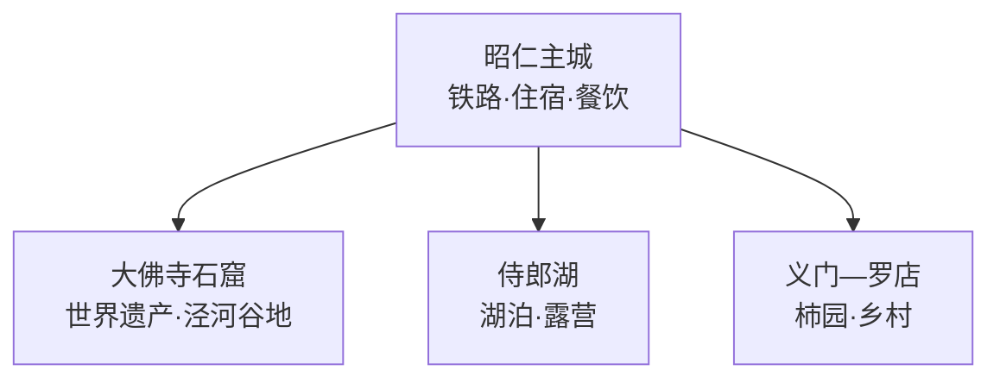
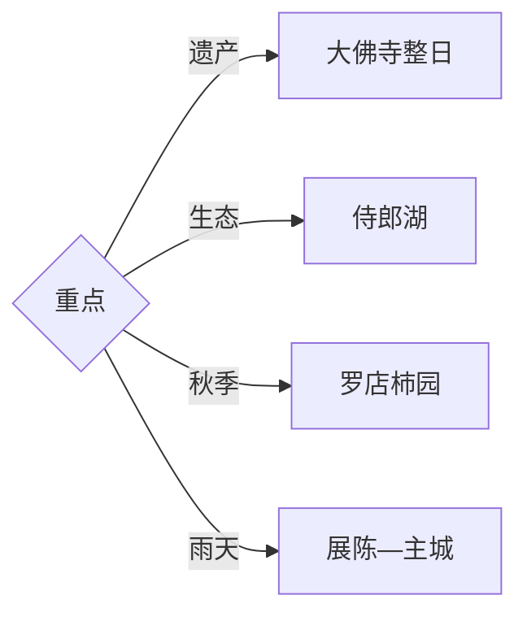

# 彬州旅行指南

彬州位于泾河中游渭北高原，昭仁主城承担铁路与住宿，大佛寺石窟在西向泾河谷地，侍郎湖和罗店柿园分属生态与乡村方向。固定快照中的 **Zhaoren / GeoNames 1784848** 对应彬州主城；核心行程应先锁定世界遗产大佛寺，再按季节选择湖泊或柿园。

> 建议停留：2–3 天\
> 旅行关键词：大佛寺石窟、丝绸之路、泾河、侍郎湖、豳风\
> 主要体力：低至中等\
> 最近研究：2026-09-03

## 城市速览

| 项目 | 旅行信息 |
|---|---|
| 主要旅行价值 | 以初唐大佛寺石窟理解丝路佛教艺术，再延伸到高原湖泊、柿园和豳地文化 |
| 建议停留 | 大佛寺与主城1天；侍郎湖或乡村方向各另留1天 |
| 较舒适季节 | 春秋适合石窟与户外；夏季避暑并关注雷雨，冬季注意低温结冰 |
| 预算特点 | 石窟票务、远线车辆和湖区住宿是主要支出 |
| 步行强度 | 石窟核心中等，湖区按线路低至中等 |
| 主要天气风险 | 高温、雷雨、暴雨、山洪、低温和道路结冰 |
| 独行旅行 | 主城方便，三条远线分别确认返程 |
| 亲子旅行 | 石窟艺术和湖区活动直观，临崖临水区域加强看护 |
| 长者与低体力旅行 | 选择大佛寺核心与侍郎湖平缓段，减少长步道 |
| 无障碍信息 | 景区新建服务区可优先，石窟栈道和湖岸连续性需确认 |

## 城市格局与游览区域

| 区域 | 主要内容 | 游览特点 | 与其他区域的关系 |
|---|---|---|---|
| 昭仁主城 | 城市服务、公共文化与泾河生活 | 平缓易行 | 各条线路共同基地 |
| 大佛寺方向 | 石窟群、寺院遗址与泾河地形 | 文物保护要求高，需完整半日以上 | 首访核心 |
| 侍郎湖 | 湖泊生态与正规露营活动 | 水位、天气和运营影响较大 | 单列一日 |
| 义门—罗店 | 柿园和乡村文化 | 果期体验集中 | 适合秋季或第三日 |

## 主要景点

| 景点 | 区域 | 类型 | 主要看点 | 建议用时 | 室内外 | 体力 | 预约风险 | 天气影响 | 优先级 |
|---|---|---|---|---:|---|---|---|---|---|
| 大佛寺石窟景区 | 城西 | 世界遗产与石窟 | 初唐大佛、洞窟群、丝路艺术与泾河谷地 | 3–5小时 | 混合 | 中 | 节假日高 | 中高 | A |
| 大佛寺石窟博物馆展陈 | 大佛寺景区 | 博物馆 | 石窟保护、历史背景与文物知识 | 1小时 | 室内 | 低 | 中 | 低 | A |
| 侍郎湖景区公开区 | 市域乡镇 | 湖泊与生态 | 高原湖泊、森林与正规露营活动 | 半天–1天 | 室外 | 低中 | 活动期高 | 高 | A |
| 罗店柿园正规游览点 | 义门镇 | 农业与乡村 | 柿园、采摘和季节景观 | 半天 | 室外 | 低 | 果期中 | 中 | B |
| 彬州主城公共文化空间 | 昭仁 | 城市与地方史 | 豳地历史、泾河城市与休息 | 1–2小时 | 室内为主 | 低 | 中 | 低 | B |
| 泾河公共观景空间 | 主城及公开河岸 | 河流与城市 | 河谷地形、水利与城市关系 | 1–2小时 | 室外 | 低 | 低 | 高 | C |

## 美食与餐饮

| 菜品或餐饮类型 | 常见区域 | 一个人用餐与常见份量 | 风味、过敏原与饮食限制 | 排队风险与替代方法 |
|---|---|---|---|---|
| 御面与地方面食 | 主城 | 单份适合独行 | 麸质、醋和辣椒按需求选择 | 午餐高峰换同类面馆 |
| 荞麦面与饸饹 | 主城、乡镇 | 单碗方便 | 汤底可能含肉 | 先问汤底和份量 |
| 柿子与柿饼 | 罗店及正规销售点 | 小份易尝 | 控糖者注意份量 | 果期选成熟果，伴手礼看标签 |
| 泾河流域家常菜 | 主城 | 多人分享更丰富 | 盐、油与肉类可提前说明 | 选择菜单清楚的本地餐馆 |

## 经典行程

### 一日经典路线

**路线**：主城 → 大佛寺石窟博物馆 → 石窟公开游线 → 泾河谷地观景 → 主城

- **串联逻辑**：用完整一天集中理解世界遗产及其地形背景。
- **预约锚点**：票务、开放洞窟、讲解与交通。
- **休息安排**：景区游客中心。
- **时间不足时**：保留大佛窟与博物馆核心，删外围停留。

### 两日城市路线

**第 1 天**：大佛寺石窟。\
**第 2 天**：侍郎湖公开区。

- **串联逻辑**：世界遗产和湖泊生态分日。
- **预约锚点**：侍郎湖运营、活动与车辆。
- **休息安排**：主城连住或选择湖区正规住宿。
- **时间不足时**：第二日改主城半日线。

### 三日深度路线

**第 1 天**：主城与泾河。\
**第 2 天**：大佛寺。\
**第 3 天**：侍郎湖或罗店柿园。

- **串联逻辑**：城市背景、石窟遗产和生态乡村各占一天。
- **预约锚点**：第三日季节项目和车辆。
- **休息安排**：主城为固定基地。
- **时间不足时**：删第一日，保留遗产与一条远线。

### 雨天路线

**路线**：大佛寺博物馆 → 可开放洞窟核心 → 主城午餐 → 公共文化空间

- **适用条件**：普通降雨采用室内优先；暴雨与山洪预警时减少谷地和湖区移动。
- **预约锚点**：石窟景区临时开放范围。
- **休息安排**：游客中心与主城。
- **时间不足时**：保留博物馆和核心洞窟。

### 亲子或低体力路线

**亲子路线**：大佛寺博物馆 → 石窟核心 → 主城休息。\
**低体力路线**：景区接驳 → 核心展陈与近段洞窟 → 原路返回。

- **减负方式**：亲子线加强临崖看护；低体力线确认台阶与接驳距离。
- **预约锚点**：无障碍入口、讲解和停车。
- **休息安排**：游客中心。
- **时间不足时**：两线均保留核心展陈。

### 远郊一日路线

**路线**：主城 → 侍郎湖正式入口 → 湖岸公开线 → 正规活动或休息 → 返回

- **适用条件**：适合天气、水位与道路稳定的日期。
- **预约锚点**：景区、露营活动、车辆与返程。
- **休息安排**：景区正式服务点。
- **时间不足时**：整段删除，改大佛寺或主城。

### 秋季乡村路线

**路线**：主城 → 义门镇 → 罗店柿园正规接待区 → 乡村餐饮 → 返回

- **串联逻辑**：围绕果期和正式接待安排单一乡村方向。
- **预约锚点**：成熟期、采摘与车辆。
- **休息安排**：正规农庄或乡镇餐馆。
- **时间不足时**：保留柿园，删其他乡村延伸。

## 住宿区域

| 区域 | 优点 | 缺点 | 适合人群 | 交通特点 |
|---|---|---|---|---|
| 昭仁主城 | 餐饮、铁路和车辆集中 | 远线需往返 | 首访与公共交通旅行者 | 各方向共同基地 |
| 大佛寺方向正规住宿 | 便于早到遗产地 | 选择少于主城 | 石窟摄影与深度游 | 核对景区入口和接送 |
| 侍郎湖正规住宿 | 便于湖区慢游和活动 | 天气与退改影响大 | 生态休闲旅行者 | 确认具体营地和道路 |

## 市内交通

| 场景 | 建议与取舍 | 行前需要重查的内容 |
|---|---|---|
| 抵达主城 | 铁路、公路客运或自驾进入昭仁主城 | 车次、站点与末班 |
| 前往大佛寺 | 公交、出租或合规车辆按景区入口导航 | 班次、停车和文保施工 |
| 前往侍郎湖或罗店 | 两方向分别安排车辆 | 返程、道路和季节接待 |
| 自驾 | 远线更灵活 | 雨雪、停车和临时管制 |

## 不同旅行者须知

| 旅行维度 | 可行条件 | 主要取舍 | 需额外核对 |
|---|---|---|---|
| 独行旅行 | 主城方便 | 远线末端交通有限 | 返程与住宿 |
| 亲子旅行 | 石窟与湖泊体验直观 | 临崖临水需要看护 | 儿童票与活动规则 |
| 长者或低体力旅行 | 核心展陈可缩短 | 栈道与湖岸步行有负担 | 接驳与台阶 |
| 无障碍需求 | 游客中心优先 | 石窟地形限制连续通行 | 无障碍入口和卫生间 |
| 摄影旅行 | 石窟、泾河与湖泊题材丰富 | 文物拍摄和光线受管理 | 三脚架、闪光灯与航拍 |
| 预算有限 | 主城食宿温和 | 远线车辆增加成本 | 公交与退改 |
| 晚出发或紧凑行程 | 主城文化线可执行 | 大佛寺需要完整半日 | 最晚入场与返程 |
| 特殊天气或自然条件 | 场馆线易调整 | 暴雨、山洪和结冰影响远线 | 气象、道路和景区公告 |

石窟、文物保护区与考古范围按正式入口和开放洞窟参观；崖壁、未开放洞窟、泾河行洪区、水库坝区、林地、农田和矿业生产区保留明确限制。

## 行前核对

| 核对事项 | 为什么需要重查 | 建议核对时间 | 官方入口 |
|---|---|---|---|
| 大佛寺票务与洞窟开放 | 文保工程和客流会调整路线 | 预约前及到访前一日 | [陕西省文物局](https://wwj.shaanxi.gov.cn/) |
| 侍郎湖运营 | 水位、天气和活动影响开放 | 出发前三日及当天 | [彬州市人民政府](http://www.snbinzhou.gov.cn/) |
| 柿园与乡村接待 | 果期和采摘规则变化 | 出发前一周 | [咸阳市人民政府](https://www.xianyang.gov.cn/) |
| 铁路与道路 | 班次、施工和雨雪影响返程 | 购票前及当天 | [中国铁路12306](https://www.12306.cn/) |

## 来源与更新记录

### 主要来源

| 来源 | 类型 | 支持内容 | 核验日期 |
|---|---|---|---|
| [陕西省文物局：陕西七处丝路遗产](https://wwj.shaanxi.gov.cn/ztzl/ndzt/2013n/slsy/ycdt_2412/201406/t20140623_2144955.html) | 政府 | 大佛寺石窟世界遗产属性与艺术价值 | 2026-09-03 |
| [新华网：彬州文旅](https://www.news.cn/shshpd/20260611/bf592e9ac2c64375a25d48ce76fc7a5e/c.html) | 国家媒体 | 大佛寺、侍郎湖、罗店柿园与文旅格局 | 2026-09-03 |
| [GeoNames 1784848](https://www.geonames.org/1784848/) | 开放数据 | Zhaoren 固定人口点、坐标与行政代码 | 2026-09-03 |

### 更新记录

| 日期 | 更新内容 |
|---|---|
| 2026-09-03 | 首次完成资料研究、遗产湖泊乡村拆分、七条路线与县级市映射 |
