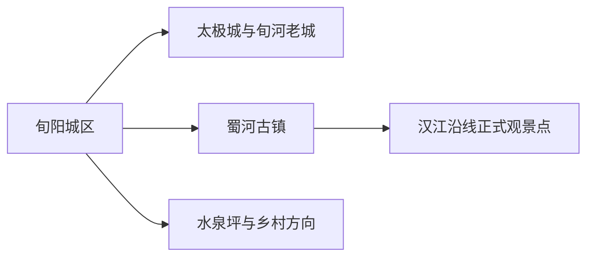
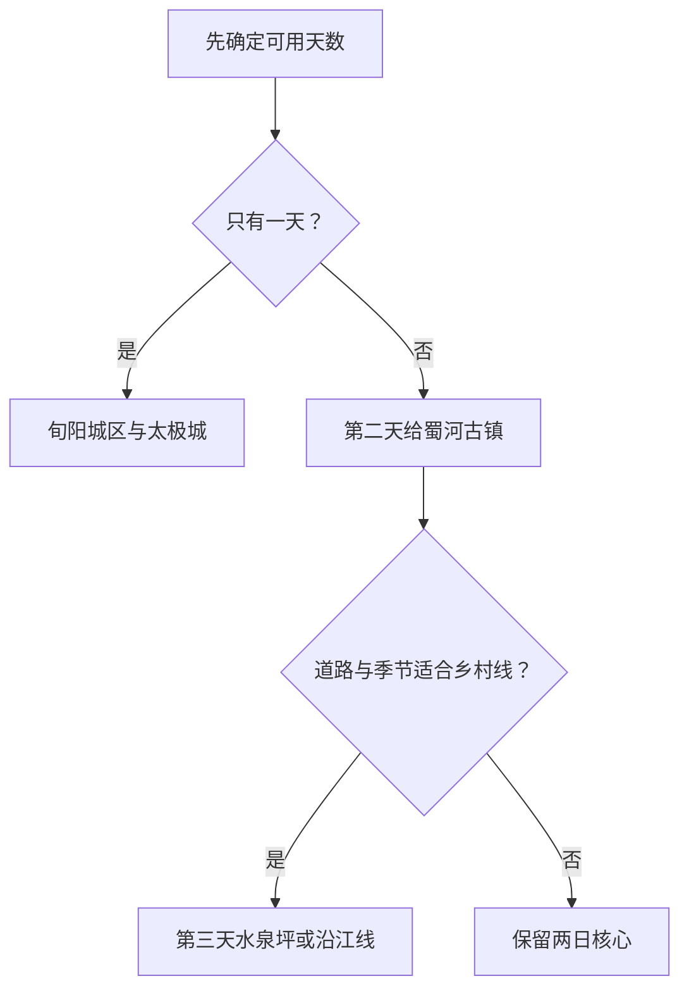

# 旬阳旅行指南

旬阳位于汉江与旬河交汇处，旅行主线由太极城山水格局、旬河老城、蜀河古镇和汉江沿线村镇组成。第一次到访可先在旬阳城区理解“山—河—城”的关系，再给蜀河古镇留一整天；水泉坪等乡村点适合作为季节明确的第三日支线。

## 城市速览

| 项目 | 信息 |
|---|---|
| 旅行主线 | 太极城、旬河老城、蜀河古镇、汉江水岸与水泉坪 |
| 建议停留 | 1 天城区；2 天加入蜀河；3 天再选乡村或山地线 |
| 住宿基地 | 旬阳城区适合铁路、公路和多方向衔接；蜀河适合古镇慢游 |
| 步行强度 | 城区中等且有坡；古镇石板路中等；山地乡村中至高 |
| 主要天气 | 夏季高温、暴雨、汉江水位、山洪、滑坡和冬季湿冷 |
| 预约核心 | 蜀河古镇场馆、县域交通、乡村接待、沿江道路和返程 |
| 亲子 | 城区公共文化、蜀河历史展陈和服务明确的乡村活动 |
| 低体力 | 城区车辆观景加一处场馆；蜀河只走近入口街区 |
| 边界重点 | 汉江岸线、水电设施、地质灾害点、茶园农田和文保院落按开放范围进入 |
| 无障碍 | 设施连续性需向官方确认，重点核对古镇石路、坡道、卫生间和落客点 |

## 城市格局与游览区域

旬阳市是安康市代管的县级市，法定代码 `610981`。固定 GeoNames `1787873` 是旬阳主城驻地点，Wikidata `Q1201108` 代表法定旬阳市，其 `P1566=1787871` 指向较广行政记录。两个标识描述不同粒度，市域边界以法定代码和政府区划资料为准。

| 区域 | 旅行价值 | 怎么安排 |
|---|---|---|
| 旬阳城区 | 到达、住宿、太极城地貌与城市公共文化 | 适合完整一天或抵达日 |
| 蜀河古镇 | 古街、会馆、汉江商贸史与民俗 | 留一整天，必要时住一晚 |
| 水泉坪方向 | 稻作景观、乡村与季节活动 | 接待、道路和农时明确时安排 |
| 汉江沿线 | 山水、村镇与公路视野 | 使用正式道路和观景点，分段游览 |

## 主要景点

### 城区与太极城

| 景点 | 所在区域 | 类型 | 核心看点 | 建议用时 | 室内/室外 | 体力 | 预约难度 | 天气敏感度 | 适合旅程 |
|---|---|---|---|---|---|---|---|---|---|
| 太极城公开观景点 | 旬阳城区 | 山水城市地貌 | 旬河回环、汉江交汇与山城格局 | 1–2 小时 | 室外 | 中 | 中 | 极高 | A |
| 旬阳城市公共文化场馆 | 城区 | 地方史与非遗 | 秦楚交界文化、汉江商贸与旬阳民俗 | 1–2 小时 | 室内 | 低 | 中 | 低 | A |
| 旬河老城公开街区 | 城区 | 老城与街巷 | 山城街巷、河谷城市生活与当期公共空间 | 2–3 小时 | 室外为主 | 中至高 | 低 | 高 | B |

### 蜀河与乡村

| 景点 | 所在区域 | 类型 | 核心看点 | 建议用时 | 室内/室外 | 体力 | 预约难度 | 天气敏感度 | 适合旅程 |
|---|---|---|---|---|---|---|---|---|---|
| 蜀河古镇景区 | 蜀河镇 | 历史古镇 | 黄州馆等会馆、古街、汉江商贸史与非遗 | 4–7 小时 | 混合 | 中 | 高 | 高 | A |
| 蜀河古镇文保院落 | 蜀河镇 | 古建筑与展陈 | 会馆、院落与古镇保护修复 | 1–3 小时 | 混合 | 中 | 高 | 中 | B |
| 水泉坪正式接待区 | 仁河口方向 | 乡村与稻作 | 山地稻田、村落与季节农事 | 3–6 小时 | 室外为主 | 中至高 | 高 | 极高 | B |
| 汉江沿线正式观景点 | 市域沿江方向 | 河谷与公路景观 | 汉江、村镇和秦巴山地关系 | 1–3 小时 | 室外 | 中 | 高 | 极高 | C |

蜀河古镇作为一个完整景区记录，内部会馆、展馆与街巷按实际开放选择。汉江航道、水电设施、施工岸线、农田水渠和山地便道保留原有生产与管理功能；旅行路线使用正式道路、公共街巷和明确接待区。

## 美食与餐饮

| 类型 | 适合场景 | 份量 | 过敏与饮食提示 | 怎么选 |
|---|---|---|---|---|
| 旬阳拐枣相关食品 | 伴手礼或季节品尝 | 按份或包装 | 酒精、糖分与加工配料 | 看标签、生产主体和保质期 |
| 汉江鱼菜 | 城区或蜀河正餐 | 多适合分享 | 鱼刺、水产过敏、酱油和辣椒 | 先问鱼种、合法来源、重量和做法 |
| 陕南蒸盆子与合菜 | 正餐 | 份量偏大 | 肉类、蛋、豆制品和高盐汤底 | 独行问小份，两人以上分享 |
| 面食与酸辣小吃 | 城区简餐 | 一人份方便 | 小麦、花生、芝麻和辣椒 | 过敏者询问汤底、油泼与配菜 |

## 经典行程

### 一日经典路线

**路线**：旬阳公共文化场馆 → 午餐 → 旬河老城 → 太极城公开观景点

- **串联逻辑**：先理解地方史，再从街巷和观景点观察山河城市关系。
- **预约锚点**：场馆、观景点开放和道路状况。
- **休息安排**：午餐长休，观景点只走靠近落客区的短线。
- **时间不足时**：保留场馆与一个太极城观景点。

### 两日城市路线

**第 1 天**：旬阳城区与太极城 
**第 2 天**：蜀河古镇完整一日

- **串联逻辑**：城区和古镇分日，避免把县际车程压进同一短线。
- **预约锚点**：蜀河场馆、交通、讲解和返程。
- **休息安排**：古镇正规餐饮和游客服务点午休。
- **时间不足时**：删除第二日或在蜀河住一晚后离开。

### 三日深度路线

**第 1 天**：旬阳城区 
**第 2 天**：蜀河古镇 
**第 3 天**：水泉坪或一段汉江正式观景线

- **串联逻辑**：城市、古镇与乡村分别成日，适配山地交通。
- **预约锚点**：第三日接待、农时、道路和车辆。
- **休息安排**：乡村接待点或镇区正规餐饮。
- **时间不足时**：删除第三日。

### 雨天路线

**路线**：城区公共文化场馆 → 午餐 → 近距离老城展陈

- **适用条件**：普通降雨且城市道路正常；暴雨、山洪或地灾预警时按官方提示调整。
- **串联逻辑**：压缩在城区，减少沿江与山路移动。
- **预约锚点**：场馆、道路积水和交通公告。
- **休息安排**：室内场馆和餐饮。
- **时间不足时**：只留一处场馆。

### 亲子路线

**路线**：城市公共文化场馆 → 午餐 → 太极城近入口观景点

- **适用条件**：护栏、天气与儿童看护条件明确。
- **串联逻辑**：室内学习和短户外观察交替。
- **预约锚点**：亲子活动、观景点开放与儿童座椅。
- **休息安排**：午餐长休，下午控制在两小时内。
- **时间不足时**：保留场馆。

### 低体力路线

**路线**：车辆到达城市公共文化场馆 → 午餐 → 老城近入口短段

- **适用条件**：落客点、平整路面和卫生间已确认。
- **串联逻辑**：用车辆替代山城长坡，每处只看核心内容。
- **预约锚点**：无障碍入口、轮椅、座椅和落客。
- **休息安排**：午餐完整休息，下午可提前返回。
- **时间不足时**：只留场馆。

### 蜀河古镇路线

**路线**：旬阳或蜀河住宿 → 古镇游客服务区 → 会馆与公开街巷 → 午餐 → 临江公开区 → 返回

- **适用条件**：古镇、交通和汉江水情稳定。
- **串联逻辑**：围绕一个古镇景区展开，不叠加其他山地远点。
- **预约锚点**：场馆、讲解、演出与返程。
- **休息安排**：午餐后安排室内院落或长休。
- **时间不足时**：保留古街与一处核心会馆。

## 住宿区域

| 区域 | 优点 | 取舍 | 适合人群 | 核对项 |
|---|---|---|---|---|
| 旬阳城区 | 铁路、公路、餐饮和多方向出发方便 | 山城坡度与跨河交通增加步行 | 首访、无车、多日旅行 | 电梯、停车、夜间入住、车站接驳 |
| 蜀河镇正规住宿 | 便于古镇早晚慢游 | 选择少，到其他方向不便 | 古镇、人文、摄影 | 消防、隔音、热水、退改与返程 |
| 乡村正规接待住宿 | 靠近稻田或沿江季节项目 | 道路与服务受天气影响 | 自驾、乡村慢游 | 合法经营、通信、供餐、地灾和车辆 |

## 市内交通

旬阳对外以铁路和公路为主，城区内部可用公交、出租车与分段步行。蜀河、水泉坪及其他乡镇方向需另算县域交通和返程；山地道路的实际用时受施工、降雨和落石影响较大。

| 场景 | 怎么做 | 行前核对 |
|---|---|---|
| 铁路到达 | 按票面完整站名选择到站，再转城区或蜀河方向 | 车次、站前接驳、夜间到达 |
| 城区移动 | 公交或短程车辆连接坡地片区 | 首末班、道路施工与积水 |
| 前往蜀河 | 使用铁路、公路或县域交通中当期稳定方案 | 停站、班次、古镇接驳与返程 |
| 乡村远线 | 自驾或正规包车，每天只选一个方向 | 山路、地灾、加油、通信和停车 |

## 不同旅行者须知

| 旅行者 | 推荐做法 | 重点核对 |
|---|---|---|
| 独行 | 住城区，蜀河安排日间往返或住一晚 | 末班、夜间照明与通信 |
| 亲子 | 城区场馆加短观景，古镇控制院落数量 | 护栏、台阶、儿童座椅与卫生间 |
| 长者与低体力 | 车辆观景、每半天一个核心 | 坡度、石板路、轮椅与落客 |
| 摄影 | 太极城与蜀河分日，预留天气机动 | 无人机、江岸警戒线和日落返程 |
| 自驾 | 日间行车，每天一个远线 | 山洪地灾、施工、疲劳与停车 |

## 行前核对

- 旬阳市政府旅游信息：景点、活动、蜀河与乡村接待。
- 安康市文旅部门：A级景区、古镇信息与市域交通。
- 陕西省气象、应急、水利部门：暴雨、山洪、地灾和汉江水情。
- 中国铁路 12306：旬阳相关车站、车次与退改。
- 蜀河古镇管理方：开放院落、讲解、演出、停车与返程。

## 来源与更新记录

| 来源 | 支持内容 | 核验日期 |
|---|---|---|
| [旬阳市政府：景点风光](https://www.xyx.gov.cn/Node-62059.html) | 太极城、蜀河、水泉坪与市域旅行线索 | 2026-08-30 |
| [旬阳市政府：蜀河古镇文旅服务中心](https://www.xyx.gov.cn/Content-2413622.html) | 古镇保护、旅游服务与接待设施 | 2026-08-30 |
| [安康市政府：蜀河古镇](https://www.ankang.gov.cn/Content-2616751.html) | 古镇属地、景区属性、地址与交通线索 | 2026-08-30 |
| [Wikidata Q1201108](https://www.wikidata.org/wiki/Q1201108) | 法定旬阳市、代码与行政 GeoNames 记录 | 2026-08-30 |
| [GeoNames 1787873](https://www.geonames.org/1787873/) | 固定旬阳驻地点、别名与坐标 | 2026-08-30 |
| [中国铁路 12306](https://www.12306.cn/) | 车站、车次与购票动态 | 2026-08-30 |
| [陕西省气象局](http://sn.cma.gov.cn/) | 暴雨、高温、强对流与地质气象风险 | 2026-08-30 |

| 日期 | 更新 |
|---|---|
| 2026-08-30 | 首次完成旬阳城区、太极城、蜀河古镇、汉江与乡村旅行研究。 |
