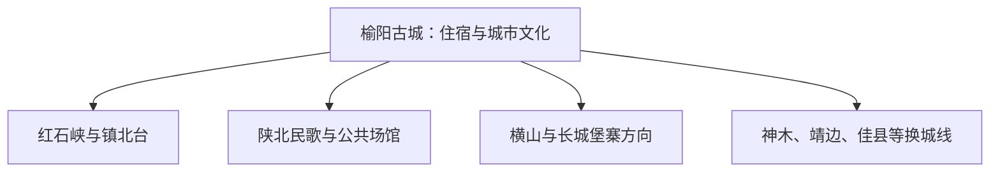

# 榆林旅行指南

榆林适合先看榆阳古城、红石峡和镇北台，再决定是否增加长城堡寨、黄河峡谷或丹霞地貌。地级市范围南北跨度很大，神木、靖边、佳县、府谷、米脂等县市各自需要完整交通与住宿，不是榆阳主城的顺路景点。

> 建议停留：榆阳主城 2 天；每个县域方向另加 1–2 天<br>
> 旅行关键词：榆林古城、红石峡、镇北台、长城、陕北民歌、黄土与沙地交错带<br>
> 主要体力：主城中等；县域山地、峡谷和沙地为中高<br>
> 最近研究：2026-08-13

## 城市速览

| 项目 | 旅行信息 |
|---|---|
| 主要旅行价值 | 在榆阳主城串联九边重镇古城、长城关隘、摩崖石刻与陕北民歌，再按兴趣换城延伸 |
| 建议停留 | 主城 2 天；靖边、神木、佳县等每个方向另留完整日或住宿 |
| 较舒适季节 | 春秋适合古城与户外；夏季日照强且有雷雨，冬季寒冷多风 |
| 预算特点 | 主城中等，县域长距离车辆、换宿和大型景区增加预算 |
| 步行强度 | 古城可连续走；红石峡—镇北台有坡度，远县山地更高 |
| 主要天气风险 | 大风、沙尘、雷暴、山洪、黄土沟壑地灾、严寒和道路结冰 |
| 独行旅行 | 主城交通与餐饮方便；县域路线提前锁到发和住宿 |
| 亲子旅行 | 古城、博物馆和民歌展陈可组合，峡谷与沙地项目核年龄和护具 |
| 长者与低体力旅行 | 古城分段，红石峡与镇北台用车辆连接，每天一个远点 |
| 无障碍信息 | 新建场馆与公共空间较易询问；古城、长城和峡谷资料有限，设施连续性需向官方确认 |

## 城市格局与游览区域

榆林市是法定地级市，代码 **610800**，辖榆阳区、横山区、神木市及多个县。GeoNames `1785777`、Wikidata `Q515712` 和法定代码精确对应，但城市点坐标只定位榆阳主城，不能缩小整个地级市范围。榆阳主城是本页的住宿与公共交通核心；县市远线只提供联程选择，不借主城页面代替属地研究。



| 区域 | 主要内容 | 游览特点 | 与其他区域的关系 |
|---|---|---|---|
| 榆阳古城 | 六楼骑街、老街、夫子庙与地方生活 | 适合连续步行和夜间餐饮 | 与红石峡、镇北台需车辆连接 |
| 红石峡—镇北台 | 摩崖石刻、长城要塞和沙地—黄土交错景观 | 适合半日至一日 | 两处相邻但各有入口与游线 |
| 东沙—公共文化片区 | 陕北民歌博物馆、城市公园和新城 | 室内外结合，适合雨天替代 | 可与古城分半日组合 |
| 横山与榆阳乡镇 | 波罗古堡、长城与乡村文化公开点 | 距离明显，选择一条正规线路 | 与远县目的地分开 |
| 神木、靖边、佳县等县市 | 石峁、红碱淖、波浪谷、白云山等 | 各有独立城区、住宿和交通 | 作为换城后的完整目的地 |

## 主要景点

### 榆阳主城

| 景点 | 区域 | 类型 | 主要看点 | 建议用时 | 室内外 | 体力 | 预约风险 | 天气影响 | 优先级 |
|---|---|---|---|---:|---|---|---|---|---|
| 榆林古城公开街区 | 榆阳老城 | 历史街区 | 六楼骑街、城墙格局、老街与公共文化空间 | 3–6 小时 | 混合 | 中 | 中 | 中 | A |
| 红石峡摩崖石刻与正式景区 | 城北 | 峡谷、文物 | 榆溪河峡谷、摩崖石刻和公开游线 | 2–4 小时 | 室外 | 中 | 高 | 高 | A |
| 镇北台景区 | 城北 | 长城、军事史 | 明长城要塞、互市历史与高处视野 | 2–3 小时 | 室外 | 中 | 高 | 极高 | A |
| 陕北民歌博物馆 | 东沙方向 | 博物馆、音乐 | 陕北民歌历史、展陈与当期活动 | 1.5–3 小时 | 室内 | 低 | 中 | 低 | B |
| 榆林市博物馆或公共文化场馆 | 主城 | 博物馆 | 地方历史、长城文化与市域展陈 | 2–3 小时 | 室内 | 低 | 中 | 低 | B |
| 榆溪河城市公共段 | 主城 | 滨水、公园 | 城市生态长廊和低强度休闲 | 1–2 小时 | 室外 | 低 | 低 | 高 | C |

### 近郊与跨县延伸

| 景点 | 区域 | 类型 | 主要看点 | 建议用时 | 室内外 | 体力 | 预约风险 | 天气影响 | 优先级 |
|---|---|---|---|---:|---|---|---|---|---|
| 波罗古堡正式开放区 | 横山方向 | 古堡、长城文化 | 堡寨、古镇公开空间与长城文化 | 1 天 | 室外为主 | 中 | 高 | 高 | B |
| 统万城国家考古遗址公园 | 靖边县 | 考古遗址 | 大夏都城遗址与正式展示 | 换城后 1 天 | 混合 | 中 | 高 | 极高 | 跨城 |
| 龙洲丹霞或波浪谷正式景区 | 靖边县 | 丹霞、峡谷 | 运营范围内的丹霞地貌游线 | 换城后 1 天 | 室外 | 中至高 | 高 | 极高 | 跨城 |
| 石峁遗址或红碱淖方向 | 神木市 | 考古、湖泊 | 正式遗址展示或湿地景区 | 换城后 1–2 天 | 混合 | 中 | 高 | 极高 | 跨城 |

红石峡生态公园、摩崖石刻和水库周边具有不同管理范围，按门票与现场标识游览。长城未开放点段、考古发掘区、煤矿与能源化工区、铁路专用线、水库工程、沙地治理生产区和村民生活空间各自遵守管理边界。

## 美食与餐饮

| 菜品或餐饮类型 | 常见区域 | 一个人用餐与常见份量 | 风味、过敏原与饮食限制 | 排队风险与替代方法 |
|---|---|---|---|---|
| 羊杂碎、羊肉面 | 榆阳主城 | 一碗适合独食 | 含羊肉、内脏、小麦，辣椒与香菜可另放 | 早餐高峰换同类清真或普通面馆 |
| 拼三鲜 | 主城餐馆 | 一份多适合分享，一人问小份 | 常含肉、蛋、海米或菌菇，配方因店而异 | 改点单人烩菜并说明过敏原 |
| 炸豆奶、油旋等小吃 | 古城与生活街区 | 小份适合边走边尝 | 含豆、奶、小麦或油炸食品 | 选择现制、卫生条件清楚的摊店 |
| 碗托、荞麦与杂粮 | 主城 | 一份适合独食 | 荞麦、辣椒、醋和蒜汁需按饮食限制调整 | 避开正餐高峰或换家常面食 |

## 经典行程

```mermaid
flowchart TD
    S["先完成榆阳主城"] --> A["古城与公共场馆"]
    A --> B["红石峡与镇北台"]
    B --> D{ "是否增加县域" }
    D -->|长城考古| J["靖边或横山"]
    D -->|湖泊考古| M["神木方向"]
    D -->|黄河文化| H["佳县等沿黄方向"]
    D -->|否| X["主城返程"]
```

### 一日经典路线

**路线**：榆林古城 → 城区午餐 → 红石峡 → 镇北台 → 主城

- **串联逻辑**：古城建立边塞城市背景，下午沿城北同方向看峡谷与长城要塞。
- **预约锚点**：红石峡、镇北台开放、交通、风沙与最后返城。
- **休息安排**：午间在古城坐席用餐，红石峡与镇北台之间留一次休息。
- **时间不足时**：保留古城与镇北台，取消红石峡内部附加项目。

### 两日城市路线

**第 1 天**：古城 → 博物馆或民歌馆；**第 2 天**：红石峡 → 镇北台 → 榆溪河短段。

- **串联逻辑**：文化场馆和城北户外分日，降低风沙或闭馆造成的连锁影响。
- **预约锚点**：场馆闭馆日、景区、公交/车辆和住宿。
- **休息安排**：首日低强度，第二日在景区游客服务点午休。
- **时间不足时**：第二天只保留镇北台与红石峡之一。

### 三日深度路线

**第 1 天**：古城；**第 2 天**：城北长城文化；**第 3 天**：横山波罗古堡等一条明确开放近郊线。

- **串联逻辑**：先完成榆阳核心，再沿单一公路方向增加堡寨，不横跨远县。
- **预约锚点**：古堡接待、车辆、道路、森林草原火险和住宿。
- **休息安排**：第三天在镇区或正式游客服务点午休。
- **时间不足时**：删第 3 天，保留主城两日。

### 雨雪天路线

**路线**：榆林市博物馆或陕北民歌博物馆 → 午餐 → 古城有明确开放的室内场馆

- **适用条件**：城区道路正常；强降雪、结冰、沙尘或暴雨时减少城北与县域移动。
- **预约锚点**：闭馆、道路、公交、铁路和气象预警。
- **休息安排**：场馆之间短车连接，每 60–90 分钟休息。
- **时间不足时**：只留一馆。

### 亲子或低体力路线

**亲子路线**：民歌博物馆 → 午休 → 古城短段<br>
**低体力路线**：市博物馆 → 坐席午餐 → 镇北台车辆可达公开段

- **减负方式**：亲子线减少峡谷与长城坡段；低体力线缩短古城步行和红石峡台阶。
- **预约锚点**：讲解、儿童活动、场馆电梯、镇北台上下客和座椅。
- **休息安排**：午间回住宿区，下午项目可提前结束。
- **时间不足时**：两条路线都只保留室内场馆。

### 远郊一日路线

**路线**：榆阳主城 → 波罗古堡等一处正式近郊目的地 → 主城；更远的靖边、神木或佳县改为换宿路线

- **适用条件**：往返车程、景区开放、道路和返程形成闭环。
- **预约锚点**：属地运营方、车辆、天气、火险和住宿。
- **休息安排**：使用镇区或游客中心，司机留足休息时间。
- **时间不足时**：改为红石峡—镇北台城北线。

## 住宿区域

| 区域 | 优点 | 缺点 | 适合人群 | 交通特点 |
|---|---|---|---|---|
| 榆阳古城或中心城区 | 餐饮、夜间步行和文化体验方便 | 停车、隔音与老楼电梯条件不同 | 首访、文化主题者 | 到机场、车站和城北均需接驳 |
| 榆林站或主要道路附近 | 便于铁路与县域车辆 | 老城氛围较弱 | 早晚车次、跨城旅行者 | 核对真实车程与公交 |
| 东沙新区 | 新建住宿和公共空间较多 | 到古城需地面交通 | 亲子、低体力与场馆主题者 | 适合博物馆/民歌馆方向 |
| 县市当地住宿 | 减少靖边、神木、佳县等当天往返 | 需要换宿和重新核交通 | 县域深度游者 | 按具体目的地选县城或景区住宿 |

## 市内交通

| 场景 | 建议与取舍 | 行前需要重查的内容 |
|---|---|---|
| 航空抵达 | 榆林榆阳机场是主城航空门户，口岸建设不等于已有固定国际客运 | 航班、机场巴士、夜间到达和当前航线 |
| 铁路抵达 | 榆林站进入主城，县市铁路站各自服务不同方向 | 12306、实际停站、公交与末班 |
| 主城移动 | 古城步行，城北和东沙用公交、出租或网约车 | 施工、活动管制、景区上下客与夜间交通 |
| 县域联程 | 铁路、长途客运或正规车辆，必要时换宿 | 总车程、末班、道路、司机休息和返程 |

## 不同旅行者须知

| 旅行维度 | 可行条件 | 主要取舍 | 需额外核对 |
|---|---|---|---|
| 独行旅行 | 主城住宿、公交与餐饮可闭环 | 县域长线提前安排换宿 | 末班、夜间叫车和接驳 |
| 亲子旅行 | 博物馆、民歌与古城适合主题学习 | 峡谷、沙地和长距离乘车增加照看 | 年龄、护具、卫生间和讲解 |
| 长者或低体力旅行 | 场馆与镇北台分段安排 | 古城石路、峡谷与长城坡度仍有负担 | 电梯、接驳、座椅和入口 |
| 无障碍需求 | 优先新建场馆与城市公共空间 | 古城、摩崖、长城和县域景区资料不足 | 设施连续性需向官方确认 |
| 摄影旅行 | 古城、长城、沙地和黄河可分主题 | 文物、无人机、矿区和社区拍摄有规则 | 开放时段、设备和许可 |
| 特殊天气 | 主城场馆可替代 | 风沙、雷暴、山洪、严寒和结冰影响远线 | 气象、道路与景区公告 |

## 行前核对

| 核对事项 | 为什么需要重查 | 建议核对时间 | 官方入口 |
|---|---|---|---|
| 红石峡、镇北台与场馆 | 开放、活动、维修和限流会调整 | 到访前一日 | [榆林市人民政府文旅入口](https://yl.gov.cn/mlyl/) |
| 县域景区 | 靖边、神木、佳县等需按属地公告安排 | 确定换城路线前 | [榆林市人民政府](https://yl.gov.cn/) |
| 航班、铁路与客运 | 班次和到发站影响住宿与换城 | 购票时及出发当天 | [中国铁路 12306](https://www.12306.cn/) |
| 天气与灾害 | 风沙、暴雨、火险和结冰具有时效性 | 出发前三日及当天 | [陕西省气象局](https://sn.cma.gov.cn/) |

## 来源与更新记录

### 主要来源

| 来源 | 类型 | 支持内容 | 核验日期 |
|---|---|---|---|
| [榆林市：红石峡生态公园](https://yl.gov.cn/mlyl/zjyl/fjms/201902/t20190213_17547.html) | 市政府 | 红石峡、榆溪河、摩崖石刻和镇北台空间关系 | 2026-08-13 |
| [榆林市：镇北台](https://yl.gov.cn/mlyl/zjyl/fjms/202009/t20200928_18048.html) | 市政府 | 镇北台、长城、互市与周边景观 | 2026-08-13 |
| [榆林城市文化游线资料](https://www.yl.gov.cn/ywdt/tpxw/202310/t20231020_359612.html) | 市政府 | 古城六楼、民歌馆、红石峡和榆溪河城市线 | 2026-08-13 |
| [榆林市政府工作报告](https://www.yl.gov.cn/zwgk/zfgzbg/202403/t20240314_1131869.html) | 市政府 | 古城、红石峡、镇北台及县域文旅动态 | 2026-08-13 |
| [榆林榆阳机场口岸建设](https://www.yl.gov.cn/ywdt/ttxw/202601/t20260107_2066535.html) | 市政府 | 机场门户和口岸建设状态 | 2026-08-13 |
| [民政部行政区划查询](https://dmfw.mca.gov.cn/xzqh/getList?code=61&trimCode=true&maxLevel=3) | 政府开放接口 | 榆林市代码 `610800` 与县区层级 | 2026-08-13 |
| [GeoNames 1785777](https://www.geonames.org/1785777/yulinshi.html) | 开放地理数据 | 固定城市点与 PPLA2 分类 | 2026-08-13 |
| [Wikidata Q515712](https://www.wikidata.org/wiki/Q515712) | 开放知识图谱 | 榆林市实体、P1566 与法定代码 | 2026-08-13 |

### 更新记录

| 日期 | 更新内容 |
|---|---|
| 2026-08-13 | 首次完成榆林旅行研究；以榆阳主城为主体，并将各县市明确为换城后的独立目的地。 |
