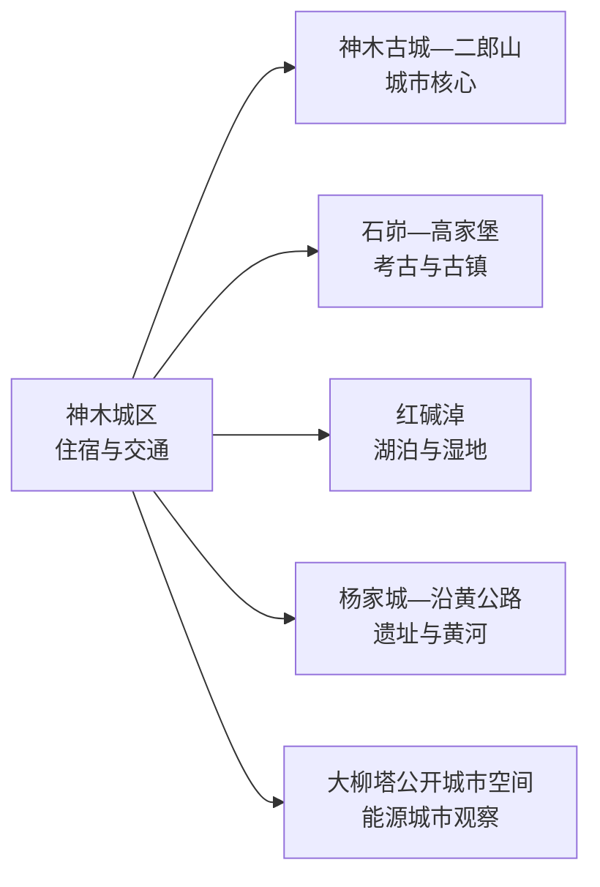
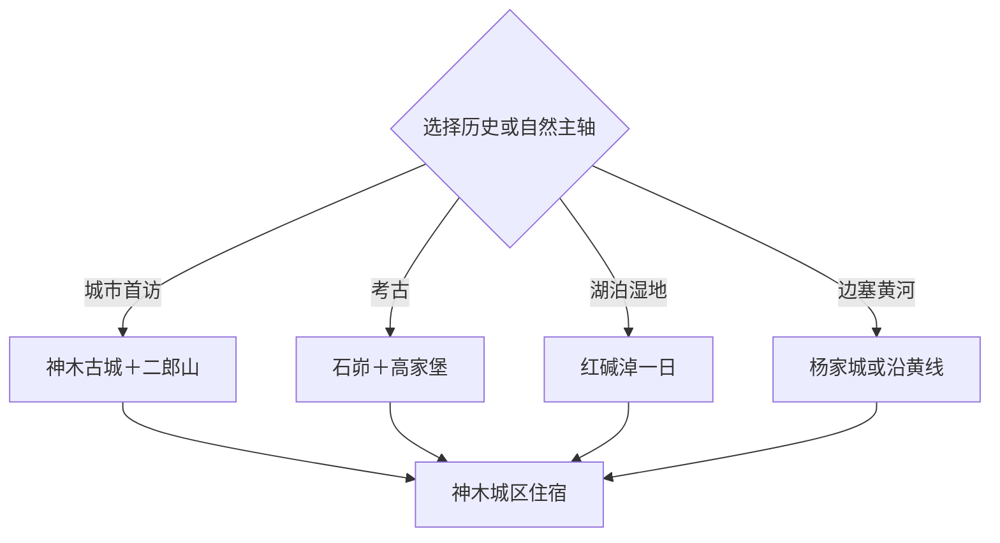

# 神木旅行指南

神木位于陕北长城沿线与黄土高原北缘，官方“一山二水三城”框架把二郎山、黄河与红碱淖、石峁（高家堡）、杨家城和神木古城串成多方向旅行体系。首访适合 2–4 天：城区与二郎山一天，石峁—高家堡一天，红碱淖或沿黄方向再选一天。

本页绑定法定神木市的 GeoNames 城市点 **1795617**。该记录位于固定 `cities500` 快照外，只计入法定县级市覆盖。

## 城市速览

| 项目 | 信息 |
|---|---|
| 主线 | 神木古城—二郎山—石峁遗址—高家堡—红碱淖—杨家城 |
| 停留 | 城区 1 天；石峁—高家堡 1 天；红碱淖或沿黄另留 1 天 |
| 住宿 | 神木城区适合综合换乘；高家堡或红碱淖周边住宿重视季节接待 |
| 交通 | 铁路、公路到达城区，遗址、湖区和沿黄远线以预约车辆为主 |
| 季节 | 春秋适合遗址与古城，夏季适合湖区；冬季寒冷且道路可能结冰 |
| 预算 | 城区项目较集中，远线车辆、讲解、景区交通和旺季住宿增加支出 |

## 城市格局与游览区域

城区、石峁—高家堡、红碱淖和沿黄方向彼此分散，分别安排一天更适合讲解、步行与天气变化。大柳塔可从公共城市空间理解能源城市，但矿井、煤化工厂区、铁路专用线、输送设施和运输道路属于生产边界。石峁、杨家城、长城与古建按文物开放范围参观，红碱淖按湿地与景区管理活动。

## 主要景点

| 景点 | 区域 | 类型 | 核心体验 | 用时 | 环境 | 体力 | 预约风险 | 天气影响 | 优先级 |
|---|---|---|---|---:|---|---|---|---|---|
| 石峁遗址公开参观区 | 高家堡镇方向 | 考古遗址 | 皇城台、石城格局和史前文明 | 半天至1天 | 室外为主 | 中 | 很高 | 高 | A |
| 高家堡古镇公开街区 | 高家堡镇 | 古镇与边塞 | 城堡、街巷和长城沿线生活 | 2–4小时 | 混合 | 低中 | 中 | 中高 | A |
| 二郎山景区 | 神木城区附近 | 山岳与人文 | 山脊、古建与城市俯瞰 | 2–4小时 | 室外为主 | 中高 | 中 | 很高 | A |
| 神木古城公开街区 | 神木城区 | 古城与城市史 | 老城格局、地方生活和边塞文化 | 2–3小时 | 混合 | 低 | 低 | 中 | A |
| 红碱淖景区正式游线 | 尔林兔方向 | 湖泊与湿地 | 湖泊、沙地草原和候鸟环境 | 1天 | 室外 | 中 | 很高 | 很高 | A |
| 杨家城遗址公开区 | 店塔方向 | 古城遗址 | 麟州故城、边地城市与历史地景 | 半天 | 室外 | 中 | 很高 | 高 | B |
| 神木市博物馆或公共文化场馆 | 城区 | 博物馆与地方史 | 考古、长城、民俗和城市发展 | 1.5–3小时 | 室内 | 低 | 高 | 低 | B |
| 天台山正式开放区 | 沿黄方向 | 黄河与山岳 | 黄河峡谷、山地景观和人文 | 半天至1天 | 室外 | 中高 | 很高 | 很高 | B |
| 神府革命纪念相关公开点 | 市域东部 | 红色历史 | 神府根据地与地方革命史 | 2–4小时 | 混合 | 低中 | 很高 | 中 | B |
| 大柳塔公共展示与城市空间 | 大柳塔镇 | 能源城市与转型 | 城市公共空间、生态治理和能源产业背景 | 2–3小时 | 混合 | 低 | 高 | 中 | C |

## 美食与餐饮

神木可寻找羊杂碎、炖羊肉、黄米馍馍、油糕、碗托、荞面饸饹和陕北家常菜。城区餐饮选择更稳定，石峁、红碱淖与沿黄远线提前确认午餐和饮水；羊肉、油脂、辣度、荞麦及乳制品需求在点餐时说明。

## 经典行程

### 城区二郎山线
**路线**：神木古城—地方午餐—二郎山景区—城区夜间活动。**逻辑**：先建立城市与边塞山川关系。**预约锚点**：二郎山开放和公共场馆。**休息**：古城街区。**删除条件**：大风、雷暴或结冰时用博物馆替代登山。

### 石峁高家堡线
**路线**：城区—石峁遗址公开区—高家堡古镇—返城。**逻辑**：把考古遗址与附近古镇组成完整历史日。**预约锚点**：遗址开放、讲解和车辆。**休息**：高家堡正式接待点。**删除条件**：遗址临时维护时以高家堡与城区展陈为主。

### 红碱淖湖区线
**路线**：城区—红碱淖景区—正式观鸟或湖区游线—返城。**逻辑**：湖泊、沙地和湿地生态独立一天。**预约锚点**：门票、内部项目、候鸟保护和车辆。**休息**：游客服务区。**删除条件**：大风、雷暴、沙尘或生态分区关闭时取消湖区。

### 杨家城遗址线
**路线**：城区—杨家城遗址公开区—店塔方向午餐—返城。**逻辑**：从麟州故城理解陕北边地城市。**预约锚点**：开放、讲解和车辆。**休息**：正式服务点。**删除条件**：考古作业或保护性关闭时改城区历史线。

### 沿黄天台山线
**路线**：城区—沿黄公路正规观景点—天台山正式开放区—返城。**逻辑**：黄河峡谷与沿线人文连成一条远线。**预约锚点**：道路、入口和往返时间。**休息**：景区服务点。**删除条件**：降雪、结冰、强风或道路管制时取消。

### 能源城市观察线
**路线**：城区—大柳塔公共展示或城市空间—地方餐饮—返城。**逻辑**：从公众开放空间理解能源产业与城市转型。**预约锚点**：展陈开放和车辆。**休息**：大柳塔镇区。**删除条件**：没有正式公开项目时改神木市博物馆。

### 三日完整线
**路线**：首日古城—二郎山，次日石峁—高家堡，第三日红碱淖或沿黄方向。**逻辑**：城市、考古和自然三类主题分日。**预约锚点**：遗址讲解、湖区或沿黄车辆及退改。**休息**：连续住神木城区。**删除条件**：压缩为两天时按天气删除自然远线。

## 住宿区域

神木城区适合铁路与公路到达、餐饮和多方向换乘。高家堡周边适合考古慢游，红碱淖周边适合湖区日出与避暑，预订时核对季节营业、供暖或空调、餐饮、夜间交通和取消规则。

## 市内交通

城区可用步行和短途车辆衔接古城、场馆与二郎山入口，石峁、高家堡、红碱淖、杨家城和沿黄方向以预约车辆更稳妥。陕北冬季低温、积雪结冰，春季大风沙尘，夏季雷暴和短时强降雨都会改变道路条件。矿区、厂区、铁路专用线和运输通道执行生产安全限制；考古、长城、湿地和黄河岸线执行文保与生态边界。

## 不同旅行者须知

考古爱好者把石峁讲解作为优先预约，历史旅行者组合高家堡、神木古城和杨家城，自然旅行者在红碱淖与沿黄方向中择一。亲子与低体力旅行者可用博物馆、古城短线配合二郎山低强度段；产业主题旅行者只选择正式开放的公共展陈。

## 行前核对

- 通过神木市、榆林市及主管部门核对石峁、高家堡、二郎山和红碱淖开放。
- 核对铁路、公路到达，远线车辆资质、驾驶时间和冬季返程余量。
- 查看大风、沙尘、雷暴、降雪、结冰、湖区水情与道路管制。
- 遗址讲解、候鸟季活动、公共场馆和沿黄项目按日期提前预约。

## 来源与更新记录

| 来源 | 支持内容 | 核验日期 |
|---|---|---|
| [神木市“十四五”规划纲要](https://www.yl.gov.cn/zwgk/fdzdgknr/ghjh/fzgh/202105/P020231116518927933222.pdf) | “一山二水三城”、石峁、高家堡、杨家城、二郎山、红碱淖与沿黄布局 | 2026-09-04 |
| [榆林市林业和草原局：文旅与生态建设](https://lyj.yl.gov.cn/xwdt/lcdt/202501/t20250120_1955449_wap.html) | 红碱淖省级旅游度假区与陕北生态文旅背景 | 2026-09-04 |
| [GeoNames 1795617](https://www.geonames.org/1795617/) | 神木市城市点 | 2026-09-04 |

