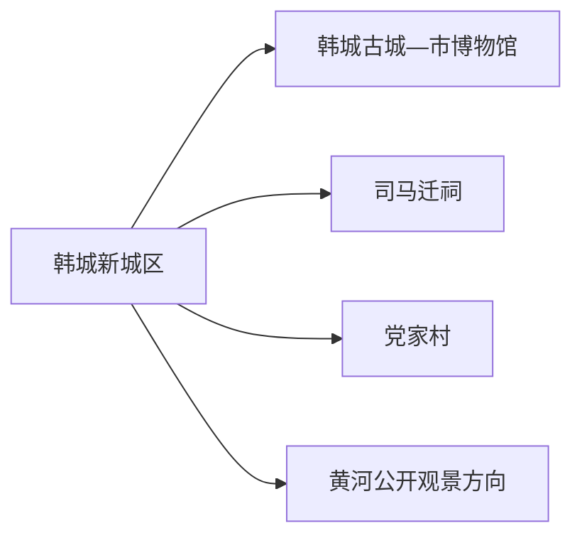
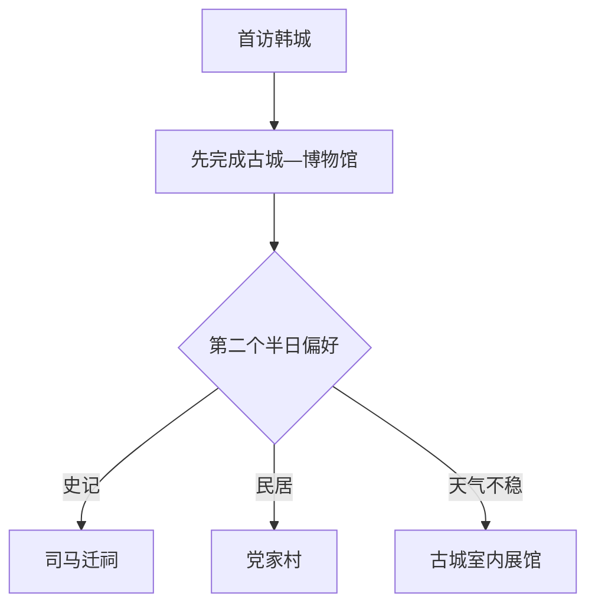

# 韩城旅行指南

韩城位于陕西东部黄河西岸，旅行主线清晰：韩城古城与市博物馆认识城市文脉，司马迁祠建立史学主题，党家村观察传统民居。三者分布在不同片区，适合各留半天；黄河岸线、煤矿与工业空间则以正式开放的公共景区和道路为边界。

## 城市速览

| 项目 | 信息 |
|---|---|
| 旅行主线 | 韩城古城—市博物馆、司马迁祠、党家村、黄河公共景观 |
| 建议停留 | 1 天古城加司马迁祠；2 天增加党家村；深度访古可留 3 天 |
| 住宿基地 | 新城区交通住宿方便；古城周边适合早晚步行 |
| 步行强度 | 古城中等；祠区与村落有台阶坡路；盛夏户外负担高 |
| 主要天气 | 盛夏高温、雷暴与黄河汛情；冬季寒冷、道路结冰和春季大风扬尘 |
| 预约核心 | 博物馆、司马迁祠、党家村、讲解、文保维修和县域车辆 |
| 边界重点 | 黄河滩地、矿区、焦化与工业园、铁路专线、文保修缮区按管理范围活动 |
| 无障碍 | 新馆先问电梯；古城、祠区和党家村逐段核对台阶、坡道和卫生间 |

## 城市格局与游览区域

韩城市是陕西省辖、由渭南市代管的县级市，法定代码 `610581`。GeoNames `1808981` 与 Wikidata `Q577415` 精确对应韩城市。渭南主城与华阴各有独立指南；韩城作为黄河沿岸的独立住宿与交通单元规划。

| 区域 | 旅行价值 | 怎么安排 |
|---|---|---|
| 新城区 | 到达、住宿、餐饮与交通 | 作为多日基地 |
| 韩城古城 | 古街、城隍庙古街区、博物馆与地方生活 | 半日至一日步行 |
| 芝川—司马迁祠 | 司马迁纪念与黄河台塬地貌 | 留半天，车辆往返 |
| 党家村 | 传统民居、村落格局与家族文化 | 留半天，按开放街巷游览 |
| 黄河沿岸 | 河流地理与公共景观 | 选择正式公园、景区和观景点 |

## 主要景点

| 景点 | 所在区域 | 类型 | 核心看点 | 建议用时 | 室内/室外 | 体力 | 预约难度 | 天气敏感度 | 适合旅程 |
|---|---|---|---|---|---|---|---|---|---|
| 韩城市博物馆与古建筑群 | 韩城古城 | 博物馆与古建筑 | 城隍庙、文庙、东营庙及韩城地方史 | 2–3 小时 | 混合 | 中 | 中高 | 中 | A |
| 韩城古城公开街区 | 古城 | 历史街区 | 街巷、传统商业、民居与城市生活 | 2–4 小时 | 室外为主 | 中 | 中 | 高 | A |
| 司马迁祠 | 芝川方向 | 纪念建筑与史学 | 司马迁生平、《史记》文化与黄河台塬视野 | 2–3 小时 | 混合 | 中至高 | 中高 | 高 | A |
| 党家村公开游览区 | 西庄方向 | 传统村落 | 四合院、巷道、防御与家族聚落 | 3–4 小时 | 室外为主 | 中 | 中高 | 高 | A |
| 状元府博物馆等开放点 | 古城 | 专题展馆 | 科举文化、历史建筑与当期展陈 | 1–2 小时 | 室内 | 低至中 | 中高 | 低 | B |
| 黄河正式开放观景点 | 市域东部 | 河流地理 | 黄河、台塬与沿岸景观 | 1–3 小时 | 室外 | 中 | 高 | 极高 | B |

韩城古城内部场馆与街巷组成一个连续历史单元，按开放状态选择，不以院落数量计算完成率。党家村是居民与文保空间，使用公开街巷和购票游线。黄河滩地、渡口作业区、堤防、水利设施以及煤矿、焦化、工业园和铁路专线保持生产或管理用途。

## 美食与餐饮

| 类型 | 适合场景 | 份量 | 过敏与饮食提示 | 怎么选 |
|---|---|---|---|---|
| 韩城羊肉饸饹 | 早餐或正餐 | 一人份 | 羊肉汤、荞麦或小麦混用、香菜与辣椒 | 先问面粉配比和汤底 |
| 馄饨与臊子面 | 城区简餐 | 一人份 | 小麦、猪肉、蛋和大豆调味 | 调味分开，询问汤底与辣度 |
| 花椒风味菜 | 正规餐馆 | 可单人或分享 | 花椒麻感、肉类与复合调味 | 先问麻度和配料 |
| 合规黄河鱼菜 | 正规餐馆 | 整鱼多为分享 | 鱼刺、水产过敏、酱油与称重 | 确认鱼种、来源、重量和总价 |
| 石子馍等面点 | 市场或门店 | 小份 | 小麦、芝麻、油脂 | 看配料、生产信息与保存期 |

## 经典行程

### 一日经典路线

**路线**：韩城市博物馆—古城公开街区 → 午餐 → 司马迁祠 → 返回城区

- **串联逻辑**：先读城市史，再进入司马迁与《史记》主题。
- **预约锚点**：博物馆、祠区和车辆。
- **休息安排**：古城午休后再乘车。
- **时间不足时**：古城只走博物馆周边核心段。

### 两日首次到访路线

**第 1 天**：韩城古城—市博物馆 
**第 2 天**：司马迁祠—党家村

- **串联逻辑**：城区步行与两个远点分日处理。
- **预约锚点**：党家村开放、讲解与两段车辆。
- **休息安排**：第二天在成熟餐饮点完成午休。
- **时间不足时**：第二日按兴趣二选一。

### 史记主题路线

**路线**：司马迁祠 → 午餐与阅读休息 → 韩城市博物馆相关展陈 → 古城短段

- **串联逻辑**：纪念地与地方文博相互补充。
- **预约锚点**：讲解、展厅和祠区开放。
- **休息安排**：正午转入室内。
- **时间不足时**：保留司马迁祠。

### 雨雪路线

**路线**：韩城市博物馆 → 午餐 → 状元府等当日开放室内点

- **适用条件**：城市交通正常；暴雨、汛情或结冰时取消黄河与村落远线。
- **预约锚点**：场馆、文保维修和道路。
- **休息安排**：馆内座椅和室内餐饮。
- **时间不足时**：只留博物馆。

### 亲子路线

**路线**：韩城市博物馆 → 午休 → 司马迁祠核心线

- **串联逻辑**：地方史与史学人物形成清晰学习主题。
- **预约锚点**：儿童讲解、台阶、防晒与卫生间。
- **休息安排**：户外控制在两小时内。
- **时间不足时**：保留博物馆。

### 低体力路线

**路线**：车辆到达韩城市博物馆 → 午餐长休 → 古城近入口短段

- **串联逻辑**：以室内为主，减少祠区和村巷坡路。
- **预约锚点**：落客、电梯、轮椅和座椅。
- **休息安排**：每处只看核心内容。
- **时间不足时**：只留博物馆。

### 传统村落路线

**路线**：城区 → 党家村正式入口 → 核心街巷与开放院落 → 午餐 → 返回

- **适用条件**：开放、道路和天气稳定。
- **预约锚点**：门票、讲解、居民空间和摄影规则。
- **休息安排**：游客服务点午休，减少正午暴晒。
- **时间不足时**：只走核心街巷。

## 住宿区域

| 区域 | 优点 | 取舍 | 适合人群 | 核对项 |
|---|---|---|---|---|
| 韩城新城区 | 交通、餐饮和现代住宿集中 | 古城与远点需接驳 | 首访、无车、商务 | 车站接驳、停车、早餐和夜间入住 |
| 古城周边 | 便于早晚步行和传统餐饮 | 老房设施、停车和噪声差异大 | 历史街区、摄影 | 合法经营、消防、隔音、台阶与停车 |
| 党家村周边正规住宿 | 接近传统村落 | 选择少，对其他片区不占优 | 村落慢游、自驾 | 消防、供餐、返程和退改 |

## 市内交通

韩城可由铁路和公路抵达。古城、新城区、司马迁祠和党家村之间以公交、出租、自驾或正规包车连接，远点各留半天。

| 场景 | 怎么做 | 行前核对 |
|---|---|---|
| 铁路到达 | 按票面完整站名抵达，再转住宿 | 车次、站前交通与夜间叫车 |
| 古城—新城 | 公交、出租与分段步行 | 首末班、施工和落客点 |
| 司马迁祠与党家村 | 每半天一个远点，提前落实车辆 | 入口、停车、等候与返程 |
| 黄河方向 | 只前往正式开放观景点 | 汛情、道路、岸线管理和最晚返程 |

## 不同旅行者须知

| 旅行者 | 推荐做法 | 重点核对 |
|---|---|---|
| 独行 | 住新城或古城，远点正规车辆 | 返程、资质和夜间入住 |
| 亲子 | 博物馆加司马迁祠短线 | 讲解、台阶、防晒和饮水 |
| 长者与低体力 | 博物馆与古城近入口段 | 坡路、轮椅、座椅和落客 |
| 摄影 | 古城与党家村分日 | 居民、文保、三脚架和无人机 |
| 自驾 | 每半天一个片区 | 停车、货车交通、冬季结冰和疲劳 |

## 行前核对

- 韩城市与陕西省文旅信息：场馆、祠区、村落、文保维修与活动。
- 各景区：票务、讲解、停车、摄影与临时关闭。
- 陕西气象、水利、自然资源与应急信息：高温、汛情、地灾和结冰。
- 中国铁路 12306：车次、完整站名与退改。

## 来源与更新记录

| 来源 | 支持内容 | 核验日期 |
|---|---|---|
| [陕西省文旅厅：书法主题线路](https://whhlyt.shaanxi.gov.cn/sy/wlyw/202504/P020250418335374198077.pdf) | 司马迁祠、韩城市博物馆、古城与党家村线路 | 2026-09-01 |
| [陕西省“十四五”文化和旅游发展规划](https://whhlyt.shaanxi.gov.cn/zfxxgk/fdzdgknr/lzyj/tzgg/202103/P020240903544085768960.pdf) | 司马迁祠与党家村文旅地位 | 2026-09-01 |
| [陕西省旅游发展规划](https://whhlyt.shaanxi.gov.cn/zfxxgk/fdzdgknr/lzyj/tzgg/202108/P020240903548059688047.pdf) | 韩城古城、司马迁祠和党家村主题关系 | 2026-09-01 |
| [陕西省文旅厅：韩城乡村线路](https://whhlyt.shaanxi.gov.cn/sy/wlyw/202407/t20240726_2577857.html) | 司马迁祠与党家村的区域串联 | 2026-09-01 |
| [Wikidata Q577415](https://www.wikidata.org/wiki/Q577415) | 韩城市实体与 `P1566=1808981` | 2026-09-01 |
| [GeoNames 1808981](https://www.geonames.org/1808981/) | 固定韩城城市点 | 2026-09-01 |
| [中国铁路 12306](https://www.12306.cn/) | 动态车次与购票 | 2026-09-01 |
| [陕西省气象局](http://sn.cma.gov.cn/) | 气象预警 | 2026-09-01 |

| 日期 | 更新 |
|---|---|
| 2026-09-01 | 首次完成古城、司马迁祠、党家村与黄河沿岸边界研究。 |
