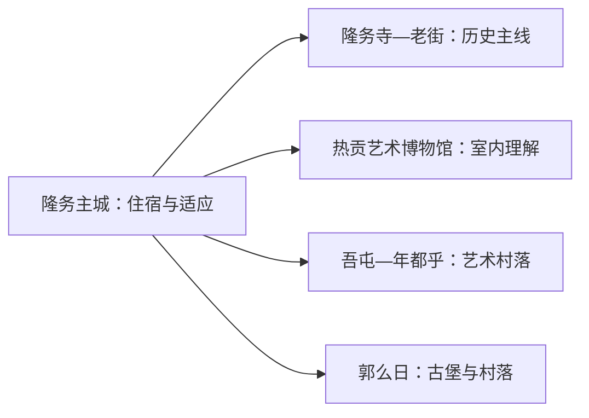
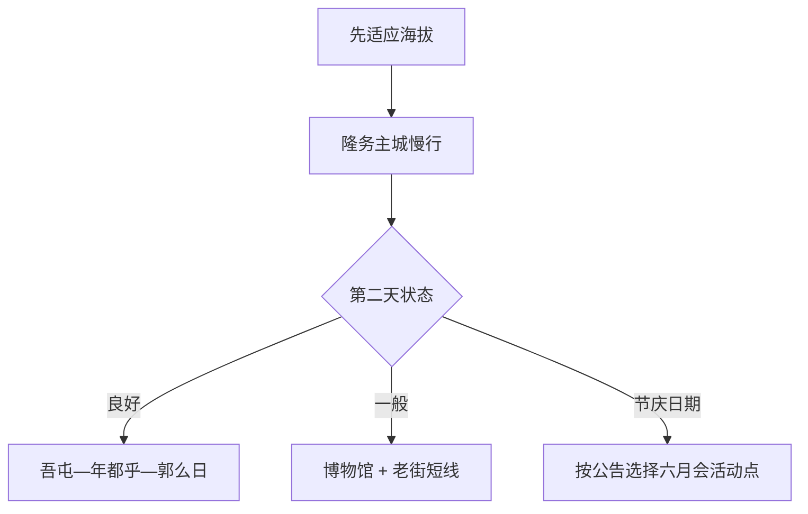

# 同仁旅行指南

同仁是理解热贡艺术最集中的城市之一：隆务主城适合用一天看寺院、老街和博物馆，吾屯、年都乎、郭么日等村落则把唐卡、古堡和宗教生活展开成第二天。这里海拔较高，先用主城适应，再去村落和山谷，行程更稳也更尊重当地节奏。

> 建议停留：2–3 天，并把首日作为高原适应日 
> 旅行关键词：热贡艺术、隆务寺、隆务老街、吾屯、郭么日古堡、六月会 
> 主要体力：中等；高原会放大负担 
> 最近研究：2026-08-13

## 城市速览

| 项目 | 旅行信息 |
|---|---|
| 主要旅行价值 | 在隆务河谷连续理解寺院、热贡艺术、村落与非遗节庆 |
| 建议停留 | 2 天覆盖主城与艺术村落；3 天增加季节活动或山谷方向 |
| 较舒适季节 | 暖季适合村落移动；冬季更安静但早晚寒冷 |
| 预算特点 | 主城中等；包车、讲解和艺术体验增加成本 |
| 步行强度 | 主城中等，村落与寺院有坡和台阶 |
| 主要天气风险 | 高海拔反应、强紫外线、昼夜温差、雷雨、冰雪和山洪 |
| 独行旅行 | 主城方便；村落日优先正规车辆与讲解 |
| 亲子旅行 | 博物馆与短时艺术体验较合适 |
| 长者与低体力旅行 | 首日主城慢行，寺院与村落减少连续台阶 |
| 无障碍信息 | 现代博物馆可咨询；寺院、古堡与村落设施连续性需向官方确认 |

## 城市格局与游览区域

同仁市是黄南藏族自治州首府、法定县级市，代码 `632301`。固定 GeoNames `1797091` 是同仁主城居民点；Wikidata `Q1364679` 代表法定同仁市，`P1566` 连接另一条地点记录 `1792589`。隆务镇承担住宿、公共文化和交通，吾屯、年都乎、郭么日等艺术村落散布在隆务河谷，坎布拉、河南县和泽库县属于其他县域路线。

| 区域 | 主要内容 | 怎么安排 | 与其他区域的关系 |
|---|---|---|---|
| 隆务主城 | 隆务寺、老街、文博、住宿 | 首日慢游 | 高原适应和全程基地 |
| 吾屯—年都乎 | 唐卡、寺院与艺术村落 | 半日至一天 | 可与郭么日同方向组合 |
| 郭么日 | 古堡、村落和宗教建筑 | 2–3 小时 | 与艺术村落同日需车辆 |
| 曲库乎等山谷方向 | 温泉、森林和乡村项目 | 有接待时独立一天 | 海拔、道路与运营门槛更高 |
| 州内其他县域 | 尖扎、泽库、河南等 | 独立跨县行程 | 不作为同仁市内景点 |

## 主要景点

### 隆务主城

| 景点 | 区域 | 类型 | 主要看点 | 建议用时 | 室内外 | 体力 | 预约风险 | 天气影响 | 优先级 |
|---|---|---|---|---:|---|---|---|---|---|
| 隆务寺 | 隆务镇 | 寺院与文物 | 建筑、宗教艺术与持续使用的寺院空间 | 2–3 小时 | 混合 | 中 | 高 | 中 | A |
| 隆务老街 | 隆务镇 | 历史街区 | 河谷城镇、传统建筑和生活街巷 | 1–2 小时 | 室外为主 | 中 | 中 | 高 | A |
| 热贡艺术博物馆及公共文化场馆 | 主城 | 博物馆 | 唐卡、堆绣、雕塑与非遗脉络 | 2–3 小时 | 室内 | 低 | 高 | 低 | A |

### 艺术村落与古堡

| 景点 | 区域 | 类型 | 主要看点 | 建议用时 | 室内外 | 体力 | 预约风险 | 天气影响 | 优先级 |
|---|---|---|---|---:|---|---|---|---|---|
| 吾屯艺术村落与正式开放画院 | 吾屯 | 非遗与村落 | 热贡艺术制作、寺院和村落生活 | 3–5 小时 | 混合 | 中 | 很高 | 中 | A |
| 年都乎艺术村落公开点 | 年都乎 | 非遗与村落 | 唐卡、堆绣和当期工作室展示 | 2–3 小时 | 室内为主 | 中 | 很高 | 中 | B |
| 郭么日古堡公开区域 | 郭么日 | 古堡与村落 | 堡墙、传统聚落和宗教文化 | 2–3 小时 | 混合 | 中 | 高 | 高 | B |
| 热贡六月会当期活动点 | 隆务河谷 | 非遗节庆 | 仪式、舞蹈与村落节庆 | 半日至一天 | 混合 | 中至高 | 很高 | 很高 | B |

隆务寺和村落寺院首先是持续使用的宗教空间，按现场礼仪与开放范围参访。画院、工作室和艺术家住宅需要明确接待；购买作品时优先选择来源、作者和价格说明清楚的正规渠道。六月会按当年日期和属地安排选择观看点。

## 美食与餐饮

| 菜品或餐饮类型 | 常见区域 | 一个人用餐与常见份量 | 风味、过敏原与饮食限制 | 排队风险与替代方法 |
|---|---|---|---|---|
| 藏面、面片与面食 | 隆务主城 | 一碗一人份 | 小麦、牛羊肉汤和乳制品常见 | 早餐午间易找到同类店 |
| 牛羊肉与手抓 | 主城、乡村 | 多为共享份量 | 肉类、乳制品和高油脂需留意 | 一人先问小份或拼盘 |
| 糌粑、酸奶与奶茶 | 主城 | 小份易尝试 | 青稞、乳制品、酥油和糖常见 | 乳糖不耐提前说明 |
| 黄南地方小吃 | 老街、市场 | 可少量组合 | 面粉、油炸、坚果和肉馅需确认 | 选现做、明码标价摊店 |

## 经典行程

### 一日经典路线

**路线**：热贡艺术博物馆 → 午餐与休息 → 隆务寺 → 隆务老街

- **串联逻辑**：先在室内建立艺术脉络，再进入寺院与街区。
- **预约锚点**：博物馆开放、隆务寺参访规则。
- **休息安排**：午间至少一小时，寺院后再短休。
- **时间不足时**：保留博物馆和隆务寺。

### 两日城市路线

**第 1 天**：隆务主城适应与文博 
**第 2 天**：吾屯 → 年都乎或郭么日二选一

- **串联逻辑**：先理解热贡艺术，再到村落观察传承环境。
- **预约锚点**：第二天画院、车辆和讲解。
- **休息安排**：连续住隆务，村落午休放在正规接待点。
- **时间不足时**：第二天只选吾屯一处。

### 三日深度路线

**第 1 天**：主城适应 
**第 2 天**：吾屯—年都乎艺术村落 
**第 3 天**：郭么日或当期六月会活动

- **串联逻辑**：三天从城市公共叙事深入到村落与节庆。
- **预约锚点**：后两天均先确认接待和活动边界。
- **休息安排**：每天午间回到室内或车辆休息。
- **时间不足时**：删第三天，第二天只保留一个村落。

### 雨雪天路线

**路线**：热贡艺术博物馆 → 午餐 → 正式开放画院 → 隆务老街短段

- **适用条件**：普通降雨或降雪可行；结冰和低能见度时减少村落道路。
- **预约锚点**：场馆、画院和道路状态。
- **休息安排**：每段均以室内暖区衔接。
- **时间不足时**：只保留博物馆。

### 亲子或低体力路线

**亲子路线**：博物馆 → 午餐 → 一次短时热贡艺术体验 
**低体力路线**：车辆到博物馆 → 长休 → 隆务寺近入口或老街平缓段

- **减负方式**：亲子线控制安静参访时长；低体力线减少寺院台阶和村落转场。
- **预约锚点**：体验年龄、材料、卫生间和入口距离。
- **休息安排**：主城安排两次室内长休。
- **时间不足时**：两类路线都保留博物馆。

### 远郊一日路线

**路线**：隆务主城 → 吾屯正式开放画院与寺院 → 午餐 → 郭么日古堡公开区 → 返回

- **适用条件**：高原状态稳定，车辆和接待均已落实。
- **预约锚点**：画院、讲解、宗教活动与返程。
- **休息安排**：午间在村镇正规餐饮长休。
- **时间不足时**：删郭么日，只完整游览吾屯。

## 住宿区域

| 区域 | 优点 | 缺点 | 适合人群 | 交通特点 |
|---|---|---|---|---|
| 隆务主城 | 医疗、餐饮、住宿和到发方便 | 早晚活动需用车 | 首访、高原适应与多日旅行 | 便于连接西宁和村落 |
| 隆务老街周边 | 靠近寺院和城市生活 | 老建筑设施差异较大 | 文化慢游与摄影 | 步行方便但先核供暖和隔音 |
| 村落接待点 | 靠近艺术体验 | 供应、语言和交通选择较少 | 已预约的深度旅行者 | 只选正规可确认住宿 |

## 市内交通

同仁通常从西宁经公路抵达，隆务主城适合步行、出租车或短途车辆。吾屯、年都乎和郭么日分散在河谷不同位置，优先使用正规包车、旅行社车辆或明确的公共交通；高原天气和道路施工会放大时间误差。

| 场景 | 建议与取舍 | 行前需要重查的内容 |
|---|---|---|
| 西宁—同仁 | 预留高原公路缓冲 | 客运站、发车点、道路和末班 |
| 隆务主城 | 步行加短途车辆 | 宗教活动和道路管制 |
| 艺术村落 | 正规车辆串联一至两处 | 接待、讲解、返程和通信 |
| 自驾 | 适合河谷村落 | 高原反应、冰雪、加油和驾驶疲劳 |

## 不同旅行者须知

| 旅行维度 | 可行条件 | 主要取舍 | 需额外核对 |
|---|---|---|---|
| 独行旅行 | 先住隆务并适应 | 村落日选择正规车辆 | 返程、通信和高原状态 |
| 亲子旅行 | 博物馆与短时体验 | 寺院仪式和长途转场控制时长 | 年龄、安静规则和材料 |
| 长者或低体力旅行 | 首日低强度并车辆连接 | 寺院台阶和古堡坡道取舍 | 血氧、医疗点和入口距离 |
| 无障碍需求 | 现代场馆可咨询 | 历史寺院与村落连续动线有限 | 设施连续性需向官方确认 |
| 摄影旅行 | 艺术、建筑与节庆题材丰富 | 尊重宗教、仪式和人物意愿 | 室内拍摄、无人机和商业用途 |
| 高原与天气 | 逐日按状态加量 | 不适时回主城休息并就医 | 预警、道路和医疗服务 |

## 行前核对

| 核对事项 | 为什么需要重查 | 建议核对时间 | 官方入口 |
|---|---|---|---|
| 隆务寺与村落寺院 | 宗教活动和开放范围会变化 | 到访前一日及现场 | [黄南州人民政府](https://www.huangnan.gov.cn/) |
| 博物馆与画院 | 展览、接待和讲解需确认 | 订房后及前一日 | [青海省文化和旅游厅](https://whlyt.qinghai.gov.cn/) |
| 六月会等节庆 | 日期、村落和观看规则按年发布 | 订票前及出发前 | [黄南州人民政府](https://www.huangnan.gov.cn/) |
| 公路、天气与高原风险 | 冰雪、山洪和身体状态影响路线 | 出发前三日及每天早晨 | [青海省交通运输厅](https://jtyst.qinghai.gov.cn/)；[青海省气象局](http://qh.cma.gov.cn/) |

## 来源与更新记录

### 主要来源

| 来源 | 类型 | 支持内容 | 核验日期 |
|---|---|---|---|
| [文化和旅游部：热贡艺术乡村线路](https://zhuanti.mct.gov.cn/xcss2024_shjlzzxc/qinghai/detail/6849.html) | 国家文旅部门 | 隆务寺、老街、吾屯、郭么日、博物馆与交通 | 2026-08-13 |
| [青海省政府：金色热贡](https://www.qinghai.gov.cn/zwgk/system/2023/08/30/030024369.shtml) | 省政府 | 隆务老街、热贡艺术与文旅发展 | 2026-08-13 |
| [黄南州人民政府](https://www.huangnan.gov.cn/) | 州政府 | 同仁属地活动、道路与场馆核对入口 | 2026-08-13 |
| [青海省文化和旅游厅](https://whlyt.qinghai.gov.cn/) | 省文旅厅 | 景区、非遗与文旅公告 | 2026-08-13 |
| [青海省交通运输厅](https://jtyst.qinghai.gov.cn/) | 省交通厅 | 高原公路和运输动态 | 2026-08-13 |
| [GeoNames 1797091](https://www.geonames.org/1797091/tongren.html) | 开放地名数据 | 固定主城点 | 2026-08-13 |
| [Wikidata Q1364679](https://www.wikidata.org/wiki/Q1364679) | 开放结构化数据 | 法定同仁市实体与P1566粒度 | 2026-08-13 |

### 更新记录

| 日期 | 更新内容 |
|---|---|
| 2026-08-13 | 首次完成同仁热贡艺术、宗教村落、高原路线、交通与礼仪边界研究 |
