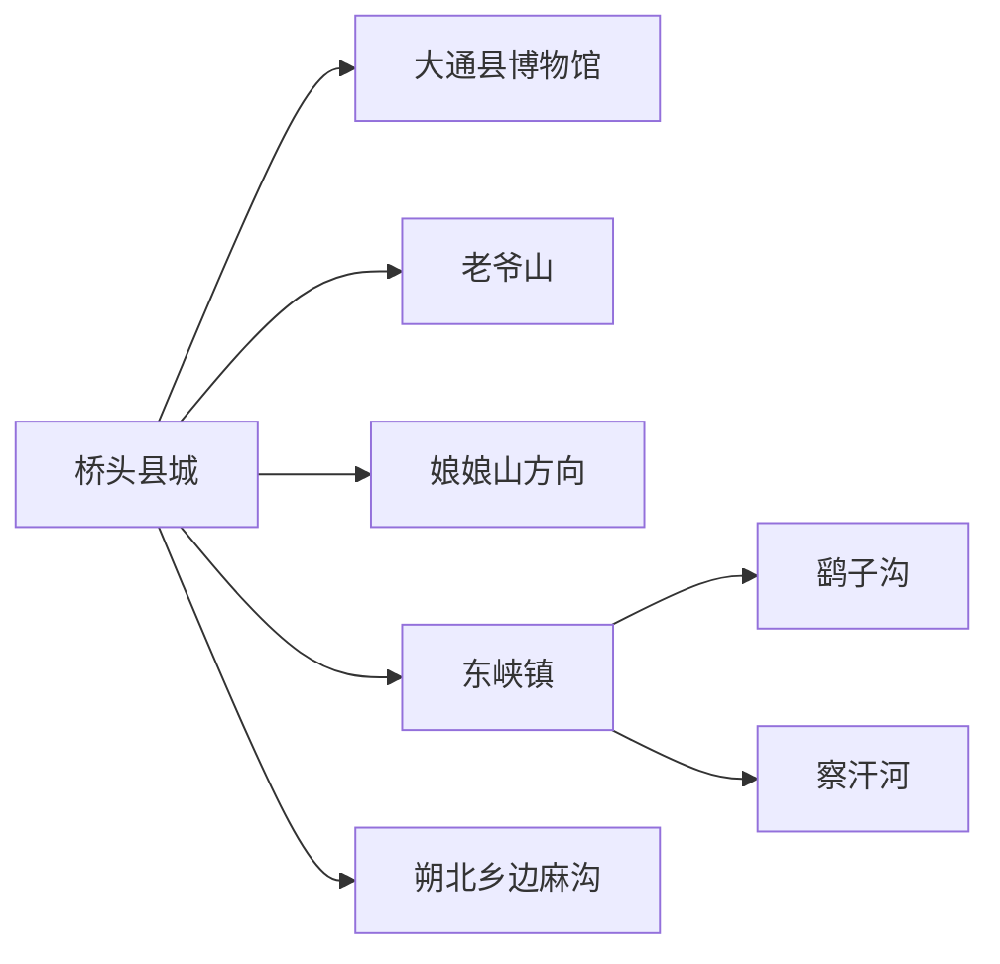
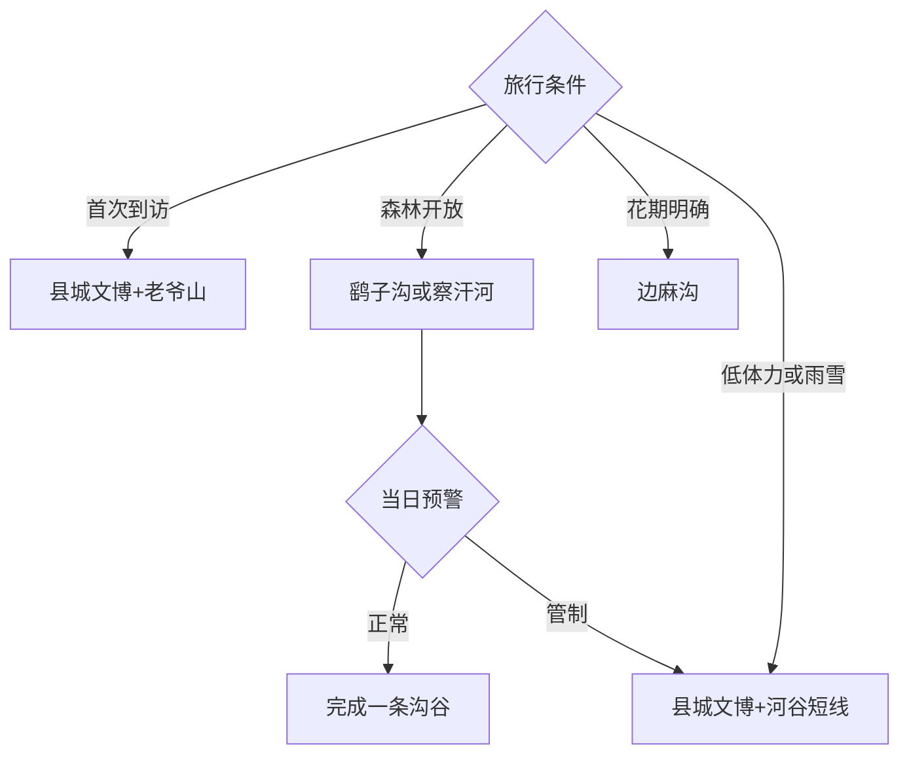

# 大通旅行指南

大通位于西宁以北的北川河谷，适合以桥头县城为基地，把老爷山、县域文博、东峡森林和朔北花海拆成不同日期。固定清单中的 **Qiaotou / GeoNames 1798131** 对应桥头镇县城；第一次到访可先用一天完成县城与老爷山，再按季节选择鹞子沟、察汗河或边麻沟。高原、山地和森林条件变化快，先看当日开放与预警，再决定进入哪条沟谷。

## 城市速览

| 项目 | 信息 |
|---|---|
| 主线 | 桥头县城—大通县博物馆—老爷山；东峡与朔北方向另排 |
| 停留 | 县城与老爷山1–2天；每条森林或花海线另留1天 |
| 住宿 | 桥头适合交通、餐饮和医疗；东峡或朔北只选确认运营的接待点 |
| 交通 | 从西宁经公路到桥头，县内远线以合规车辆或自驾衔接 |
| 季节 | 夏秋适合山林和花海；冬春关注积雪、暗冰、林火与低温 |
| 边界 | 森林公园、水源涵养地、宗教空间、乡村和农业生产地分别管理 |

## 城市格局与游览区域

桥头集中县级公共服务、住宿与跨方向换乘，老爷山紧邻县城但具有明显爬升。鹞子沟与察汗河同属大通国家森林公园体系，进入东峡方向后仍应按各自入口、道路和接待状态安排；边麻沟位于朔北藏族乡，是另一条季节花海与乡村路线。娘娘山、宝库和东峡林区承担水源涵养与生态保护功能，游览采用正式景区、观景点和维护道路。

西宁是最近的大型交通门户，大通则具备独立的县城住宿、文博与多条山地线路。把大通当作西宁“顺路半日”容易压缩高原适应和返程余量；连续游览时在桥头住一晚更稳妥。

## 主要景点

| 景点 | 区域 | 类型 | 核心体验 | 用时 | 环境 | 体力 | 预约风险 | 天气影响 | 优先级 |
|---|---|---|---|---:|---|---|---|---|---|
| 老爷山景区 | 桥头镇 | 山地与民俗 | 河湟山岳、登高视野与民俗文化 | 半日至1天 | 室外 | 高 | 很高 | 极高 | A |
| 大通县博物馆 | 桥头镇 | 地方文博 | 河湟历史、民俗与县域文物 | 1.5–3小时 | 室内 | 低 | 很高 | 低 | A |
| 河湟皮影戏传承展示 | 县级场馆 | 非遗 | 皮影、土族民俗与地方表演传统 | 1–2小时 | 室内 | 低 | 极高 | 低 | B |
| 鹞子沟景区 | 东峡方向 | 森林与沟谷 | 高原森林、沟谷步道与季节景观 | 半日至1天 | 室外 | 中高 | 极高 | 极高 | A |
| 察汗河景区 | 东峡方向 | 森林与峡谷 | 森林公园另一沟谷系统 | 1天 | 室外 | 高 | 极高 | 极高 | B |
| 边麻沟花海景区 | 朔北乡 | 花海与乡村 | 季节花卉、村落与河湟乡村 | 半日至1天 | 室外 | 中 | 极高 | 极高 | B |
| 娘娘山正式游览点 | 县城西北 | 山地生态 | 高位山景与北川河谷视野 | 1天 | 室外 | 高 | 极高 | 极高 | B |
| 北川河公共岸线 | 桥头片区 | 河谷公共空间 | 河谷城市格局与短段散步 | 1–2小时 | 室外 | 低 | 中 | 高 | C |
| 东峡镇公共服务片区 | 东峡镇 | 山镇与补给 | 森林路线前的山镇生活和补给 | 1–2小时 | 混合 | 低 | 中 | 高 | C |
| 朔北乡公开乡村接待点 | 朔北乡 | 乡村与民俗 | 正式农家乐、季节活动与村落环境 | 2–4小时 | 混合 | 低中 | 极高 | 高 | C |

老爷山、鹞子沟、察汗河、娘娘山和边麻沟均以管理方确认开放为行程成立条件。花海的花期和经营状态逐年变化，博物馆与非遗展示也可能因布展调整接待；先确认一个核心点，再把同方向公共空间作为弹性补充。

## 美食与餐饮

桥头可选青海老八盘、手抓羊肉、炕锅、酿皮、甜醅、焜锅馍馍与牛羊杂碎，东峡和朔北更适合预约正规的乡村接待。清真餐饮按店家规范用餐；共享菜提前说明牛羊肉、乳制品、坚果与麸质过敏。山地日携带饮水和常温补给，野生菌、野菜与散装乳制品选择来源清楚、充分加工的产品。

## 经典行程

### 一日经典线
**路线**：大通县博物馆—桥头午餐—老爷山当日开放线。**逻辑**：先建立河湟与县域背景，再登高观察北川河谷。**预约锚点**：博物馆、老爷山入口和返程车。**休息**：桥头县城。**删除条件**：老爷山闭园或大风雷雨时保留文博与河谷短线。

### 两日基础线
**路线**：首日县城与老爷山；次日鹞子沟或察汗河二选一。**逻辑**：山岳和森林沟谷分日，给海拔适应与接驳留余量。**预约锚点**：森林景区开放、车辆、餐饮和返程。**休息**：桥头或东峡正式服务点。**删除条件**：林火、强降雨、积雪或道路管制时取消沟谷日。

### 边麻沟花海线
**路线**：桥头—朔北乡—边麻沟花海—公开乡村接待点—返程。**逻辑**：把季节花期与村落生活放在同一方向。**预约锚点**：花期、景区运营、乡村接待和车辆。**休息**：景区服务区。**删除条件**：花期偏差、景区暂停或山洪预警时改县城文化线。

### 东峡森林线
**路线**：桥头—东峡镇—鹞子沟或察汗河—桥头。**逻辑**：当天只完成一条沟谷，减少山路赶场。**预约锚点**：具体入口、步道、停车、通信和闭园时间。**休息**：东峡镇。**删除条件**：天气预警、森林防火管制或返程时间不足时提前折返。

### 民俗文化线
**路线**：县博物馆—皮影与土族民俗展示—桥头餐饮—北川河短线。**逻辑**：以室内展陈理解多民族河湟文化。**预约锚点**：展馆开放、讲解和演出日期。**休息**：县级场馆。**删除条件**：展陈调整时保留博物馆并增加县城公共空间。

### 雨雪调整线
**路线**：县博物馆—正规餐饮—县城短距离公共文化空间。**逻辑**：控制山路、沟谷和长时间户外暴露。**预约锚点**：场馆和县城道路。**休息**：桥头。**删除条件**：暴雪、道路结冰或高等级预警时留在住宿地。

### 低体力线
**路线**：车辆到县博物馆—桥头午餐—老爷山山脚公开区或北川河平缓岸线。**逻辑**：用车辆、室内展陈和短步行控制爬升。**预约锚点**：落客、座椅、卫生间和陪同服务。**休息**：博物馆与餐厅。**删除条件**：山脚环境湿滑或客流过高时只留县城场馆。

## 住宿区域

桥头县城适合连续住宿，可兼顾西宁接驳、县内包车、餐饮和医疗；东峡适合已确认次日森林入口与返程的旅行者；朔北乡住宿以正式经营、供暖热水、餐饮和通信均落实为前提。订房时核对海拔感受、夜间温度、停车、早餐、退改和到店时间。

## 市内交通

从西宁到桥头主要依赖公路交通，具体客运站、班次和下车点在出发前确认。老爷山从县城接驳，东峡、察汗河、鹞子沟和朔北属于不同山路方向，适合每天安排一条。自驾为高原天气、牲畜穿行、弯道和夜间低温留余量，县域车辆提前约定返程和取消规则。

## 不同旅行者须知

文化旅行者优先县博物馆和非遗展示；摄影者按花期、云量和山口能见度选择；亲子家庭选开放明确的场馆、花海与短步道；长者以桥头为基地控制爬升；徒步者采用景区维护线路。森林公园、水源涵养地、宗教活动空间、农田、牧场和林业作业区保留明确边界，拍摄人物和仪式先征得同意。

## 行前核对

- 核对老爷山、鹞子沟、察汗河、娘娘山和边麻沟的当日开放。
- 核对博物馆布展、非遗活动、县际客运、山路施工和返程车辆。
- 核对高原反应、雷雨、山洪、落石、积雪、暗冰、低温和森林火险。
- 山林、水源涵养地与农业生产空间按正式入口、步道和接待范围进入。

## 来源与更新记录

| 来源 | 支持内容 | 核验日期 |
|---|---|---|
| [青海省人大：大通县林业管理条例](https://www.qhrd.gov.cn/qhsdfxfg_0/zztldxtl/201811/t20181127_168532.html) | 老爷山、娘娘山、宝库、东峡及大通国家森林公园的保护与管理关系 | 2026-09-04 |
| [青海省财政厅：大通县博物馆展陈项目](https://czt.qinghai.gov.cn/static/media/20240605/20240605093411_842.pdf) | 县博物馆、河湟皮影与土族民俗展陈 | 2026-09-04 |
| [GeoNames 1798131](https://www.geonames.org/1798131/) | Qiaotou 固定人口点 | 2026-09-04 |

| 日期 | 更新 |
|---|---|
| 2026-09-04 | 首次完成大通旅行研究；以桥头为基地拆分县城文博、老爷山、东峡森林和朔北花海线路。 |
