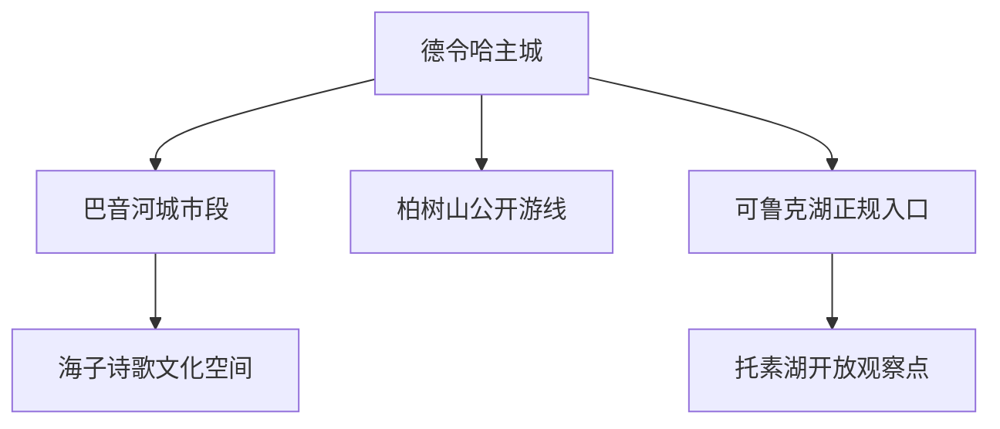
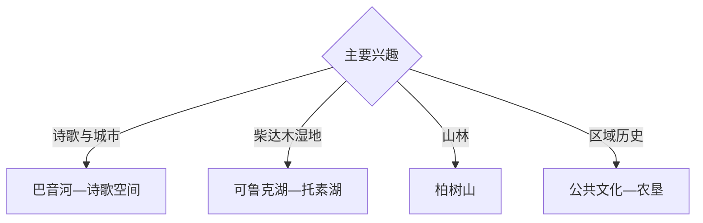

# 德令哈旅行指南

德令哈是海西州州府和柴达木盆地东部绿洲城市，巴音河城市空间、海子诗歌记忆、柏树山以及可鲁克湖—托素湖构成旅行主线。固定快照中的 **Delingha / GeoNames 1281378** 对应德令哈主城；湖区属于湿地和自然保护范围，游览以正式开放入口与当期生态管理为准。

## 城市速览

| 项目 | 信息 |
|---|---|
| 主线 | 巴音河—海子诗歌—柏树山—可鲁克湖—托素湖 |
| 停留 | 主城1天；柏树山或湖区各另留半天至1天 |
| 住宿 | 主城便于州府服务、铁路换乘和高原休整 |
| 交通 | 铁路与公路进入，远线以正规车辆接驳 |
| 季节 | 夏秋较适合；全年关注温差、大风和高反 |
| 预算 | 湖区车辆、高原装备和天气冗余增加预算 |

## 城市格局与游览区域

主城沿巴音河展开，承担住宿、交通和公共文化；柏树山位于城市近郊山地方向，可鲁克湖与托素湖构成更远的湖泊湿地单元。湖泊、芦苇滩、鸟类繁殖地、观测设施、农牧业生产区和矿业设施分别遵循保护、生产与安全边界。

## 主要景点

| 景点 | 区域 | 类型 | 核心体验 | 用时 | 环境 | 体力 | 研究价值 | 拥挤 | 优先级 |
|---|---|---|---|---:|---|---|---|---|---|
| 巴音河城市滨水公开段 | 主城 | 河流与城市 | 高原绿洲、水利与城市生活 | 2–3小时 | 室外 | 低 | 高 | 傍晚中 | A |
| 海子诗歌文化空间 | 主城 | 文学与城市 | 诗歌记忆与德令哈城市意象 | 2小时 | 混合 | 低 | 高 | 节假日中 | A |
| 海西州公共文化场馆 | 主城 | 文博与民族 | 柴达木、蒙古族藏族文化与州域历史 | 2–3小时 | 室内 | 低 | 很高 | 低 | A |
| 柏树山公开游览区 | 近郊 | 山林与眺望 | 高原山林、峡谷与城市远眺 | 半天 | 室外 | 中高 | 高 | 周末中 | B |
| 可鲁克湖正规游览区 | 湖区 | 淡水湖与湿地 | 芦苇、湿地和水鸟观察 | 半天 | 室外 | 中 | 很高 | 旺季中 | A |
| 托素湖开放观察点 | 湖区 | 咸水湖与荒漠 | 咸淡湖泊对照与戈壁地貌 | 半天 | 室外 | 中 | 很高 | 旺季中 | A |
| 柯鲁柯农垦文化公开点 | 柯鲁柯方向 | 农垦与农业 | 柴达木绿洲农业和农垦记忆 | 半天 | 混合 | 低 | 高 | 低 | B |

## 美食与餐饮

主城可选择牦牛肉、羊肉、青稞面食、枸杞饮品和蒙古族、藏族风味。湖区与山地路线提前准备饮水和简餐，农牧产品体验选择正规餐饮或明确接待的经营点。

## 经典行程

### 诗歌城市线
**路线**：巴音河城市段—海子诗歌文化空间—城市夜景。**逻辑**：从河流景观理解德令哈的文学意象。**预约锚点**：场馆开放和滨水维护。**休息**：主城。**删除条件**：大风低温时缩短户外段。

### 州域文化线
**路线**：海西州公共文化场馆—主城历史街区—地方餐饮。**逻辑**：建立柴达木与多民族文化背景。**预约锚点**：场馆开放与讲解。**休息**：主城。**删除条件**：闭馆时改巴音河城市线。

### 柏树山半日线
**路线**：主城—柏树山正式入口—开放步道—返城。**逻辑**：用半天完成近郊山林与眺望。**预约锚点**：景区、防火和天气。**休息**：游客服务点。**删除条件**：雷雨、大风、积雪或防火封控时取消。

### 可鲁克湖湿地线
**路线**：主城—可鲁克湖正规入口—开放观景点—返程。**逻辑**：以低干扰方式观察淡水湖湿地。**预约锚点**：保护区开放、鸟季管理和道路。**休息**：正规服务点。**删除条件**：生态封闭或恶劣天气时改主城。

### 咸淡湖组合线
**路线**：主城—可鲁克湖—托素湖开放观察点—返城。**逻辑**：在同一天比较相连的淡水与咸水生态。**预约锚点**：两处开放范围、车辆和返程时间。**休息**：湖区正规服务点。**删除条件**：任一段封闭时只保留可公开抵达的一处。

### 农垦文化线
**路线**：主城—柯鲁柯正规文化接待点—绿洲农业展示—返城。**逻辑**：理解戈壁绿洲农业与人口迁徙。**预约锚点**：接待主体和参观时段。**休息**：正规接待点。**删除条件**：农忙或停止接待时改州域文化线。

### 三日组合线
**路线**：首日诗歌与州域文化；次日咸淡湖；第三日柏树山或农垦文化。**逻辑**：城市、湿地和山地分日。**预约锚点**：湖区与山地开放。**休息**：主城连续住宿。**删除条件**：两天时删第三日。

## 住宿区域

主城住宿便于铁路到发、餐饮、医疗和远线接驳，初到高原可连续住宿两晚。订房核对供暖、热水、停车和高原服务；湖区与乡镇只选择资质、通信和返程安排清晰的正规住宿。

## 市内交通

德令哈站与公路网络连接主城和柴达木环线，车次与站点以出发日信息为准。巴音河城市段适合步行与短途交通；柏树山、可鲁克湖—托素湖和柯鲁柯方向分别计算车辆、油量、路况与白天返程时间。

## 不同旅行者须知

文学旅行者把巴音河与诗歌空间放在同一天；自然观察者选择正规湖区观景点；亲子与长者优先主城场馆和低强度滨水段；徒步者依据天气选择柏树山。湿地核心区、鸟类繁殖地、芦苇滩、天文与能源设施、矿区、农田牧场和居民生活空间保留明确限制。

## 行前核对

- 核对公共文化场馆、柏树山及湖区开放。
- 核对可鲁克湖—托素湖保护区边界与鸟季管理。
- 核对高反、低温、大风、雷雨和道路状况。
- 核对铁路班次、远线车辆、通信与白天返程余量。

## 来源与更新记录

| 来源 | 支持内容 | 核验日期 |
|---|---|---|
| [海西州人民政府：魅力海西·德令哈](https://www.haixi.gov.cn/mlhx.htm) | 德令哈格局、文化、柏树山与可鲁克湖—托素湖 | 2026-09-03 |
| [青海省人民政府：巴音河水利风景区](https://www.qinghai.gov.cn/dmqh/system/2017/06/15/010269027.shtml) | 巴音河、咸淡湖泊、湿地与城市关系 | 2026-09-03 |
| [GeoNames 1281378](https://www.geonames.org/1281378/) | Delingha 固定人口点与德令哈主城位置 | 2026-09-03 |
