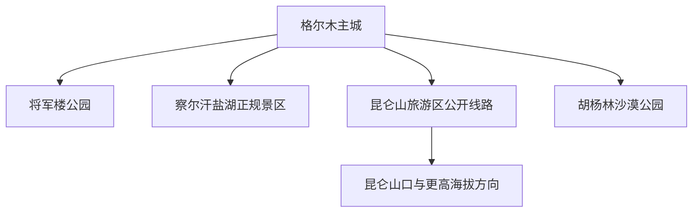
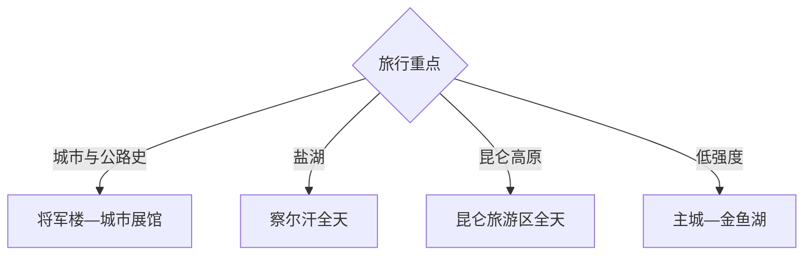

# 格尔木旅行指南

格尔木是柴达木盆地南缘的高原交通与补给城市，旅行主线由将军楼城市记忆、察尔汗盐湖、昆仑山旅游区和胡杨林组成。固定快照中的 **Golmud / GeoNames 1281184** 对应格尔木主城；盐湖、昆仑山口与长江源方向距离长、海拔差大，适合分别留出完整日期。

## 城市速览

| 项目 | 信息 |
|---|---|
| 主线 | 将军楼—察尔汗盐湖—昆仑山旅游区—胡杨林 |
| 停留 | 主城1天；盐湖、昆仑山各另留1天以上 |
| 住宿 | 主城适合连续住宿；远线按正规接待和返程能力选择 |
| 交通 | 铁路、航空和公路可达，景区远线以合规车辆接驳 |
| 季节 | 夏秋适合高原游览；全年关注低温、大风和高反 |
| 预算 | 远线车辆、景区交通、氧气与应急冗余是主要增量 |

## 城市格局与游览区域

主城集中住宿、医疗和交通补给；察尔汗位于主城以北，昆仑山方向沿青藏公路向南，胡杨林位于另一近郊方向。察尔汗同时是盐湖工业生产区，胡杨林涉及自然保护范围，昆仑山口及更南方向进入高寒、生态敏感和长距离公路环境，游览均以正式景区、开放道路和当期管理边界为准。

## 主要景点

| 景点 | 区域 | 类型 | 核心体验 | 用时 | 环境 | 体力 | 研究价值 | 拥挤 | 优先级 |
|---|---|---|---|---:|---|---|---|---|---|
| 将军楼公园公开区 | 主城 | 城市史与红色 | 青藏公路建设史与城市形成 | 2–3小时 | 混合 | 低 | 很高 | 节假日中 | A |
| 格尔木城市展馆开放区 | 主城 | 文博与地理 | 柴达木、昆仑与盐湖城市背景 | 2小时 | 室内 | 低 | 高 | 低 | B |
| 察尔汗盐湖景区 | 察尔汗 | 盐湖与工业地理 | 盐花、湖色与盐湖资源体系 | 1天 | 室外 | 中 | 很高 | 旺季高 | A |
| 昆仑山旅游区公开段 | 南山口方向 | 高原与文化 | 昆仑地貌、圣泉和高原公路 | 1天 | 室外 | 中高 | 很高 | 旺季中 | A |
| 胡杨林沙漠公园公开区 | 近郊 | 荒漠生态 | 高原胡杨、沙漠与绿洲关系 | 半天 | 室外 | 中 | 高 | 秋季高 | B |
| 金鱼湖民族风情园 | 主城周边 | 休闲与民俗 | 湖滨休闲与地方文化 | 半天 | 室外 | 低 | 中 | 周末中 | B |
| 昆仑山世界地质公园博物馆 | 主城方向 | 地质科普 | 昆仑山形成、矿物与地质遗迹 | 2–3小时 | 室内 | 低 | 高 | 低 | B |

## 美食与餐饮

主城可体验牦牛肉、羊肉、青稞面食、枸杞饮品和西北家常菜。远线早餐准备热食和饮水，盐湖与昆仑山途中把正规服务区作为补给锚点；高原初到阶段选择清淡、易消化的餐食。

## 经典行程

### 主城认识线
**路线**：将军楼公园—城市展馆开放区—主城街区。**逻辑**：先理解青藏公路、盐湖资源和城市形成。**预约锚点**：场馆开放。**休息**：主城。**删除条件**：场馆维护时保留公园与城市漫步。

### 察尔汗盐湖线
**路线**：主城—察尔汗正规入口—景区交通—公开观景区—返城。**逻辑**：用完整一天容纳往返和盐湖游览。**预约锚点**：景区开放、车辆和天气。**休息**：游客中心。**删除条件**：大风、沙尘、道路或生产安全管制时顺延。

### 昆仑山文化线
**路线**：主城—昆仑山门—昆仑圣泉—公开文化景点—返城。**逻辑**：逐步升高并把文化景点串成一线。**预约锚点**：道路、景区和高原天气。**休息**：正规服务点。**删除条件**：高反、降雪、结冰或管制时缩短至低海拔段。

### 胡杨荒漠线
**路线**：主城—胡杨林沙漠公园正式入口—开放栈道—返城。**逻辑**：用半天观察荒漠绿洲生态。**预约锚点**：景区开放、防火和风力。**休息**：游客服务点。**删除条件**：大风、沙尘或防火封控时改主城。

### 地质研学线
**路线**：地质公园博物馆—将军楼—察尔汗或盐湖科普点。**逻辑**：从展馆知识过渡到实地地貌。**预约锚点**：展馆和景区讲解。**休息**：主城。**删除条件**：远线受限时完成室内部分。

### 轻松适应线
**路线**：主城休整—金鱼湖—城市餐饮—早返住宿。**逻辑**：把抵达日用于适应海拔。**预约锚点**：身体状态和天气。**休息**：主城多次安排。**删除条件**：出现明显不适时直接休息或就医。

### 四日组合线
**路线**：首日主城适应；次日察尔汗；第三日昆仑山；第四日胡杨林或地质研学。**逻辑**：把三条不同方向远线分日。**预约锚点**：车辆、道路、天气和住宿。**休息**：主城连续住宿。**删除条件**：三天时删胡杨林或研学线。

## 住宿区域

主城适合连续住宿，便于医疗、补给和各方向车辆接驳。选择供暖、热水、停车与制氧信息明确的正规住宿；盐湖、昆仑山和长江源方向只有在正规接待、道路和返程计划同时明确时换宿。

## 市内交通

格尔木站、机场与公路客运连接主城，具体班次以出发日运营信息为准。察尔汗、昆仑山、胡杨林分属不同方向；长距离自驾按油量、通信、轮胎、低温和白天返程留足余量，青藏公路货运交通密集时保持安全距离。

## 不同旅行者须知

初到高原者先安排主城适应；亲子与长者选择将军楼、展馆和察尔汗正规游线；摄影者关注盐湖光线与胡杨季节；高原线路参与者按身体状态逐步升高。盐湖生产区、铁路与公路设施、自然保护区、野生动物活动区、无人管理荒漠、冰川雪山和军事管理空间保留明确限制。

## 行前核对

- 核对察尔汗、昆仑山旅游区、胡杨林与展馆开放。
- 核对高反应对、医疗点、氧气、保暖和防晒装备。
- 核对青藏公路路况、降雪结冰、大风沙尘与车辆资质。
- 核对保护区、防火、盐湖生产区和无人机管理边界。

## 来源与更新记录

| 来源 | 支持内容 | 核验日期 |
|---|---|---|
| [格尔木市人民政府：走进格尔木](https://www.geermu.gov.cn/into) | 城市格局、将军楼、察尔汗、昆仑山与胡杨林 | 2026-09-03 |
| [格尔木市人民政府：精品旅游线路](https://www.geermu.gov.cn/details?id=40288a1c9642a81e019642ba14e6000a) | 城市休闲、盐湖与昆仑山分线组织 | 2026-09-03 |
| [GeoNames 1281184](https://www.geonames.org/1281184/) | Golmud 固定人口点与格尔木主城位置 | 2026-09-03 |
