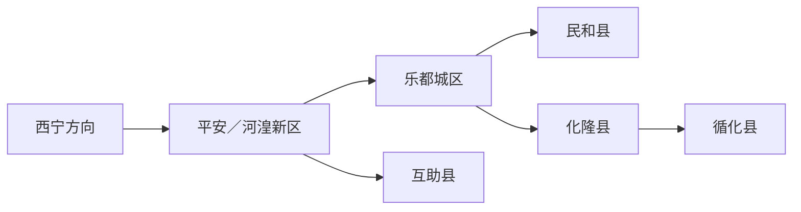
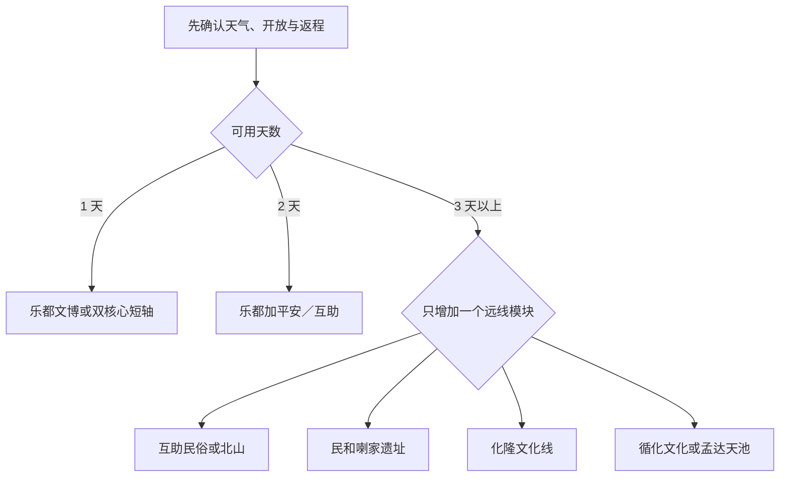

# 海东旅行指南

海东不是一片从机场延伸到黄河的连续城区，而是一座沿湟水河谷展开、再向北部山地和南部黄河谷地分叉的地级市。乐都与平安构成双核心：乐都集中市级行政、文博和河湟历史入口，平安连接海东西站、河湟新区、曹家堡机场与平安驿；民和、互助、化隆、循化则分别是需要独立交通和返程方案的县域目的地。首访最实用的做法是先完成乐都—平安文化轴，再按彩陶、民俗、考古、黄河或山地兴趣只增加一条远线。

> 建议停留：乐都—平安 2 天；增加互助或民和另留 1 天；化隆、循化和北山方向分别按独立日安排 
> 旅行关键词：河湟文化、彩陶考古、乐都平安双核心、土族与撒拉族文化、黄河谷地 
> 主要体力：核心文博线为低至中等；寺院、遗址、北山与孟达天池为中等至较高，并叠加海拔和长车程 
> 最近研究：2026-08-12

## 城市速览

| 项目 | 旅行信息 |
|---|---|
| 主要旅行价值 | 在河湟文化博物馆、柳湾彩陶和喇家遗址之间观察黄河上游史前文明，在瞿昙寺等文物与宗教空间理解河湟建筑，再通过互助、化隆、循化的正式展陈和公共游线认识不同社区持续发展的生活文化。 |
| 建议停留 | 1 天只走乐都文博或平安—乐都一条轴线；2 天覆盖双核心；3 天选择互助土族故土园、民和喇家遗址或瞿昙寺之一。化隆、循化和互助北山不与核心景点硬拼。 |
| 较舒适季节 | 春秋通常较利于河谷文博与短途步行，但早晚温差、大风和节庆客流需要取舍；夏季山地较凉，却是强降雨、山洪和地质灾害重点期；冬季可有冰雪体验，也会遇到低温、结冰、短日照和季节停运。 |
| 预算特点 | 核心城区餐饮和公共文化较易控制支出；县际车辆、司机等候、山地接驳、异地住宿与景区内部交通是主要增量。机场或高铁到达不等于已经抵达县域景点。 |
| 步行强度 | 乐都与平安内部可分段短走，但两区之间不能步行串联；瞿昙寺、喇家遗址、北山、孟达天池和山地宗教场所有台阶、坡道、非铺装路或长距离接驳。 |
| 主要天气风险 | 强日照、昼夜温差、低温、大风、强降雨、山洪、滑坡崩塌泥石流、冬季积雪结冰；河谷预报不能替代互助北山、化隆山地或孟达天池的点位预报。 |
| 独行旅行 | 双核心的铁路、公路客运、出租和正规餐饮便于独自安排；县域远线应提前锁定合规车辆、返程、住宿与应急联系人，不依赖景区门口临时拼车。 |
| 亲子旅行 | 河湟文化博物馆、柳湾彩陶博物馆和正式民俗展陈主题清晰；遗址保护棚、宗教场所、河岸、森林步道、骑乘和冰雪项目仍需持续看护，并逐项确认年龄与安全规则。 |
| 长者与低体力旅行 | 每天采用“一座大馆 + 一处短点”，以车辆连接乐都和平安；北山、孟达天池、山地寺院和连续跨县优先删除，不能因有摆渡车就推定全程少步行。 |
| 无障碍信息 | 公开资料不足以证明任一历史建筑、遗址或自然景区形成连续无障碍链；铁路可申请重点旅客服务，场馆和景区仍需逐点询问落客区、坡道、电梯、轮椅、卫生间与陪同规则。 |

本页固定采用 **GeoNames 1799471**。项目的 2026-07-30 固定快照把该居民点记为 `Nianbo`、类别为 `PPL`，位置落在乐都一带；GeoNames 实时资料已在同一编号下使用 `Haidong` 名称，因此不另换 ID。Wikidata **Q984788** 的 `P1566` 精确连接该编号，并把对象标为现行地级海东市；居民点坐标只能帮助定位乐都主城，不能代替全市行政边界。

海东市现行法定行政区划代码为 **630200**，下辖乐都区、平安区、民和回族土族自治县、互助土族自治县、化隆回族自治县和循化撒拉族自治县。Q984788 还保留写作 “63 21”、终止于 2013 年的旧统计代码表达，它对应撤地设市以前的历史层级，不能覆盖现行 `630200`，也不能据此把六个县区缩成一个居民点。

## 城市格局与游览区域

海东市国土空间总体规划把中心城区写成沿湟水河发展的“一轴双心多组团”：双心是乐都城区和平安城区（含河湟新区），中心城区范围还涉及互助县部分区域。这个规划概念用于理解城市功能，并不表示乐都、平安、机场、高铁站和互助县城之间形成连续步行带，更不表示民和、化隆、循化属于“市郊几站路”。

| 区域 | 主要内容 | 游览特点 | 与其他区域的关系 |
|---|---|---|---|
| 乐都城区与东部河谷 | 河湟文化博物馆、城市公共服务、柳湾彩陶博物馆；瞿昙寺在乐都区南向山谷 | 适合作为文博住宿基地；博物馆之间仍需乘车，瞿昙寺通常独立半日至一日 | 可与平安形成两日双核心；柳湾在东向、瞿昙寺在南向，不宜当成同一街区 |
| 平安城区与河湟新区 | 平安驿、海东西站、海东客运枢纽、曹家堡机场 | 到达与换乘功能强，平安驿适合餐饮和民俗商业体验；机场正式名称服务西宁，但位置在海东城市核心范围 | 可与乐都同日车辆串联；去互助、化隆、循化前常在此重组交通 |
| 互助县 | 威远镇服务、互助土族故土园、佑宁寺、互助北山国家森林地质公园 | 县城民俗线与北山自然线不是一条短线；北山海拔、道路和天气门槛更高 | 土族故土园可从平安或西宁方向单日往返；北山宜另住或独立一日 |
| 民和县 | 县城与官亭镇、喇家国家考古遗址公园、季节性河谷乡村点 | 喇家遗址位于官亭镇，不在民和县城步行范围；保护展示与黄河谷地并重 | 可从乐都沿东向铁路或公路抵达县域，再换最后一段；不与循化同日压缩 |
| 化隆县 | 巴燕县城、群科片区、夏琼寺与黄河谷地 | 县城、群科和山地寺院分处不同海拔与道路；拉面文化适合在正规餐饮和公开展陈中体验 | 从乐都或平安南下，宜单独一天；可与循化组成多日黄河线，但不是连续城区 |
| 循化县 | 积石县城、撒拉族绿色家园文化线、黄河公共游览点、孟达天池 | 文化线、黄河线和自然保护地入口需分别核对；孟达天池为季节性山地项目 | 与化隆可组成两地住宿联程；从双核心当天往返时必须保留返程和取消条件 |

曹家堡机场虽然以“西宁”命名，海东西站虽然以“海东”命名，两者都不能代表整座地级市的景点入口。导航时应分别输入具体车站、县城、游客中心和景区入口。互助北山、孟达天池、喇家遗址与瞿昙寺的最后一段更应按官方道路、售检票与接驳信息计算，不能只看地图直线距离。

瞿昙寺、佑宁寺和夏琼寺等仍是宗教或文物保护空间，开放殿堂与礼拜、修缮、僧众生活区之间有边界。柳湾与喇家是遗址保护场所，互助北山和孟达天池又涉及森林、自然保护和防火管理。只进入公告明确开放的游线，不攀爬文物、不穿越农田和居民院落，也不把水库坝体、林业作业道、矿区或未开放河岸当成观景捷径。

## 主要景点

优先级用于安排行程，不代表绝对排名：**A** 为首访核心，**B** 为按兴趣补充，**C** 为县域、季节性或需要独立交通的目的地。车站、餐饮片区和换乘点可标记为“路线节点”；同一景区内部展馆、村落、演艺和交通项目合并记录，不重复计算。

### 乐都—平安双核心

| 景点 | 区域 | 类型 | 主要看点 | 建议用时 | 室内外 | 体力 | 预约风险 | 天气影响 | 优先级 |
|---|---|---|---|---:|---|---|---|---|---|
| 河湟文化博物馆 | 乐都城区 | 综合性地市级博物馆 | 河湟历史、民俗、建筑与非遗的系统展陈，是理解全市六县区关系的首站 | 2–3 小时 | 室内 | 低 | 中；闭馆日、预约与展厅开放需确认 | 低；极端天气可能调整 | A |
| 青海柳湾彩陶博物馆（柳湾遗址片区） | 乐都区高庙镇柳湾村 | 遗址博物馆 | 马家窑文化半山、马厂以及齐家、辛店等类型彩陶与柳湾墓地背景；博物馆和遗址片区合并为一站 | 2–3 小时 | 室内为主 | 低至中 | 中；馆日、讲解与开放范围需确认 | 低至中；最后一段受雨雪影响 | A |
| 瞿昙寺文化旅游景区 | 乐都区瞿昙镇方向 | 全国重点文物保护单位、在用宗教文化空间 | 明代建筑、壁画与河湟多元建筑传统；只走当期开放殿堂与游客通道 | 2.5–4 小时 | 混合 | 中 | 高；宗教活动、修缮、票务和开放边界需确认 | 高；山谷雨雪、结冰和地灾影响 | A／独立半日 |
| 平安驿·河湟民俗文化体验地 | 平安区 | 民俗商业街区 | 河湟建筑、工坊、餐饮与当期演艺；适合作为双核心之间的休息和用餐站 | 2–4 小时 | 混合 | 低至中 | 中；演出、商户和活动按当期运营 | 中；雨雪、大风和节庆客流影响 | B／路线节点 |

### 互助县北线

| 景点 | 区域 | 类型 | 主要看点 | 建议用时 | 室内外 | 体力 | 预约风险 | 天气影响 | 优先级 |
|---|---|---|---|---:|---|---|---|---|---|
| 互助土族故土园 | 互助县威远镇周边 | 国家 5A 级民俗文化景区 | 土族历史、盘绣、生产生活与正式演艺展陈；彩虹部落、青稞酒文化等内部项目不拆分计数 | 3–5 小时 | 混合 | 中 | 中至高；项目、演出、酒类体验和接驳会调整 | 中；户外活动受雨雪和大风影响 | A／县域 |
| 佑宁寺 | 互助县五十镇方向 | 在用藏传佛教寺院、历史建筑 | 寺院建筑和持续宗教文化；参观服从现场礼拜、拍摄和开放范围 | 1.5–3 小时 | 混合 | 中 | 高；不以旧攻略保证开放 | 高；山路、雨雪和结冰影响 | C／条件式 |
| 互助北山国家森林地质公园 | 互助县北山方向 | 森林、峡谷与地质景区 | 高山森林、峡谷和正式开放自然游线；浪士当、扎隆沟等内部片区按一处完整景区管理 | 4–8 小时 | 室外 | 高 | 高；入口、分区、摆渡、防火和季节运营需确认 | 很高；降雨、落石、山洪、降雪和道路施工影响 | A／独立一日 |

### 民和、化隆与循化远线

| 景点 | 区域 | 类型 | 主要看点 | 建议用时 | 室内外 | 体力 | 预约风险 | 天气影响 | 优先级 |
|---|---|---|---|---:|---|---|---|---|---|
| 喇家国家考古遗址公园 | 民和县官亭镇喇家村 | 国家考古遗址公园 | 齐家文化大型聚落、灾难遗址、遗址博物馆与保护展示棚；各展示点合并为一站 | 3–5 小时 | 混合 | 中 | 高；局部开放范围、馆舍与讲解需确认 | 中至高；河谷强降雨和道路影响 | A／独立一日 |
| 夏琼寺 | 化隆县查甫乡方向 | 在用藏传佛教寺院、山地历史空间 | 寺院建筑、山地环境与持续宗教活动；不把周边道路和生产空间当景区 | 2–4 小时 | 混合 | 中至高 | 高；礼拜、修缮、交通和开放边界需确认 | 很高；海拔、风雨雪和山路影响 | B／条件式 |
| 群科拉面文化片区 | 化隆县群科方向 | 饮食与产业观察节点 | 在正规餐饮、公开展陈或当期活动中理解化隆拉面技艺和产业迁移 | 1.5–3 小时 | 混合 | 低 | 中；展陈、商户和活动可能变化 | 低至中 | 路线节点 |
| 撒拉族绿色家园文化线 | 循化县街子等公开点位 | 民俗文化景区与生活社区 | 以骆驼泉、撒拉尔故里民俗文化园等当期开放展陈理解迁徙记忆、建筑、饮食与非遗；内部点位不重复计数 | 3–5 小时 | 混合 | 中 | 高；项目建设、开放点和社区边界需确认 | 中；节庆客流和雨雪影响 | A／县域 |
| 孟达天池景区 | 循化县孟达方向 | 自然保护地中的季节性山地景区 | 森林、峡谷与高山湖泊，只使用正式入口、开放步道和批准交通 | 5–8 小时 | 室外 | 高 | 很高；年度开园、门票、接驳、防火和限流需确认 | 很高；山洪、落石、雷暴、低温和结冰可取消 | A／独立一日 |

平安驿的商业展陈不能替代真实社区，民俗景区的演艺也不能代表所有居民的日常生活。土族故土园内部景点、北山内部沟谷、喇家遗址各保护棚和撒拉族绿色家园内部点位均按一个完整景区或文化线记录；只有地址、管理和入口明确独立时才另列。

## 美食与餐饮

海东饮食适合按县区和菜品寻找：乐都、平安可作为河湟面食与小吃基地，互助侧重青稞、洋芋和正式土乡餐，民和与循化常见牛羊肉及家宴，化隆则以牛肉拉面及其产业文化最具辨识度。平安驿集合本地和省外小吃，不能把街区内所有菜品都当成海东传统；清真标识、酒类、汤底、肉源、厨房共用和过敏原都应向具体经营者确认。

| 菜品或餐饮类型 | 常见区域 | 一个人用餐与常见份量 | 风味、过敏原与饮食限制 | 排队风险与替代方法 |
|---|---|---|---|---|
| 化隆牛肉拉面 | 化隆群科、巴燕及全市正规面馆 | 通常一人一碗，可选面型并另加肉、蛋或小菜 | 面含小麦麸质；汤底常含牛肉与香辛料，辣油另问；素食者需确认是否可用独立清汤 | 用餐高峰翻台快但可能排队；优先选菜单、价格和经营资质清楚的同类店 |
| 面片、搓鱼儿与浆水面 | 乐都、平安、民和县城 | 多为一人一碗，份量可能较足，可先问小份 | 含小麦麸质；汤底可能有牛羊肉、鸡肉或动物油，浆水酸味明显 | 午餐高峰可换附近普通面馆，不必追逐单一老字号 |
| 搅团、散饭与洋芋类小吃 | 乐都、平安驿及正规小吃店 | 可单份尝试，搭配菜和辣汁后饱腹感较强 | 以玉米、杂粮或洋芋为主，但调味可能含小麦、辣椒、蒜和动物油 | 平安驿节假日拥挤；可到乐都或平安城区的正规餐馆寻找同类 |
| 焜锅馍馍、馓子与杂粮面点 | 互助、循化及全市市场 | 馍馍适合分食，馓子按重量购买，先少量尝试 | 多含小麦麸质和油脂，可能接触芝麻、奶、蛋或坚果 | 节庆和刚出炉时排队；选择配料、生产日期和储存清楚的替代点 |
| 黄焖羊肉、手抓羊肉与土暖锅 | 民和、化隆、循化及乐都正规餐馆 | 多人共享更合适；独行者先问重量、部位、最低份量和是否可半份 | 牛羊肉与动物油为主，汤锅可能含小麦、豆制品或乳制品；清真与否看经营者明示 | 宴席时段等待较长；以明码标价、可小份点单的同类店替代 |
| 互助洋芋宴、土乡家宴 | 互助县城、故土园和预约制正规餐饮 | 组合菜常适合多人，独行者宜改点一两种代表菜 | 可能同时含肉、奶、蛋、小麦和多种油脂；青稞酒体验含酒精 | 演出或团队日需预约；无法凑桌时改选焜锅、洋芋或面食单品 |
| 循化撒拉家宴 | 循化县城、街子及确认接待的正规经营点 | 通常多人共享且可能需预订；先问菜数、人数和计价 | 常见牛羊肉、面点、油炸食品和辣椒；饮食礼仪、清真要求与过敏原逐项确认 | 节庆和团队期风险高；独行者可改选面食、手抓小份或正规简餐 |
| 甜醅、老酸奶与熬茶 | 乐都、平安、化隆等正规餐饮 | 可单碗或单杯，适合餐后少量尝试 | 甜醅为发酵谷物，可能含微量酒精且含麸质；酸奶含乳；熬茶可能含奶、盐或坚果配料 | 选择冷藏、配料和制作时间清楚的产品，不买久置散装食品 |

进入清真餐饮、寺院周边或社区经营空间时，遵守商户和场所关于酒类、吸烟、拍摄与座次的提示。不要凭菜名推断绝对无肉、无酒精或无过敏原，也不依据服饰、语言或外貌判断经营者和顾客身份。

## 经典行程

### 一日双核心经典路线

**路线**：平安驿短段 → 平安城区午餐 → 河湟文化博物馆 → 乐都城区休息；若从乐都出发可反向，柳湾彩陶博物馆只在交通与馆日均确认时替换平安驿

- **串联逻辑**：以车辆沿湟水河谷连接平安和乐都，只安排一座主馆和一个短点；不在同日加入瞿昙寺、互助或民和。
- **预约锚点**：河湟文化博物馆的闭馆日、预约与最晚入场最先确认；平安驿只核对当日活动和停车，不把演出当固定项目。
- **休息安排**：午餐放在平安或乐都城区，博物馆前后各留一段室内休息；抵达高原首日减少饮酒和连续赶路。
- **时间不足时**：先删平安驿，只保留河湟文化博物馆；若博物馆未开放，则改为柳湾彩陶博物馆单馆日，不临时转去山地寺院。

### 两日乐都、平安与互助路线

**第 1 天**：河湟文化博物馆 → 乐都城区午餐 → 青海柳湾彩陶博物馆 → 乐都住宿

**第 2 天**：平安城区出发 → 互助土族故土园 → 互助或平安午后休息 → 平安驿短段 → 平安住宿或返程

- **串联逻辑**：第一天沿乐都东部文化轴处理两座互补文博点，第二天只走平安—互助北线；故土园内部项目合并安排，不再拆成多站。
- **预约锚点**：两座博物馆馆日与讲解、故土园门票和当日演艺、平安—互助交通与返程；不以过去开通的旅游专线保证当天有车。
- **休息安排**：第一天在乐都城区午休，第二天在故土园正式服务区或互助县城用餐；饮酒体验不与驾驶相容。
- **时间不足时**：第一天删柳湾、只留河湟文化博物馆；第二天删平安驿、只留故土园。不要把北山再塞入第二天。

### 三日河湟文化与考古路线

**第 1 天**：河湟文化博物馆 → 乐都城区 → 青海柳湾彩陶博物馆

**第 2 天**：平安驿短段 → 互助土族故土园 → 平安或互助住宿

**第 3 天**：乐都或民和县域出发 → 喇家国家考古遗址公园 → 官亭镇正规餐饮与休息 → 民和南站、民和县城或原路线返程

- **串联逻辑**：用前两天理解河湟整体与土族文化展示，第三天才沿东向进入民和官亭；喇家是完整考古遗址日，不与循化或化隆联排。
- **预约锚点**：喇家遗址博物馆、保护展示棚、开放入口和讲解最优先，随后确认到官亭的最后一段车辆与返程；铁路只按票面站名使用。
- **休息安排**：第三天在官亭镇或景区正式服务区安排午餐和长休，携带饮水但不在保护棚、河岸和考古区野餐。
- **时间不足时**：第三天整段取消，保留双核心；已经抵达民和县城却无法确认遗址开放时，不翻越围栏或寻找非正式入口。

### 普通雨雪调整路线

**路线**：住宿地核对道路与馆日 → 河湟文化博物馆 → 乐都城区室内午餐 → 青海柳湾彩陶博物馆；任一场馆关闭则改为单馆加休息

- **串联逻辑**：只用车辆连接两座室内为主的场馆，避开山谷寺院、遗址室外段、森林和黄河岸线。
- **适用条件**：仅适用于普通降雨或小雪且道路、场馆正常；暴雨、暴雪、道路结冰、山洪或地质灾害预警时取消跨片区移动，留在住宿地。
- **预约锚点**：两馆开放、停车或落客点、城市道路和返程；平安驿的半户外街区不作为恶劣天气兜底。
- **休息安排**：每馆之间保留完整午休和换干衣物时间，避免湿滑路面连续步行。
- **时间不足时**：只保留河湟文化博物馆；若其闭馆，则只去柳湾，不能用瞿昙寺或北山补位。

### 亲子或低体力路线

**亲子路线**：河湟文化博物馆 → 乐都城区午餐与长休 → 青海柳湾彩陶博物馆 → 返回住宿地

**低体力路线**：车辆直达河湟文化博物馆落客区 → 单馆慢游 → 乐都城区午餐 → 车辆前往平安驿入口只走一段平缓街区 → 返回住宿地

- **减负方式**：亲子线用两座主题明确的场馆替代山地和长车程，持续看护儿童并确认推车、互动展项和餐饮过敏原；低体力线一天只设一座大馆，门到门乘车，不加入柳湾、寺院或县域远线。两类路线都不能预设全程无障碍。
- **预约锚点**：场馆儿童证件、推车、母婴设施和互动项目规则；低体力线另问落客区、轮椅、电梯、座椅和无障碍卫生间。
- **休息安排**：亲子线在乐都安排完整午休，低体力线每 45–60 分钟主动找座位；高原不适时立即结束。
- **时间不足时**：两条路线都只保留河湟文化博物馆，不用平安驿游乐项目或山地景点补齐时长。

### 县域远线一日路线

**互助民俗线**：平安或西宁方向出发 → 互助土族故土园 → 互助县城休息 → 原路返回；北山另作独立日

**民和考古线**：乐都、民和南站或民和县域出发 → 喇家国家考古遗址公园 → 官亭镇休息 → 原路返回

**化隆文化线**：乐都或平安出发 → 夏琼寺当期开放部分 → 化隆县城或群科正规餐饮 → 原路返回

**循化文化线**：化隆或循化县城出发 → 撒拉族绿色家园文化线当期开放点 → 循化县城休息 → 原路返回；孟达天池另作独立日

- **适用条件**：每次只选一县一条主线。互助北山和孟达天池要求山地天气、道路、景区交通和体力全部满足；化隆、循化更适合前一晚已住当地或已锁定返程者。
- **预约锚点**：按所选县域确认景区开放、宗教活动、道路、合规车辆、司机等候、最晚返程和异地住宿；2026 年孟达天池开园信息也不能替代到访日公告。
- **休息安排**：在县城、游客中心或正规餐饮点完成午餐、补水和卫生间停留，不在公路弯道、河道、林区防火带或居民院落停车休息。
- **时间不足时**：整条县域线取消，不截短后再追加双核心景点；若已经出发但开放或道路不满足，返回最近县城或住宿地。

## 住宿区域

| 区域 | 优点 | 缺点 | 适合人群 | 交通特点 |
|---|---|---|---|---|
| 乐都城区 | 靠近市级行政、河湟文化博物馆和东向柳湾、民和方向；日常餐饮与公共服务较完整 | 到机场、海东西站、互助和循化仍需车辆；瞿昙寺不在城区步行范围 | 以文博、彩陶、喇家遗址或瞿昙寺为主的行程 | 适合作为东向与南向线路基地；按具体酒店核对停车和车站接送 |
| 平安城区 | 海东西站、客运枢纽、平安驿和县际交通衔接较方便 | 市级文博集中在乐都；节庆和平安驿活动期可能拥挤、嘈杂 | 晚到早走、机场铁路衔接、准备去互助或化隆者 | 到乐都仍是跨区乘车；县际班线和定制客运需提前确认 |
| 河湟新区与机场周边 | 接近曹家堡机场、海东西站及快速道路，适合航班前后缓冲 | 城市步行体验和稳定餐饮选择取决于具体位置；不能因设有综合交通中心就推定已有机场轨道 | 航班到达、短暂停留、需要低换乘负担者 | 先确认航站楼、酒店接送、出租上客区和夜间交通；不要只看“距机场”直线距离 |
| 互助县城 | 故土园、佑宁寺与北山方向组织更从容，便于把北线拆成两天 | 与乐都、民和、循化方向不顺路；北山仍需长距离山路 | 民俗文化、北山摄影、需要降低当日往返压力者 | 县城到故土园和北山入口分别核算；山区返程不依赖末刻叫车 |
| 民和县城或官亭镇 | 便于把喇家遗址和东向铁路、公路拆开，减少从平安当天折返 | 县城与官亭镇不是同一地点，住宿、餐饮和接送条件差异大 | 考古深度游、继续向甘肃联程或次日早访喇家者 | 先根据喇家入口或民和南站选择落脚点，不能笼统导航“民和” |
| 化隆或循化县城 | 黄河文化、夏琼寺、撒拉族文化和孟达天池可拆成多日，避免夜返双核心 | 住宿选择相对有限，节庆、施工和天气更影响供应；两县城也不相邻 | 已有两日以上南线计划、摄影或自然旅行者 | 分别锁定县城、景区和下一站车辆；不要一天同时换住两县 |

## 市内交通

海东的“市内交通”实际包含双核心通勤、县际客运、景区接驳和山地公路四层。铁路适合把旅客送到平安、乐都或民和附近，公路才承担多数景点最后一段；县域之间虽有高速和干线公路，仍会受施工、雨雪、地灾和节庆车流影响。

| 场景 | 建议与取舍 | 行前需要重查的内容 |
|---|---|---|
| 从曹家堡机场抵达 | 机场位于海东城市核心范围、正式名称服务西宁；前往河湟新区、平安、乐都或其他县区应分别叫车或确认定制客运。T3 与三期扩建已投运并设综合交通中心，但这不等于已有机场轨道；铁路衔接须以当期运营公告为准 | 到达航站楼、出租与网约车上客区、机场巴士或定制客运、酒店接送、夜间服务、航班延误和价格 |
| 铁路抵达 | 官方铁路站名包括平安区的海东西、乐都区的乐都南、民和县的民和南；按目的地选择到发站，不能只因站名含“海东”就默认离所有景点最近 | 车次是否停靠、票面站名、检票口、行李、重点旅客服务、站外接驳和返程余票 |
| 乐都—平安双核心 | 公交、县际或定制客运、出租和合规网约车各承担一部分；赶馆日时门到门车辆更稳定，两区之间不适合步行或临时骑行 | 线路、站点、首末班、支付、临时绕行、跨区计价、平安驿活动交通和博物馆落客点 |
| 跨县移动 | 海东已发展连接核心区、互助、化隆、循化、民和、机场和景点的定制客运，但具体线路与发车需要实时查询；普通客运站仍是重要兜底 | 海东客运枢纽和各县客运站位置、实名购票、发车条件、最低成行、行李、取消、最晚返程 |
| 景区最后一段 | 故土园、北山、喇家、瞿昙寺、夏琼寺、绿色家园和孟达天池入口各不相同；与司机约定入口、等候、返程和封路替代 | 游客中心、摆渡、停车预约、道路等级、施工、防火、落石、信号、司机资质和保险 |
| 片区内步行 | 乐都和平安各自可选短段步行，博物馆、平安驿和县城餐饮之间适合分段；遗址、寺院和山地按正式游线 | 坡度、台阶、结冰、道路施工、夜间照明、推车和轮椅连续性 |
| 自驾 | 县域远线自驾更灵活，但驾驶员要同时承担高原疲劳、长下坡、急弯、落石、牲畜、风雨雪和夜间低温风险；饮酒体验后不得驾驶 | 路况与预警、加油充电、停车、景区预约、轮胎防滑、救援、异地还车和驾驶员轮换 |

导航中的“县城”“景区”“游客中心”“保护区入口”不是同义词。北山方向 2026 年仍有 G338 改扩建工程信息，任何历史车程都不应当成固定承诺；遇到封闭、劝返或生产保护标志时原路返回，不绕行未铺装便道。

## 不同旅行者须知

| 旅行维度 | 可行条件 | 主要取舍 | 需额外核对 |
|---|---|---|---|
| 独行旅行 | 双核心文博、面馆和铁路方便独自安排，县城可作为远线基地 | 山区、宗教场所和保护地不适合依赖临时拼车或独自改线 | 司机与车辆、返程、住宿登记、夜间交通、通信和紧急联系人 |
| 亲子旅行 | 河湟文化博物馆、柳湾彩陶和故土园正式展陈可按半天组合 | 长车程、遗址边缘、河岸、森林步道、冰雪和骑乘项目增加看护压力 | 儿童证件、年龄身高、推车、母婴室、休息点、餐食过敏原和项目保险 |
| 长者或低体力旅行 | 单馆慢游、车辆串联、午间长休和县城住宿能显著减负 | 寺院台阶、遗址步道、北山、孟达天池及连续跨县应优先删除 | 落客区、电梯、轮椅、座椅、卫生间、接驳和最近医疗点 |
| 无障碍需求 | 铁路重点旅客服务可提前申请，现代场馆可能提供部分辅助设施 | 历史建筑、石板街、遗址保护棚、山地和景区车辆会中断连续通行 | 轮椅尺寸、坡道、门槛、电梯状态、车辆固定、陪同票和备用入口；设施连续性需向官方确认 |
| 摄影旅行 | 柳湾彩陶、河湟建筑、黄河谷地和正式自然游线主题差异明显 | 展柜、壁画、礼拜、人物、遗址和保护地规则不同；无人机不因空旷就可飞 | 馆内拍摄、三脚架、闪光灯、商业拍摄、肖像同意、空域与自然保护规定 |
| 预算有限 | 住乐都或平安、以一座主馆和公共交通为核心，可控制基础支出 | 远线包车与异地住宿是主要成本，不能以非法拼车或夜驾压低预算 | 免费开放是否预约、优惠资格、公交支付、县际票价、司机等候和退改 |
| 晚出发或紧凑行程 | 下午只选河湟文化博物馆、柳湾彩陶或平安驿中的一个 | 不应临时增加瞿昙寺、互助、民和、化隆或循化 | 最晚入场、闭馆日、夜间交通、餐厅营业和航班列车衔接 |
| 高原、雨雪与强日照 | 抵达首日放慢速度、规律补水、防晒防风并分层穿衣 | 酒精、熬夜、剧烈活动和直接进入更高山地会增加身体负担；夏季降雨和冬季结冰会让普通路线升级 | 逐小时天气、地灾与道路预警、个人病史、药物、保险、医疗点和住宿应急信息 |
| 宗教与社区访问 | 在公告开放的寺院、民俗展陈和公共街区内参观 | 礼拜、居民生活、学校、农田、作坊和演艺不是随意拍摄对象 | 当日礼仪、开放殿堂、服装、拍摄、饮食、节庆和团队规则 |

海东河谷与山地海拔差异明显，不应把“高原”渲染成每个人都会发病，也不能据此保证任何人安全。出现持续加重的头痛、恶心、眩晕、乏力，或静息呼吸困难、意识改变、步态不稳等严重表现，应停止活动、及时求助医疗，并在专业指导和安全条件下降低海拔；本页不提供药物处方。

## 行前核对

本节只列会变化的事项。旧游记中的门票、演出、班次、开园月份和车程不能替代场馆、景区、铁路、公路、民航与气象部门的当期公告。

| 核对事项 | 为什么需要重查 | 建议核对时间 | 官方入口 |
|---|---|---|---|
| 河湟文化博物馆与柳湾彩陶博物馆 | 闭馆日、预约、团队讲解、临展、修缮、寄存和助残服务可能调整 | 确定日期后及到访前一日 | [海东市人民政府](https://www.haidong.gov.cn/)及[青海省文旅信息](https://www.mct.gov.cn/whzx/qgwhxxlb/qh/)所汇集的主管部门公告 |
| 瞿昙寺、佑宁寺与夏琼寺 | 在用宗教空间的礼拜、节庆、修缮、殿堂开放和拍摄边界以现场为准 | 排入路线前、到访前三日及当天 | [青海省人民政府宗教场所资料](https://www.qinghai.gov.cn/mzfw/xgjg/zdsgjt/zcfjsy/index.html)及属地政府当期公告 |
| 平安驿与民俗活动 | 商户、演艺、节庆、停车、夜间活动和拥挤程度变化频繁 | 到访前一周及当天 | [青海省人民政府海东文旅信息](https://www.qinghai.gov.cn/dmqh/system/2024/05/05/030043460.shtml)及运营方当期公告 |
| 互助土族故土园 | 内部项目、演出、票务、青稞酒体验与景区交通按季节调整 | 购票前及到访当天 | [文化和旅游部互助文旅资料](https://zhuanti.mct.gov.cn/xcss2024_nlhwzzxc/qinghai/detail/8153.html)及景区当期公告 |
| 互助北山 | 分区开放、摆渡、防火、道路施工、雨雪和地灾决定能否进入 | 出发前一周、前三日及当天 | [青海省交通运输厅](https://jtyst.qinghai.gov.cn/)和属地林草、景区公告 |
| 喇家国家考古遗址公园 | 遗址博物馆、保护展示棚和局部开放范围可能不同 | 排入路线前及到访前一日 | [青海省人民政府喇家遗址资料](https://www.qinghai.gov.cn/zwgk/system/2020/05/02/010357493.shtml)及园区当期公告 |
| 循化文化线与孟达天池 | 民俗园项目建设、社区开放、年度开园、限流、接驳、防火和天气均会变化 | 订车住宿前、出发前三日及当天 | [青海省人民政府 2026 海东春游信息](https://www.qinghai.gov.cn/zwgk/system/2026/04/02/030096277.shtml)及循化属地公告 |
| 铁路车次与站名 | 海东西、乐都南、民和南的停靠车次、检票和重点旅客服务按运行图变化 | 购票时、出发前一日及进站前 | [中国铁路 12306](https://www.12306.cn/) |
| 机场航站楼与地面接驳 | T3 航站楼与三期扩建已投运；综合交通中心、上客区、巴士、定制客运及铁路衔接仍会调整 | 购票后、起飞前一日及落地前 | [中国民航局 T3 与综合交通中心资料](https://xb.caac.gov.cn/XB_XXGK/XB_GZDT/202501/t20250126_226591.html)、[三期投运后运行资料](https://www.caac.gov.cn/PHONE/GLJ_PHONE/XBGLJ/XB_XXGK/XB_GZDT/202509/t20250926_228719.html)及机场当期公告 |
| 县际客运、定制客运与景区接驳 | 线路、最低成行、发车、票价、站点、车辆与取消条件具有时效性 | 订住宿前、出发前一日和乘车当天 | [青海省交通运输厅定制客运资料](https://jtyst.qinghai.gov.cn/jtyst/2025-03/24/article_2025032417581391230.html)及海东客运运营方 |
| 道路、山洪与地质灾害 | 海东各县区风险分布不同，施工、强降雨、落石、积雪和结冰会改变路线 | 出发前三日、前一晚及当天 | [青海省实时路况](https://jtyst.qinghai.gov.cn/jtyst/cxfw/lkxx/index.html)、[青海省气象局](http://qh.cma.gov.cn/)及属地预警 |
| 高原健康准备 | 个体病史、上升速度、儿童与孕期情况不能靠通用攻略判断 | 订票前；抵达后持续观察 | [国家卫生健康委员会高原病防治资料](https://www.nhc.gov.cn/zwgkzt/pjbkz1/201005/47316.shtml)及正规医疗机构 |
| 入境、签证与住宿登记 | 境外旅行者适用规则取决于国籍、证件、口岸和当期政策 | 购买国际交通前及出发前 | [国家移民管理局](https://www.nia.gov.cn/) |
| 餐饮、清真与过敏原 | 商户营业、配料、酒类、厨房共用和宴席最低人数会变化 | 排入路线前及点餐时 | 商户当期公示、现场询问与当地市场监管信息 |

## 来源与更新记录

### 主要来源

| 来源 | 类型 | 支持内容 | 核验日期 |
|---|---|---|---|
| [GeoNames：1799471](https://www.geonames.org/1799471/nianbo.html) | 开放地名资料（CC BY 4.0） | 固定 GeoNames 编号、快照名称 `Nianbo`、乐都居民点定位及实时同 ID 名称变化入口 | 2026-08-12 |
| [GeoNames：相关名称更新记录](https://www.geonames.org/recent-changes/user/qinxiayun/) | 开放地名变更记录 | 编号 1799471 下增加 `Haidong` 名称的实时变更线索；不据此改换固定 ID | 2026-08-12 |
| [Wikidata：Haidong](https://www.wikidata.org/wiki/Q984788) | 开放结构化资料（CC0） | Q984788、现行地级市属性、`P1566=1799471`、MCA 代码 630200，以及终止于 2013 年的旧统计代码表达 | 2026-08-12 |
| [青海省民政厅：行政区划代码查询入口](https://mzt.qinghai.gov.cn/) | 省级民政主管部门 | 现行行政区划代码的官方核对入口；用于与旧统计代码区分 | 2026-08-12 |
| [海东市国土空间总体规划（2021—2035 年）](https://www.haidong.gov.cn/webaspx/ImageHandler.ashx?filename=%2Ffiles%2F202410301029504239.pdf&portalid=1) | 市政府法定规划 | 六县区范围、中心城区涉及乐都平安及互助部分、“一轴双心多组团”、机场与交通骨架 | 2026-08-12 |
| [海东市“十四五”规划](https://www.haidong.gov.cn/webaspx/ImageHandler.ashx?filename=%2Fimages%2F2021071311081451451.pdf&portalid=1) | 市政府规划 | “一圈三线”旅游空间、六县区景点方向、故土园、瞿昙寺、柳湾、喇家、夏琼寺与孟达天池的项目关系 | 2026-08-12 |
| [青海省人民政府：海东冬春文旅概览](https://www.qinghai.gov.cn/dmqh/system/2023/12/03/030031131.shtml) | 省政府文旅信息 | 六县区代表景点、河湟文化、餐饮类型、民俗展陈与黄河方向 | 2026-08-12 |
| [青海省人民政府：2026 海东春游线路](https://www.qinghai.gov.cn/zwgk/system/2026/04/02/030096277.shtml) | 省政府当期文旅信息 | 民和—乐都、化隆—循化、平安—互助三条分向线路及孟达天池季节开园提示 | 2026-08-12 |
| [河湟文化博物馆开馆资料](https://jtyst.qinghai.gov.cn/jtyst/2023-07/04/article_2023070411185281266.html) | 省级政府公开信息 | 博物馆位于乐都、综合性地市级馆定位、河湟主题与展陈结构 | 2026-08-12 |
| [青海柳湾彩陶博物馆资料](https://www.qinghai.gov.cn/dmqh/system/2024/01/13/030034792.shtml) | 省政府文旅报道 | 乐都高庙镇柳湾村位置、彩陶文化类型与馆舍属性 | 2026-08-12 |
| [平安驿河湟文化资料](https://www.qinghai.gov.cn/dmqh/system/2024/05/05/030043460.shtml) | 省政府文旅报道 | 平安区位置、河湟建筑、餐饮、工艺与民俗商业体验 | 2026-08-12 |
| [文化和旅游部：互助土族故土园与北山](https://zhuanti.mct.gov.cn/xcss2024_nlhwzzxc/qinghai/detail/8153.html) | 国家文旅主管部门专题 | 故土园 5A 身份、内部项目合并关系、北山组成与海拔范围 | 2026-08-12 |
| [文化和旅游部：海东乡村生态游](https://zhuanti.mct.gov.cn/qh_detail/315.html) | 国家文旅主管部门线路 | 互助故土园、佑宁寺、北山以及乐都瞿昙寺和柳湾的官方组合参考 | 2026-08-12 |
| [青海省人民政府：喇家遗址公园开放资料](https://www.qinghai.gov.cn/zwgk/system/2020/05/02/010357493.shtml) | 省政府文物信息 | 官亭镇位置、齐家文化大型聚落、遗址博物馆与保护展示棚 | 2026-08-12 |
| [青海省人民政府：藏传佛教寺院目录](https://www.qinghai.gov.cn/mzfw/xgjg/zdsgjt/zcfjsy/index.html) | 省政府宗教场所资料 | 瞿昙寺、佑宁寺和夏琼寺的官方场所身份核对入口 | 2026-08-12 |
| [文化和旅游部：循化撒拉族绿色家园讲解范围](https://zwgk.mct.gov.cn/zfxxgkml/scgl/202105/p020210514530681096726.pdf) | 国家文旅主管部门考试大纲 | 绿色家园、撒拉族迁徙文化、骆驼泉与饮食文化的组合边界 | 2026-08-12 |
| [青海省人民政府：孟达天池与循化路线](https://www.qinghai.gov.cn/dmqh/system/2020/04/29/010357335.shtml) | 省政府出行资料 | 孟达天池山地属性、街子—孟达方向及长距离县域尺度 | 2026-08-12 |
| [中国铁路 12306：青藏地区车站列表](https://www.12306.cn/mormhweb/kyyyz/qinzang/201001/t20100124_1196.html) | 铁路运营方 | 海东西、乐都南、民和南的官方站名及所在县区 | 2026-08-12 |
| [中国民航局：西宁机场 T3 与综合交通中心建设](https://xb.caac.gov.cn/XB_XXGK/XB_GZDT/202501/t20250126_226591.html) | 民航主管部门 | T3 航站楼与综合换乘交通中心的建设内容；不由设施名称推定已开通机场轨道 | 2026-08-12 |
| [中国民航局：西宁机场三期扩建投运后运行](https://www.caac.gov.cn/PHONE/GLJ_PHONE/XBGLJ/XB_XXGK/XB_GZDT/202509/t20250926_228719.html) | 民航主管部门 | 三期扩建完成转场投用后的运行状态；当前铁路衔接仍须查运营公告 | 2026-08-12 |
| [海东河湟新区交通资料](https://hdgyy.qinghai.gov.cn/cms/yqgk/yqgk.html?id=12) | 海东市政府园区信息 | 曹家堡机场、海东西站、河湟新区与平安方向的空间关系 | 2026-08-12 |
| [青海省交通运输厅：海东定制客运](https://jtyst.qinghai.gov.cn/jtyst/2025-03/24/article_2025032417581391230.html) | 省交通主管部门 | 核心区至五县、机场和景点的定制客运结构；班次仍需实时核验 | 2026-08-12 |
| [青海省交通运输厅：G338 互助北山方向工程](https://jtyst.qinghai.gov.cn/jtyst/2026-06/09/article_2026060916250530831.html) | 省交通主管部门 | 互助北山相关道路改扩建与山地线路动态风险 | 2026-08-12 |
| [海东市地质灾害防治资料](https://www.haidong.gov.cn/webaspx/ImageHandler.ashx?filename=%2Ffiles%2F202507181017185755.pdf&portalid=1) | 市政府自然资源与应急资料 | 六县区雨季地质灾害重点区域、强降雨与山地风险差异 | 2026-08-12 |
| [海东气候与地貌资料](https://www.haidong.gov.cn/webaspx/ImageHandler.ashx?filename=%2Ffiles%2F202401291104232632.pdf&portalid=1) | 市政府公开资料 | 高原大陆性气候、强日照、昼夜温差、河谷与山地海拔和降水差异 | 2026-08-12 |
| [国家卫生健康委员会：高原病综合防治指导方案](https://www.nhc.gov.cn/zwgkzt/pjbkz1/201005/47316.shtml) | 国家卫生主管部门 | 高原反应识别、减轻活动、及时医疗与安全下降原则 | 2026-08-12 |

### 更新记录

| 日期 | 更新内容 |
|---|---|
| 2026-08-12 | 首次完成公开资料研究；建立乐都—平安双核心与民和、互助、化隆、循化分向远线，澄清 GeoNames 居民点、Wikidata 法定实体、现行 630200 与 2013 年前旧代码边界，并加入可删减路线、景区去重、宗教社区礼仪和动态交通核对。 |
