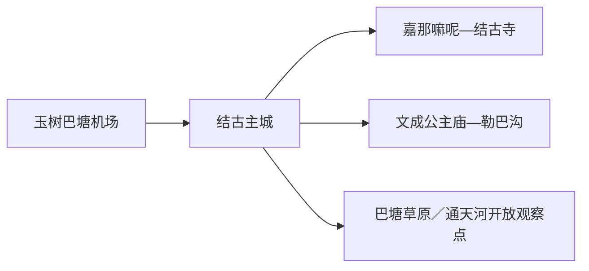
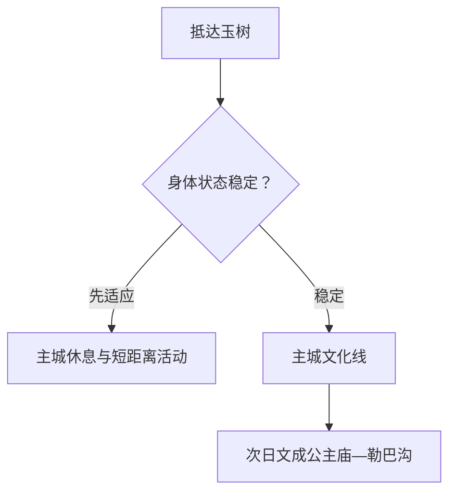

# 玉树旅行指南

玉树市的第一原则是先适应海拔，再安排文化与高原自然。抵达日留在结古主城休息；状态稳定后，以嘉那嘛呢石经城、结古寺和文成公主庙—勒巴沟作为主线。巴塘草原与通天河方向根据天气、道路和保护要求选择，州内其他县另作远程目的地。

> 建议停留：3–5 天，含至少半天适应 
> 旅行关键词：结古、嘉那嘛呢、文成公主庙、勒巴沟、三江源 
> 主要体力：高海拔下整体上调一级；主城低至中，远线中高 
> 最近研究：2026-08-12

## 城市速览

| 项目 | 旅行信息 |
|---|---|
| 主要旅行价值 | 在高原主城、宗教文化、石刻艺术和三江源生态之间理解玉树 |
| 建议停留 | 抵达半天休息；1 天主城文化；1 天文成公主庙—勒巴沟；再留天气缓冲 |
| 较舒适季节 | 以道路、降雪、雷暴和个人适应情况选择；昼夜温差全年明显 |
| 预算特点 | 住宿和主城消费可控，包车、远线、氧气和保暖装备增加预算 |
| 步行强度 | 海拔约 3600 米上下会放大任何步行负担，采用慢速短段 |
| 主要天气风险 | 高海拔反应、低温、强紫外线、冰雪、雷暴、大风和山路 |
| 独行旅行 | 主城可行，远线使用正规车辆并共享行程信息 |
| 亲子旅行 | 是否前往由监护人结合儿童健康与专业建议决定，抵达后观察适应 |
| 长者与低体力旅行 | 先咨询医疗专业人员，主城车辆短线优先 |
| 无障碍信息 | 主城现代设施可先询问；寺院、石经城和山谷的设施连续性需向官方确认 |

## 城市格局与游览区域

结古街道一带是主城服务核心，机场位于巴塘方向。嘉那嘛呢石经城、结古寺与主城形成文化一日；文成公主庙和勒巴沟位于同一出城走廊，可组成完整远线。隆宝滩等保护地强调生态保护，采用主管部门明确开放的观察方式。

| 区域 | 主要内容 | 游览特点 | 与其他区域的关系 |
|---|---|---|---|
| 结古主城 | 住宿、医疗、餐饮、公共文化 | 抵达后先休息，适合短距离活动 | 是全部远线基地 |
| 嘉那嘛呢—结古寺 | 石刻、宗教建筑、城市文化 | 尊重礼仪，慢速分段 | 可与主城同日 |
| 文成公主庙—勒巴沟 | 寺庙、石刻、峡谷与历史交通 | 高海拔公路远线 | 独立一日并留天气缓冲 |
| 巴塘与通天河方向 | 草原、河谷、开放观景点 | 生态和生产空间交织 | 只选明确开放点 |

固定 GeoNames `1281105` 是玉树主城城市点；法定县级玉树市代码 `632701`，Wikidata `Q1026088` 的 `P1566=1279541` 指向另一行政记录。页面以固定点承接队列，以法定代码界定市域；玉树州内杂多、称多、治多、囊谦、曲麻莱另作跨县旅行。

## 主要景点

### 主城文化

| 景点 | 区域 | 类型 | 主要看点 | 建议用时 | 室内外 | 体力 | 预约风险 | 天气影响 | 优先级 |
|---|---|---|---|---:|---|---|---|---|---|
| 嘉那嘛呢石经城 | 结古周边 | 宗教文化、石刻 | 大规模嘛呢石刻、信仰空间与工艺 | 1.5–2.5 小时 | 室外为主 | 中 | 中；礼仪与活动需核 | 高 | A |
| 结古寺 | 结古 | 寺院 | 寺院建筑、城市高点与宗教文化 | 1.5–2 小时 | 混合 | 中高 | 高；宗教活动和参观规则需核 | 高 | A |
| 玉树市公共文化场馆 | 主城 | 博物馆／文化馆 | 地方历史、灾后重建与民族文化 | 1.5–2 小时 | 室内 | 低 | 中；具体馆舍开放需核 | 低 | B |

### 高原远线

| 景点 | 区域 | 类型 | 主要看点 | 建议用时 | 室内外 | 体力 | 预约风险 | 天气影响 | 优先级 |
|---|---|---|---|---:|---|---|---|---|---|
| 文成公主庙 | 贝纳沟方向 | 寺庙、历史文化 | 唐蕃交通记忆、山谷寺庙与石刻 | 1.5–2 小时 | 混合 | 中 | 高；开放与道路需核 | 高 | A |
| 勒巴沟岩画与石刻开放段 | 文成公主庙方向 | 石刻、峡谷 | 山谷石刻、自然环境和历史线路 | 2–3 小时 | 室外 | 中高 | 高；开放段、道路需核 | 极高 | B |
| 巴塘草原正式开放观景点 | 巴塘方向 | 高原草原 | 草原、机场走廊与牧区景观 | 1–2 小时 | 室外 | 中 | 高；牧业、道路和接待需核 | 高 | B |
| 通天河正式开放观景点 | 市域河谷 | 河流、生态 | 高原河谷与三江源环境 | 1–2 小时 | 室外 | 中 | 高；点位与道路需核 | 高 | C |

嘉那嘛呢和寺院是持续使用的信仰空间，游览服从宗教礼仪和现场活动。隆宝滩等自然保护区采用主管部门公布的保护与开放边界；野生动物观察保持距离，牧场、湿地核心区和未开放道路不作为自由穿越线路。

## 美食与餐饮

| 菜品或餐饮类型 | 常见区域 | 一个人用餐与常见份量 | 风味、过敏原与饮食限制 | 排队风险与替代方法 |
|---|---|---|---|---|
| 藏面、面片与汤食 | 结古主城 | 单人友好 | 小麦、肉汤、盐和香辛料 | 初到选清淡、小份 |
| 牦牛肉菜品 | 主城正规餐馆 | 多人共享或小份 | 牛肉、油脂；充分加热 | 先问份量和做法 |
| 糌粑与酥油茶 | 主城、正规接待点 | 少量尝试 | 青稞、乳制品和油脂 | 乳糖不耐先说明 |
| 酸奶与乳制品 | 正规餐饮 | 小份 | 乳制品、糖；注意冷链 | 选密封或现制可靠来源 |

## 经典行程

### 一日经典路线

**路线**：主城慢早餐 → 嘉那嘛呢石经城短线 → 午休 → 玉树市公共文化场馆

- **串联逻辑**：户外文化放在上午，下午用室内和休息降低负担。
- **预约锚点**：场馆、宗教活动与车辆。
- **休息安排**：午间至少两小时，随时按状态提前返宿。
- **时间不足时**：保留公共文化场馆或嘉那嘛呢之一。

### 两日城市路线

**第 1 天**：结古主城适应 → 公共文化场馆。 
**第 2 天**：嘉那嘛呢 → 结古寺开放区域。

- **串联逻辑**：先适应再增加坡度，避免抵达日直接登高。
- **预约锚点**：寺院活动、车辆和天气。
- **休息安排**：第二天两点之间回主城午休。
- **时间不足时**：第二天在两点中选一。

### 三日深度路线

**第 1 天**：适应与主城。 
**第 2 天**：嘉那嘛呢—结古寺。 
**第 3 天**：文成公主庙—勒巴沟开放段。

- **串联逻辑**：体力逐日递增，远线放在适应后的第三天。
- **预约锚点**：第三天车辆、道路、开放和天气。
- **休息安排**：山谷服务点短休，车内备水和保暖层。
- **时间不足时**：取消第三天，不压缩适应期。

### 雨雪天路线

**路线**：住宿地休息 → 主城正式开放的文化场馆 → 就近用餐 → 早返

- **适用条件**：轻微天气变化且道路正常；强降雪、雷暴或大风时减少外出。
- **串联逻辑**：以主城短距离室内活动保持弹性。
- **预约锚点**：场馆和交通公告。
- **休息安排**：室内坐休与热饮。
- **时间不足时**：以休息和适应为主。

### 亲子或低体力路线

**亲子路线**：主城文化场馆 → 午休 → 嘉那嘛呢外围短线。 
**低体力路线**：车辆观览主城 → 单一文化场馆 → 返回住宿。

- **减负方式**：两类路线都不以完成景点数量为目标，按血氧、睡眠和主观状态及时收缩。
- **预约锚点**：医疗咨询、车辆、座椅、卫生间与氧气服务。
- **休息安排**：午间长休，任何不适立即停止活动并寻求医疗帮助。
- **时间不足时**：只保留主城单馆。

### 远郊一日路线

**路线**：结古主城 → 文成公主庙 → 勒巴沟官方开放段 → 返回主城

- **适用条件**：已完成适应，天气、道路和身体状态稳定。
- **串联逻辑**：两点位于同一历史山谷走廊，车辆往返成一日闭环。
- **预约锚点**：正规车辆、寺庙、开放段、返程和应急联系。
- **休息安排**：庙前后短休，控制步速和连续户外时间。
- **时间不足时**：只到文成公主庙后返城。

## 住宿区域

| 区域 | 优点 | 缺点 | 适合人群 | 交通特点 |
|---|---|---|---|---|
| 结古主城医疗与商业附近 | 餐饮、医疗、补给和叫车方便 | 城市噪声与交通需权衡 | 首访、高原适应、公共交通 | 首选容易返回住宿的位置 |
| 主城安静街区 | 睡眠环境可能更好 | 到餐饮与医疗距离需确认 | 多日慢旅行 | 订房前问供暖、热水、楼层和电梯 |
| 巴塘机场方向 | 抵离方便 | 距主城文化点较远 | 晚到早走 | 核机场接驳与高原夜间交通 |

## 市内交通

| 场景 | 建议与取舍 | 行前需要重查的内容 |
|---|---|---|
| 航空抵达 | 玉树巴塘机场接驳结古主城，抵达日不排远线 | 航班、天气、行李和接驳 |
| 主城移动 | 出租、网约或预约车辆减少高海拔步行 | 上客点、夜间服务、医疗位置 |
| 文成公主庙远线 | 使用熟悉路线的正规车辆 | 道路、降雪、信号、返程和应急 |
| 跨县旅行 | 玉树州内距离长，单独核公路与住宿 | 路况、油料、检查点和天气 |

## 不同旅行者须知

| 旅行维度 | 可行条件 | 主要取舍 | 需额外核对 |
|---|---|---|---|
| 初到高原 | 抵达后休息、补水并保持低强度 | 适应优先于景点数量 | 医疗建议、保险、既往病史 |
| 独行旅行 | 主城短线并共享行程 | 远线选正规车辆 | 信号、应急联系人、返程 |
| 亲子旅行 | 经专业建议并观察适应 | 年龄越小越应保守安排 | 儿科医疗、氧气、保暖 |
| 长者或低体力旅行 | 行前专业评估、车辆短线 | 坡道和海拔共同增加负担 | 心肺状况、药物、医疗点 |
| 无障碍需求 | 主城现代设施优先咨询 | 寺院、石刻和山谷连续性有限 | 设施连续性需向官方确认 |
| 宗教文化 | 尊重礼仪、转经方向与现场活动 | 拍摄与进入范围服从管理 | 着装、拍摄、法会安排 |
| 生态旅行 | 使用开放观景点和公路 | 湿地、野生动物和牧场保护优先 | 保护区公告、无人机和垃圾管理 |

## 行前核对

| 核对事项 | 为什么需要重查 | 建议核对时间 | 官方入口 |
|---|---|---|---|
| 健康与高海拔 | 个体反应差异大 | 订票前及抵达后 | [国家卫生健康委员会](https://www.nhc.gov.cn/) |
| 文成公主庙与勒巴沟 | 道路、寺院活动和开放段会变化 | 出发前三日及当天 | [玉树市文体旅游广电局资料](https://www.yushulvyouwang.com/index/detail/id/19.html) |
| 航空 | 高原天气影响航班和接驳 | 购票前及当天 | [中国民航局运输机场名录](https://www.caac.gov.cn/GYMH/MHGK/MYJC/) |
| 天气与道路 | 降雪、雷暴、大风和低温影响远线 | 出发前三日及当天 | [青海省气象局](http://qh.cma.gov.cn/) |
| 生态保护 | 保护范围和开放观察方式会调整 | 排远线前 | [三江源保护资料](https://sjy.qinghai.gov.cn/storage/uploads/govgk/gknr/ghjh/2024/07-15/1721032190363979.pdf) |

## 来源与更新记录

### 主要来源

| 来源 | 类型 | 支持内容 | 核验日期 |
|---|---|---|---|
| [文成公主庙资料](https://www.yushulvyouwang.com/index/detail/id/19.html) | 玉树市文体旅游广电局 | 寺庙位置、文化和游览方向 | 2026-08-12 |
| [玉树旅游公路线路资料](https://jtyst.qinghai.gov.cn/jtyst/2020-04/24/article_2022121414501131029.html) | 青海省交通运输厅 | 文成公主庙、勒巴沟、嘉那嘛呢与道路关系 | 2026-08-12 |
| [玉树灾后恢复重建总体规划](https://www.mee.gov.cn/zcwj/gwywj/201811/t20181129_676491.shtml) | 国家部门公开文件 | 结古主城、文化与生态背景 | 2026-08-12 |
| [三江源国家公园保护资料](https://sjy.qinghai.gov.cn/storage/uploads/govgk/gknr/ghjh/2024/07-15/1721032190363979.pdf) | 青海省三江源国家公园管理局 | 生态保护与开放边界 | 2026-08-12 |
| [Wikidata Q1026088](https://www.wikidata.org/wiki/Special:EntityData/Q1026088.json) | 开放结构化数据 | 法定玉树市与另一行政记录 | 2026-08-12 |
| [GeoNames 1281105](https://sws.geonames.org/1281105/about.rdf) | 开放地名数据 | 固定玉树主城城市点 | 2026-08-12 |
| [民政部行政区划代码查询](https://dmfw.mca.gov.cn/xzqh/getList?code=632701&trimCode=false&maxLevel=3) | 国家行政区划数据 | 法定代码 632701 | 2026-08-12 |

### 更新记录

| 日期 | 更新内容 |
|---|---|
| 2026-08-12 | 首次完成玉树市指南，核验高海拔节奏、文化主线、生态保护和标识粒度 |
