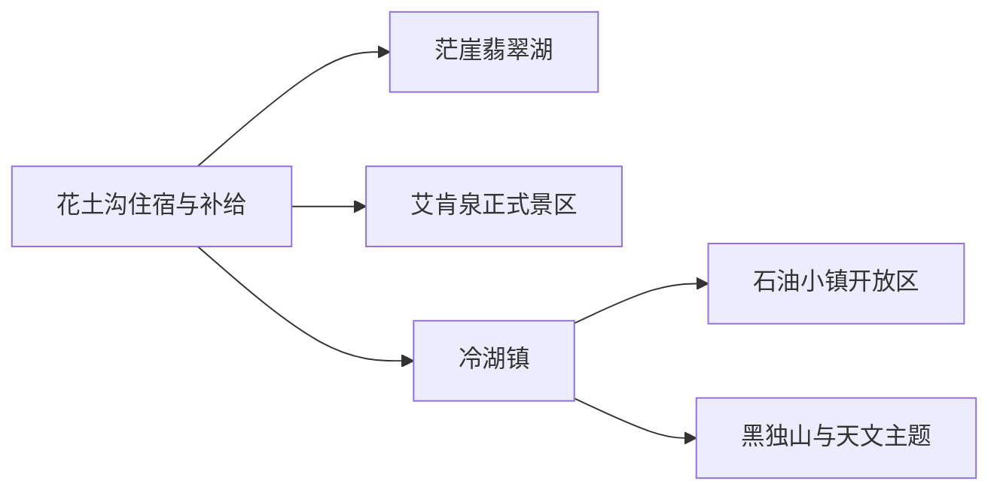
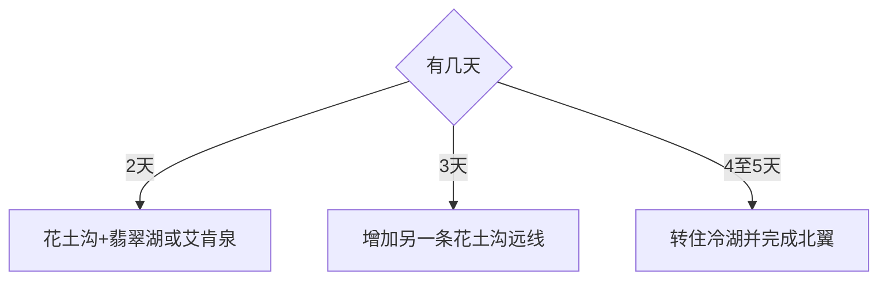

# 茫崖旅行指南

茫崖位于柴达木盆地西缘，花土沟承担住宿、补给与航空门户，冷湖承接石油工业遗址、天文科普和黑独山方向，翡翠湖、艾肯泉等盐湖泉华景观又分处长距离荒漠道路。先选一个住宿基地，再为每条远线配置合规车辆、通信和返程余量，体验会比追逐零散坐标稳定得多。

## 城市速览

| 项目 | 信息 |
|---|---|
| 旅行主线 | 花土沟补给—翡翠湖—艾肯泉，或冷湖石油小镇—火星地貌—天文科普 |
| 建议停留 | 2 天完成一个基地与一条远线；4–5 天分开花土沟、冷湖两翼 |
| 住宿基地 | 花土沟服务较全；冷湖适合北翼工业遗址与天文主题 |
| 体力与环境 | 景点步行多为低至中等，海拔、风沙、昼夜温差与长车程增加负担 |
| 交通 | 航空、国省道与合规包车为主；基地间和景点间距离长 |
| 核对重点 | 道路、油量、通信、景区入口、天气、自然保护与矿业生产边界 |
| 行程取舍 | 首访在翡翠湖—艾肯泉与冷湖—黑独山两条线中先选一条 |
| 无障碍 | 花土沟公共空间较易安排；盐壳、砂砾、观景坡和远线卫生间连续性需确认 |

## 城市格局与游览区域

| 区域 | 适合内容 | 安排方式 | 边界 |
|---|---|---|---|
| 花土沟 | 住宿、餐饮、补给、城市休息 | 抵达日和远线前后留宿 | 城镇服务不代表周边矿道开放 |
| 翡翠湖方向 | 盐湖色彩、戈壁地貌 | 单独半日至一日 | 使用正式入口、栈道与停车区 |
| 艾肯泉方向 | 泉华地貌、荒漠景观 | 合规车辆整日往返 | 泉眼、湿地与脆弱地表保持管理距离 |
| 冷湖方向 | 石油工业史、天文与火星地貌 | 至少一晚，分项目安排 | 遗址开放区、天文科研区和油田生产区分别管理 |

## 主要景点

| 景点 | 区域 | 类型 | 核心体验 | 用时 | 环境 | 体力 | 研究价值 | 拥挤 | 优先级 |
|---|---|---|---|---:|---|---|---|---|---|
| 茫崖翡翠湖 | 花土沟方向 | 盐湖景区 | 盐池色彩、戈壁与远山构图 | 3–5 小时 | 室外 | 低至中 | 高 | 中高 | A |
| 艾肯泉景区 | 花土沟远线 | 泉华地貌 | 正式观景设施观察矿物色彩与泉眼 | 5–8 小时含往返 | 室外 | 中 | 高 | 中 | A |
| 冷湖石油小镇开放区 | 冷湖 | 工业遗址 | 石油城市兴衰与遗存建筑 | 2–4 小时 | 室外 | 中 | 高 | 中 | A |
| 黑独山正式游览区 | 冷湖方向 | 荒漠地貌 | 深色山体、光影与尺度感 | 3–6 小时 | 室外 | 中 | 中高 | 中高 | B |
| 冷湖天文与火星主题接待项目 | 冷湖 | 科普研学 | 暗夜、天文与类火星环境 | 半日至一晚 | 混合 | 中 | 高 | 中 | B |
| 花土沟城市公共空间 | 花土沟 | 城市休息 | 补给、适应与地方生活 | 1–2 小时 | 混合 | 低 | 中 | 低 | C |

翡翠湖内部盐池与观景节点按一个运营景区计算；冷湖石油小镇的建筑群按一个遗址单元理解。盐湖生产池、油井、管线、矿道、科研台址、无人区便道和保护地非开放区保持原有用途，只从正式入口进入。

## 美食与餐饮

| 选择 | 适合场景 | 点餐方法 | 注意事项 |
|---|---|---|---|
| 牛羊肉与面食 | 远线前后的正餐 | 小份主食加热菜，先问分量 | 清真餐饮尊重店内习惯；高原与干燥环境补足饮水 |
| 川青家常菜 | 花土沟多人晚餐 | 选一荤一素和汤类 | 询问辣度、盐度与共享锅具 |
| 简餐与路餐 | 长距离远线 | 从正规商店准备水、主食和易保存食品 | 食品包装和垃圾随车带回 |

## 经典行程

### 两日花土沟与翡翠湖
**路线**：花土沟适应 → 翡翠湖 → 城区休息。**逻辑**：把抵达与盐湖放在同一基地。**预约锚点**：景区入口和车辆。**休息**：午后避开强晒并补水。**删除条件**：大风、道路管制或景区关闭时保留城区适应。

### 两日花土沟与艾肯泉
**路线**：花土沟 → 艾肯泉正式入口 → 原路返程。**逻辑**：用完整一天覆盖偏远往返。**预约锚点**：合规车辆、油量和开放公告。**休息**：沿正式服务点分段。**删除条件**：通信、天气或返程余量不足时删除整线。

### 三日花土沟双线
**路线**：适应日 → 翡翠湖 → 艾肯泉。**逻辑**：两处各占一天，避免戈壁夜路。**预约锚点**：两景区与连续用车。**休息**：第二日晚早睡。**删除条件**：体力下降时保留翡翠湖。

### 四日花土沟与冷湖
**路线**：花土沟 → 翡翠湖 → 转住冷湖 → 石油小镇。**逻辑**：换住宿消除重复长途。**预约锚点**：基地间车辆和冷湖住宿。**休息**：转场日只加轻量项目。**删除条件**：住宿或道路不稳时留在花土沟。

### 冷湖地貌与星空线
**路线**：冷湖 → 黑独山正式游览区 → 暗夜接待项目。**逻辑**：日间地貌与夜间科普互补。**预约锚点**：准入、向导与返程。**休息**：日落前完成地貌段。**删除条件**：风沙、云量或运营取消时删除夜间段。

### 亲子科普线
**路线**：花土沟公共空间 → 翡翠湖栈道短段 → 冷湖合规研学项目。**逻辑**：用可解释的盐湖、能源与天文主题串联。**预约锚点**：年龄、卫生间和研学接待。**休息**：每小时回到车内。**删除条件**：儿童不适或风沙增强时缩短户外。

### 低体力替代线
**路线**：花土沟休息 → 翡翠湖近入口观景 → 城区晚餐。**逻辑**：减少砂砾步行和长车程。**预约锚点**：落客距离与座椅。**休息**：车内与室内交替。**删除条件**：高原不适持续时改为休息和就医评估。

## 住宿区域

| 区域 | 优点 | 适合人群 | 核对 |
|---|---|---|---|
| 花土沟中心 | 餐饮、补给、公共服务较集中 | 首访、航空抵离、翡翠湖与艾肯泉 | 供暖、热水、停车、取消政策 |
| 冷湖镇 | 接近北翼工业与天文主题 | 连住两晚、摄影和研学 | 夜间接待、供暖、餐饮时段、通信 |

## 市内交通

茫崖的“市内”更接近广域公路旅行。先锁定花土沟或冷湖住宿，再按当天唯一远线配置合规车辆；纸质或离线地图、满油状态、饮水、保暖层和紧急联系人随车准备。机场、道路客运和包车信息以当期官方与运营方为准。

## 不同旅行者须知

| 旅行者 | 怎么安排 |
|---|---|
| 独行者 | 选择有资质的完整往返产品，把集合、解散和失联处置写进订单 |
| 自驾者 | 在城镇完成油料、轮胎、备胎与通信检查，沿公开道路和景区路线行驶 |
| 摄影者 | 使用正式观景台和停车点，日落前预留返程，不以航拍替代准入核对 |
| 亲子与长者 | 以翡翠湖短线为主，冷湖远线按体力与医疗可达性取舍 |

## 行前核对

- 向景区与茫崖市政府核对翡翠湖、艾肯泉、冷湖项目的入口、开放和车辆规则。
- 向气象与交通部门核对大风、沙尘、降雪、道路施工和夜间通行。
- 盐湖、泉华、荒漠、矿区和天文科研空间分别服从生态、生产和科研管理边界。
- 身体出现持续或加重的不适时停止远线活动，联系当地医疗机构评估。

## 来源与更新记录

| 来源 | 支持内容 | 核验日期 |
|---|---|---|
| [人民日报海外版：茫崖文旅发展](https://paper.people.com.cn/rmrbhwb/pc/attachement/202602/04/09bf2736-03f9-4943-acf3-2116fe90fb5c.pdf) | 花土沟、冷湖、翡翠湖、艾肯泉与文旅布局 | 2026-09-01 |
| [民政部行政区划代码查询](https://dmfw.mca.gov.cn/xzqh/getList?code=63&trimCode=true&maxLevel=3) | 茫崖市法定代码与层级 | 2026-09-01 |
| [GeoNames 1281003](https://www.geonames.org/1281003/) | 花土沟固定居民点 | 2026-09-01 |
| [Wikidata Q1201941](https://www.wikidata.org/wiki/Q1201941) | 茫崖法定实体与旧行政记录关系 | 2026-09-01 |

| 日期 | 更新 |
|---|---|
| 2026-09-01 | 首次完成茫崖旅行研究；建立花土沟、翡翠湖、艾肯泉与冷湖双翼路线 |
