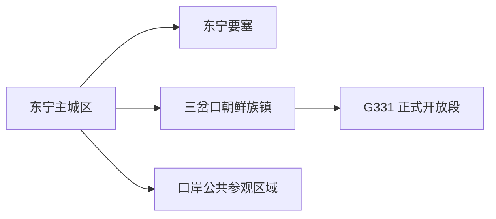
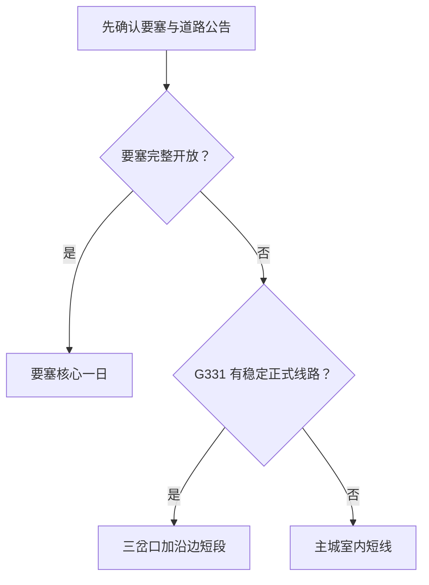

# 东宁旅行指南

东宁位于中俄边境，适合从主城出发认识东宁要塞历史、三岔口朝鲜族乡村与 G331 边境公路景观。首访可住主城区，把要塞单独留出半日至一日；沿边路线以正式开放、道路和边境管理信息为前提。

## 城市速览

| 项目 | 信息 |
|---|---|
| 旅行主线 | 东宁主城、东宁要塞、三岔口朝鲜族镇、G331 正式开放段 |
| 建议停留 | 1 天主城与要塞；2 天加入三岔口或一段沿边公路 |
| 住宿基地 | 主城区适合补给和改线；沿线住宿用于接待与返程已确认的路线 |
| 步行强度 | 主城低；要塞中等并涉及台阶、洞体与坡地；远郊按项目变化 |
| 主要天气 | 严寒、暴雪、结冰、浓雾、强降雨和山地道路中断 |
| 预约核心 | 要塞开放与讲解、远郊车辆、边境路段、返程和住宿 |
| 边界重点 | 口岸查验区、国界设施、军事遗址封闭区和生产空间按管理要求使用 |
| 标识说明 | 固定 GeoNames 点是东宁主城；法定市域按行政代码 `231086` 理解 |

## 城市格局与游览区域

东宁市是牡丹江市代管的县级市。GeoNames `2037611` 用于固定东宁城市点，Wikidata `Q1241426` 的 `P1566` 指向相邻行政记录 `2037610`；页面定位使用前者，行政边界和旅行管理以东宁市法定区划及属地公告为准。

| 区域 | 旅行价值 | 怎么安排 |
|---|---|---|
| 东宁主城区 | 到达、住宿、补给、公共文化和边境城市生活 | 抵达日或半日 |
| 东宁要塞方向 | 二战遗址、纪念教育与山地环境 | 单独半日至一日，优先预约讲解 |
| 三岔口方向 | 朝鲜族乡村、饮食和边境公路节点 | 接待和车辆明确时安排半日至一日 |
| G331 沿边方向 | 山地、村落与边境公路景观 | 使用正式道路、观景点和运营线路分段游览 |

## 主要景点

| 景点 | 所在区域 | 类型 | 核心看点 | 建议用时 | 室内/室外 | 体力 | 预约难度 | 天气敏感度 | 适合旅程 |
|---|---|---|---|---|---|---|---|---|---|
| 东宁公共文化场馆 | 主城区 | 地方文化 | 边境城市历史、民族生活与当期展陈 | 1–2 小时 | 室内 | 低 | 中 | 低 | B |
| 东宁要塞景区 | 要塞方向 | 战争遗址 | 地下工事、遗址环境与和平教育 | 3–5 小时 | 混合 | 中至高 | 高 | 高 | A |
| 三岔口朝鲜族镇公开接待区 | 三岔口 | 民族文化与乡村 | 村落生活、饮食和边境地区文化 | 2–4 小时 | 混合 | 低至中 | 高 | 高 | B |
| G331 正式开放观景点 | 沿边公路 | 公路与山地景观 | 边境地形、森林和村落尺度 | 2–5 小时 | 室外 | 中 | 高 | 极高 | B |
| 口岸对外开放参观区域 | 主城边境方向 | 口岸与边贸 | 边境城市功能与当期公开展示 | 1–2 小时 | 混合 | 低 | 高 | 中 | C |

口岸旅检和货运生产区按查验秩序运行。国界设施、边防道路、军事遗址封闭洞体及施工区域保留其安全功能；摄影、无人机和证件规则以现场管理为准。

## 美食与餐饮

| 类型 | 适合场景 | 份量 | 过敏与饮食提示 | 怎么选 |
|---|---|---|---|---|
| 朝鲜族冷面、拌菜与烤肉 | 主城或三岔口正餐 | 单人至共享 | 荞麦、小麦、芝麻、花生和辣椒 | 逐项询问汤底、酱料和共用烤盘 |
| 东北炖菜 | 主城多人餐 | 通常较大 | 肉类、豆制品、菌菇和高盐 | 先问份量与锅底，按人数点单 |
| 黑木耳等食用菌 | 正餐或伴手礼 | 易拆分 | 菌菇过敏、干货储存 | 选择正规经营者并查看产地信息 |
| 边境地区俄式风味食品 | 咖啡、简餐或伴手礼 | 多为小份 | 奶、蛋、坚果和酒精 | 以中文标签和正规进口信息为准 |

## 经典行程

### 一日经典路线

**路线**：东宁主城 → 东宁要塞景区 → 返回主城用餐

- **串联逻辑**：用一处核心遗址建立东宁的边境历史认识。
- **预约锚点**：要塞开放、讲解、交通和最晚返程。
- **休息安排**：景区服务区长休，洞体参观后留恢复时间。
- **时间不足时**：保留要塞核心开放线。

### 两日城市路线

**第 1 天**：东宁要塞 
**第 2 天**：主城公共文化 → 三岔口正式接待区

- **串联逻辑**：战争史与当代边境生活分日理解。
- **预约锚点**：第二日接待、用餐、车辆和返程。
- **休息安排**：午餐作为长休，不继续叠加沿边远点。
- **时间不足时**：删除三岔口。

### 三日深度路线

**第 1 天**：主城与要塞 
**第 2 天**：三岔口 
**第 3 天**：G331 一段正式开放线路

- **串联逻辑**：每天只走一个远郊方向，给道路和边境规则留调整空间。
- **预约锚点**：车辆、路况、观景点、边境管理和返程。
- **休息安排**：第三日只使用明确运营的服务点补给。
- **时间不足时**：优先删除第三日。

### 雨雪天气路线

**路线**：主城室内场馆 → 午餐 → 住宿休息或近距离公开展示

- **适用条件**：城市道路正常；暴雪、冻雨、强降雨和大雾按预警调整。
- **预约锚点**：场馆和交通运行。
- **休息安排**：室内为主，减少洞体、坡地和公路移动。
- **时间不足时**：只留一座场馆。

### 亲子路线

**路线**：主城场馆 → 午餐 → 要塞适龄讲解短线

- **适用条件**：洞体开放线、照明和儿童年龄条件明确。
- **预约锚点**：亲子讲解、护具、卫生间与车辆。
- **休息安排**：每段地下或坡地参观后回服务区休息。
- **时间不足时**：保留主城场馆。

### 低体力路线

**路线**：车辆抵达主城场馆 → 午餐长休 → 要塞入口附近公开展示

- **适用条件**：落客、台阶替代线和座椅条件已确认。
- **预约锚点**：无障碍入口、轮椅、卫生间与陪同。
- **休息安排**：选择地面核心展示，按体力决定洞体段。
- **时间不足时**：只留主城场馆。

### G331 边境公路路线

**路线**：东宁出发 → 三岔口服务点 → 正式开放观景段 → 原路返回

- **适用条件**：道路、天气、边境管理、补给和返程均已确认。
- **预约锚点**：车辆、开放路段、摄影规则和最晚返程。
- **休息安排**：在经营明确的接待点用餐和如厕。
- **时间不足时**：缩为三岔口单点或改走主城。

## 住宿区域

| 区域 | 优点 | 取舍 | 适合人群 | 核对项 |
|---|---|---|---|---|
| 东宁主城区 | 餐饮、补给、叫车和改线方便 | 去要塞与沿边路段仍需车辆 | 首访、独行、多日旅行 | 供暖、电梯、停车、早餐和夜间入住 |
| 三岔口等正规乡村住宿 | 靠近乡村与沿边路线 | 服务密度、通信和退改差异大 | 自驾、摄影、慢游者 | 合法经营、消防、餐食、边境规则与返程 |

## 市内交通

东宁以公路交通为主，跨城路线可从牡丹江、绥芬河等方向衔接。主城用公交、出租车和短段步行；要塞、三岔口及 G331 更依赖自驾、正规包车或当期旅游线路。地图时间需结合降雪、施工、边境管理和山区通信重新判断。

| 场景 | 怎么做 | 行前核对 |
|---|---|---|
| 跨城抵达 | 使用正规客运、自驾或已确认车辆进入主城 | 发到站、末班、道路和夜间接驳 |
| 主城移动 | 公交与短程车辆连接住宿、餐饮和场馆 | 首末班、积雪、施工 |
| 要塞与 G331 | 每天只选一个远郊方向 | 开放、边境规则、加油、通信与返程 |

## 不同旅行者须知

| 旅行者 | 推荐做法 | 重点核对 |
|---|---|---|
| 独行 | 住主城，远线参加正规线路或可靠包车 | 司机资质、返程、通信与夜间入住 |
| 亲子 | 主城场馆加要塞适龄短线 | 洞体照明、台阶、护栏与卫生间 |
| 长者与低体力 | 车辆串联，优先地面展示与落客点附近内容 | 坡度、轮椅、座椅和医疗点 |
| 摄影 | 要塞与沿边公路分日，使用公共拍摄位 | 文保、国界、无人机与三脚架规则 |
| 冬季旅行 | 住主城并预留机动日 | 暴雪、风吹雪、暗冰、供暖和道路封闭 |

## 行前核对

- 东宁市政府与文旅部门：要塞、乡村线路、活动和接待动态。
- 交通、交警与 G331 属地管理单位：施工、冰雪路况和临时管制。
- 黑龙江省气象：暴雪、寒潮、大雾、强降雨和山地风险。
- 国家移民管理局及属地边境管理部门：口岸、证件、摄影和边境通行规则。

## 来源与更新记录

| 来源 | 支持内容 | 核验日期 |
|---|---|---|
| [东宁市人民政府：印象东宁](https://www.dongning.gov.cn/mdjdnsrmzf/c102667/yxdn.shtml) | 市情、边境位置与旅行概览 | 2026-08-30 |
| [东宁市人民政府：2026 年文旅动态](https://www.dongning.gov.cn/mdjdnsrmzf/c102674/202602/c03_1036612.shtml) | 当前文旅项目与城市旅行线索 | 2026-08-30 |
| [东宁市人民政府：东宁要塞恢复开放](https://www.dongning.gov.cn/mdjdnsrmzf/c102676/202602/c03_1037458.shtml) | 要塞开放与参观动态 | 2026-08-30 |
| [东宁市人民政府：三岔口](https://www.dongning.gov.cn/mdjdnsrmzf/c102670/202505/c03_1006690.shtml) | 朝鲜族镇与乡村旅行内容 | 2026-08-30 |
| [东宁市人民政府：G331](https://www.dongning.gov.cn/mdjdnsrmzf/c102673/202408/c03_968102.shtml) | 边境公路与沿线文旅线索 | 2026-08-30 |
| [Wikidata Q1241426](https://www.wikidata.org/wiki/Q1241426) | 法定东宁市与 GeoNames 标识关系 | 2026-08-30 |
| [GeoNames 2037611](https://www.geonames.org/2037611/) | 固定清单东宁城市点 | 2026-08-30 |

| 日期 | 更新 |
|---|---|
| 2026-08-30 | 首次完成东宁要塞、三岔口、G331 沿边公路与边境旅行研究。 |
