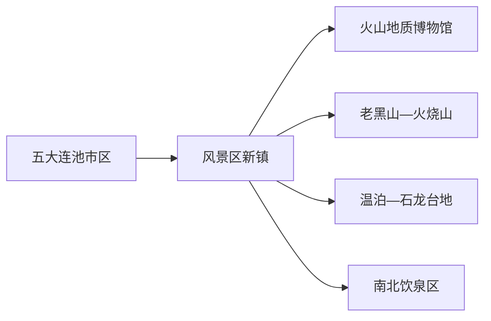
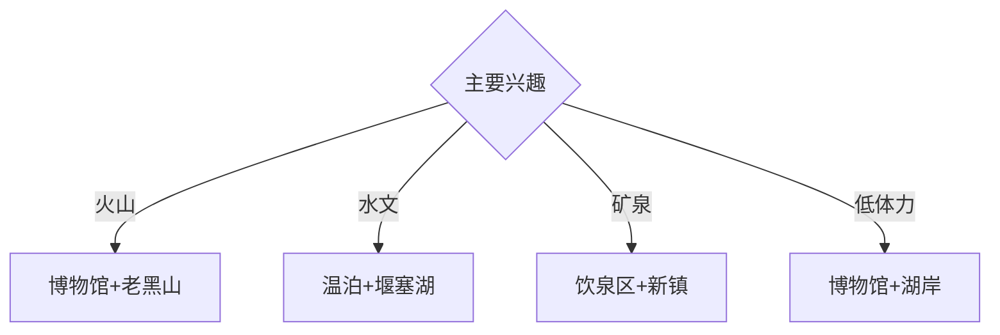

# 五大连池旅行指南

五大连池市的行政城区与五大连池风景名胜区是两个不同住宿和交通节点，火山锥、熔岩台地、堰塞湖与冷矿泉构成核心体验。固定快照中的 **Wudalianchi / GeoNames 2034137** 对应现行五大连池市；首访适合住景区两晚，再按抵离时间补城区。

## 城市速览

| 项目 | 信息 |
|---|---|
| 主线 | 火山地质博物馆—新期火山—温泊—矿泉 |
| 停留 | 景区2天；城区或人文主题另加1天 |
| 住宿 | 风景区新镇便于火山与矿泉；市区便于行政城区与铁路公路换乘 |
| 交通 | 飞机、公路与区域铁路接驳；景点间用景区车、约车或自驾 |
| 风险 | 火山地貌保护、林火、雷雨、低温、矿泉饮用适应性 |

## 城市格局与游览区域

五大连池市区位于风景区以东，二者通常需要车辆转换。新镇集中住宿、地质博物馆和矿泉服务，老黑山、温泊、堰塞湖等景点分散在保护地内；每日根据景区交通与开放组合两至三个单元。

## 主要景点

| 景点 | 区域 | 类型 | 核心体验 | 用时 | 环境 | 体力 | 研究价值 | 拥挤 | 优先级 |
|---|---|---|---|---:|---|---|---|---|---|
| 五大连池火山地质博物馆 | 新镇 | 博物馆 | 火山喷发、熔岩、矿泉与地质导读 | 2–3小时 | 室内 | 低 | 很高 | 团体时中 | A |
| 老黑山开放游线 | 新期火山区 | 火山地貌 | 火山锥、熔岩流与高点俯瞰 | 半天至1天 | 室外 | 高 | 很高 | 旺季高 | A |
| 火烧山及新期熔岩公开区 | 新期火山区 | 火山地貌 | 喷发遗迹、熔岩台地与植被演替 | 半天 | 室外 | 中高 | 很高 | 旺季中 | A |
| 温泊景区 | 石龙台地方向 | 湿地与火山 | 火山石龙、自涌泉与水体景观 | 2–3小时 | 室外 | 中 | 很高 | 旺季中高 | A |
| 五大连池堰塞湖公开观景点 | 湖区 | 湖泊 | 串珠湖泊、火山水文与日落 | 2–3小时 | 室外 | 低中 | 高 | 傍晚中 | A |
| 南北饮泉正式取水区 | 新镇 | 矿泉文化 | 冷矿泉、地方生活与非遗 | 1–2小时 | 混合 | 低 | 高 | 旺季高 | B |
| 五大连池市博物馆 | 市区 | 博物馆 | 地方史、抗联记忆与城市文化 | 2小时 | 室内 | 低 | 高 | 团体时中 | B |

## 美食与餐饮

矿泉豆腐、矿泉鱼、东北炖菜和火山农产品具有地方特色。矿泉饮用按景区提示少量尝试，慢性病、儿童、孕妇或肠胃敏感者先咨询专业意见；食材与饮用水选择正规经营点。

## 经典行程

### 一日地质基础线
**路线**：火山地质博物馆—午餐—温泊—堰塞湖公开观景点。**逻辑**：先理解喷发，再看熔岩水文。**预约锚点**：三处开放和景区交通。**休息**：新镇。**删除条件**：强对流时保留博物馆并缩短室外段。

### 新期火山线
**路线**：新镇—老黑山入口—开放登山线—火烧山公开区—返宿。**逻辑**：完整一天观察近期火山地貌。**预约锚点**：门票、景交和末班。**休息**：游客服务点。**删除条件**：雷雨、林火、强风或结冰时取消登山。

### 温泊水文线
**路线**：温泊—石龙台地公开栈道—湖区观景—返新镇。**逻辑**：串联熔岩、泉水与堰塞湖。**预约锚点**：栈道、接驳和返程。**休息**：温泊服务区。**删除条件**：积水、维护或低温结冰时缩短栈道。

### 矿泉文化线
**路线**：地质博物馆—南北饮泉正式区域—矿泉饮食—新镇慢行。**逻辑**：从科学背景进入地方矿泉生活。**预约锚点**：取水区开放和健康提示。**休息**：新镇。**删除条件**：身体不适时停止饮用并保留展陈。

### 城市人文线
**路线**：风景区新镇—五大连池市区—市博物馆—城市公共空间—返程。**逻辑**：补足火山之外的地方史。**预约锚点**：市博物馆开放和城际交通。**休息**：市区。**删除条件**：往返班次不合适时留在景区。

### 亲子科普线
**路线**：火山地质博物馆—午休—温泊近入口栈道—湖岸观景。**逻辑**：室内知识配低强度地貌观察。**预约锚点**：亲子讲解和景交。**休息**：馆内与新镇。**删除条件**：儿童体力不足时取消湖岸延伸。

### 雨雪天气线
**路线**：火山地质博物馆—室内矿泉文化展陈—正规餐饮—新镇休整。**逻辑**：用室内空间保留地质主题。**预约锚点**：馆舍开放。**休息**：新镇。**删除条件**：暴雪封路时留在住宿地。

## 住宿区域

风景区新镇适合火山、温泊和矿泉线路；五大连池市区适合地方史与区域换乘。旺季住宿提前核对位置、景区接驳、供暖或空调、消防和取消政策。

## 市内交通

外部抵离可组合航空、铁路与公路，最终一段通常需要车辆。风景区内按当期景交、自驾管控和停车规则移动；市区与景区之间提前核对班次或约车，避免把两地视为连续步行城区。

## 不同旅行者须知

地质旅行者至少留两天；亲子家庭优先博物馆、温泊和湖岸；摄影者按光线选择火山与湖区公开点；行动不便者确认景交、火山台阶、栈道坡度和无障碍卫生间。

## 行前核对

- 核对老黑山、火烧山、温泊、湖区、博物馆与景交开放。
- 核对林火、雷雨、冰雪、蚊虫、矿泉饮用提示和市区返程。
- 火山地质遗迹、熔岩台地、泉眼、保护区核心区和森林管护区沿正式步道进入。

## 来源与更新记录

| 来源 | 支持内容 | 核验日期 |
|---|---|---|
| [五大连池风景区管委会：景区概况](https://wdlcgwh.heihe.gov.cn/wdlcfjq/c100752/201801/c11_58024.shtml) | 火山群、熔岩、堰塞湖、矿泉与保护属性 | 2026-09-01 |
| [黑河市政府：自然景观](https://www.heihe.gov.cn/hhs/c102673/tt.shtml) | 温泊、药泉湖与火山地质博物馆 | 2026-09-01 |
| [GeoNames 2034137](https://www.geonames.org/2034137/) | Wudalianchi 固定人口点与位置 | 2026-09-01 |

| 日期 | 更新 |
|---|---|
| 2026-09-01 | 首次完成五大连池旅行研究；建立火山、水文、矿泉与城市人文路线。 |
