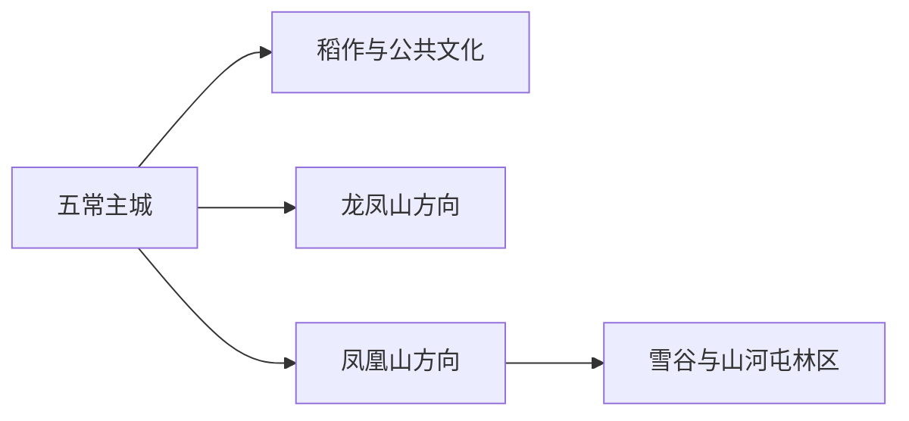
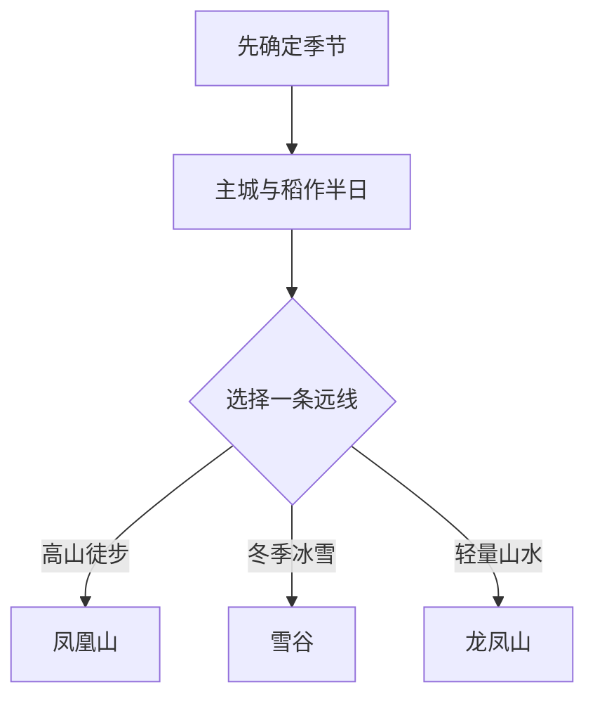

# 五常旅行指南

五常的旅行有两条清晰主线：主城与稻作文化适合用半日至一日认识，东南山地则在凤凰山、雪谷和龙凤山之间择一安排。山地距离远、季节差异大，最省力的做法是先锁定一个正式运营目的地，再决定是否在景区附近住一晚；稻田、粮库和加工厂则选择公布的研学或接待项目进入。

> 建议停留：1–3 天 
> 旅行关键词：凤凰山、雪谷、龙凤山、五常大米、林海、冰雪 
> 主要体力：主城低；山地与雪地中至高 
> 最近研究：2026-08-13

## 城市速览

| 项目 | 旅行信息 |
|---|---|
| 主要旅行价值 | 在稻作城市和张广才岭山地之间选择，兼顾东北农业、森林与冰雪 |
| 建议停留 | 1 天主城与稻作；2 天增加一条山线；3 天可在景区附近放慢节奏 |
| 较舒适季节 | 夏秋适合山林与稻作观察；冬季适合正式冰雪产品，春季融雪期路况变化大 |
| 预算特点 | 主城中等；山地门票、景交、住宿与车辆是主要增量 |
| 步行强度 | 主城低；凤凰山、雪谷与冬季雪地为中至高 |
| 主要天气风险 | 暴雪、严寒、道路结冰、山洪、雷电、大风与森林火险 |
| 独行旅行 | 主城易安排；山线优先正规接驳、景区住宿或成熟产品 |
| 亲子旅行 | 稻作科普与正式雪地项目较合适，山地按年龄体力减量 |
| 长者与低体力旅行 | 主城、稻作展陈和车辆可达观景点更轻松 |
| 无障碍信息 | 主城新设施可咨询；山地、雪地和乡村设施连续性需向官方确认 |

## 城市格局与游览区域

五常是哈尔滨市代管的县级市，法定代码 `230184`。固定 GeoNames `2034141` 对应五常主城点，并与旧五常镇地点实体关联；法定城市采用 Wikidata `Q769855`，其 `P1566=2034140` 指向另一行政记录。页面以固定点承接人口窗口，以法定代码确定市域边界。

| 区域 | 主要内容 | 怎么安排 | 与其他区域的关系 |
|---|---|---|---|
| 五常主城 | 公共文化、餐饮、住宿与稻作主题 | 抵达日或半日 | 多日山地旅行的交通基地 |
| 龙凤山方向 | 水库、山林与正式游览区 | 半日至一日 | 距主城较近，适合作轻远线 |
| 凤凰山方向 | 高山森林、瀑布峡谷与季节景观 | 一日至两日 | 体力和车程最高，宜单独安排 |
| 山河屯—雪谷方向 | 林区、村落与正式冰雪产品 | 一日至两日 | 冬季运营、道路与返程决定计划 |
| 稻田与粮食生产空间 | 水田、粮库、加工与品牌展示 | 参加公布的研学或接待项目 | 农忙、机械、仓储和食品安全按生产管理 |

## 主要景点

### 主城、稻作与近郊

| 景点 | 区域 | 类型 | 主要看点 | 建议用时 | 室内外 | 体力 | 预约风险 | 天气影响 | 优先级 |
|---|---|---|---|---:|---|---|---|---|---|
| 五常市公共文化场馆 | 主城 | 文博与文化 | 地方历史、稻作、民俗与当期展览 | 1–2 小时 | 室内 | 低 | 中 | 低 | B |
| 五常大米文化正式展示点 | 主城或园区 | 农业科普 | 品种、种植、加工与品牌识别 | 1–3 小时 | 室内为主 | 低 | 很高 | 低 | A |
| 龙凤山风景名胜区正式开放区 | 龙凤山方向 | 湖库与山林 | 水库、山林和季节景观 | 半日至一日 | 室外 | 中 | 高 | 很高 | B |
| 拉林古城与当期开放遗存 | 拉林方向 | 历史文化 | 拉林地区历史、民族与城镇格局 | 2–4 小时 | 混合 | 中 | 很高 | 中 | C |
| 主城滨水与公共绿地 | 主城 | 城市公园 | 日常生活、休息和短步行 | 1–2 小时 | 室外 | 低 | 低 | 中 | C |

### 凤凰山、雪谷与林海

| 景点 | 区域 | 类型 | 主要看点 | 建议用时 | 室内外 | 体力 | 预约风险 | 天气影响 | 优先级 |
|---|---|---|---|---:|---|---|---|---|---|
| 凤凰山国家森林公园完整景区 | 凤凰山方向 | 高山森林 | 森林、峡谷、瀑布与高山季节景观 | 1–2 天 | 室外 | 高 | 高 | 很高 | A |
| 凤凰山大峡谷开放游线 | 凤凰山内 | 峡谷步道 | 溪流、瀑布与森林步道 | 4–6 小时 | 室外 | 高 | 高 | 很高 | 路线节点 |
| 凤凰山空中花园开放游线 | 凤凰山内 | 高山景观 | 高海拔植被、云海与季节花景 | 4–6 小时 | 室外 | 高 | 高 | 很高 | 路线节点 |
| 中国雪谷正式运营区 | 山河屯方向 | 冰雪与乡村 | 雪乡生活、雪地活动和林区冬景 | 1–2 天 | 室外为主 | 中至高 | 很高 | 很高 | A |
| 山河屯林业局公布的生态体验点 | 东南林区 | 林业与自然 | 林业历史、森林教育与正式步道 | 半日至一日 | 混合 | 中 | 很高 | 高 | C |

凤凰山按一个完整父景区记录，大峡谷和空中花园用于选择内部游线。雪谷的营业期、车辆和活动以当季公告为准；例如黑龙江省文旅厅曾公布 2026 年 3 月初结束当季冰雪运营，之后的夏秋产品要重新核对。

## 美食与餐饮

| 菜品或餐饮类型 | 常见区域 | 一个人用餐与常见份量 | 风味、过敏原与饮食限制 | 排队风险与替代方法 |
|---|---|---|---|---|
| 五常大米饭与东北家常菜 | 主城 | 合餐为主，一人问小份 | 菜品常含猪肉、大豆酱油和葱蒜 | 搭配一荤一素，热门店满位时选居民商圈 |
| 铁锅炖 | 主城、景区镇 | 多人共享 | 常含鱼、禽肉、豆制品、玉米饼或小麦面食 | 独行先问最小锅与等候时间 |
| 粘豆包与东北面点 | 早餐店、农家餐饮 | 小份容易尝试 | 糯米或黏玉米制品，馅料可能含豆、糖、坚果 | 购买即食小份并确认保存 |
| 山野菜与菌类菜 | 林区正规餐馆 | 适合共享 | 只选餐饮单位供应的可食用品种 | 野采季不自行辨认和采食 |
| 大米及加工产品 | 正规商超和品牌门店 | 适合小包装购买 | 查看地理标志、执行标准、生产日期和储存条件 | 比较标签，不凭散装口述判断产地 |

## 经典行程

### 一日经典路线

**路线**：五常主城 → 公共文化场馆 → 午餐 → 正式稻作展示点 → 城市绿地短步行

- **串联逻辑**：先认识城市与农业，再用轻步行结束抵达日。
- **预约锚点**：文化场馆与稻作展示点。
- **休息安排**：主城午餐和室内场馆。
- **时间不足时**：保留稻作展示与主城午餐。

### 两日城市路线

**第 1 天**：主城与稻作。 
**第 2 天**：龙凤山正式开放区 → 服务点午餐 → 返回主城。

- **串联逻辑**：第一天低体力，第二天用一条近郊山水线补自然体验。
- **预约锚点**：龙凤山开放、车辆和停车。
- **休息安排**：景区服务点和主城住宿。
- **时间不足时**：第二天缩短为车辆可达观景段。

### 三日深度路线

**第 1 天**：主城与稻作。 
**第 2 天**：凤凰山或雪谷完整日。 
**第 3 天**：继续同一景区的另一条正式游线，或返主城休整。

- **串联逻辑**：山地目的地车程长，连续住一个方向比跨景区更稳妥。
- **预约锚点**：住宿、门票、景交、雪地活动与返程。
- **休息安排**：使用景区游客中心和已预订住宿。
- **时间不足时**：改为主城加龙凤山两日。

### 雨雪天路线

**路线**：主城文化场馆 → 室内午餐 → 大米展示或正规商场

- **适用条件**：主城交通正常；暴雪和冻雨升级时在住宿附近活动。
- **预约锚点**：场馆营业与交通公告。
- **休息安排**：全程以室内和短程车为主。
- **时间不足时**：只保留一座场馆。

### 亲子或低体力路线

**亲子路线**：稻作展示 → 午餐 → 适龄农业或雪地体验。 
**低体力路线**：车辆到文化场馆 → 午休 → 城市绿地短段。

- **减负方式**：亲子线按年龄选活动；低体力线把山地改为主城或龙凤山车辆可达段。
- **预约锚点**：年龄、装备、卫生间、座椅与落客点。
- **休息安排**：主城餐饮和室内场馆。
- **时间不足时**：两类路线都保留稻作展示。

### 远郊一日路线

**路线**：主城 → 凤凰山、雪谷或龙凤山三选一 → 正式服务点午餐 → 返回或景区住宿

- **适用条件**：运营、天气、道路、体力和返程已确认。
- **预约锚点**：景区、景交、住宿、车辆与森林火险。
- **休息安排**：游客中心和正式餐饮点。
- **时间不足时**：整段改为主城—稻作线。

## 住宿区域

| 区域 | 优点 | 缺点 | 适合人群 | 交通特点 |
|---|---|---|---|---|
| 五常主城 | 餐饮、采购与交通选择多 | 距凤凰山和雪谷较远 | 首访、独行、只做一条远线者 | 适合作往返基地 |
| 凤凰山景区周边正式住宿 | 方便连续走景区游线 | 营业季、餐饮和通信条件需核对 | 徒步、摄影和早出发者 | 提前锁定接驳与返程 |
| 雪谷正式住宿 | 靠近冬季活动 | 冬季价格、供暖与退改波动大 | 冰雪主题旅行 | 只选有资质经营者 |
| 龙凤山方向住宿 | 适合轻度假 | 到主城服务较远 | 自驾和慢节奏 | 核对道路、停车和营业期 |

## 市内交通

| 场景 | 建议与取舍 | 行前需要重查的内容 |
|---|---|---|
| 铁路或公路抵达 | 先到五常主城，再衔接景区车辆 | 车次、客运站、末班和上客点 |
| 主城移动 | 公交、出租和网约车覆盖日常点位 | 线路、夜间供给和冬季路况 |
| 凤凰山与雪谷 | 正规班线、景区接驳、自驾或包车，预留长车程 | 运营季、集合点、返程和道路管制 |
| 农业研学 | 按主办方集合进入展示田、工厂或仓储区 | 农忙、机械、食品卫生、摄影和保险 |

## 不同旅行者须知

| 旅行维度 | 可行条件 | 主要取舍 | 需额外核对 |
|---|---|---|---|
| 独行旅行 | 主城与成熟景区可独立安排 | 远线接驳和住宿成本较高 | 返程、通信和夜间上客点 |
| 亲子旅行 | 稻作科普和正式雪地项目 | 长车程、严寒和山路消耗体力 | 年龄、装备、救援与卫生间 |
| 长者或低体力旅行 | 主城与车辆可达观景点 | 高山步道和雪地连续性差 | 落客点、座椅、坡度和景交 |
| 无障碍需求 | 主城现代设施可提前咨询 | 山地、乡村和雪地连续通行有限 | 设施连续性需向官方确认 |
| 摄影旅行 | 稻田公共观景与正式景区适合 | 林区、无人机和农忙作业受管理 | 航拍、商业拍摄和日出返程 |
| 食品与农业兴趣 | 正规展示和商超便于了解产品 | 田块、粮库和加工线有生产边界 | 接待、消毒、摄影和购买标签 |

## 行前核对

| 核对事项 | 为什么需要重查 | 建议核对时间 | 官方入口 |
|---|---|---|---|
| 凤凰山与雪谷 | 运营季、内部游线和交通会调整 | 订房前及出发前三日 | [黑龙江省文化和旅游厅](https://wlt.hlj.gov.cn/) |
| 森林与火险 | 封山、雷雨和林区管理影响进入 | 出发前三日及当天 | [国家林业和草原局](https://www.forestry.gov.cn/) |
| 铁路和客运 | 班次与末段接驳变化 | 出发前一周及当天 | [中国铁路 12306](https://www.12306.cn/) |
| 天气 | 暴雪、严寒和强降雨影响山线 | 出发前三日及当天 | [黑龙江省气象局](https://hl.cma.gov.cn/) |

## 来源与更新记录

### 主要来源

| 来源 | 类型 | 支持内容 | 核验日期 |
|---|---|---|---|
| [黑龙江省文旅厅：凤凰山与雪谷季节运营](https://wlt.hlj.gov.cn/wlt/c114254/202602/c00_31917799.shtml) | 文旅主管部门 | 2026 冰雪季结束时间与季节核对 | 2026-08-13 |
| [国家林草局：凤凰山森林旅游案例](https://www.forestry.gov.cn/u/cms/www/202605/061108329s2z.pdf) | 国家林业部门 | 凤凰山森林资源、景区和保护背景 | 2026-08-13 |
| [黑龙江省人民政府](https://www.hlj.gov.cn/) | 省政府 | 行政、交通与当期公共信息入口 | 2026-08-13 |
| [GeoNames 2034141](https://www.geonames.org/2034141/) | 开放地名库 | 固定主城点与坐标 | 2026-08-13 |
| [Wikidata Q769855](https://www.wikidata.org/wiki/Q769855) | 开放知识库 | 法定五常市与另一行政 GeoNames 记录 | 2026-08-13 |

### 更新记录

| 日期 | 更新内容 |
|---|---|
| 2026-08-13 | 首次建立五常独立指南；按主城稻作、龙凤山、凤凰山和雪谷组织，并明确林区、农业与粮食生产边界。 |
