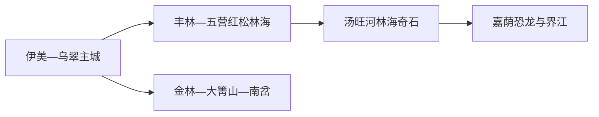
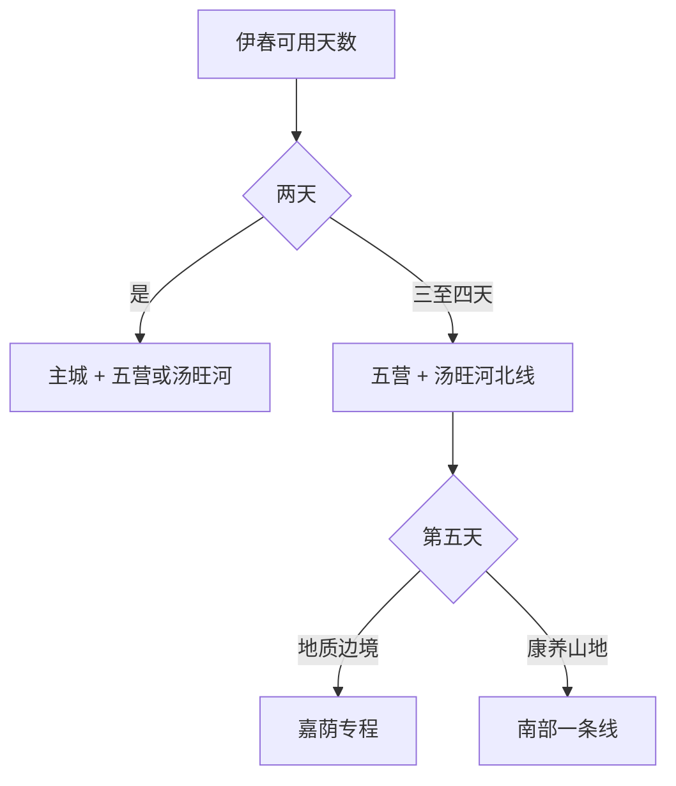

# 伊春旅行指南

伊春沿小兴安岭展开，主城、红松林、花岗岩石林、嘉荫恐龙和南部山地之间距离很长。旅行时先选一个住宿基地，再按“中部主城—北部森林—县域远线”分日；森林景区、林业生产区和自然保护空间各有不同入口与规则。

> 建议停留：3–5 天；只看主城与一条森林线可安排 2 天 
> 旅行关键词：小兴安岭、红松、汤旺河石林、森林康养、冰雪 
> 主要体力：中等至较高；跨县公路与冬季条件显著增负 
> 最近研究：2026-08-13

## 城市速览

| 项目 | 旅行信息 |
|---|---|
| 主要旅行价值 | 在伊美—乌翠认识林都城市，在五营红松林海和汤旺河林海奇石体验小兴安岭森林地质。 |
| 建议停留 | 2 天主城加一个森林景区；3–4 天增加另一条森林线；5 天再选嘉荫或南部方向。 |
| 较舒适季节 | 夏季避暑、秋季五花山、冬季冰雪各有主题；春融和林区防火期需看当期管理。 |
| 预算特点 | 主城可中等预算，跨县车辆、景区门票、特色住宿和冬季装备是主要增量。 |
| 步行强度 | 森林栈道、石林台阶和雪地步行可达中高强度，景点间多依赖车辆。 |
| 主要天气风险 | 严寒、暴雪、道路结冰、大风、强降雨、雷暴、森林火险和野生动物活动。 |
| 独行旅行 | 主城方便，跨县景区优先选择正规接驳、团队或明确返程车辆。 |
| 亲子旅行 | 森林科普、恐龙主题和短步道可选，冬季项目按年龄与装备分级。 |
| 长者与低体力旅行 | 每天一个景区，选择观光车、短环线和服务设施较完整的入口。 |
| 无障碍信息 | 林区景区、观光车、栈道和住宿之间的设施连续性需向官方确认。 |

### 城市身份与边界

伊春是地级市 **230700**。固定 **GeoNames 2033413** 与法定实体 **Wikidata Q349976** 的 `P1566` 精确对应。2019 年区划调整后，现辖伊美、乌翠、友好、金林 4 区，汤旺、丰林、大箐山、南岔、嘉荫 5 县和[铁力市](./铁力市.md)；铁力按独立县级市规划交通、住宿与森林线路。

## 城市格局与游览区域

| 区域 | 主要内容 | 游览特点 | 与其他区域的关系 |
|---|---|---|---|
| 伊美—乌翠主城 | 城市服务、兴安森林公园、公共文化与餐饮 | 住宿交通最集中，适合抵达日 | 作为中部基地，但去北线仍需长距离车辆 |
| 丰林—五营方向 | 五营红松林海、溪水森林等 | 红松森林与康养主题，景区开放独立 | 适合住一晚，不与汤旺河压成半日 |
| 汤旺县 | 林海奇石、森林与汽车营地 | 5A景区尺度大，石林步道受天气影响 | 与五营组成北线两日更从容 |
| 嘉荫县 | 恐龙地质、黑龙江沿岸和边境县城 | 距主城远，边境与水域另有规则 | 单独一至两天，不作汤旺河顺路小站 |
| 金林—大箐山—南岔 | 九峰山、金山鹿苑、山地森林与温泉方向 | 主题分散，季节项目多 | 从主城选择一条南部线 |

## 主要景点

### 主城与中部

| 景点 | 区域 | 类型 | 主要看点 | 建议用时 | 室内外 | 体力 | 预约风险 | 天气影响 | 优先级 |
|---|---|---|---|---:|---|---|---|---|---|
| 兴安国家森林公园正式开放区 | 伊美区 | 城市森林公园 | 林都主城、森林步道与城市视野 | 3–5 小时 | 户外 | 中高 | 中 | 极高 | A |
| 伊春市博物馆 | 伊美区 | 地方综合博物馆 | 林业史、地方生态、非遗与临展 | 2–3 小时 | 室内 | 低 | 中 | 低 | A |
| 九峰山养心谷正式运营区 | 金林区 | 森林康养与季节项目 | 山地森林、冬夏项目和度假服务 | 5–8 小时 | 混合 | 中高 | 高 | 极高 | B |

### 北部森林与地质

| 景点 | 区域 | 类型 | 主要看点 | 建议用时 | 室内外 | 体力 | 预约风险 | 天气影响 | 优先级 |
|---|---|---|---|---:|---|---|---|---|---|
| 五营红松林海景区 | 丰林县 | 红松森林与科普 | 红松原始林、森林步道和生态教育 | 5–8 小时 | 户外 | 中高 | 高 | 极高 | A |
| 汤旺河林海奇石景区 | 汤旺县 | 5A森林地质景区 | 花岗岩奇石、林海与地质步道 | 6–9 小时 | 户外 | 高 | 高 | 极高 | A |
| 上甘岭溪水森林正式开放区 | 友好区 | 森林康养 | 溪流、森林和当期开放休闲项目 | 4–7 小时 | 户外 | 中 | 高 | 极高 | B |
| 嘉荫恐龙国家地质公园正式开放区 | 嘉荫县 | 地质与恐龙科普 | 恐龙化石、地层与正规展馆 | 5–8 小时 | 混合 | 中 | 高 | 高 | C |

五营、汤旺河和嘉荫分别按完整目的地计数，景区内部栈道、奇石、展馆和营地不拆分累加。林业作业道路、保护地核心区、矿区和自然河冰按管理要求使用，旅游路线以正式入口和开放段为准。

## 美食与餐饮

| 菜品或餐饮类型 | 常见区域 | 一个人用餐与常见份量 | 风味、过敏原与饮食限制 | 排队风险与替代方法 |
|---|---|---|---|---|
| 山野菜与菌菇菜 | 主城、正规餐馆 | 小炒可单人 | 野生菌误食风险高，只选正规供应和熟制 | 以菜单标明食材的同类店替代 |
| 铁锅炖与东北菜 | 主城、县城 | 多人共享 | 鱼、肉、大豆、小麦和高盐常见 | 独食选小份炖菜或套餐 |
| 蓝莓、松子与森林食品 | 正规商店 | 小包装适合携带 | 坚果过敏、糖和配料需注意 | 看标签、产地、保质期和储存 |
| 烧烤、饺子与面食 | 各城市组团 | 单人友好 | 小麦、肉类、花生和共用烤架需问 | 社区餐馆可替代景区高峰 |

## 经典行程

### 一日经典路线

**路线**：伊春市博物馆 → 主城午餐 → 兴安国家森林公园开放短线 → 主城晚餐

- **串联逻辑**：先理解林业城市，再以近城森林收尾。
- **预约锚点**：场馆和森林公园开放。
- **休息安排**：午餐后坐休，公园选择短线。
- **时间不足时**：保留场馆，公园只走入口附近。

### 两日城市路线

**第 1 天**：伊美—乌翠主城  
**第 2 天**：五营红松林海或汤旺河林海奇石二选一

- **串联逻辑**：主城与一个代表性森林景区分日，控制公路时间。
- **预约锚点**：第二天景区、往返车辆与最晚返程。
- **休息安排**：使用游客中心和正式休息点。
- **时间不足时**：第二天走官方短环线。

### 三日深度路线

**第 1 天**：主城  
**第 2 天**：五营红松林海  
**第 3 天**：汤旺河林海奇石

- **串联逻辑**：沿北线递进并在丰林或汤旺住宿，减少重复回主城。
- **预约锚点**：两景区、住宿、行李与跨县车辆。
- **休息安排**：每天只安排一个大景区，傍晚提早入住。
- **时间不足时**：五营和汤旺河二选一，不压成同日。

### 雨雪天路线

**路线**：伊春市博物馆 → 室内午餐 → 当日开放室内文化活动 → 提前返店

- **适用条件**：普通雨雪且主城道路正常；暴雪、冻雨和低能见度时减少出行。
- **串联逻辑**：把跨县和森林步道改成主城短程室内路线。
- **预约锚点**：场馆开放、公交和道路。
- **休息安排**：午后只安排一处室内目的地。
- **时间不足时**：保留一个场馆。

### 亲子或低体力路线

**亲子路线**：伊春市博物馆生态展陈 → 午餐 → 兴安森林公园科普短线  
**低体力路线**：车辆到场馆最近入口 → 精选展陈 → 午休 → 公园平缓开放段

- **减负方式**：亲子按年龄选择活动；低体力路线减少石林台阶、雪地和长栈道。
- **预约锚点**：儿童项目、观光车、落客点、轮椅和卫生间。
- **休息安排**：每 60–90 分钟安排室内或有遮蔽坐休。
- **时间不足时**：两线只保留场馆。

### 北部森林两日路线

**第 1 天**：主城或丰林住宿 → 五营红松林海 → 丰林或汤旺住宿  
**第 2 天**：汤旺河林海奇石 → 汤旺住宿或按确认交通离开

- **适用条件**：两景区开放、跨县车辆、住宿和天气均已确认。
- **串联逻辑**：顺北线移动并换宿，减少往返主城。
- **预约锚点**：景区入园、住宿、行李、司机休息和次日离开。
- **休息安排**：每天只走一条主游线，傍晚不赶夜路。
- **时间不足时**：只选一景区并原路返回。

## 住宿区域

| 区域 | 优点 | 代价 | 适合人群 | 交通提示 |
|---|---|---|---|---|
| 伊美—乌翠主城 | 交通、餐饮、医疗和住宿最集中 | 去北线需长距离往返 | 首访、独行、短住 | 核对伊春站、机场和景区车辆 |
| 丰林—五营 | 便于红松林海和北线接续 | 夜间服务少于主城 | 森林摄影、北线两日 | 订房时确认供暖、餐饮与次日车辆 |
| 汤旺县城 | 便于林海奇石早入园 | 距主城远 | 石林深度游 | 确认景区入口、客运和退改 |
| 嘉荫县城 | 适合恐龙与界江专程 | 需要额外一至两天 | 地质、边境主题 | 不与北线景区压缩串联 |

## 市内交通

伊春林都机场、伊春站及公路客运承担到发，市域内以铁路、公路客运、正规包车和自驾连接。景区之间的地图距离不能代替实际道路、冬季限速和司机休息。

| 场景 | 建议与取舍 | 行前需要重查的内容 |
|---|---|---|
| 航空与铁路抵达 | 先住主城，再按方向换宿 | 航班车次、接驳、除冰延误和末班 |
| 主城移动 | 公交、出租和短程步行 | 线路、冬季站点、道路施工和上客点 |
| 北部森林线 | 客运、景区接驳、正规包车或自驾 | 开放、住宿、道路、油料、通信和返程 |
| 冬季自驾 | 有冰雪驾驶经验并配齐车辆装备 | 雪胎、防冻液、风吹雪、救援和夜间驾驶 |

## 不同旅行者须知

- **独行旅行**：主城或县城作为明确基地，跨县选择正规承运和白天返程。
- **亲子旅行**：森林科普与恐龙主题分日，冬季项目按年龄和装备选择。
- **长者与低体力旅行**：一天一个景区，优先观光车和最短开放线。
- **无障碍需求**：联系景区、住宿和交通方确认落客、坡道、车辆、电梯与卫生间。
- **摄影旅行**：日出、雾凇和五花山活动以天气和正式开放点为前提。

## 行前核对

| 核对事项 | 建议时间 | 官方入口 |
|---|---|---|
| 森林景区开放、门票与接驳 | 订房订车前及前一日 | [黑龙江省文化和旅游厅](https://wlt.hlj.gov.cn/) |
| 航空、铁路和跨县交通 | 购票时、前一日及当天 | [12306](https://www.12306.cn/) · [中国民航局机场名录](https://www.caac.gov.cn/GYMH/MHGK/MYJC/) |
| 天气、火险与道路 | 出发前三日及每天出车前 | [黑龙江省气象局](https://hl.cma.gov.cn/) · 属地应急林草公告 |
| 冬季项目与装备 | 预订前及当天 | 景区、滑雪场和承运方正式公告 |

## 来源与更新记录

### 主要来源

| 来源 | 支持内容 | 核验日期 |
|---|---|---|
| [民政部行政区划代码查询](https://dmfw.mca.gov.cn/) | 伊春市 230700 与现行区县 | 2026-08-12 |
| [Wikidata Q349976](https://www.wikidata.org/wiki/Q349976) | 法定实体与 GeoNames 精确映射 | 2026-08-12 |
| [GeoNames 2033413](https://www.geonames.org/2033413/yichun.html) | 固定伊春城市点 | 2026-08-12 |
| [黑龙江省政府行政区划](https://www.hlj.gov.cn/hlj/c108499/redirect_firstChannel.shtml) | 伊春现行 4 区、5 县、1 县级市结构 | 2026-08-12 |
| [黑龙江省文旅厅：伊春全域旅游](https://wlt.hlj.gov.cn/wlt/c114254/202305/c00_31632319.shtml) | 主城、五营、汤旺河、嘉荫与市域旅游格局 | 2026-08-12 |
| [黑龙江省文旅厅：汤旺河石林](https://wlt.hlj.gov.cn/wlt/c114164/202607/c00_31958806.shtml) | 5A景区、花岗岩地貌和属地 | 2026-08-12 |
| [黑龙江省文旅厅：冬季线路](https://wlt.hlj.gov.cn/wlt/c114254/202510/c00_31884140.shtml) | 五营、汤旺河、九峰山和冬季组合 | 2026-08-12 |

### 更新记录

| 日期 | 更新内容 |
|---|---|
| 2026-08-12 | 首次整理伊春现行区划、主城—北部森林—嘉荫与南部方向、路线、住宿、交通和林区边界。 |
| 2026-08-13 | 增加铁力独立指南入口；伊春页保留法定代管关系和跨城衔接。 |
