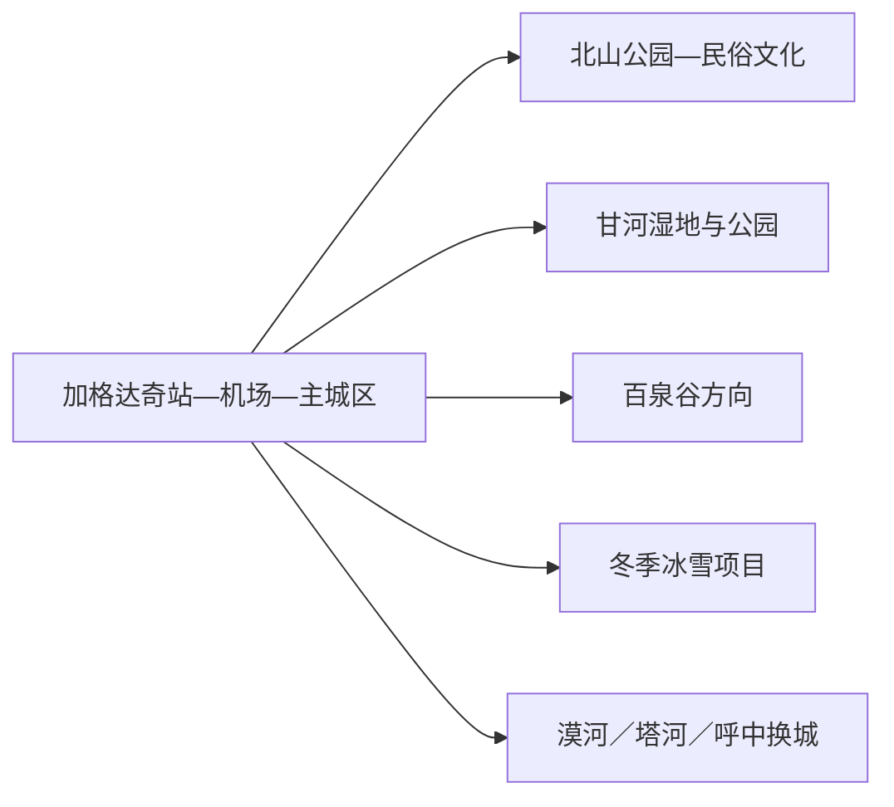
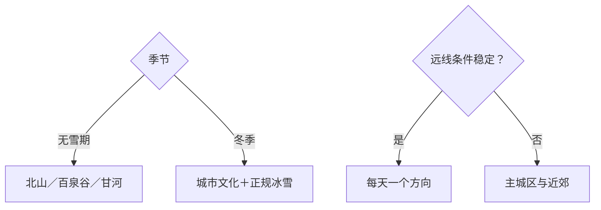

# 加格达奇旅行指南

加格达奇是大兴安岭地区的交通和公共服务中心，适合先用北山公园、地方民俗与林区城市生活形成一日底盘，再从百泉谷、甘河湿地或冬季冰雪项目中选择一条远线。它也是继续前往漠河、塔河、呼中等地的重要集散点，但这些目的地仍应分别规划。

> 建议停留：1–3 天；每条林区或湿地远线各留完整一天 
> 旅行关键词：大兴安岭门户、北山公园、民俗文化、甘河湿地、百泉谷、冰雪 
> 主要体力：城区低至中等；森林湿地中高 
> 最近研究：2026-08-13

## 城市速览

| 项目 | 旅行信息 |
|---|---|
| 主要旅行价值 | 在林区中心城市、森林湿地、鄂伦春文化与寒地冰雪之间建立大兴安岭旅行起点 |
| 建议停留 | 1 天城区；2 天加入百泉谷或甘河；3 天再选季节项目或周边公开景区 |
| 较舒适季节 | 夏秋适合森林湿地；冬季冰雪鲜明但严寒和日照短 |
| 预算特点 | 城区平实，远线车辆、保暖装备和季节项目增加预算 |
| 步行强度 | 北山公园中等，湿地森林中高；冰雪会放大体力成本 |
| 主要天气风险 | 严寒、暴雪、道路结冰、大风、森林火险、雷雨和蚊虫 |
| 独行旅行 | 铁路航空门户便利，远线需锁定车辆和返程 |
| 亲子旅行 | 民俗、植物、森林科普和正规冰雪活动可组合 |
| 长者与低体力旅行 | 一馆加北山短线或车辆观景更舒适 |
| 无障碍信息 | 机场、车站和现代场馆可先申请协助；森林、湿地和雪地设施连续性需向官方确认 |

## 城市格局与游览区域

加格达奇区由黑龙江省大兴安岭地区行政公署管辖，公开行政代码常见为 `232761`；其土地历史关系又与内蒙古自治区鄂伦春自治旗有关，省、地官方资料均明确“原属地权不变、由大兴安岭地区管辖”的特殊格局。GeoNames `2036597` 与 Wikidata `Q1283517` 精确对应，QID 同时还列有另一条行政记录 `8740492`。本页按实际公共服务和旅行管理范围组织，不把它计入法定城市清单。

| 区域 | 主要内容 | 游览特点 | 与其他区域的关系 |
|---|---|---|---|
| 主城区 | 火车站、机场、住宿、餐饮与公共文化 | 适合抵达、补给和雨雪天 | 是地区远线集散基地 |
| 北山公园—城市民俗 | 北山公园、正式民俗展陈与城市视野 | 可组成半日至一日 | 与城区交通最稳定 |
| 甘河方向 | 甘河湿地、公园和当期冰雪活动 | 水情、冰面与运营变化明显 | 每次选择公开入口 |
| 百泉谷方向 | 森林生态、研学和公开游线 | 距离较远，依赖车辆 | 适合单独完整一日 |
| 林区远点 | 万亩种子园、正式开放森林项目 | 防火、道路与接待条件优先 | 不沿林业作业道路串点 |
| 地区联程 | 漠河、塔河、呼中、呼玛等 | 都有独立交通和住宿尺度 | 加格达奇只承担换乘与补给 |

大兴安岭的森林、湿地、林场和防火道路具有明确管理属性。游客采用 A 级景区、正式公园、公开研学和当期活动入口；火险期、封冻期和林业生产期按照属地公告调整路线。

## 主要景点

### 城区与近郊

| 景点 | 区域 | 类型 | 主要看点 | 建议用时 | 室内外 | 体力 | 预约风险 | 天气影响 | 优先级 |
|---|---|---|---|---:|---|---|---|---|---|
| 加格达奇北山公园 | 城区北部 | 3A景区、城市山地公园 | 林区城市视野、森林环境和当期开放步道 | 2–4 小时 | 室外 | 中 | 中 | 高 | A |
| 大兴安岭地区正式民俗／文博场馆 | 主城区 | 民俗、地方文博 | 林区历史、鄂伦春文化和地方展陈 | 1.5–3 小时 | 室内 | 低 | 高 | 低 | A |
| 南湖与城区公共休闲空间 | 主城区 | 公园、季节活动 | 城市生活、冬季滑冰等当期项目 | 1–3 小时 | 室外 | 低至中 | 高 | 很高 | B |

### 森林与湿地远线

| 景点 | 区域 | 类型 | 主要看点 | 建议用时 | 室内外 | 体力 | 预约风险 | 天气影响 | 优先级 |
|---|---|---|---|---:|---|---|---|---|---|
| 百泉谷生态旅游景区 | 林区方向 | 4A景区、森林生态 | 森林、泉溪与正式生态游线 | 6–9 小时 | 室外 | 中高 | 很高 | 很高 | A |
| 甘河湿地公园公开游览区 | 甘河方向 | 湿地、自然教育 | 湿地生态、河流与季节景观 | 4–7 小时 | 室外 | 中 | 高 | 很高 | B |
| 万亩种子园 | 加格达奇区 | 3A景区、林业科普 | 林木种质、森林景观和公开游线 | 4–7 小时 | 室外 | 中 | 很高 | 很高 | B |
| 当期正式冰雪项目 | 城区及近郊 | 冰雪、赛事 | 滑冰、冰雪乐园、冬泳观赛等运营内容 | 2–6 小时 | 室外 | 中高 | 很高 | 极高 | B |
| 映山红滑雪场等正式运营项目 | 近郊 | 滑雪、冰雪 | 雪道与冬季体验 | 4–8 小时 | 室外 | 高 | 极高 | 极高 | C |

百泉谷、甘河和种子园分别对应不同方向与管理单位，适合择一完成。冰面与滑雪活动以运营资质、雪况、装备、救援和保险为锚；冬泳更适合作为正式赛事观赏内容。

## 美食与餐饮

| 菜品或餐饮类型 | 常见区域 | 一个人用餐与常见份量 | 风味、过敏原与饮食限制 | 排队风险与替代方法 |
|---|---|---|---|---|
| 东北炖菜与铁锅菜 | 主城区 | 多人共享，一人问小锅 | 肉类、大豆、粉条和盐分 | 改点盖饭或小份炖菜 |
| 锅包肉与熘炒菜 | 主城区 | 份量偏大 | 小麦、淀粉、糖和油 | 多人共享或选小份 |
| 山野菜、菌菇与林区菜 | 正规餐馆 | 适合共享 | 品种、来源和误采风险 | 只选可说明来源的食材 |
| 黏豆包、冻梨等季节食物 | 市场、正规餐饮 | 可少量尝试 | 糯米、豆馅、糖和低温刺激 | 选择现制与适量食用 |

## 经典行程

### 一日经典路线

**路线**：地方民俗／文博场馆 → 午餐 → 北山公园公开短线 → 主城区

- **串联逻辑**：先理解林区历史，再从北山观察城市与森林关系。
- **预约锚点**：场馆开放和北山步道状态。
- **休息安排**：午餐长休，北山按体力折返。
- **时间不足时**：保留场馆和北山入口短线。

### 两日城市路线

**路线**：第 1 天城区文博—北山。 
**第 2 天**：百泉谷或甘河湿地二选一。

- **串联逻辑**：城市与远郊分日，第二天只完成一种生态体验。
- **预约锚点**：景区开放、车辆、天气和返程。
- **休息安排**：第二天使用正式服务点午休。
- **时间不足时**：第二天改南湖或城区公园半日。

### 三日深度路线

**路线**：第 1 天主城区。 
**第 2 天**：百泉谷。 
**第 3 天**：甘河湿地、万亩种子园或冬季项目三选一。

- **串联逻辑**：代表性森林固定在第二天，第三天按季节补湿地、林业或冰雪。
- **预约锚点**：第三日项目、车辆和道路。
- **休息安排**：每天回城区或入住已核验接待点。
- **时间不足时**：删除第三天。

### 雨雪天路线

**路线**：正式民俗／文博场馆 → 午餐 → 主城区公共文化空间

- **适用条件**：普通降雪且城区交通正常；暴雪和结冰时就近安排。
- **串联逻辑**：以室内内容替代森林、湿地和冰面。
- **预约锚点**：场馆和公共交通。
- **休息安排**：馆内和餐饮区。
- **时间不足时**：只留一个场馆。

### 亲子或低体力路线

**亲子路线**：民俗场馆精选内容 → 午餐 → 北山入口短线或正规冰雪体验。 
**低体力路线**：车辆到场馆 → 核心展厅 → 午餐长休 → 南湖短线。

- **减负方式**：亲子线按保暖和年龄缩短户外；低体力线取消长坡与林区远线。
- **预约锚点**：儿童规则、装备、座椅、轮椅和落客点。
- **休息安排**：每个主点后回暖或坐休。
- **时间不足时**：两线均保留室内核心。

### 远郊一日路线

**路线**：主城区 → 百泉谷或万亩种子园二选一 → 正式游线 → 原路返回

- **适用条件**：防火、道路、天气、开放和返程明确。
- **串联逻辑**：单方向深入林区，减少在作业道路间横穿。
- **预约锚点**：入口、车辆、服务点和最晚返程。
- **休息安排**：正式游客服务区午休，早返城区。
- **时间不足时**：改北山半日。

## 住宿区域

| 区域 | 优点 | 缺点 | 适合人群 | 交通特点 |
|---|---|---|---|---|
| 加格达奇站—主城区 | 铁路、餐饮、医疗和补给集中 | 远线需往返 | 首访、公共交通、联程 | 最稳定的统一基地 |
| 机场方向 | 早晚航班衔接方便 | 城市生活密度较低 | 航空到离 | 先确认接送与餐饮 |
| 林区正规接待点 | 便于早进景区 | 淡旺季、供暖和通信差异大 | 自驾、森林专题 | 匹配实际入口与返程 |

## 市内交通

| 场景 | 建议与取舍 | 行前需要重查的内容 |
|---|---|---|
| 铁路抵达 | 加格达奇站是地区重要门户 | 车次、改造施工、站内协助和接驳 |
| 航空抵达 | 加格达奇嘎仙机场继续地面接驳 | 航班、天气、机场巴士和叫车 |
| 城区移动 | 公交、出租或网约车连接场馆与公园 | 线路、低温下等候和末班 |
| 林区远线 | 自驾或正规预约车辆更灵活 | 防火检查、道路、通信、加油和返程 |

## 不同旅行者须知

| 旅行维度 | 可行条件 | 主要取舍 | 需额外核对 |
|---|---|---|---|
| 独行旅行 | 城区交通和住宿完整 | 林区夜返容错低 | 正规车辆、离线地图和通信 |
| 亲子旅行 | 民俗、森林科普与冰雪主题鲜明 | 严寒和户外时间需缩短 | 年龄、装备、保险和回暖点 |
| 长者或低体力旅行 | 一馆加车辆短线 | 山坡、雪地和湿地长线减量 | 落客点、座椅和医疗 |
| 无障碍需求 | 机场、车站和现代场馆优先咨询 | 森林与雪地转换多 | 设施连续性需向官方确认 |
| 摄影旅行 | 林海、湿地、冰雪和城市铁路题材丰富 | 低温电池、防火和无人机规则优先 | 拍摄许可、禁飞和保暖 |
| 森林与湿地 | 正式景区和研学入口可行 | 防火、生态保护和林业作业优先 | 准入、向导、保险和天气 |

## 行前核对

| 核对事项 | 为什么需要重查 | 建议核对时间 | 官方入口 |
|---|---|---|---|
| A级景区与林区远线 | 开放、入口、防火和车辆随季节调整 | 排路线前及当天 | [大兴安岭地区A级景区表](https://www.dxal.gov.cn/dxal/c100149/202501/c13_303129.shtml) |
| 冰雪活动 | 场地、气温、冰层、装备和赛事变化明显 | 出发前三日及当天 | [加格达奇冰雪文旅动态](https://www.dxal.gov.cn/dxal/c100024/202512/c13_325516.shtml) |
| 铁路与航空 | 时刻和天气影响到离 | 购票前及当天 | [中国铁路12306](https://www.12306.cn/) |
| 森林火险与天气 | 火险、暴雪、雷雨和大风影响远线 | 出发前三日及当天 | [黑龙江省气象局](http://hl.cma.gov.cn/) |

## 来源与更新记录

### 主要来源

| 来源 | 类型 | 支持内容 | 核验日期 |
|---|---|---|---|
| [大兴安岭地区行政区划](https://www.dxal.gov.cn/dxal/c100014/tydp.shtml) | 地区行政公署 | 加格达奇区管辖范围与基层区划 | 2026-08-13 |
| [大兴安岭地区建置沿革](https://dxal.gov.cn/dxal/c100012/tydp.shtml) | 地区行政公署 | 原属地权与实际管理关系 | 2026-08-13 |
| [大兴安岭地区A级景区表](https://www.dxal.gov.cn/dxal/c100149/202501/c13_303129.shtml) | 地区行政公署 | 北山、万亩种子园、百泉谷等级与属地 | 2026-08-13 |
| [大兴安岭文旅产业方案](https://www.dxal.gov.cn/dxal/c100055/202401/c13_272299.shtml) | 地区行政公署 | 民俗、百泉谷、甘河、冰雪与旅游集散角色 | 2026-08-13 |
| [Wikidata Q1283517](https://www.wikidata.org/wiki/Special:EntityData/Q1283517.json) | 开放结构化数据 | 加格达奇实体与两条 GeoNames 记录 | 2026-08-13 |
| [GeoNames 2036597](https://sws.geonames.org/2036597/about.rdf) | 开放地名数据 | 固定加格达奇城市记录 | 2026-08-13 |

### 更新记录

| 日期 | 更新内容 |
|---|---|
| 2026-08-13 | 首次完成加格达奇指南，核验林区门户、景区、特殊行政关系和生态生产边界 |
