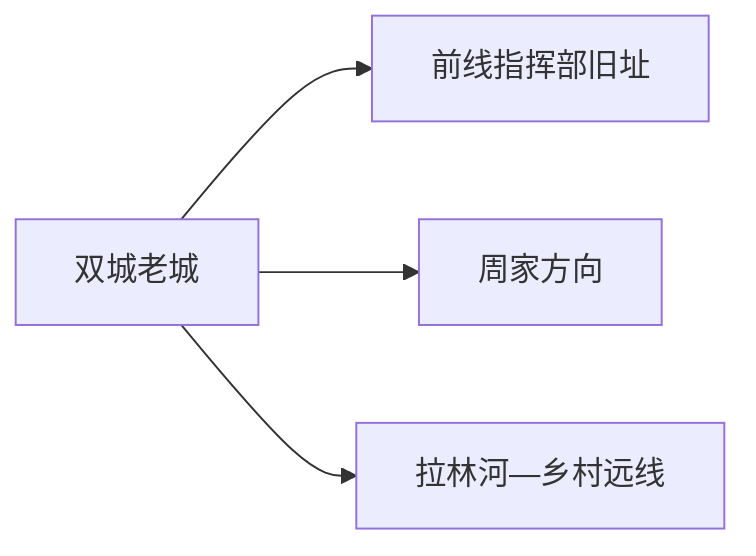
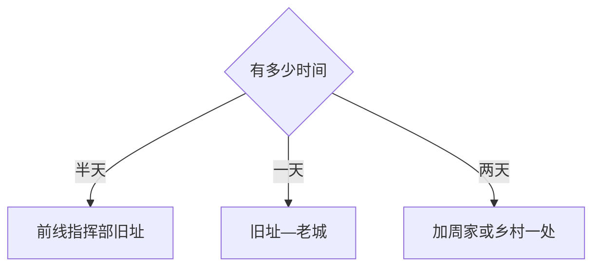

# 双城旅行指南

双城位于哈尔滨主城西南，是一座以第四野战军前线指挥部旧址、老城建筑、拉林河平原与农业生产为主要线索的市辖区。它更适合历史专题和慢节奏周末：一天看老城与纪念旧址，两天再加入周家方向或当期开放的乡村文化点。

> 建议停留：1–2 天 
> 旅行关键词：双城老城、第四野战军前线指挥部旧址、承旭门、铁路、拉林河、黑土地农业 
> 主要体力：低至中等；乡村远线以乘车为主 
> 最近研究：2026-08-13

## 城市速览

| 项目 | 旅行信息 |
|---|---|
| 主要旅行价值 | 通过革命旧址、老城格局与农业城镇生活理解哈尔滨西南门户，而不是把它当作主城近郊公园 |
| 建议停留 | 1 天完成老城历史线；2 天加入周家纪念馆或一处正式乡村接待点 |
| 较舒适季节 | 春秋适合老城步行；冬季注意严寒与路面，汛期关注拉林河和乡村道路 |
| 预算特点 | 城区场馆、餐饮和普通住宿较易控制；乡村用车是主要增量 |
| 步行强度 | 老城可分段步行，点位之间仍需车辆；乡村与河流方向以乘车为主 |
| 主要天气风险 | 严寒、暴雪、冻雨、大风、夏季雷暴、内涝与河流水情 |
| 独行旅行 | 城区可自行组织；乡村和晚间返程先确认车辆 |
| 亲子旅行 | 革命纪念和城市史场馆适合学龄儿童，讲解时长按年龄调整 |
| 长者与低体力旅行 | 一座旧址加一段老城短线，车辆连接最省力 |
| 无障碍信息 | 新建公共设施可询问；旧址、老建筑和乡村设施连续性需向官方确认 |

## 城市格局与游览区域

双城区法定行政代码 `230113`，是哈尔滨市辖区。GeoNames `2034834` 与 Wikidata `Q1000142` 精确对应双城区；本页计入 GeoNames 旅行指南覆盖，不计入全国 695 个法定城市账本。

| 区域 | 主要内容 | 游览特点 | 与其他区域的关系 |
|---|---|---|---|
| 双城老城 | 前线指挥部旧址、承旭门、老街与城市服务 | 历史点位集中但开放各自管理 | 住宿与餐饮基地 |
| 周家方向 | 中国人民解放军第四野战军纪念馆等正式场馆 | 近现代史专题 | 与老城分开安排半日 |
| 拉林河与乡村 | 河流、黑土地农业、村镇生活 | 水情与生产活动影响明显 | 只选正式接待点 |
| 铁路与公路门户 | 双城北站、双城堡站及客运 | 站点功能和距离不同 | 先按车票选择住宿与接驳 |

革命旧址和纪念馆的开放、讲解与团队接待需逐处核对。农田、粮食仓储、乳业和加工厂是生产空间；旅行可在正规展陈、乡村接待和公共道路了解产业，不进入作业区或占用农机道路。

## 主要景点

### 老城与近现代史

| 景点 | 区域 | 类型 | 主要看点 | 建议用时 | 室内外 | 体力 | 预约风险 | 天气影响 | 优先级 |
|---|---|---|---|---:|---|---|---|---|---|
| 东北民主联军前线指挥部旧址 | 老城 | 革命旧址 | 东北解放战争指挥史、院落与展陈 | 2–3 小时 | 混合 | 低 | 高 | 中 | A |
| 双城老城与承旭门公开段 | 老城 | 城市历史与建筑 | 城门、街区格局与地方城镇史 | 2–3 小时 | 室外为主 | 中 | 中 | 高 | A |
| 双城区地方公共文化场馆 | 老城 | 城市史与文化 | 地方历史、农业与民俗专题展 | 1–3 小时 | 室内 | 低 | 高 | 低 | B |
| 第四野战军纪念馆当期开放展陈 | 周家方向 | 革命纪念馆 | 东北野战军与第四野战军历史展陈 | 2–3 小时另计往返 | 室内 | 低 | 很高 | 低 | B |

### 河流与乡村

| 景点 | 区域 | 类型 | 主要看点 | 建议用时 | 室内外 | 体力 | 预约风险 | 天气影响 | 优先级 |
|---|---|---|---|---:|---|---|---|---|---|
| 拉林河公开滨水或水利科普点 | 市域南部 | 河流与水利 | 松嫩平原河流、水利与城镇边界 | 2–3 小时 | 室外 | 中 | 高 | 很高 | C |
| 正式乡村旅游接待点 | 市域乡镇 | 农业与乡村 | 黑土地、粮食与村镇生活 | 半日至一日 | 混合 | 中 | 很高 | 高 | C |

## 美食与餐饮

双城饮食以东北家常、面食、乳制品和农产品为主。城区用餐比临时乡村摊点更稳定；购买乳制品、肉制品与粮食产品时看标签、冷链和保质期。

| 菜品或餐饮类型 | 常见区域 | 一个人用餐与常见份量 | 风味、过敏原与饮食限制 | 排队风险与替代方法 |
|---|---|---|---|---|
| 东北炖菜 | 城区 | 多人份，先问小锅 | 肉类、粉条、豆制品和较高盐分 | 单人改点盖饭、饺子或面食 |
| 饺子、包子与面食 | 老城、车站周边 | 适合一人 | 麸质、蛋、肉馅和芝麻按店确认 | 高峰换社区早餐店 |
| 乳制品 | 正规商店与餐馆 | 小包装易控制 | 乳糖、乳蛋白与冷链 | 看标签和日期，不买常温久置散装品 |
| 玉米、杂粮与农家菜 | 城区、正规乡村接待 | 可按小份搭配 | 粗粮消化、油盐和交叉接触 | 乡村行程提前订餐，城内准备替代 |

## 经典行程

### 一日经典路线

**路线**：东北民主联军前线指挥部旧址 → 老城午餐 → 承旭门与老城公开街区 → 地方公共文化场馆

- **串联逻辑**：先看核心旧址，再用老城格局和地方展陈补全城市背景。
- **预约锚点**：旧址与公共文化场馆开放。
- **休息安排**：午餐和下午休息都在老城。
- **时间不足时**：保留旧址与承旭门外观，删除第二座场馆。

### 两日城市路线

**第 1 天**：老城历史线 
**第 2 天**：周家方向纪念馆或正式乡村接待点二选一

- **串联逻辑**：第二天只深化一个主题，避免在分散乡镇间赶路。
- **预约锚点**：纪念馆或乡村接待确认。
- **休息安排**：在老城或目的地镇区用餐。
- **时间不足时**：删除第二天，第一天保持完整。

### 三日深度路线

**第 1 天**：双城老城 
**第 2 天**：周家革命史专题 
**第 3 天**：拉林河公开点或农业科普接待点

- **串联逻辑**：三天依次从城市史到专题史，再到自然与农业背景。
- **预约锚点**：第三天水利或农业接待。
- **休息安排**：远线在镇区正规餐馆休息。
- **时间不足时**：先删第三天，再删第二天。

### 雨雪天路线

**路线**：前线指挥部旧址 → 老城午餐 → 地方公共文化场馆

- **适用条件**：普通雨雪；暴雪冻雨时缩短为住宿附近一馆。
- **预约锚点**：场馆与交通运行。
- **休息安排**：全程室内与城区。
- **时间不足时**：只留前线指挥部旧址。

### 亲子或低体力路线

**亲子路线**：地方公共文化场馆 → 午休 → 前线指挥部旧址短讲解 
**低体力路线**：车辆到前线指挥部旧址 → 老城午餐 → 承旭门外观

- **减负方式**：亲子缩短历史讲解；低体力线用车辆连接并减少户外久站。
- **预约锚点**：讲解、儿童参观和最近下客点。
- **休息安排**：场馆与老城餐饮区。
- **时间不足时**：均只留一座场馆。

### 远郊一日路线

**路线**：双城主城 → 正式乡村或拉林河接待点 → 镇区午餐 → 返回

- **适用条件**：天气、水情、接待和车辆均明确。
- **预约锚点**：运营或管理单位。
- **休息安排**：镇区正规餐馆。
- **时间不足时**：整段取消，改主城慢游。

## 住宿区域

| 区域 | 优点 | 缺点 | 适合人群 | 交通特点 |
|---|---|---|---|---|
| 双城老城 | 餐饮、旧址和城市服务集中 | 去高铁站和乡镇需车辆 | 首访、历史专题 | 默认基地 |
| 双城北站周边 | 高铁抵离方便 | 与老城景点有距离 | 早晚班、中转 | 先查站区到酒店的真实距离 |
| 乡镇正规住宿 | 减少远线往返 | 选择少、夜间交通弱 | 已确认接待的专题旅行 | 核消防、供暖、热水和退改 |

## 市内交通

| 场景 | 建议与取舍 | 行前需要重查的内容 |
|---|---|---|
| 双城北站抵达 | 高铁门户，接老城需公交或车辆 | 末班、出租上客点与无障碍服务 |
| 双城堡站抵达 | 更接近传统城区的普速门户 | 车次、站前交通与夜间到达 |
| 老城移动 | 核心段步行，跨点用公交或叫车 | 冬季路面、施工和上客点 |
| 周家与乡村 | 城乡交通或正规车辆 | 班次、返程、道路与通信 |
| 自驾 | 远线灵活 | 冰雪、乡道、农机与停车 |

## 不同旅行者须知

| 旅行维度 | 可行条件 | 主要取舍 | 需额外核对 |
|---|---|---|---|
| 独行旅行 | 老城历史线可独立完成 | 远线先锁车辆 | 末班、夜间叫车与通信 |
| 亲子旅行 | 纪念馆与地方场馆主题清楚 | 讲解时长与内容按年龄调整 | 儿童预约、休息与安全教育 |
| 长者或低体力旅行 | 一座旧址加车辆短线 | 冬季路面和老建筑门槛 | 下客点、座椅、防滑与卫生间 |
| 无障碍需求 | 新建交通设施可询问 | 老旧建筑与乡村差异大 | 设施连续性需向官方确认 |
| 摄影旅行 | 老城与铁路城镇有历史质感 | 文保、居民肖像与铁路安全有边界 | 三脚架、闪光灯和商业拍摄 |
| 预算有限 | 一日老城易控费 | 远线车辆和预约讲解增加成本 | 门票、讲解、交通与退改 |
| 特殊天气 | 普通雪天可做室内旧址 | 暴雪冻雨减少跨区 | 气象、铁路、公路与场馆公告 |

## 行前核对

| 核对事项 | 为什么需要重查 | 建议核对时间 | 官方入口 |
|---|---|---|---|
| 革命旧址与纪念馆 | 开放、讲解和团队接待变化 | 出发前一周 | [双城区政府](http://www.hrbsc.gov.cn/) |
| 老城文保点 | 修缮和内部开放各自管理 | 排入路线前 | [黑龙江省文物局](https://wlt.hlj.gov.cn/) |
| 铁路门户 | 双城北与双城堡功能不同 | 订票时及当天 | [中国铁路 12306](https://www.12306.cn/) |
| 乡村接待与水情 | 生产季、道路和河流水位影响 | 出发前三日 | [哈尔滨市政府](https://www.harbin.gov.cn/) |
| 严寒与暴雪 | 影响道路、铁路和户外停留 | 出发前三日及当天 | [黑龙江省气象局](https://hl.cma.gov.cn/) |

## 来源与更新记录

### 主要来源

| 来源 | 类型 | 支持内容 | 核验日期 |
|---|---|---|---|
| [黑龙江省委史志研究室：前线指挥部旧址](https://www.hljszw.org.cn/news/2540.html) | 省级党史机构 | 旧址位置、历史和省级文保、爱国主义教育属性 | 2026-08-13 |
| [双城区旅游市场安全资料](https://hrbcredit.harbin.gov.cn/creditMess.do?conId=ba52e07781704b81aecce057b26d29a1&conType=&method=showDetailHtml) | 哈尔滨市政府平台 | 属地文旅市场与安全管理入口 | 2026-08-13 |
| [GeoNames 2034834](https://www.geonames.org/2034834/) | 开放地理数据 | 双城城市点与坐标 | 2026-08-13 |
| [Wikidata Q1000142](https://www.wikidata.org/wiki/Q1000142) | 开放结构化数据 | 双城区实体与精确 GeoNames 映射 | 2026-08-13 |

### 更新记录

| 日期 | 更新内容 |
|---|---|
| 2026-08-13 | 首次完成双城区独立旅行研究；建立老城革命史、周家专题与乡村水利路线，补充双铁路门户、严寒水情、农业生产与文保边界 |
