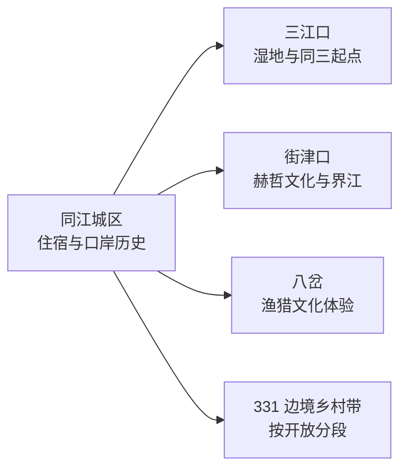
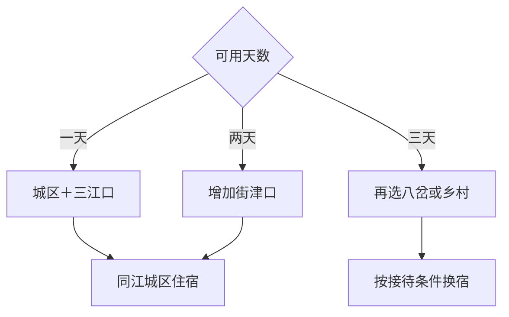

# 同江旅行指南

同江位于松花江与黑龙江汇流地带，赫哲族文化、三江湿地、界江风光、口岸历史和同三公路起点构成核心体验。城区—三江口适合一天，街津口通常另留一天；八岔、边境乡村和 331 国道方向更分散，适合有车辆和明确接待条件时加入。

本页绑定同江同名聚居点 **GeoNames 2034407**。该点未进入项目固定 `cities500` 快照，因此只用于法定县级市覆盖，不改变固定 GeoNames 候选进度。

## 城市速览

| 项目 | 信息 |
|---|---|
| 主线 | 三江汇流—赫哲文化—界江湿地—百年口岸—同三起点 |
| 停留 | 2 天覆盖城区与街津口；3 天加入八岔或边境乡村 |
| 住宿 | 同江城区方便补给与换乘；街津口住宿需确认季节营业 |
| 交通 | 铁路、公路抵达后，远点以自驾、预约车辆或旅游线路为主 |
| 季节 | 夏秋适合湿地与公路；冬季适合冰雪活动但日短严寒；开江和节庆按公告 |
| 预算 | 城区消费可控，远点车辆、界江项目、民族体验和换宿增加成本 |

## 城市格局与游览区域

城区和三江口距离相对可控，适合作为首日；街津口位于黑龙江岸边，是赫哲文化深度线；八岔及边境村屯更远。中俄铁路大桥、口岸监管区、国界水域与普通旅游区具有不同边界，参观使用正式观景、展陈和运营项目。

## 主要景点

| 景点 | 区域 | 类型 | 核心体验 | 用时 | 环境 | 体力 | 预约风险 | 天气影响 | 优先级 |
|---|---|---|---|---:|---|---|---|---|---|
| 三江口生态旅游区 | 城区东北方向 | 湿地与界江 | 松花江、黑龙江汇流地貌和边城景观 | 2–4小时 | 室外 | 低中 | 节假日中 | 很高 | A |
| 三江口国家湿地公园宣教馆 | 三江口片区 | 湿地与科普 | 三江平原湿地生态、鸟类与保护知识 | 1–2小时 | 室内为主 | 低 | 中高 | 低 | A |
| 街津口赫哲旅游度假区 | 街津口乡 | 民族文化与界江 | 赫哲族文化、村镇壁画、黑龙江岸线与山地游览 | 半天至1天 | 混合 | 中 | 节庆时高 | 很高 | A |
| 赫哲民族文化村 | 街津口乡 | 民族文化 | 渔猎生活、鱼皮文化、歌舞与传统体育展陈 | 2–3小时 | 混合 | 低中 | 高 | 中 | A |
| 赫哲祖源数字非遗体验馆 | 官方公布场址 | 非遗与数字展陈 | 伊玛堪、鱼皮制作等赫哲文化的数字体验 | 1.5–2小时 | 室内 | 低 | 高 | 低 | A |
| 八岔渔猎文化体验区 | 八岔乡方向 | 民族与乡村 | 渔猎文化、边境乡村和当期体验项目 | 半天 | 混合 | 低中 | 很高 | 高 | B |
| 同江口岸历史与百年海关线 | 主城区 | 城市历史 | 口岸发展、海关旧址线索与边城公共空间 | 2小时 | 混合 | 低 | 中 | 中 | B |
| 同三公路起点公共节点 | 三江口附近 | 公路地标 | 国道起点、边境公路与城市地理 | 0.5–1小时 | 室外 | 低 | 低 | 高 | B |
| 革命烈士纪念馆 | 主城区 | 纪念馆 | 地方革命史与边疆建设记忆 | 1–2小时 | 室内 | 低 | 高 | 低 | B |
| 乐业知青园或闯关东民俗村 | 乐业镇及乡村方向 | 农垦与民俗 | 知青、移民与三江平原农耕生活 | 2–3小时 | 混合 | 低 | 很高 | 中 | C |

## 美食与餐饮

同江可从赫哲全鱼宴、鳇鱼水饺、江鱼、东北炖菜和稻米主食切入。全鱼宴适合多人并需提前确认份量与来源，一人可选水饺或小份鱼菜。鱼刺、淡水鱼来源、酒精、花生芝麻和面食麸质分别说明；民族文化体验尊重传承人和社区安排。

## 经典行程

### 城区三江口一日线
**路线**：城市历史展陈—午餐—三江口—湿地宣教馆—同三起点。**逻辑**：在近郊完成口岸、汇流与生态主线。**预约锚点**：宣教馆开放。**休息**：三江口服务区。**删除条件**：风雨或低温时缩短岸线段。

### 街津口一日线
**路线**：城区—街津口赫哲旅游度假区—民族文化村—返城。**逻辑**：集中理解赫哲文化和界江环境。**预约锚点**：场馆、演出和车辆。**休息**：村镇正式服务点。**删除条件**：天气或道路变化时保留室内非遗展陈。

### 赫哲非遗专题线
**路线**：数字非遗体验馆—鱼皮或伊玛堪公开展示—赫哲餐饮。**逻辑**：从知识展陈进入当期传承活动。**预约锚点**：传承人活动和演出。**休息**：场馆。**删除条件**：没有展演时保留固定展陈。

### 八岔边境乡村线
**路线**：同江城区—八岔体验区—乡村午餐—返城。**逻辑**：把远距民族乡作为独立方向。**预约锚点**：接待、道路和车辆。**休息**：正式运营点。**删除条件**：接待未确认时改街津口。

### 雨雪场馆线
**路线**：数字非遗体验馆—革命烈士纪念馆—地方餐饮。**逻辑**：在城区和室内维持文化主线。**预约锚点**：两馆开放。**休息**：城区。**删除条件**：暴雪、极寒或道路预警时按属地安排暂停出行。

### 亲子低体力线
**路线**：湿地宣教馆—三江口短段—数字非遗体验。**逻辑**：科普和文化相间，岸线长度可调。**预约锚点**：儿童活动。**休息**：三江口和馆区。**删除条件**：大风时取消岸线。

### 三日完整线
**路线**：首日城区—三江口，次日街津口，第三日八岔或乐业乡村。**逻辑**：按距离逐日展开。**预约锚点**：第二、三日车辆与接待。**休息**：前两晚住城区。**删除条件**：压缩时先删第三日远线。

## 住宿区域

同江城区适合首次到访，餐饮、铁路和远线车辆更容易协调。街津口住宿适合希望体验界江晨昏、且已确认季节营业的旅行者；八岔及边境乡村住宿以正式接待、证件要求、供暖和返程条件为选择依据。

## 市内交通

通过 12306 核对同江站车次，远点安排预留边境公路和天气余量。城区到三江口可短途接驳，街津口、八岔和 331 国道沿线适合自驾或预约车辆。口岸监管区、铁路大桥作业区、国界水域、湿地核心保护区和边防设施执行明确限制；界江游船按许可航线运营。

## 不同旅行者须知

民族文化旅行者优先预约正式展演和手作；亲子家庭选择湿地科普与数字非遗；低体力旅行者保留三江口车辆近达段；摄影旅行者按边境、航拍和自然保护规定选取公共机位。冬季户外准备覆盖极寒和日短，夏季岸线活动关注雷雨、水位和蚊虫。

## 行前核对

- 通过同江市政府核对三江口、街津口、非遗馆、八岔和乡村景点开放。
- 通过 12306 核对铁路，并落实街津口、八岔方向车辆与返程。
- 核对界江游船、口岸参观、边境证件、摄影和无人机规则。
- 出发前三日和当天核对江面水情、大风、雷雨、寒潮、暴雪及 331 国道路况。

## 来源与更新记录

| 来源 | 支持内容 | 核验日期 |
|---|---|---|
| [同江市政府：2025 年景区开放情况](https://www.tongjiang.gov.cn/tjs/c100070/202504/c04_215846.shtml) | 三江口湿地、街津口、文化场馆与开放线索 | 2026-09-04 |
| [同江市政府：赫哲文旅发展答复](https://www.tongjiang.gov.cn/tjs/c100125/202506/c04_224978.shtml) | 赫哲博物、非遗、八岔、街津口与体验线路 | 2026-09-04 |
| [同江市政府：旅游发展答复](https://www.tongjiang.gov.cn/tjs/c100124/202505/c04_224807.shtml) | 跨境旅游带、民族文化体验带和空间组织 | 2026-09-04 |
| [GeoNames 2034407](https://www.geonames.org/2034407/) | 同江同名城市点与坐标 | 2026-09-04 |

