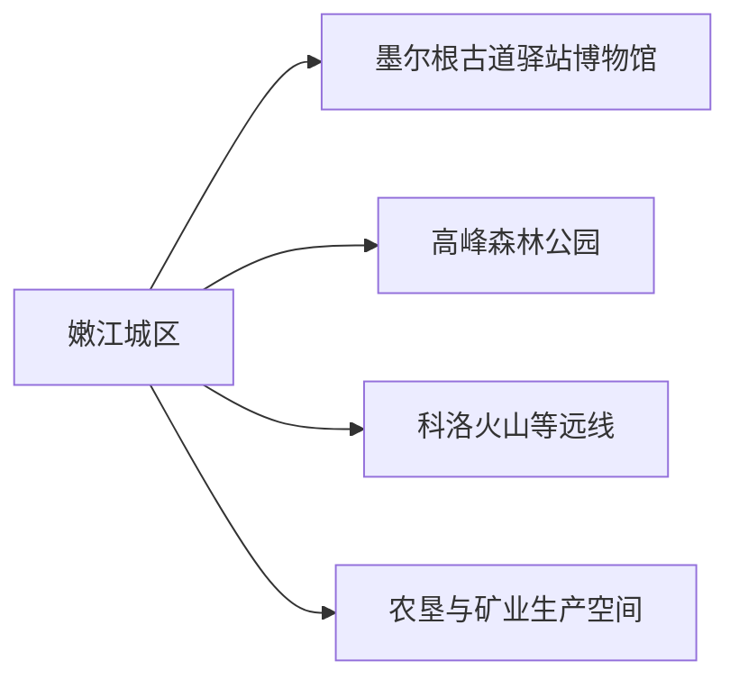
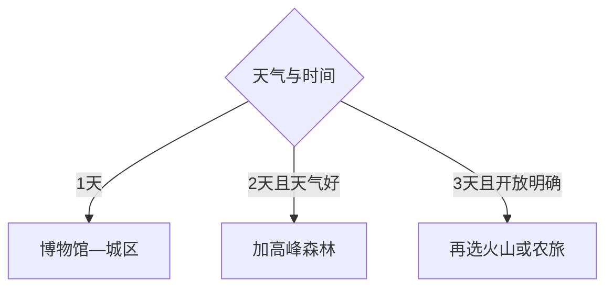

# 嫩江旅行指南

嫩江的辨识度来自“古驿嫩江”：城区以墨尔根古道驿站博物馆为核心，高峰森林公园构成近郊自然日；火山、湿地、农垦和矿业方向则先确认正式接待，再决定是否加入。

> 建议停留：城区 1 天；高峰森林公园 1 天；其他远线按开放另加 
> 旅行关键词：墨尔根古驿、嫩江、森林、寒地农业、冰雪 
> 无障碍说明：博物馆可询问电梯与轮椅；森林步道、冰雪路面和远郊项目的设施连续性需向官方确认

## 城市速览
| 项目 | 旅行信息 |
|---|---|
| 主要旅行价值 | 墨尔根古驿文化、高峰森林、嫩江城市生活与寒地农业 |
| 建议停留 | 2–3 天 |
| 舒适季节 | 夏秋适合森林，冬季冰雪主题鲜明但更考验交通 |
| 预算特点 | 城区平实，远郊车辆和季节项目增加预算 |
| 步行强度 | 城区低至中，森林中高 |
| 天气风险 | 极寒、暴雪、暗冰、大风、雷雨和森林火险 |
| 独行旅行 | 城区方便，远线先锁车辆 |
| 亲子旅行 | 博物馆、科技馆和森林自然教育 |
| 长者与低体力 | 博物馆加城区短线 |
| 行前重点 | 场馆开放、森林防火、道路、农场矿区边界和返程 |

## 城市格局与游览区域
嫩江是黑河代管的县级市，代码 `231183`。固定 GeoNames `2035601` 是嫩江城区驻地点；法定实体 `Q1344863` 当前未列 P1566，页面用代码和官方行政资料界定市域。

| 区域 | 主要内容 | 怎么安排 | 时间 |
|---|---|---|---|
| 嫩江城区 | 博物馆、科技馆、城市公共空间 | 抵达日或完整一日 | 1 天 |
| 高峰方向 | 森林公园、自然教育 | 天气稳定时完整一日 | 1 天 |
| 科洛等远线 | 火山、湿地与乡村 | 只走正式接待入口 | 1 天起 |
| 农场与矿区 | 寒地农业、铜矿和试车产业 | 仅参加明确开放项目 | 预约制 |

## 主要景点
### 城区、森林与远线
| 景点 | 区域 | 类型 | 主要看点 | 建议用时 | 室内外 | 体力 | 预约风险 | 天气影响 | 优先级 |
|---|---|---|---|---:|---|---|---|---|---|
| 墨尔根古道驿站博物馆 | 城区 | 博物馆 | 古驿道、边疆史、考古与地方文物 | 2.5–4 小时 | 室内 | 低 | 高 | 低 | A |
| 嫩江市科技馆 | 城区 | 科技馆 | 科普互动和亲子教育 | 1.5–2.5 小时 | 室内 | 低 | 高 | 低 | B |
| 创驿里或当期开放城市街区 | 城区 | 城市更新 | 古驿主题、城市生活与夜间休闲 | 1–2 小时 | 混合 | 低 | 中 | 中高 | B |
| 嫩江公共岸线代表段 | 城区 | 城市滨水 | 河流城市格局和季节景观 | 1–2 小时 | 室外 | 低 | 低 | 很高 | B |
| 高峰森林公园正式开放区 | 高峰方向 | 森林、自然教育 | 红皮云杉、樟子松与古驿道线索 | 4–6 小时 | 室外 | 中高 | 高 | 很高 | A |
| 科洛火山森林公园当期开放入口 | 科洛方向 | 火山、森林 | 火山地貌与森林景观 | 1 天 | 室外 | 高 | 很高 | 很高 | B |
| 正式开放寒地农业项目 | 农垦方向 | 农业、研学 | 大豆、机械化农业与农垦文化 | 2–5 小时 | 混合 | 中 | 很高 | 高 | C |

高峰森林公园按一个完整景区计数；科洛火山群、自然保护区和林场按当期开放入口组织。矿山、试车场和农场作业区只进入正式接待线路。

## 美食与餐饮
| 类型 | 怎么点 | 过敏原与份量 | 选择建议 |
|---|---|---|---|
| 东北炖菜 | 多人分享，独行问小锅 | 肉类、大豆、小麦和菌菇 | 先问份量与主料 |
| 大豆制品与杂粮 | 小份组合 | 大豆、乳制品和坚果 | 过敏者明确询问加工 |
| 江鱼与河鲜 | 问清来源、重量和单价 | 鱼类、鱼刺与酱油 | 选择合法来源餐馆 |
| 烧烤、饺子和面食 | 单人或多人均可 | 小麦、蛋、花生芝麻 | 在城区成熟餐饮区选择 |

## 经典行程

### 一日经典路线
**路线**：墨尔根古道驿站博物馆 → 城区午餐 → 科技馆或城市街区 → 嫩江岸线短段
- **串联逻辑**：古驿历史、现代城市与河流空间顺序展开。
- **预约锚点**：博物馆和科技馆。
- **休息安排**：午餐和下午在城区室内休息。
- **时间不足时**：保留博物馆与街区短段。

### 两日城市路线
**第 1 天**：城区经典路线 
**第 2 天**：高峰森林公园正式开放线路
- **串联逻辑**：第一天古驿文化，第二天森林生态。
- **预约锚点**：森林开放、防火和车辆。
- **休息安排**：游客服务点分段休息。
- **时间不足时**：第二天缩短步道。

### 三日深度路线
**第 1 天**：城区 
**第 2 天**：高峰森林 
**第 3 天**：科洛火山或正式农旅项目二选一
- **串联逻辑**：文化、森林与地质/生产主题分日。
- **预约锚点**：第三天正式接待与道路。
- **休息安排**：镇区和游客中心。
- **时间不足时**：删除第三天。

### 雨雪天路线
**路线**：墨尔根博物馆 → 午餐 → 科技馆或室内公共文化活动
- **适用条件**：城市道路和供暖正常。
- **串联逻辑**：减少森林、河岸和远郊暴露。
- **预约锚点**：临时闭馆、清雪和交通。
- **休息安排**：城区室内节点。
- **时间不足时**：只保留博物馆。

### 亲子或低体力路线
**亲子路线**：墨尔根博物馆 → 午休 → 科技馆 
**低体力路线**：车辆到博物馆 → 午休 → 城市街区或岸线平缓短段
- **减负方式**：把森林和远郊拆到另一天。
- **预约锚点**：轮椅、电梯、亲子活动和落客点。
- **休息安排**：场馆与城区餐饮。
- **时间不足时**：保留博物馆。

### 远郊路线
**路线**：科洛火山与正式农业项目二选一
- **适用条件**：接待、天气、道路和返程明确。
- **串联逻辑**：自然地质与生产文化分别成线。
- **预约锚点**：林区、运营方和车辆。
- **休息安排**：正式服务点。
- **时间不足时**：改为高峰森林短段或城区。

## 住宿区域
| 区域 | 优点 | 取舍 | 适合人群 |
|---|---|---|---|
| 嫩江城区 | 铁路、餐饮和场馆方便 | 去森林和远线需车辆 | 首访、短住 |
| 森林或乡村正式住宿 | 靠近自然项目 | 季节营业、通信和餐饮有限 | 摄影、自然旅行 |
| 黑河或齐齐哈尔联程 | 干线交通选择更多 | 属跨城移动 | 多城组合 |

## 市内交通
- 嫩江站车次按 12306 核对；城区使用公交、出租和网约车。
- 高峰、科洛和农垦方向提前锁定正规车辆与返程。
- 冬季把预热、清雪、暗冰、风寒和通信纳入计划；矿区与试车道路服从生产管理。

## 不同旅行者须知
| 情况 | 怎么安排 | 重点核对 |
|---|---|---|
| 独行 | 住城区、白天远线 | 车辆、通信和末班 |
| 亲子 | 两馆组合 | 互动项目、卫生间和午休 |
| 长者与低体力 | 博物馆为核心 | 轮椅、电梯、取暖和落客 |
| 森林摄影 | 走开放步道 | 防火、野生动物、无人机 |
| 冬季 | 缩短户外、日落前返城 | 极寒、暗冰、停运和救援 |

## 行前核对
| 项目 | 何时核对 | 官方入口 |
|---|---|---|
| 墨尔根博物馆与科技馆 | 出发前一周及前一日 | [嫩江市人民政府](https://www.nenjiang.gov.cn/) |
| 高峰森林与科洛远线 | 订车前及当天 | 嫩江文旅、林草和景区公告 |
| 铁路与道路 | 购票时及前一日 | [中国铁路 12306](https://www.12306.cn/)及交通部门 |
| 暴雪、极寒、雷雨和火险 | 出发前三日起每日 | [中国气象局](https://www.cma.gov.cn/)及应急林草公告 |

## 来源与更新记录
| 来源 | 支持内容 | 核验日期 |
|---|---|---|
| [嫩江市简介](https://www.nenjiang.gov.cn/njs/njjj/202202/c11_3754.shtml) | 撤县设市、自然资源与保护地 | 2026-08-13 |
| [嫩江市 2026 年工作报告](https://www.nenjiang.gov.cn/njs/c100699/202603/c11_349988.shtml) | 墨尔根、高峰森林和城市更新现状 | 2026-08-13 |
| [嫩江市研学活动](https://www.nenjiang.gov.cn/njs/c100693/202606/c11_355101.shtml) | 博物馆、科技馆与高峰森林当前活动 | 2026-08-13 |
| [墨尔根古道驿站博物馆介绍](https://www.nenjiang.gov.cn/njs/c100515/202409/c11_303553.shtml) | 馆藏、功能与地方历史 | 2026-08-13 |
| [民政部行政区划代码查询](https://dmfw.mca.gov.cn/xzqh/getList?code=23&trimCode=true&maxLevel=3) | `231183` 县级市层级 | 2026-08-13 |
| [GeoNames 2035601](https://www.geonames.org/2035601/nenjiang.html) | 固定城区点 | 2026-08-13 |
| [Wikidata Q1344863](https://www.wikidata.org/wiki/Q1344863) | 法定县级市实体 | 2026-08-13 |

| 日期 | 更新 |
|---|---|
| 2026-08-13 | 首次完成嫩江市指南；建立古驿城区、森林、火山与生产边界。 |
