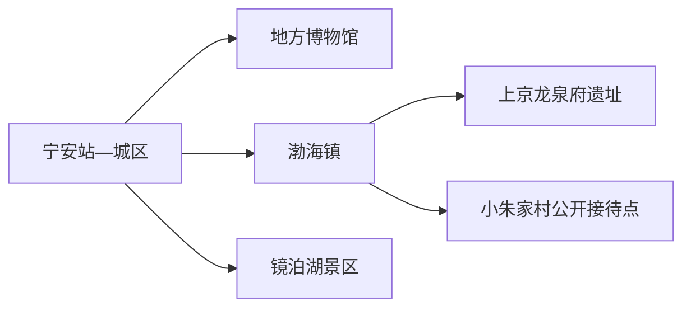
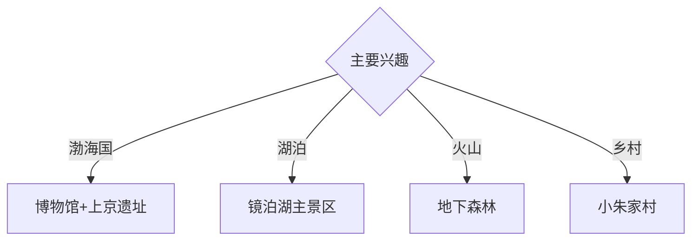

# 宁安旅行指南

宁安位于牡丹江上游，渤海国上京龙泉府遗址、镜泊湖火山堰塞湖和朝鲜族乡村构成互补的历史与地貌路线。固定快照中的 **Ning’an / GeoNames 2035588** 对应黑龙江省宁安市；宁安城区、渤海镇和镜泊湖相距较远，适合分三天安排。

## 城市速览

| 项目 | 信息 |
|---|---|
| 主线 | 宁安城区—渤海上京遗址—镜泊湖 |
| 停留 | 城区1天；遗址和镜泊湖各另加1天 |
| 住宿 | 宁安城区适合文化线；镜泊湖正规住宿适合地貌线 |
| 交通 | 铁路、公路抵达；遗址和湖区宜约车、自驾或正规线路 |
| 风险 | 遗址保护、湖区水上安全、森林防火、冬季冰雪与村庄生产边界 |

## 城市格局与游览区域

宁安城区承担住宿和换乘；渤海镇集中上京龙泉府遗址与相关展陈，距镜泊湖约十余公里，但两者游览规模不同。镜泊湖风景名胜区还包含湖区、火山地质和森林方向，门票、观光车、船线与入口按景区当期公告组合。

## 主要景点

| 景点 | 区域 | 类型 | 核心体验 | 用时 | 环境 | 体力 | 研究价值 | 拥挤 | 优先级 |
|---|---|---|---|---:|---|---|---|---|---|
| 渤海国上京龙泉府遗址 | 渤海镇 | 考古遗址 | 都城格局、宫城遗迹与渤海国历史 | 半天至1天 | 室外 | 中 | 很高 | 旺季中 | A |
| 黑龙江省渤海上京遗址博物馆 | 渤海镇 | 博物馆 | 考古文物、城市制度与遗址导读 | 2–3小时 | 室内 | 低 | 很高 | 团体时中 | A |
| 镜泊湖主景区 | 镜泊湖镇方向 | 湖泊景区 | 火山堰塞湖、吊水楼瀑布与湖岸地貌 | 1天 | 室外 | 中高 | 很高 | 旺季高 | A |
| 火山口地下森林正式游线 | 镜泊湖景区 | 火山森林 | 火山口、熔岩与森林演替 | 半天至1天 | 室外 | 高 | 很高 | 旺季中高 | A |
| 宁安市博物馆或地方展陈 | 城区 | 博物馆 | 宁安城市史、民族与地方文物 | 2小时 | 室内 | 低 | 高 | 团体时中 | B |
| 小朱家村公开接待区 | 镜泊湖近郊 | 乡村体验 | 湖畔村落、朝鲜族饮食与田园 | 半天 | 混合 | 低中 | 中 | 节假日中 | B |
| 牡丹江正式滨水公园段 | 城区 | 滨水空间 | 城市河流、堤防与日常生活 | 1–2小时 | 室外 | 低 | 中 | 傍晚中 | B |

## 美食与餐饮

镜泊湖鱼、朝鲜族冷面、打糕、石锅拌饭和东北山野菜最具地方辨识度。湖鱼选择正规餐馆和合法来源；山野菜、菌类与自酿食品按经营资质和个人体质选择。遗址与湖区日提前准备饮水和简餐。

## 经典行程

### 一日历史基础线
**路线**：宁安地方展陈—午餐—渤海上京遗址博物馆—遗址近入口公开区。**逻辑**：先建立地方史，再进入都城考古。**预约锚点**：两馆与遗址开放。**休息**：渤海镇。**删除条件**：遗址因天气关闭时保留室内展陈。

### 上京遗址深读线
**路线**：遗址博物馆—宫城与外郭公开游线—考古解说点—返城。**逻辑**：用展品与空间互证都城制度。**预约锚点**：讲解、开放范围和返程。**休息**：游客中心。**删除条件**：高温或积雪时缩短室外步行。

### 镜泊湖地貌线
**路线**：正规入口—吊水楼瀑布—湖岸公开段—景区交通—返宿。**逻辑**：集中观察堰塞湖与瀑布地貌。**预约锚点**：门票、观光车、船线和末班。**休息**：景区服务区。**删除条件**：大风、雷雨、洪水或结冰管控时取消船线。

### 火山森林线
**路线**：景区入口—火山口地下森林开放线—地质解说点—返程。**逻辑**：完整半天至一天理解火山与森林演替。**预约锚点**：开放游线和接驳。**休息**：游客服务点。**删除条件**：林火、雷暴或冰雪预警时取消。

### 朝鲜族乡村线
**路线**：渤海镇—小朱家村公开接待点—午餐—湖畔公共空间—返城。**逻辑**：把地方饮食与湖区村落放在同一方向。**预约锚点**：村内接待与返程。**休息**：正规餐饮点。**删除条件**：接待暂停时改遗址深读线。

### 亲子研学线
**路线**：渤海上京遗址博物馆—午休—遗址近入口段—乡村正规体验。**逻辑**：室内文物配低强度空间观察。**预约锚点**：亲子讲解与体验。**休息**：博物馆和镇区。**删除条件**：儿童体力不足时取消乡村延伸。

### 雨雪天气线
**路线**：宁安地方展陈—午餐—渤海上京遗址博物馆—城区休整。**逻辑**：用室内场馆保留历史主线。**预约锚点**：馆舍开放。**休息**：城区。**删除条件**：暴雪封路时只留就近场馆。

## 住宿区域

宁安城区适合铁路抵离和历史方向换乘；渤海镇适合遗址深读；镜泊湖正规住宿适合清晨地貌游览。乡村和湖区住宿按合法经营、消防、供暖、夜间交通与天气响应能力选择。

## 市内交通

宁安站与公路客运承担抵离，城区用公交、出租车和网约车。渤海镇、镜泊湖与火山口方向使用正规旅游线路、约车或自驾；冬季和汛期提前核对景区入口、道路与返程。

## 不同旅行者须知

历史兴趣者给上京遗址完整一天；地质旅行者把湖区和地下森林分开；亲子家庭优先两座博物馆与近入口段；行动不便者确认遗址路面、景区车、船舶上下客与卫生间。

## 行前核对

- 核对上京遗址、两座博物馆、镜泊湖各入口、观光车和船线。
- 核对火山森林开放、湖区水情、林火、冰雪、蚊虫和返程。
- 考古工作区、遗址保护区、湖面封闭区、森林管护区、农田和村庄生产空间按现场边界进入。

## 来源与更新记录

| 来源 | 支持内容 | 核验日期 |
|---|---|---|
| [黑龙江省政府：渤海国上京龙泉府遗址保护规划](https://www.hlj.gov.cn/hlj/c108411/202110/31182525/files/a5a0b47f8f709901864104e4cf2bb558.pdf) | 遗址位置、周边文化与保护范围 | 2026-09-01 |
| [黑龙江省外事办：水资源参访路线](https://fao.hlj.gov.cn/fao/c111834/202206/30672918/files/025996ad567e84465b235ce0cca63ab5.pdf) | 镜泊湖、火山森林与渤海上京整体关系 | 2026-09-01 |
| [GeoNames 2035588](https://www.geonames.org/2035588/) | Ning’an 固定人口点与位置 | 2026-09-01 |

| 日期 | 更新 |
|---|---|
| 2026-09-01 | 首次完成宁安旅行研究；建立上京遗址、镜泊湖、火山森林与乡村路线。 |
