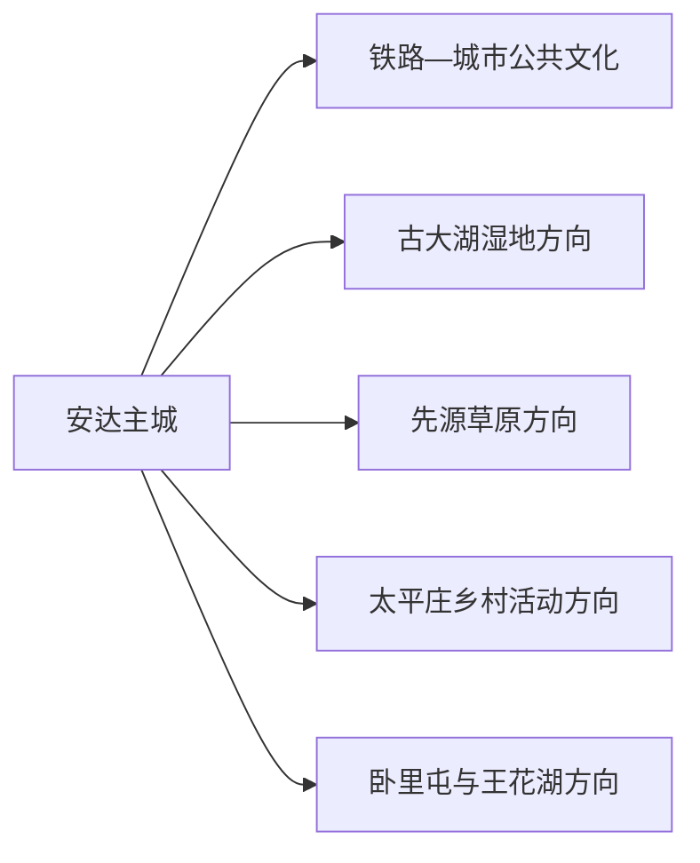
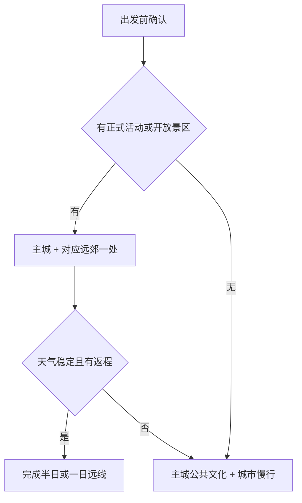

# 安达旅行指南

安达位于哈尔滨—大庆交通轴上，旅行节奏更像一座草原湿地与奶业城市的短住：先看主城公共文化和铁路城市肌理，再按季节选择古大湖湿地、先源草原或太平庄乡村活动。成熟开放项目不多，提前确认接待能让两天行程更踏实。

> 建议停留：1–2 天；遇正式节庆可安排 3 天 
> 旅行关键词：草原湿地、奶牛之乡、古大湖、铁路城市、乡村节庆 
> 主要体力：低至中等 
> 最近研究：2026-08-12

## 城市速览

| 项目 | 旅行信息 |
|---|---|
| 主要旅行价值 | 在哈大齐之间体验草原、湿地、奶业和铁路城市生活，适合慢节奏短住与季节活动。 |
| 建议停留 | 1 天主城与一处确认开放的近郊；2 天增加古大湖或先源方向；节庆日再延长。 |
| 较舒适季节 | 夏秋适合草原和乡村活动，冬季适合冬捕等正式节庆；春季融雪与大风需留意。 |
| 预算特点 | 主城成本较低，远线车辆、活动门票和乡村住宿是主要增量。 |
| 步行强度 | 主城平缓，湿地和草原以车辆到达、短段步行为主。 |
| 主要天气风险 | 冬季严寒、风雪与结冰，春季大风，夏季雷雨、湿地水位和蚊虫。 |
| 独行旅行 | 主城容易安排，远郊优先正式活动和可确认返程的车辆。 |
| 亲子旅行 | 公共文化、正规草原体验和节庆适合亲子，水域、牲畜和机械设备需看护。 |
| 长者与低体力旅行 | 采用主城住宿、车辆接驳和单点短游，草原大风与冬季低温时缩短户外。 |
| 无障碍信息 | 主城现代公共设施相对平缓，乡村与湿地接待点差异大；设施连续性需向官方确认。 |

### 城市身份与资料粒度

安达是绥化市代管的县级市 **231281**。固定 **GeoNames 2038650** 连接薄地点实体 **Wikidata Q10947224**；法定安达市实体 **Wikidata Q489631** 当前没有 `P1566`。页面用固定城市点满足清单覆盖，以法定代码确定市域，不用缺失的 P1566 推断边界。

## 城市格局与游览区域

| 区域 | 主要内容 | 游览特点 | 与其他区域的关系 |
|---|---|---|---|
| 安达主城 | 车站、公共文化、北湖等城市空间 | 生活服务集中，适合抵达日 | 作为各远线住宿基地 |
| 古大湖镇 | 国家湿地公园、冬捕与湿地摄影 | 生态和节庆属性强，开放随季节变化 | 适合独立半日至一日 |
| 先源乡 | 友谊草原等正式休闲项目 | 草原、马术和乡村体验依运营安排 | 先确认接待与返程 |
| 太平庄镇 | 萱草、乡村生态画廊和节庆 | 花期与活动日决定价值 | 可与一个近郊点组合 |
| 卧里屯—王花湖 | 宗教文化、水域与乡村线索 | 成熟度和开放差异较大 | 只选明确接待项目 |

## 主要景点

| 景点 | 区域 | 类型 | 主要看点 | 建议用时 | 室内外 | 体力 | 预约风险 | 天气影响 | 优先级 |
|---|---|---|---|---:|---|---|---|---|---|
| 安达城市公共文化场馆 | 主城 | 博物馆与公共文化 | 地方历史、奶业、非遗与临展 | 1.5–3 小时 | 室内 | 低 | 中 | 低 | A |
| 主城铁路与城市开放空间 | 主城 | 城市历史与公园 | 中东铁路城市线索、街区与居民生活 | 1–2 小时 | 混合 | 低 | 低 | 中高 | B |
| 古大湖国家湿地公园正式开放区 | 古大湖镇 | 湿地与节庆 | 湿地生态、冬捕和季节摄影 | 3–6 小时 | 室外 | 低至中 | 高 | 高 | A |
| 友谊草原休闲养生园 | 先源乡 | 草原与乡村体验 | 草原、马术及正式接待活动 | 3–5 小时 | 室外 | 中 | 高 | 高 | B |
| 太平庄百里生态画廊与萱草活动 | 太平庄镇 | 乡村与花季 | 花田、乡村景观和节庆 | 2–4 小时 | 室外 | 低 | 高 | 高 | C |
| 卧里屯济渡古寺等文化点 | 卧里屯镇 | 宗教与地方文化 | 属地历史和传统空间 | 1–2 小时 | 混合 | 低 | 高 | 中 | C |
| 王花湖等正式接待水域项目 | 市域 | 水域与休闲 | 湿地、水面和季节活动 | 2–4 小时 | 室外 | 低至中 | 高 | 高 | C |

国土规划把古大湖、先源和太平庄列为旅游型乡镇，但规划定位不等于每天开放。将景区公告、活动通知或经营方确认作为入场依据，更容易获得完整体验。

## 美食与餐饮

| 菜品或餐饮类型 | 常见区域 | 一个人用餐与常见份量 | 风味、过敏原与饮食限制 | 排队风险与替代方法 |
|---|---|---|---|---|
| 奶制品 | 主城正规商店与餐馆 | 选小包装或单杯 | 含乳制品，冷链和乳糖耐受需注意 | 查看配料、生产日期和储存条件 |
| 东北炖菜 | 主城与乡镇 | 多人共享，单人问小份 | 肉类、豆制品和高盐汤汁常见 | 选择明码菜单，改点盖饭 |
| 铁锅炖鱼 | 古大湖等正式餐饮点 | 多人共享 | 鱼类过敏、按重量计价 | 先确认重量、总价和熟度 |
| 烧烤与草原餐 | 主城、活动场地 | 按串或套餐 | 肉类、孜然、辣椒和共烤接触 | 选择证照齐全、明码标价商户 |
| 玉米与乡村主食 | 市场和乡镇 | 单人友好 | 糖分、粗粮和加工油脂 | 优先熟透现制产品 |

## 经典行程

### 一日经典路线

**路线**：城市公共文化场馆 → 午餐 → 主城铁路与公园开放空间 → 地方晚餐

- **串联逻辑**：在无季节活动时仍能完整理解安达城市与产业背景。
- **预约锚点**：场馆开放。
- **休息安排**：午间与下午各一次室内休息。
- **时间不足时**：保留场馆和一段城市慢行。

### 两日城市路线

**第 1 天**：安达主城  
**第 2 天**：古大湖湿地或先源草原二选一

- **串联逻辑**：先城市、后一个成熟远郊主题。
- **预约锚点**：景区或活动、车辆与返程。
- **休息安排**：远线使用游客中心或正规餐饮点。
- **时间不足时**：第二天缩成半日，不临时叠加乡镇。

### 三日深度路线

**第 1 天**：主城公共文化与街区  
**第 2 天**：古大湖  
**第 3 天**：先源或太平庄正式活动

- **串联逻辑**：湿地、草原和乡村花季按主题分日。
- **预约锚点**：两个远线的接待与交通。
- **休息安排**：每天午后留出避风或返城缓冲。
- **时间不足时**：第三天取消，保留古大湖。

### 雨雪天气路线

**路线**：城市公共文化场馆 → 午餐 → 酒店休息或确认开放的室内活动

- **适用条件**：交通正常；暴雪、大风和道路结冰时就近活动。
- **串联逻辑**：用主城短交通替代湿地、草原和乡道。
- **预约锚点**：场馆与交通公告。
- **休息安排**：全程使用供暖空间。
- **时间不足时**：保留一个场馆。

### 亲子或低体力路线

**亲子路线**：城市公共文化 → 午餐 → 正式草原或节庆体验  
**低体力路线**：车辆游主城 → 公共文化场馆 → 奶制品与地方餐饮体验

- **减负方式**：亲子只选有管理、有看护边界的项目；低体力路线不安排长距离湿地步道。
- **预约锚点**：儿童活动、动物接触、场馆设施。
- **休息安排**：每半日回到室内。
- **时间不足时**：两类路线均保留主城公共文化。

### 远郊一日路线

**路线**：主城 → 古大湖；或主城 → 先源友谊草原；或主城 → 太平庄活动

- **适用条件**：选择一个已确认开放方向。
- **串联逻辑**：乡镇分散，单点往返能保证体验与返程。
- **预约锚点**：开放、活动、车辆和餐饮。
- **休息安排**：在正式接待点完成午休。
- **时间不足时**：缩短户外段并提前返城。

## 住宿区域

| 区域 | 优点 | 代价 | 适合人群 | 交通提示 |
|---|---|---|---|---|
| 安达主城 | 车站、餐饮和公共服务集中 | 前往湿地草原需车辆 | 首访、独行、公共交通 | 优先靠近稳定上车点 |
| 乡村正式接待点 | 靠近活动和自然空间 | 设施、餐饮与夜间交通差异大 | 自驾、节庆、摄影 | 核实资质、供暖、热水和返程 |

## 市内交通

安达站承担铁路到发，具体车次以 12306 为准；大庆机场是邻近航空门户之一，机场到安达仍需公路接驳。湿地和草原项目多在乡镇，优先使用正规客运、出租或预约车辆。

| 方式 | 适用场景 | 核对重点 |
|---|---|---|
| 铁路 | 哈尔滨、大庆等方向 | 安达站车次与站城接驳 |
| 公路接驳 | 大庆机场和周边城市 | 实际车程、天气与夜间到达 |
| 出租与预约车 | 湿地、草原和乡镇 | 往返价格、资质和返程 |
| 自驾 | 多个季节项目 | 冬季道路、乡道积水、酒后驾驶 |

## 不同旅行者须知

- **独行者**：把远线开放和返程同时确认，主城作为稳定基地。
- **亲子家庭**：动物、冰面、水边、农机和马术项目持续看护并按年龄选择。
- **长者与低体力旅行者**：车辆接驳、短段户外和供暖休息更舒适。
- **湿地与草原**：沿正式入口、步道和活动区游览，候鸟、水位和牧业生产得到优先保护。
- **工业与能源空间**：油气、风电、光伏、乳品生产区通过正式参观项目了解，日常作业区域保持生产秩序。

## 行前核对

| 核对事项 | 建议时间 | 官方入口 |
|---|---|---|
| 景区、节庆和乡村接待 | 排入路线前 | [安达市人民政府](https://www.hlanda.gov.cn/)、经营方正式渠道 |
| 铁路和机场接驳 | 购票前及当天 | [12306](https://www.12306.cn/)、[民航局机场名录](https://www.caac.gov.cn/GYMH/MHGK/MYJC/) |
| 风雪、低温、雷暴和湿地水位 | 出发前三日及当天 | [黑龙江省气象局](https://hl.cma.gov.cn/)、属地应急公告 |
| 无障碍和亲子设施 | 预订前 | 场馆、住宿和项目服务电话 |

## 来源与更新记录

### 主要来源

| 来源 | 支持内容 | 核验日期 |
|---|---|---|
| [民政部行政区划代码查询](https://dmfw.mca.gov.cn/) | 安达市 231281 | 2026-08-12 |
| [Wikidata Q489631](https://www.wikidata.org/wiki/Q489631) | 法定安达市实体及无 P1566 状态 | 2026-08-12 |
| [GeoNames 2038650](https://www.geonames.org/2038650/anda.html) | 固定安达城市点 | 2026-08-12 |
| [安达市概况](https://www.hlanda.gov.cn/ad/zjad/zjad.shtml) | 草原、湿地、奶业、交通与市域结构 | 2026-08-12 |
| [安达市 2025 政府工作报告](https://www.hlanda.gov.cn/ad/zfgzbg/202502/c12_203931.shtml) | 古大湖、友谊草原、节庆和 3A 信息 | 2026-08-12 |
| [安达国土空间规划](https://www.hlanda.gov.cn/ad/c100040/202311/162658/files/WgxlrWTDFvCAa-cnAnEKwRwuuZA316.pdf) | 旅游型乡镇与生产空间 | 2026-08-12 |
| [安达湿地保护规划](https://www.hlanda.gov.cn/ad/c100030/202212/85847/files/WgxlrWUCXvKALIHHAB6Kv__VtSY979.pdf) | 古大湖及市域湿地保护 | 2026-08-12 |
| [中国铁路 12306](https://www.12306.cn/) | 铁路动态 | 2026-08-12 |

### 更新记录

| 日期 | 更新内容 |
|---|---|
| 2026-08-12 | 首次整理安达固定点与法定实体、主城、湿地草原乡村线、交通、天气和生产保护边界。 |
