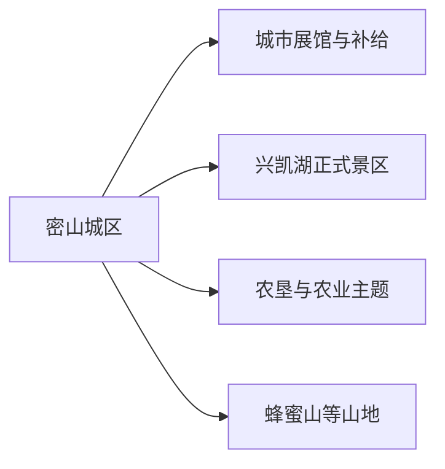
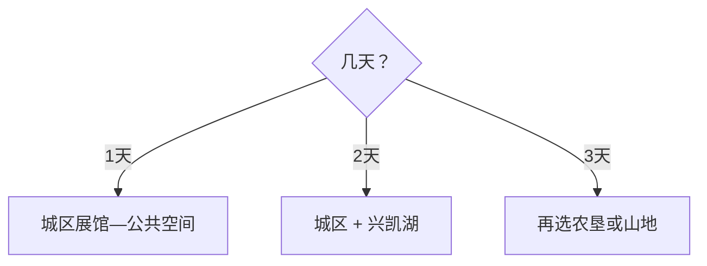

# 密山旅行指南

密山适合把城区作为补给基地，再给兴凯湖方向留出完整一天。湖泊跨中俄边境，湿地、保护区、农场与公众景区的边界需要分别确认。

> 建议停留：城区半日至 1 天；兴凯湖方向 1 天；山地或农垦主题另留 1 天 
> 旅行关键词：兴凯湖、北大荒、口岸边境、湿地、东北农业 
> 无障碍说明：城区场馆可询问电梯与轮椅；湖岸沙地、湿地栈道和山地步道的设施连续性需向官方确认

## 城市速览
| 项目 | 旅行信息 |
|---|---|
| 主要旅行价值 | 兴凯湖、三江平原农业、北大荒记忆与边境湖泊生态 |
| 建议停留 | 2–3 天 |
| 舒适季节 | 夏秋适合湖区，冬季适合冰雪但交通弹性大 |
| 预算特点 | 城区平实，湖区车辆与季节住宿增加预算 |
| 步行强度 | 城区低，湖岸中等，山地中高 |
| 天气风险 | 大风、雷雨、低温、暴雪、暗冰和湖面风浪 |
| 独行旅行 | 住城区，远线提前订正规车辆 |
| 亲子旅行 | 场馆、农垦展陈和开放湖岸短段 |
| 长者与低体力 | 一天一个远点，车辆直达服务区 |
| 行前重点 | 湖区开放、边境规则、道路、森林防火和返程 |

## 城市格局与游览区域
密山是鸡西代管的县级市，代码 `230382`。固定 GeoNames `2035746` 是城区点；法定实体 `Q203738` 的 `P1566=2033111` 连接另一记录。

| 区域 | 主要内容 | 怎么安排 | 时间 |
|---|---|---|---|
| 密山城区 | 住宿、交通和地方展陈 | 抵达日安排 | 半日至 1 天 |
| 兴凯湖方向 | 正式湖岸景区、自然教育 | 早出晚归或近湖住宿 | 1 天 |
| 农垦方向 | 北大荒与农业生产文化 | 选择明确接待项目 | 半日至 1 天 |
| 山地方向 | 蜂蜜山等正式步道 | 天气稳定时单独安排 | 1 天 |

## 主要景点
### 城区、湖泊与农垦
| 景点 | 区域 | 类型 | 主要看点 | 建议用时 | 室内外 | 体力 | 预约风险 | 天气影响 | 优先级 |
|---|---|---|---|---:|---|---|---|---|---|
| 密山市博物馆或当期地方展馆 | 城区 | 博物馆 | 地方史、边境与农业文化 | 2–3 小时 | 室内 | 低 | 高 | 低 | A |
| 兴凯湖旅游区正式开放岸段 | 兴凯湖 | 湖泊、边境生态 | 大湖、沙岸、湿地与候鸟 | 4–7 小时 | 室外 | 中 | 很高 | 很高 | A |
| 兴凯湖自然教育或博物展陈 | 湖区 | 自然教育 | 湖泊形成、湿地和生物多样性 | 1.5–3 小时 | 室内为主 | 低 | 高 | 低 | A |
| 北大荒开发建设纪念类正式场馆 | 农垦方向 | 农垦史 | 垦殖、农业机械与社会记忆 | 2–4 小时 | 混合 | 中 | 很高 | 中 | B |
| 蜂蜜山正式开放步道 | 湖区近山 | 山地、森林 | 山湖视野与森林景观 | 3–5 小时 | 室外 | 中高 | 高 | 很高 | B |
| 城区公共空间代表段 | 城区 | 城市公园 | 休息、补给和地方生活 | 1–2 小时 | 室外 | 低 | 低 | 高 | C |

兴凯湖作为一个完整湖区目的地组织，湖滩、观景台和自然展陈统一规划；国界水域、自然保护核心区、农场作业区和冬季冰面按管理要求活动。

## 美食与餐饮
| 类型 | 怎么点 | 过敏原与份量 | 选择建议 |
|---|---|---|---|
| 兴凯湖鱼菜 | 先问合法来源、品种、重量和单价 | 鱼类、鱼刺、酱油 | 选择明码标价的城区或景区餐厅 |
| 东北炖菜 | 多人分享 | 肉类、大豆、小麦和菌菇 | 独行问小锅或套餐 |
| 朝鲜族风味冷面与拌菜 | 单人友好 | 小麦、荞麦、花生、芝麻和辣椒 | 先问面粉比例和汤底 |
| 大米与杂粮 | 作为主食搭配 | 豆类与乳制品配料 | 选择本地米饭、粥和时蔬 |

## 经典行程

### 一日经典路线
**路线**：地方展馆 → 城区午餐 → 城市公共空间 → 提前确认次日车辆
- **串联逻辑**：先建立湖泊、边境和农垦背景。
- **预约锚点**：场馆开放。
- **休息安排**：全部在城区。
- **时间不足时**：只保留一座展馆。

### 两日城市路线
**第 1 天**：城区 
**第 2 天**：兴凯湖正式开放岸段 → 自然教育展陈 → 返城或近湖住宿
- **串联逻辑**：城市背景与湖区现场分日。
- **预约锚点**：湖区开放、车辆和返程。
- **休息安排**：游客中心与正式餐饮点。
- **时间不足时**：湖区只走一个开放岸段。

### 三日深度路线
**第 1 天**：城区 
**第 2 天**：兴凯湖 
**第 3 天**：农垦场馆或蜂蜜山二选一
- **串联逻辑**：湖泊之后再选择人文或山地主题。
- **预约锚点**：第三天接待和防火公告。
- **休息安排**：正式服务点。
- **时间不足时**：删除第三天。

### 雨雪天路线
**路线**：地方展馆 → 午餐 → 城区室内活动
- **适用条件**：城市道路正常。
- **串联逻辑**：避开湖岸、冰面和山路。
- **预约锚点**：场馆和交通公告。
- **休息安排**：城区室内节点。
- **时间不足时**：保留一馆。

### 亲子或低体力路线
**亲子路线**：地方展馆 → 午休 → 湖区自然教育短段 
**低体力路线**：车辆到展馆 → 午休 → 开放湖岸观景点短停
- **减负方式**：缩短沙岸与栈道距离。
- **预约锚点**：轮椅、落客、卫生间和防风空间。
- **休息安排**：展馆和游客中心。
- **时间不足时**：保留展馆。

### 远郊路线
**路线**：农垦主题与蜂蜜山二选一
- **适用条件**：正式接待、天气和返程确认。
- **串联逻辑**：生产文化与山地体验分别成线。
- **预约锚点**：场馆、林区和车辆。
- **休息安排**：服务点与镇区。
- **时间不足时**：改为城区半日。

## 住宿区域
| 区域 | 优点 | 取舍 | 适合人群 |
|---|---|---|---|
| 密山城区 | 交通、餐饮和补给集中 | 去湖区距离长 | 首访、公共交通 |
| 兴凯湖正式住宿区 | 靠近日出和湖区入口 | 季节性强 | 摄影、生态旅行 |
| 鸡西联程 | 航空和地级市服务更多 | 属跨城移动 | 多城组合 |

## 市内交通
- 密山站车次以 12306 为准；兴凯湖方向需要公路接驳。
- 湖区、农场和山地提前约定正规车辆、返程和应急联系。
- 冬季交通使用正式开放道路；边境、保护地和农业生产路服从现场管理。

## 不同旅行者须知
| 情况 | 怎么安排 | 重点核对 |
|---|---|---|
| 独行 | 住城区、白天远线 | 车辆、通信和末班 |
| 亲子 | 展馆加湖岸短段 | 防风、防晒、临水护栏 |
| 长者与低体力 | 车辆到观景点 | 轮椅、沙地、卫生间 |
| 观鸟摄影 | 用开放观察点和长焦 | 鸟季、无人机和团队限额 |
| 冬季 | 以城区和正式冰雪项目为主 | 极寒、暗冰、救援和停运 |

## 行前核对
| 项目 | 何时核对 | 官方入口 |
|---|---|---|
| 兴凯湖开放区 | 订房与订车前、当天 | [密山市人民政府](https://www.hljms.gov.cn/)及景区公告 |
| 场馆与农垦项目 | 出发前一周 | 属地文旅与运营方 |
| 铁路和道路 | 购票时及前一日 | [中国铁路 12306](https://www.12306.cn/)及交通部门 |
| 风浪、暴雪与森林火险 | 出发前三日起每日 | [中国气象局](https://www.cma.gov.cn/)及应急林草公告 |

## 来源与更新记录
| 来源 | 支持内容 | 核验日期 |
|---|---|---|
| [密山市人民政府](https://www.hljms.gov.cn/) | 市情、兴凯湖与动态入口 | 2026-08-13 |
| [密山市主要景区景点介绍](https://www.hljms.gov.cn/mss/c100524/202402/c06_287867.shtml) | 兴凯湖、蜂蜜山与北大荒主题景区 | 2026-08-13 |
| [密山市文旅局：蜂蜜山景区](https://www.hljms.gov.cn/mss/c100539/202604/c06_361524.shtml) | 蜂蜜山位置、步道与当期景区资料 | 2026-08-13 |
| [黑龙江省人民政府](https://www.hlj.gov.cn/) | 行政、保护地与边境动态入口 | 2026-08-13 |
| [民政部行政区划代码查询](https://dmfw.mca.gov.cn/xzqh/getList?code=23&trimCode=true&maxLevel=3) | `230382` 县级市层级 | 2026-08-13 |
| [GeoNames 2035746](https://www.geonames.org/2035746/mishan.html) | 固定城区点 | 2026-08-13 |
| [Wikidata Q203738](https://www.wikidata.org/wiki/Q203738) | 法定实体与 `P1566=2033111` | 2026-08-13 |

| 日期 | 更新 |
|---|---|
| 2026-08-13 | 首次完成密山市指南；建立城区、兴凯湖、农垦与山地路线。 |
