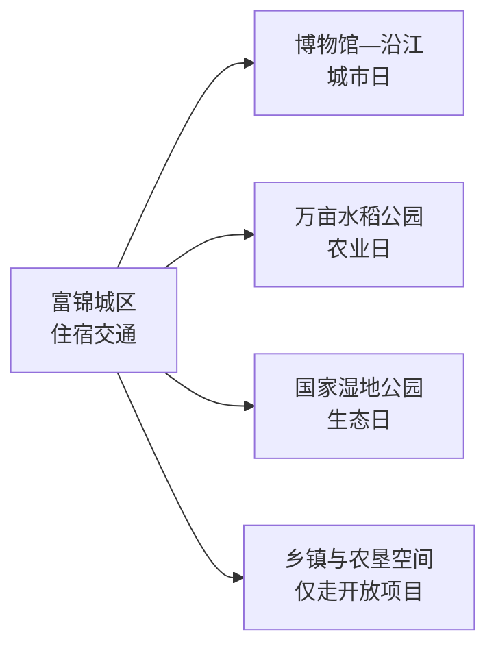
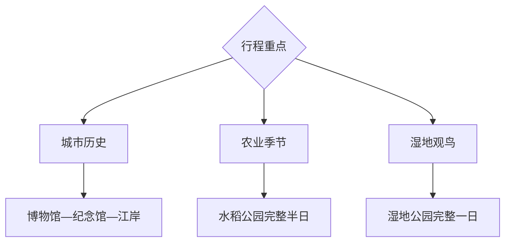

# 富锦旅行指南

富锦把三江平原的农业、湿地和松花江城市生活集中在一座县级市里。最稳妥的安排是以城区为基地，把博物馆与沿江空间放在抵达日，再分别给水稻公园和国家湿地公园留出半日至一天。

> 建议停留：城区 1 天；农业与湿地合计再留 1–2 天 
> 旅行关键词：三江平原、寒地农业、湿地、松花江、抗战记忆 
> 无障碍说明：城区场馆可优先询问电梯与轮椅；田间栈道、湿地步道和冬季冰雪路面的设施连续性需向官方确认

## 城市速览

| 项目 | 旅行信息 |
|---|---|
| 主要旅行价值 | 水稻公园、富锦国家湿地公园、城市博物馆和三江平原农业景观 |
| 建议停留 | 2–3 天，每天选择城区、农业或湿地一个主题 |
| 舒适季节 | 夏秋适合湿地和田野；冬季适合冰雪体验但交通弹性更大 |
| 预算特点 | 城区食宿较平实，远点车辆与季节活动增加预算 |
| 步行强度 | 城区低至中；湿地和农业园中等，受栈道距离影响 |
| 天气风险 | 春季大风、夏季雷雨与洪水、秋季降温、冬季严寒暗冰 |
| 独行旅行 | 城区方便，远点先锁返程车辆 |
| 亲子旅行 | 博物馆、稻作科普和湿地自然教育适合分日 |
| 长者与低体力 | 一天一处大型园区，缩短栈道 |
| 行前重点 | 湿地开放区、农事季节、道路、返程和防火防汛公告 |

## 城市格局与游览区域

富锦是佳木斯代管的县级市，代码 `230882`。城区、水稻公园与国家湿地公园方向分散，适合车辆串联。

| 区域 | 主要内容 | 怎么安排 | 时间 |
|---|---|---|---|
| 富锦城区 | 博物馆、抗战纪念馆、沿江公共空间 | 抵达日或完整一日 | 半日至 1 天 |
| 长安农业方向 | 万亩水稻公园、农事景观 | 按花期、稻季和运营公告前往 | 半日至 1 天 |
| 锦山湿地方向 | 富锦国家湿地公园 | 先核开放栈道和观鸟季 | 1 天 |
| 其他乡镇与农场 | 农业生产、林地和湿地 | 只选择正式接待项目 | 需预约 |

固定 GeoNames `2037375` 是富锦城区点；法定实体 `Q614877` 的 `P1566=2037374` 连接另一行政粒度记录。页面以固定点入账，以法定代码界定市域。

## 主要景点

### 城区与农业

| 景点 | 区域 | 类型 | 主要看点 | 建议用时 | 室内外 | 体力 | 预约风险 | 天气影响 | 优先级 |
|---|---|---|---|---:|---|---|---|---|---|
| 富锦市博物馆 | 城区 | 博物馆 | 三江平原历史、民俗与地方文物 | 2–3 小时 | 室内 | 低 | 高 | 低 | A |
| 富锦抗日战争纪念馆 | 城区 | 纪念馆 | 东北抗战与地方记忆 | 1.5–2.5 小时 | 室内 | 低 | 高 | 低 | B |
| 松花江沿江公共空间代表段 | 城区 | 城市滨水 | 江岸城市格局、日落与日常生活 | 1–2 小时 | 室外 | 低 | 低 | 很高 | B |
| 富锦锦台 | 城区 | 城市地标 | 平原城市视野和公共空间 | 1–2 小时 | 混合 | 低至中 | 中 | 高 | B |
| 富锦市水稻公园 | 长安方向 | 农业景区 | 寒地稻作、田园艺术与农事科普 | 3–5 小时 | 室外 | 中 | 高 | 很高 | A |

### 湿地与远点

| 景点 | 区域 | 类型 | 主要看点 | 建议用时 | 室内外 | 体力 | 预约风险 | 天气影响 | 优先级 |
|---|---|---|---|---:|---|---|---|---|---|
| 富锦国家湿地公园 | 锦山方向 | 湿地、自然教育 | 三江平原湿地、鸟类和栈道观察 | 4–6 小时 | 室外 | 中 | 高 | 很高 | A |
| 别拉音子山正式步道 | 县域远点 | 山地、森林 | 平原边缘山体和森林景观 | 3–5 小时 | 室外 | 中高 | 高 | 很高 | C |

水稻公园作为一个农业景区安排，田间艺术、观景台和农事体验统一规划。湿地公园使用运营方开放栈道和观察点，自然保护核心区、芦苇荡和农田生产路遵守管理边界。

## 美食与餐饮

| 类型 | 怎么点 | 份量与过敏原 | 选择建议 |
|---|---|---|---|
| 东北炖菜 | 2–4 人分享 | 可能含猪肉、鸡肉、大豆、小麦和菌菇 | 独行询问小锅或盖饭形式 |
| 江鱼 | 先问品种、来源、重量和单价 | 鱼类过敏、鱼刺和酱油麸质 | 选择明码标价、合法来源的餐馆 |
| 大米与杂粮主食 | 单人份友好 | 留意玉米、豆类和乳制品配料 | 以本地米饭、粥和面点组合 |
| 烧烤与铁锅炖 | 多人更合适 | 共用烤具、花生芝麻和辣椒 | 先问最小份量和等位时间 |

## 经典行程

### 一日经典路线

**路线**：富锦市博物馆 → 城区午餐 → 抗战纪念馆或锦台 → 松花江沿江公共空间

- **串联逻辑**：先理解平原城市历史，再到江岸观察现实城市。
- **预约锚点**：两座场馆开放时段。
- **休息安排**：午餐和下午休息均在城区。
- **时间不足时**：保留博物馆和江岸短段。

### 两日城市路线

**第 1 天**：城区经典路线 
**第 2 天**：水稻公园 → 城区晚餐

- **串联逻辑**：第一天城市史，第二天农业生产与展示。
- **预约锚点**：水稻公园季节开放和体验项目。
- **休息安排**：园区服务点与城区午晚餐。
- **时间不足时**：第二天缩为园区核心线路。

### 三日深度路线

**第 1 天**：城区 
**第 2 天**：水稻公园 
**第 3 天**：富锦国家湿地公园

- **串联逻辑**：城市、农业、湿地三种平原景观分日完成。
- **预约锚点**：湿地开放区、观鸟活动和返程车辆。
- **休息安排**：湿地游客中心和观察点分段休息。
- **时间不足时**：优先删除第三天远线。

### 雨雪天路线

**路线**：博物馆 → 城区午餐 → 抗战纪念馆或其他开放室内场馆

- **适用条件**：城市道路和场馆正常开放。
- **串联逻辑**：全部留在城区，减少田野和栈道暴露。
- **预约锚点**：临时闭馆、清雪和交通公告。
- **休息安排**：每馆之间回到城区室内休息。
- **时间不足时**：只保留一座场馆。

### 亲子或低体力路线

**亲子路线**：博物馆 → 午休 → 水稻公园当期科普项目 
**低体力路线**：博物馆 → 车辆到锦台或江岸平缓段 → 午休

- **减负方式**：每次只走一小段栈道或田间展示线。
- **预约锚点**：无障碍入口、亲子项目和车辆落客点。
- **休息安排**：场馆、游客中心和车内补水保暖。
- **时间不足时**：保留博物馆，取消户外远点。

### 远郊路线

**路线**：富锦国家湿地公园或别拉音子山二选一

- **适用条件**：道路、开放入口和返程车辆已确认。
- **串联逻辑**：湿地与山地分属不同主题和方向，一日只选一处。
- **预约锚点**：景区开放、森林防火和观鸟规则。
- **休息安排**：只使用正式服务点。
- **时间不足时**：改为水稻公园半日或城区江岸。

## 住宿区域

| 区域 | 优点 | 取舍 | 适合人群 |
|---|---|---|---|
| 富锦站—城区 | 铁路、餐饮和车辆组织方便 | 去湿地仍有公路距离 | 首访、公共交通、晚到早走 |
| 城区江岸附近 | 晚间散步方便 | 汛期和大风需调整 | 慢旅行、摄影 |
| 景区周边正式住宿 | 减少远点往返 | 季节营业和餐饮选择有限 | 农业、湿地主题 |

## 市内交通

- 富锦站是主要铁路门户，车次以 12306 为准。
- 城区用公交、出租或网约车；水稻公园、湿地公园和山地方向提前约定返程。
- 冬季把清雪、暗冰、低温电池衰减和车辆救援纳入计划。
- 农场道路、堤防、水利设施与作业区以生产管理为先，旅行车辆走公开道路和正式入口。

## 不同旅行者须知

| 情况 | 怎么安排 | 重点核对 |
|---|---|---|
| 独行 | 住城区，远线使用正规车辆 | 司机资质、返程和通信 |
| 亲子 | 博物馆加一个科普园区 | 护栏、卫生间、防蚊与防晒 |
| 长者与低体力 | 缩短栈道，车辆直达服务点 | 轮椅、落客、取暖和中途退出 |
| 观鸟摄影 | 使用开放观察点和长焦 | 鸟类繁殖期、无人机和团队限额 |
| 冬季旅行 | 上午晚些出发，日落前返城 | 极寒、风寒、暗冰和车辆状态 |

## 行前核对

| 项目 | 何时核对 | 官方入口 |
|---|---|---|
| 博物馆与纪念馆 | 到访前一周及前一日 | [富锦市景区景点目录](https://www.fujin.gov.cn/fjs/c101696/common_list.shtml) |
| 水稻公园与湿地公园 | 订车前及当天 | 富锦市政府、景区运营方和林草部门 |
| 铁路与道路 | 购票时及出发前一日 | [中国铁路 12306](https://www.12306.cn/)及富锦交通信息 |
| 洪水、大风、雷雨和极寒 | 出发前三日起每日 | [中国气象局](https://www.cma.gov.cn/)及当地应急公告 |
| 无障碍与亲子设施 | 预约时 | 场馆和游客中心 |

## 来源与更新记录

| 来源 | 支持内容 | 核验日期 |
|---|---|---|
| [富锦市景区景点目录](https://www.fujin.gov.cn/fjs/c101696/common_list.shtml) | 水稻公园、湿地公园、博物馆等官方入口 | 2026-08-13 |
| [富锦市概况](https://www.fujin.gov.cn/fjs/c101687/mlfj.shtml) | 松花江、行政与农业水域背景 | 2026-08-13 |
| [富锦市发展规划](https://www.fujin.gov.cn/fjs/c101580/202112/c04_154391.shtml) | 城区、农业、沿江和湿地旅游空间 | 2026-08-13 |
| [富锦市研学活动](https://www.fujin.gov.cn/fjs/c101599/202508/c04_156282.shtml) | 抗战纪念馆与湿地公园教育活动 | 2026-08-13 |
| [民政部行政区划代码查询](https://dmfw.mca.gov.cn/xzqh/getList?code=23&trimCode=true&maxLevel=3) | `230882` 县级市层级 | 2026-08-13 |
| [GeoNames 2037375](https://www.geonames.org/2037375/fujin.html) | 固定城区点 | 2026-08-13 |
| [Wikidata Q614877](https://www.wikidata.org/wiki/Q614877) | 法定实体与 `P1566=2037374` | 2026-08-13 |

| 日期 | 更新 |
|---|---|
| 2026-08-13 | 首次完成富锦市指南；建立城区、农业和湿地三层路线，并补充严寒、防汛、生产与生态边界。 |
