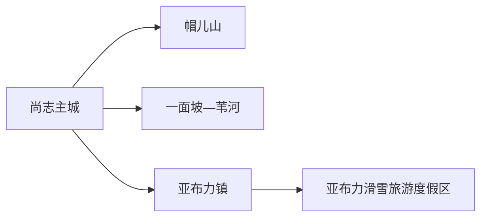
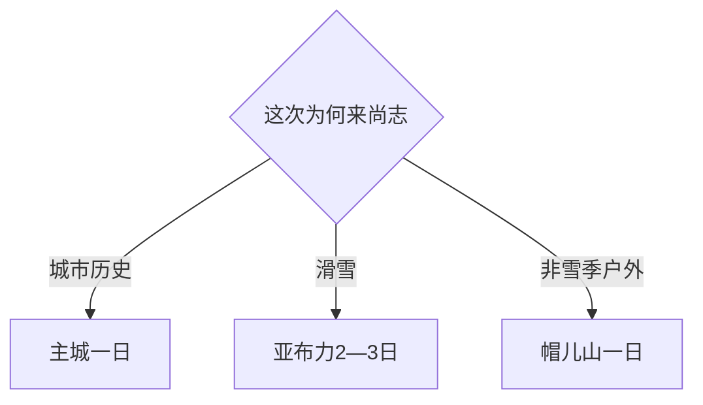

# 尚志旅行指南

尚志是哈尔滨代管的县级市，主城保存抗联与赵一曼相关记忆，亚布力是需要住宿的山地滑雪度假区，帽儿山、一面坡和苇河又各有森林、铁路与乡镇尺度。冬季可把主要预算和时间留给亚布力；非雪季则用主城历史日搭配帽儿山或亚布力山地项目。

> 建议停留：2–4 天；亚布力至少 2 天 1 晚 
> 旅行关键词：亚布力、帽儿山、赵一曼、抗联、中东铁路、森林、滑雪 
> 主要体力：主城低至中等；雪场和山地较高 
> 最近研究：2026-08-13

## 城市速览

| 项目 | 旅行信息 |
|---|---|
| 主要旅行价值 | 在抗联历史、铁路城镇和大兴安岭余脉之间选择四季山地体验，冬季以亚布力滑雪最鲜明 |
| 建议停留 | 1 天主城；2 天主城加近郊；3–4 天可完整安排亚布力或帽儿山 |
| 较舒适季节 | 冬季适合正式雪场，夏秋适合森林与山地；春融和汛期先查道路 |
| 预算特点 | 主城较易控费；雪票、课程、装备、度假住宿与山地车辆是大项 |
| 步行强度 | 主城场馆温和；雪场、帽儿山和森林步道强度差异大 |
| 主要天气风险 | 严寒、暴雪、冻雨、大风、低能见度、春融、山洪与森林火险 |
| 独行旅行 | 主城与铁路方便；滑雪先选正规雪场、课程与保险，山地远线锁返程 |
| 亲子旅行 | 以适龄雪场课程或主城场馆为主；雪圈、缆车和山地项目按年龄规则选择 |
| 长者与低体力旅行 | 主城纪念场馆或亚布力度假区游客中心短线更稳，减少雪面和登山步行 |
| 无障碍信息 | 铁路与大型度假设施可询问服务；历史建筑、雪场和山地设施连续性需向官方确认 |

## 城市格局与游览区域

尚志市行政代码 `230183`，由哈尔滨市代管。GeoNames `2035002` 与 Wikidata `Q1015925` 精确对应法定尚志市。主城尚志镇、亚布力、帽儿山、一面坡与苇河分散在滨绥铁路和公路沿线，旅行按城镇分日更稳。

| 区域 | 主要内容 | 游览特点 | 与其他区域的关系 |
|---|---|---|---|
| 尚志主城 | 赵一曼、抗联、碑林书法与城市服务 | 适合一日历史线 | 作为综合住宿基地 |
| 亚布力镇—度假区 | 多个雪场、山地项目、住宿与铁路门户 | 需先选具体雪场和住宿 | 至少住一晚，站点与雪场不等同 |
| 帽儿山 | 山地、森林与季节户外 | 登山、漂流或冬季项目随运营变化 | 从哈尔滨或尚志均可进入 |
| 一面坡—苇河 | 铁路、城镇历史与林区线索 | 接待分散，适合专题远线 | 先确认开放点与返程 |

“亚布力”包含镇区、多个铁路站、多个雪场和住宿群，路线必须落到具体运营方。赛事场地、林场作业区、封闭雪道和训练设施按公告进入；帽儿山与林区执行防火、山洪和冰雪管理。

## 主要景点

### 主城历史与公共文化

| 景点 | 区域 | 类型 | 主要看点 | 建议用时 | 室内外 | 体力 | 预约风险 | 天气影响 | 优先级 |
|---|---|---|---|---:|---|---|---|---|---|
| 赵一曼纪念园或相关正式展馆 | 主城 | 革命纪念 | 赵一曼与东北抗联地方记忆 | 2–3 小时 | 混合 | 低 | 中高 | 中 | A |
| 尚志市历史文化展馆 | 主城 | 地方博物与城市史 | 城市、铁路、抗联与地方文化 | 2–3 小时 | 室内 | 低 | 高 | 低 | A |
| 中国书法文化博物馆或碑林正式开放区 | 主城 | 书法与碑刻 | 书法、碑刻和地方文化 | 2–3 小时 | 混合 | 中 | 高 | 中 | B |

### 山地、冰雪与铁路城镇

| 景点 | 区域 | 类型 | 主要看点 | 建议用时 | 室内外 | 体力 | 预约风险 | 天气影响 | 优先级 |
|---|---|---|---|---:|---|---|---|---|---|
| 亚布力滑雪旅游度假区 | 亚布力 | 山地冰雪度假区 | 按能力选择正规雪场、课程、雪道与山地项目 | 2–3 天 | 室外为主 | 高 | 很高 | 很高 | A |
| 帽儿山正式景区 | 帽儿山 | 山地森林 | 登山、森林与当期季节项目 | 1 天 | 室外 | 高 | 高 | 很高 | B |
| 一面坡中东铁路历史文化公开点 | 一面坡 | 铁路遗产与城镇 | 铁路建筑、街区与城镇发展 | 半日至一日 | 混合 | 中 | 高 | 高 | B |
| 青山村等正式乡村旅游接待点 | 亚布力周边 | 冰雪乡村 | 雪场山下乡村、民俗与预约体验 | 3–5 小时 | 混合 | 中 | 高 | 很高 | C |

## 美食与餐饮

主城和亚布力镇适合解决正餐；雪场酒店餐饮更便利但价格差异大。林区山野菜和菌类只在正规餐馆选择可追溯食材。

| 菜品或餐饮类型 | 常见区域 | 一个人用餐与常见份量 | 风味、过敏原与饮食限制 | 排队风险与替代方法 |
|---|---|---|---|---|
| 东北炖菜与铁锅炖 | 主城、亚布力 | 多人份，先问小锅 | 肉类、鱼、豆制品、粉条和较高盐分 | 独行改点盖饭、饺子或小炒 |
| 锅包肉、杀猪菜等地方菜 | 城区、镇区 | 适合分享 | 油炸、小麦、糖、猪肉与酸菜盐分 | 小团体点一份共享，搭配时蔬 |
| 饺子、面食与早餐 | 主城、车站周边 | 适合一人 | 小麦、蛋、肉馅和芝麻按店确认 | 早班车前选营业时间明确的店 |
| 山野菜与菌菇 | 正规餐馆 | 小份尝试 | 物种和充分加热是重点 | 不自行采食，改常规蔬菜即可 |

## 经典行程

### 一日经典路线

**路线**：赵一曼相关纪念场馆 → 主城午餐 → 历史文化展馆 → 书法或碑林公开区

- **串联逻辑**：集中在主城建立抗联、城市与书法文化脉络。
- **预约锚点**：各场馆开放与讲解。
- **休息安排**：午餐和下午休息放在主城。
- **时间不足时**：保留赵一曼主题与一座历史场馆。

### 两日城市路线

**第 1 天**：尚志主城历史线 
**第 2 天**：帽儿山正式入口 → 当期主游线 → 返回

- **串联逻辑**：城市史与森林山地各占一天。
- **预约锚点**：帽儿山开放、交通与项目。
- **休息安排**：第二天使用游客中心，返城后晚餐。
- **时间不足时**：第二天缩成山脚核心段；天气不佳改主城慢游。

### 三日深度路线

**第 1 天**：抵达亚布力、适应与装备 
**第 2 天**：所选正规雪场完整日 
**第 3 天**：按体力安排半日雪上课程或山地观景 → 返程

- **串联逻辑**：先完成装备与教学，再给完整雪日，最后留返程余量。
- **预约锚点**：雪场、课程、装备、住宿、接驳与保险。
- **休息安排**：使用雪场正式暖房和酒店。
- **时间不足时**：两天只保留适应加一个完整雪日，不跨多个雪场。

### 雨雪天路线

**路线**：主城历史场馆 → 午餐 → 另一座室内展馆

- **适用条件**：普通降雪；暴雪、冻雨和道路预警时减少移动。
- **预约锚点**：场馆和交通运行。
- **休息安排**：全程主城室内。
- **时间不足时**：只留一座场馆。

### 亲子或低体力路线

**亲子路线**：适龄滑雪课程或主城纪念馆二选一 → 午休 → 短时雪地活动 
**低体力路线**：主城纪念馆 → 车辆午餐 → 历史展馆

- **减负方式**：亲子只用一处正规运营场地；低体力线减少雪面和户外停留。
- **预约锚点**：年龄、教练、护具、轮椅或接驳。
- **休息安排**：暖房、酒店或主城餐馆。
- **时间不足时**：均只保留第一项。

### 远郊一日路线

**路线**：尚志主城 → 一面坡公开铁路遗产 → 镇区午餐 → 原路返回

- **适用条件**：开放点、道路和返程明确。
- **预约锚点**：场馆或旧址接待。
- **休息安排**：镇区正规餐馆。
- **时间不足时**：整段取消，留在主城。

## 住宿区域

| 区域 | 优点 | 缺点 | 适合人群 | 交通特点 |
|---|---|---|---|---|
| 尚志主城 | 铁路、餐饮和城市服务集中 | 到亚布力度假区仍需长距离转场 | 历史、预算、多方向 | 默认非滑雪基地 |
| 亚布力镇 | 餐饮与铁路衔接较方便 | 到具体雪场仍需接驳 | 兼顾镇区和多个项目 | 核对所用车站与雪场距离 |
| 亚布力度假区 | 早进雪场、课程和装备方便 | 价格高、园区间不可互换 | 滑雪、亲子、连续雪日 | 订房时绑定具体雪场接驳 |
| 帽儿山镇 | 便于山地清晨行程 | 夜间选择较少 | 登山、漂流或季节专题 | 先落实正规住宿和返程 |

## 市内交通

| 场景 | 建议与取舍 | 行前需要重查的内容 |
|---|---|---|
| 铁路抵达 | 尚志站、亚布力站和亚布力西站服务不同目的地 | 车站、雪场接驳、雪具携带与末班 |
| 主城移动 | 公交、步行和正规叫车 | 冬季路面、夜间车辆与施工 |
| 亚布力内部 | 按酒店和雪场官方接驳安排 | 班次、园区入口、散场和装备 |
| 帽儿山与乡镇 | 城际铁路、公路或正规车辆 | 到站后末端交通与返程 |
| 自驾 | 非雪季灵活；冬季需冰雪驾驶能力 | 冬季胎、防滑、封路、停车和疲劳 |

## 不同旅行者须知

| 旅行维度 | 可行条件 | 主要取舍 | 需额外核对 |
|---|---|---|---|
| 独行旅行 | 主城和正规雪场可组织 | 课程、装备与保险优先于临时拼车 | 单人课程、雪具寄存、返程 |
| 亲子旅行 | 正规教学区或主城场馆 | 一天一个主目标 | 年龄、教练、头盔、暖房和医务 |
| 长者或低体力旅行 | 主城两馆或度假区观景 | 冰雪路面和缆车上下站需减量 | 接驳、座椅、防滑与心肺条件 |
| 无障碍需求 | 大型度假设施可咨询 | 雪场与历史建筑差异大 | 设施连续性需向官方确认 |
| 摄影旅行 | 森林、铁路与冰雪题材突出 | 严寒耗电、赛事与无人机规则 | 低温设备、航拍、日出车辆 |
| 预算有限 | 主城日易控费 | 滑雪全套成本需提前拆分 | 雪票、课程、装备、柜租和接驳 |
| 特殊天气 | 暴雪日减少移动 | 雪场开放不代表公路稳定 | 气象、道路、雪场和铁路公告 |

## 行前核对

| 核对事项 | 为什么需要重查 | 建议核对时间 | 官方入口 |
|---|---|---|---|
| 亚布力具体雪场 | “亚布力”包含多个运营主体 | 订房订票前及当天 | [黑龙江省文旅厅](https://wlt.hlj.gov.cn/) |
| 雪道、课程与装备 | 雪况、能力分级、课程和租赁变化 | 订票前 | 所选雪场官方渠道 |
| 帽儿山与林区 | 防火、降雨、冰雪和维护影响 | 出发前三日 | [尚志市政府](http://www.shangzhi.gov.cn/) |
| 铁路和接驳 | 三个主要站点不可互换 | 订票时及当天 | [中国铁路 12306](https://www.12306.cn/) |
| 严寒、暴雪与道路 | 影响雪场、山路和返程 | 出发前三日及当天 | [黑龙江省气象局](https://hl.cma.gov.cn/) |

## 来源与更新记录

### 主要来源

| 来源 | 类型 | 支持内容 | 核验日期 |
|---|---|---|---|
| [黑龙江省政府：亚布力智慧旅游](https://www.hlj.gov.cn/hlj/c108551/202510/c00_31881421.shtml) | 省政府 | 亚布力山地度假、项目与智慧服务 | 2026-08-13 |
| [黑龙江省文旅厅：亚布力青山村](https://wlt.hlj.gov.cn/wlt/c114164/202603/c00_31927266.shtml) | 省文旅厅 | 亚布力镇、雪场周边乡村与正式接待 | 2026-08-13 |
| [黑龙江省政府：亚布力安全与建设](https://www.hlj.gov.cn/hlj/c107858/202312/c00_31695003.shtml) | 省政府 | 度假区、赛事场地与安全生产边界 | 2026-08-13 |
| [黑龙江省文旅厅：铁路前往亚布力](https://wlt.hlj.gov.cn/wlt/c114254/202601/c00_31905800.shtml) | 省文旅厅 | 铁路门户和动态交通核对 | 2026-08-13 |
| [GeoNames 2035002](https://www.geonames.org/2035002/) | 开放地理数据 | 尚志城市点与坐标 | 2026-08-13 |
| [Wikidata Q1015925](https://www.wikidata.org/wiki/Q1015925) | 开放结构化数据 | 法定尚志市与精确 GeoNames 映射 | 2026-08-13 |

### 更新记录

| 日期 | 更新内容 |
|---|---|
| 2026-08-13 | 首次完成尚志市独立旅行研究；将亚布力从哈尔滨主城页迁为独立住宿目的地，并建立主城抗联、帽儿山、铁路城镇、冰雪交通与安全边界 |
