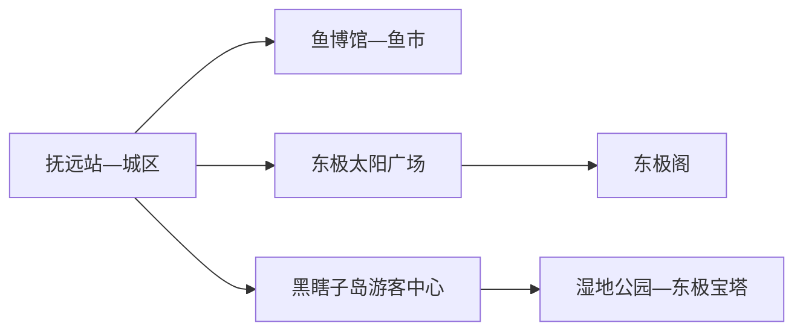
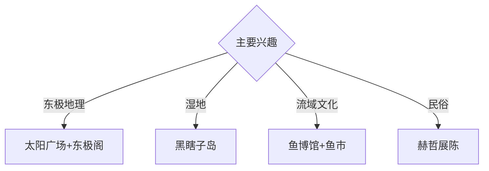

# 抚远旅行指南

抚远位于黑龙江与乌苏里江交汇方向，华夏东极、黑瞎子岛湿地、赫哲文化和淡水鱼构成完整的边境城市体验。固定快照中的 **Fuyuan / GeoNames 2037330** 对应现行抚远市；城区、东极广场和黑瞎子岛分属不同片区，适合安排两至三天。

## 城市速览

| 项目 | 信息 |
|---|---|
| 主线 | 抚远城区—东极广场—黑瞎子岛 |
| 停留 | 城区1天；东极与黑瞎子岛各另留半天至1天 |
| 住宿 | 抚远城区便于铁路、餐饮和各方向接驳 |
| 交通 | 铁路、公路抵达；景区使用正规线路、景交或约车 |
| 风险 | 边境管理、湿地保护、洪水浓雾、低温与野生动物 |

## 城市格局与游览区域

城区集中鱼博馆、鱼市和公共服务；东极太阳广场位于乌苏里江与黑龙江汇流方向；黑瞎子岛经乌苏大桥进入景区，并由游客中心组织景交。口岸出境属于另一套证件、边检和国际交通流程，不作为普通城市游览的自然延伸。

## 主要景点

| 景点 | 区域 | 类型 | 核心体验 | 用时 | 环境 | 体力 | 研究价值 | 拥挤 | 优先级 |
|---|---|---|---|---:|---|---|---|---|---|
| 抚远鱼文化体验馆或鱼博馆 | 城区 | 博物馆 | 淡水鱼、流域生态与渔业文化 | 2小时 | 室内 | 低 | 高 | 团体时中 | A |
| 抚远鱼市 | 城区 | 市场 | 黑龙江流域鱼类与城市日常 | 1–2小时 | 混合 | 低 | 中 | 早市时高 | B |
| 东极太阳广场 | 东极方向 | 地理地标 | 两江地理、日出与国土空间 | 2–3小时 | 室外 | 低中 | 很高 | 日出时高 | A |
| 东极阁与南山公开区 | 城区南部 | 城市观景 | 城市、江流与边境地理总览 | 1–2小时 | 混合 | 中 | 高 | 傍晚中 | A |
| 黑瞎子岛湿地公园 | 黑瞎子岛 | 湿地与边境 | 栈道、湿地、鸟类与岛屿地理 | 半天至1天 | 室外 | 中 | 很高 | 旺季高 | A |
| 东极宝塔公开景区 | 黑瞎子岛 | 地标与文化 | 东极地标、历史浮雕与湿地视野 | 2小时 | 室外 | 中 | 高 | 旺季中高 | A |
| 赫哲民俗展示馆 | 市域公开点 | 民俗展陈 | 赫哲文化、渔猎传统与当代生活 | 2小时 | 室内 | 低 | 高 | 团体时中 | B |

## 美食与餐饮

江鱼、鱼子、赫哲风味和东北炖菜最具辨识度。鱼类按合法来源、明码标价和适量原则选择，保护物种与禁渔期规则由正规经营者落实。观日出与黑瞎子岛日提前准备早餐、饮水和防风保暖层。

## 经典行程

### 一日东极基础线
**路线**：东极太阳广场日出—早餐—鱼博馆—鱼市—东极阁。**逻辑**：从地理位置进入流域生态与城市生活。**预约锚点**：日出接驳和馆舍开放。**休息**：城区酒店与餐馆。**删除条件**：浓雾或强风时取消日出早出。

### 黑瞎子岛生态线
**路线**：城区—岛上游客中心—湿地公园—东极宝塔—景交换乘—返城。**逻辑**：给岛屿湿地完整半天至一天。**预约锚点**：景区开放、门票和末班车。**休息**：游客中心。**删除条件**：洪水、雷雨、火险或临时边境管控时取消。

### 流域文化线
**路线**：鱼博馆—鱼市—午餐—赫哲民俗展示馆。**逻辑**：从自然生态走向渔业与民族文化。**预约锚点**：两馆开放和讲解。**休息**：城区。**删除条件**：民俗馆暂停时增加东极阁。

### 东极摄影线
**路线**：太阳广场日出—城区休整—黑瞎子岛湿地—东极阁日落。**逻辑**：按光线分配三个地理视角。**预约锚点**：天气、日出时刻和景交。**休息**：午间回酒店。**删除条件**：能见度低时改室内展陈。

### 边境历史线
**路线**：城市地理展陈—乌苏大桥公开行车段—岛上历史浮雕与地标—返城。**逻辑**：以官方景区空间理解边境变迁。**预约锚点**：讲解和边境管理提示。**休息**：岛上游客中心。**删除条件**：临时检查或景区关闭时留在城区。

### 亲子科普线
**路线**：鱼博馆—午餐—黑瞎子岛湿地公园近入口段。**逻辑**：室内鱼类知识配湿地实景。**预约锚点**：亲子讲解与景交。**休息**：馆内和游客中心。**删除条件**：蚊虫、强风或儿童体力不适时只留城区。

### 雨雪天气线
**路线**：鱼博馆—赫哲民俗展陈—正规餐馆鱼类体验—城区休整。**逻辑**：在室内保留流域文化主线。**预约锚点**：馆舍开放。**休息**：城区。**删除条件**：暴雪封路时留在住宿地。

## 住宿区域

抚远城区适合铁路抵离、餐饮和黑瞎子岛接驳；东极方向住宿适合明确的日出主题。边境、乡村和湿地附近住宿按合法经营、供暖、防洪、通信和夜间交通能力选择。

## 市内交通

抚远站与公路客运承担抵离，城区用公交、出租车和网约车。东极广场和黑瞎子岛使用正规旅游线路、约车或自驾至指定停车换乘点；冬季与汛期出行前核对道路、景交和返程。

## 不同旅行者须知

地理爱好者优先太阳广场与黑瞎子岛；观鸟者遵守保护距离和静音要求；亲子家庭优先鱼博馆与湿地公园；行动不便者确认景交上下车、栈道距离、东极阁台阶和卫生间。

## 行前核对

- 核对黑瞎子岛开放、景交、东极广场道路、日出天气和返程。
- 核对边境证件与拍摄提示、湿地保护、蚊虫、洪水和低温预警。
- 国境线、口岸、界江冰面、湿地核心区、野熊饲养管理区和渔业生产面按现场边界管理。

## 来源与更新记录

| 来源 | 支持内容 | 核验日期 |
|---|---|---|
| [黑龙江省政府：走进抚远黑瞎子岛](https://www.hlj.gov.cn/hlj/c107858/202507/c00_31853736.shtml) | 岛上景交、湿地公园、东极宝塔与保护开发关系 | 2026-09-01 |
| [黑龙江省政府：东极抚远旅游发展](https://www.hlj.gov.cn/hlj/c108552/202408/c00_31757507.shtml) | 城区、东极广场、鱼博馆、民俗与线路 | 2026-09-01 |
| [GeoNames 2037330](https://www.geonames.org/2037330/) | Fuyuan 固定人口点与位置 | 2026-09-01 |

| 日期 | 更新 |
|---|---|
| 2026-09-01 | 首次完成抚远旅行研究；建立东极、岛屿湿地、流域文化与边境历史路线。 |
