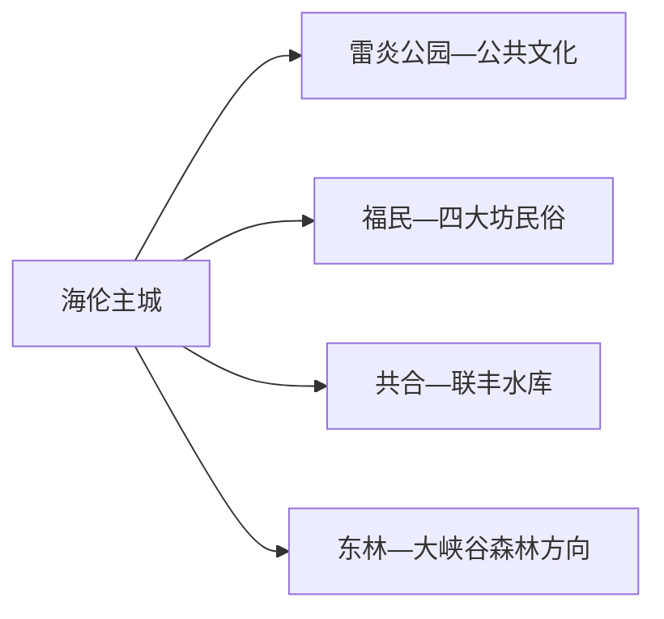
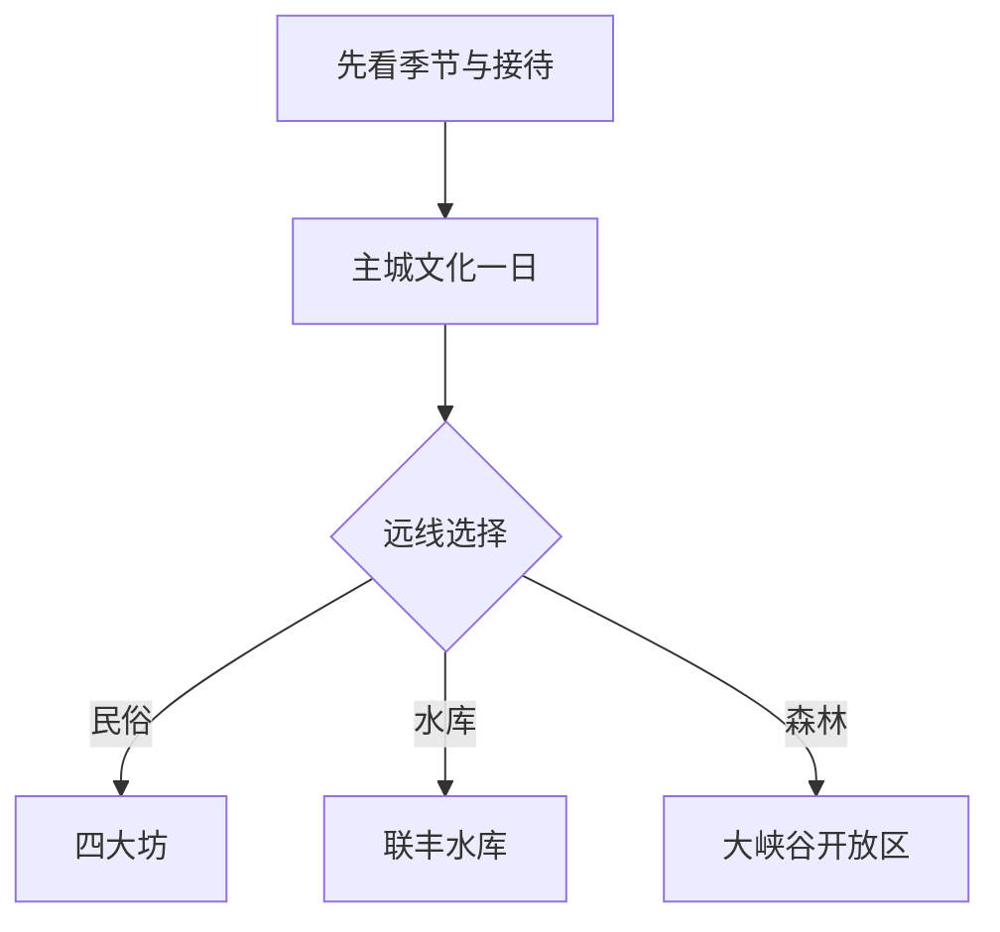

# 海伦旅行指南

海伦适合以“中国大豆名城”和剪纸民俗为入口：主城看雷炎公园、公共文化与非遗，远线再在四大坊民俗村、联丰水库或大峡谷森林方向中选一个。这里的魅力更多来自季节活动和县域生活，先确认接待与车辆，再决定是否住两晚。

> 建议停留：1–2 天 
> 旅行关键词：大豆、剪纸、雷炎公园、四大坊、联丰水库、黑土地 
> 主要体力：低至中等；森林远线较高 
> 最近研究：2026-08-13

## 城市速览

| 项目 | 旅行信息 |
|---|---|
| 主要旅行价值 | 从大豆产业、剪纸和东北民俗认识黑土地县域生活，再按季节选择水库或森林远线 |
| 建议停留 | 1 天主城与近郊；2 天增加一条正式远线 |
| 较舒适季节 | 夏秋适合乡村与公园；冬季适合正式冰雪活动但严寒与道路风险较高 |
| 预算特点 | 主城低；远线车辆、活动和乡村住宿增加预算 |
| 步行强度 | 主城低；森林、花谷和水库岸线中等至较高 |
| 主要天气风险 | 严寒、暴雪、道路结冰、大风、雷雨、洪涝和森林火险 |
| 独行旅行 | 主城方便；远线优先正规接待和明确返程 |
| 亲子旅行 | 剪纸、公共文化和正式农业体验较适合 |
| 长者与低体力旅行 | 雷炎公园、公共场馆和车辆乡村观景 |
| 无障碍信息 | 现代场馆可咨询，乡村、森林和水库设施连续性需向官方确认 |

## 城市格局与游览区域

海伦市是绥化市代管的县级市，法定代码 `231283`；GeoNames `2037069` 与 Wikidata `Q1278514` 精确对应。市域包含海伦镇等 16 镇、7 乡以及国营林场、水库和农场，旅行服务以主城为基地。

| 区域 | 主要内容 | 怎么安排 | 与其他区域的关系 |
|---|---|---|---|
| 海伦主城 | 车站、住宿、雷炎公园与公共文化 | 半日至一日 | 多日基地 |
| 四大坊—福民方向 | 民俗村、剪纸和乡村活动 | 半日至一日 | 按正式接待日期进入 |
| 联丰水库方向 | 水库生态、冬捕冬钓等活动 | 独立一日 | 水位、冰况和运营决定可行性 |
| 东方红水库—东林方向 | 水源保护、林场和森林资源 | 只进入正式景区或活动区 | 饮用水源、林场作业和防火边界优先 |
| 农场与大豆生产区 | 黑土地农业与加工 | 选择公开展陈、节庆和正规采购点 | 农田、仓储、粮库和加工线按生产管理 |

## 主要景点

### 主城与民俗

| 景点 | 区域 | 类型 | 主要看点 | 建议用时 | 室内外 | 体力 | 预约风险 | 天气影响 | 优先级 |
|---|---|---|---|---:|---|---|---|---|---|
| 雷炎公园—人民公园城市绿地 | 主城 | 城市公园 | 城市休闲、纪念空间和日常生活 | 1–2 小时 | 室外 | 低 | 低 | 高 | A |
| 海伦市公共文化场馆 | 主城 | 博物馆、文化馆与图书馆 | 地方史、大豆、剪纸及当期展览 | 1–2 小时 | 室内 | 低 | 高 | 低 | A |
| 海伦剪纸正式展陈或工坊 | 主城及接待村 | 非遗 | 剪纸技艺、作品与公开体验 | 1–2 小时 | 室内 | 低 | 很高 | 低 | A |
| 四大坊民俗文化村 | 福民方向 | 民俗与乡村 | 东北村落、民俗展示和季节活动 | 半日 | 混合 | 中 | 很高 | 高 | B |

### 水库、森林与农业

| 景点 | 区域 | 类型 | 主要看点 | 建议用时 | 室内外 | 体力 | 预约风险 | 天气影响 | 优先级 |
|---|---|---|---|---:|---|---|---|---|---|
| 联丰水库正式生态景区/活动区 | 共合方向 | 水库与季节活动 | 水库景观、正式冬捕冬钓或生态活动 | 半日至一日 | 室外 | 中 | 很高 | 很高 | B |
| 大峡谷国家森林公园正式开放区 | 东林方向 | 森林与地质 | 白桦、红松、峡谷和森林景观 | 1 天 | 室外 | 高 | 很高 | 很高 | B |
| 百兴生态文明村等正式乡村点 | 乡镇 | 乡村休闲 | 农业、村容与季节接待 | 半日 | 混合 | 中 | 很高 | 高 | C |
| 大豆、鲜食玉米等公开农业体验 | 市域 | 农业与食品 | 黑土地作物、品牌产品和正式展示 | 半日 | 混合 | 中 | 很高 | 高 | C |

东方红水库承担水源与生态治理功能，不以“水库风景”推定公共岸线；联丰水库活动也只在公布区域开展。森林、冰面、粮库、农田和加工厂按保护及生产规则进入。

## 美食与餐饮

海伦可围绕大豆制品、鲜食玉米、富硒米和东北家常菜选择。主城最适合购买标识完整的农产品和安排正餐。

| 菜品或餐饮类型 | 常见区域 | 一个人用餐与常见份量 | 风味、过敏原与饮食限制 | 排队风险与替代方法 |
|---|---|---|---|---|
| 豆浆、豆腐与豆制品 | 主城早餐店和正规商店 | 单份适合一人 | 含大豆，卤汁可能含肉和小麦酱油 | 选择配料和生产信息完整产品 |
| 鲜食玉米与玉米粥 | 市区、季节市集 | 单根或一碗适合一人 | 注意糖分和储存条件 | 非产季选择正规包装产品 |
| 东北炖菜 | 主城家常菜馆 | 多为合菜 | 常含猪肉、酸菜、大豆酱和葱蒜 | 独行问半份或点套餐 |
| 富硒米饭与农家菜 | 市区、正式乡村餐饮 | 一餐主食配菜 | “富硒”以产品标识为准，菜品可能含猪肉和油脂 | 选择明码标价的餐饮主体 |
| 冬捕鱼宴 | 联丰水库活动与主城餐馆 | 常为多人合餐 | 鱼刺、酒和大豆酱常见 | 非活动期在主城选普通鱼菜 |

## 经典行程

### 一日经典路线

**路线**：海伦站或主城 → 公共文化场馆 → 主城午餐 → 雷炎公园 → 剪纸展陈/工坊

- **串联逻辑**：用主城一天完成历史、非遗和城市生活，不依赖远郊接待。
- **预约锚点**：场馆和剪纸体验。
- **休息安排**：主城餐饮与公园服务点。
- **时间不足时**：保留公共文化和雷炎公园短段。

### 两日城市路线

**第 1 天**：主城文化线。  
**第 2 天**：四大坊民俗村或联丰水库正式活动二选一。

- **串联逻辑**：第二天只去一个方向，给县域道路和接待留余量。
- **预约锚点**：乡村/水库接待、车辆和午餐。
- **休息安排**：第一天主城；第二天使用正式接待点。
- **时间不足时**：删第二天远线。

### 三日深度路线

**第 1 天**：主城。  
**第 2 天**：民俗或水库。  
**第 3 天**：大峡谷森林开放区或公开农业体验。

- **串联逻辑**：第三天按体力和季节在森林与农业中二选一。
- **预约锚点**：森林开放、防火、农业接待和车辆。
- **休息安排**：连续住主城，远线当天往返。
- **时间不足时**：先删第三天。

### 雨雪天路线

**路线**：公共文化场馆 → 主城午餐 → 剪纸工坊或室内活动

- **适用条件**：城区交通正常；暴雪、极寒或结冰时缩短到住宿附近。
- **预约锚点**：场馆与活动状态。
- **休息安排**：同一城区片区内移动。
- **时间不足时**：只保留一座场馆。

### 亲子与低体力路线

**亲子路线**：公共文化场馆 → 剪纸体验 → 雷炎公园。  
**低体力路线**：车辆到场馆 → 主城午休 → 公园平缓短段。

- **减负方式**：亲子路线用手作替代长远线；低体力路线取消森林和冰面活动。
- **预约锚点**：体验年龄、场馆电梯和休息座椅。
- **休息安排**：主城餐饮与公共设施。
- **时间不足时**：两类路线都只保留场馆和午餐。

### 远郊一日路线

**路线**：主城 → 四大坊/联丰水库/大峡谷三选一 → 正式服务点午餐 → 返回

- **适用条件**：接待、道路和天气均确认。
- **预约锚点**：活动、车辆、防火或冰况公告。
- **休息安排**：正式游客服务和乡镇生活区。
- **时间不足时**：整段改为主城公园—非遗线。

## 住宿区域

| 区域 | 优点 | 缺点 | 适合人群 | 交通特点 |
|---|---|---|---|---|
| 海伦站—主城 | 到达、餐饮与远线出发方便 | 去森林和水库车程较长 | 首访、独行和多日旅行者 | 最适合作为基地 |
| 海西新区 | 现代住宿和城市服务较集中 | 到老城生活区需接驳 | 自驾、家庭和商务联程 | 停车相对方便 |
| 正式乡村接待点 | 靠近季节活动 | 营业、供暖、餐饮和返程需逐项确认 | 摄影、民俗与季节旅行者 | 必须先锁定接待和车辆 |

## 市内交通

| 场景 | 建议与取舍 | 行前需要重查的内容 |
|---|---|---|
| 铁路抵达 | 海伦站连接主城，车次按日期查询 | 12306、站前上客点和冬季晚点 |
| 主城移动 | 公交、出租与网约车连接场馆和公园 | 运营时间、极寒和道路施工 |
| 县域远线 | 自驾或正规包车更稳妥 | 车辆资质、返程、积雪和通信 |
| 冬季活动 | 仅按正式运营区域和冰况进入 | 冰厚、救援、保险和极寒停运 |

## 不同旅行者须知

| 旅行维度 | 可行条件 | 主要取舍 | 需额外核对 |
|---|---|---|---|
| 独行旅行 | 主城方便 | 远线先锁定车辆和接待 | 返程、通信和夜间上客点 |
| 亲子旅行 | 剪纸、公共文化与正规农业体验 | 冰面和森林按年龄取舍 | 保暖、活动保险和卫生间 |
| 长者或低体力旅行 | 主城车辆短线 | 取消长森林步道 | 电梯、座椅和室内温度 |
| 无障碍需求 | 现代场馆可咨询 | 乡村、森林和水库连续通行资料有限 | 设施连续性需向官方确认 |
| 冰雪旅行 | 正式活动和救援体系明确 | 自然冰面和水库作业区按管理范围活动 | 冰况、风寒、装备与退改 |
| 摄影旅行 | 公园、村落公共区和正式观景点 | 农田、粮库和林场作业区按生产规则 | 无人机、防火和肖像许可 |

## 行前核对

| 核对事项 | 为什么需要重查 | 建议核对时间 | 官方入口 |
|---|---|---|---|
| 乡村、森林和水库活动 | 开放、接待和季节活动变化快 | 排入路线前及当天 | [海伦市人民政府](https://www.hailun.gov.cn/) |
| 冬季冰雪 | 冰况、风寒和救援条件具有时效性 | 出发前三日及当天 | [黑龙江省气象局](https://hl.cma.gov.cn/) |
| 铁路 | 车次和停站按日期调整 | 出发前一周及当天 | [中国铁路 12306](https://www.12306.cn/) |
| 防汛与道路 | 暴雨和积水影响乡村道路 | 夏季出发前 | [海伦市防汛信息](https://www.hailun.gov.cn/hl/c20/202607/c12_237536.shtml) |

## 来源与更新记录

### 主要来源

| 来源 | 类型 | 支持内容 | 核验日期 |
|---|---|---|---|
| [黑龙江省行政区划](https://www.hlj.gov.cn/hlj/c108499/redirect_firstChannel.shtml) | 省级政府 | 海伦县级市层级与绥化代管关系 | 2026-08-13 |
| [海伦市概况](https://www.hailun.gov.cn/hl/c02/new_leftwzy.shtml) | 属地政府 | 乡镇、林场、水库、农场和城市定位 | 2026-08-13 |
| [海伦市 2026 年政府工作报告](https://www.hailun.gov.cn/hl/zfgzbg/202601/c12_226035.shtml) | 属地政府 | 大豆、剪纸、联丰水库活动、城市公园和生态治理 | 2026-08-13 |
| [海伦市中国旅游日文旅推介](https://www.hailun.gov.cn/hl/c22/202605/c12_234159.shtml) | 属地政府 | 四大坊、联丰水库、乡村点与非遗文创 | 2026-08-13 |
| [GeoNames 2037069](https://www.geonames.org/2037069/) | 开放地名库 | 城市记录与坐标 | 2026-08-13 |
| [Wikidata Q1278514](https://www.wikidata.org/wiki/Q1278514) | 开放知识库 | 法定城市实体与 GeoNames 精确映射 | 2026-08-13 |

### 更新记录

| 日期 | 更新内容 |
|---|---|
| 2026-08-13 | 首次建立海伦独立指南；以主城非遗和大豆文化为基地，把民俗、水库、森林与农业远线设为季节性选择，并明确水源、冰面、林场和生产空间边界。 |
