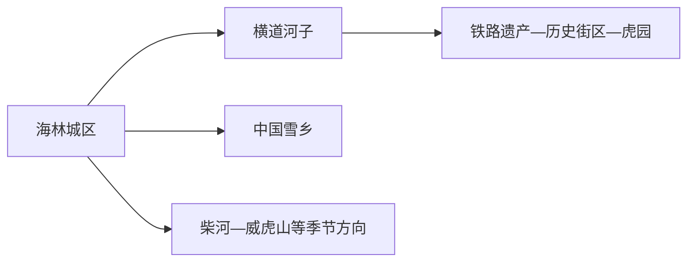
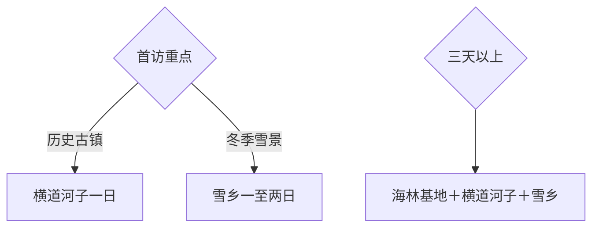

# 海林旅行指南

海林的旅行尺度跨度很大：海林城区适合作为交通与住宿基地，横道河子以铁路遗产、历史街区和东北虎主题形成完整一日，中国雪乡则需要单独核对公路、预约、住宿和严寒条件。首访可在横道河子与雪乡之间择一，三天以上再组合。

> 建议停留：2–4 天 
> 旅行关键词：横道河子、林海雪原、中国雪乡、山地森林 
> 主要体力：城区低；古镇中等；雪乡与山地中高 
> 最近研究：2026-08-12

## 城市速览

| 项目 | 旅行信息 |
|---|---|
| 主要旅行价值 | 在横道河子读铁路与近代街镇，在雪乡和林海雪原体验长冬、森林与山地 |
| 建议停留 | 1 天横道河子；雪乡另留 1–2 天；组合时至少 3 天 |
| 较舒适季节 | 夏秋适合古镇和森林；冬季雪景鲜明，但严寒、积雪与公路条件提高门槛 |
| 预算特点 | 横道河子可控，雪乡住宿、车辆、门票和冬季装备构成主要支出 |
| 步行强度 | 古镇可分段，雪地、坡道和低温会放大体力消耗 |
| 主要天气风险 | 严寒、暴雪、大风、结冰、能见度、森林火险和山区道路 |
| 独行旅行 | 横道河子较易，雪乡选择正规交通与住宿并留返程缓冲 |
| 亲子旅行 | 铁路故事和冬季雪景适合分龄体验，低温下缩短户外连续时长 |
| 长者与低体力旅行 | 以海林或横道河子短线为主，雪乡选择核心区、接驳和近距离住宿 |
| 无障碍信息 | 新建游客中心可先咨询；古镇、雪道和积雪路面的设施连续性需向官方确认 |

## 城市格局与游览区域

海林城区位于牡丹江西侧，是铁路、公路与市域服务基地；横道河子在东部铁路线上，适合独立一日；中国雪乡位于大海林林业局方向，是山地远线。柴河、威虎山等方向根据正式开放项目选择，不与雪乡同日赶场。

| 区域 | 主要内容 | 游览特点 | 与其他区域的关系 |
|---|---|---|---|
| 海林城区 | 住宿、餐饮、铁路、公路与城市公共文化 | 适合抵达和补给 | 作为市域线路基地 |
| 横道河子 | 中东铁路遗产、历史街区、东北虎林园 | 步行与短途车结合，完整一日 | 可从海林或牡丹江联程 |
| 中国雪乡 | 雪景、林区聚落、正式开放冬季体验 | 交通和住宿一体规划 | 至少独立一日，常需过夜 |
| 柴河—威虎山方向 | 森林、峡谷与红色文化项目 | 季节和运营影响大 | 作为第三日兴趣线 |

GeoNames `2037075` 与 Wikidata `Q117542` 的 `P1566` 精确对应海林，法定代码 `231083`，为牡丹江代管的县级市。横道河子和中国雪乡由海林页实质承接；牡丹江主城只保留跨城交通与行政关系。

## 主要景点

### 横道河子

| 景点 | 区域 | 类型 | 主要看点 | 建议用时 | 室内外 | 体力 | 预约风险 | 天气影响 | 优先级 |
|---|---|---|---|---:|---|---|---|---|---|
| 横道河子历史文化街区与中东铁路建筑群 | 横道河子 | 历史街区、工业遗产 | 车站、铁路建筑、街镇格局与近代交通史 | 3–4 小时 | 混合 | 中 | 中；场馆与保护建筑开放需核 | 中高 | A |
| 横道河子东北虎林园 | 横道河子 | 野生动物展示、科普 | 东北虎观察与保护教育 | 2–3 小时 | 混合 | 低至中 | 高；场次、票务和安全规则需核 | 中高 | A |
| 横道河子镇公共文化空间 | 横道河子 | 展览、街镇生活 | 地方历史、摄影与季节活动 | 1–2 小时 | 混合 | 低 | 中；具体点位需核 | 中 | B |

### 雪乡与森林

| 景点 | 区域 | 类型 | 主要看点 | 建议用时 | 室内外 | 体力 | 预约风险 | 天气影响 | 优先级 |
|---|---|---|---|---:|---|---|---|---|---|
| 中国雪乡国家森林公园 | 大海林林业局方向 | 冬季景区、森林 | 雪蘑菇、林区聚落、雪景步道与夜景 | 1–2 天 | 室外为主 | 中高 | 高；实名、住宿、交通需核 | 极高 | A |
| 林海雪原红色文化方向 | 市域林区 | 红色文化、森林 | 文学影视记忆与林区历史 | 2–4 小时 | 混合 | 中 | 高；运营和接待需核 | 高 | B |
| 柴河九寨等正式开放森林项目 | 柴河方向 | 森林、峡谷 | 林海、水景和步道 | 1 天 | 室外 | 中高 | 高；开放、道路与火险需核 | 高 | C |

横道河子历史街区内部建筑作为一个整体片区理解，不将每栋建筑重复计数。雪乡的观景台、雪韵大街和运营项目属于同一父景区；自发穿越林区、非开放雪道和生产林场不纳入旅行路线。

## 美食与餐饮

| 菜品或餐饮类型 | 常见区域 | 一个人用餐与常见份量 | 风味、过敏原与饮食限制 | 排队风险与替代方法 |
|---|---|---|---|---|
| 东北炖菜与铁锅菜 | 海林城区、横道河子 | 多人共享，一人问小锅 | 肉类、大豆、粉条和盐分 | 选套餐或家常菜小份 |
| 锅包肉、熘炒菜 | 城区和镇区 | 份量偏大 | 小麦、淀粉、糖和油 | 多人共享或换盖饭 |
| 粘豆包、冻梨等冬季食物 | 正规餐馆与市场 | 适合少量尝试 | 糯米、豆馅、糖；肠胃敏感控制冰冷食物 | 选室内食用和小份 |
| 菌菇与山野菜 | 正规餐馆 | 适合共享 | 选择可追溯、充分熟制食材 | 换常规蔬菜 |

## 经典行程

### 一日经典路线

**路线**：海林／牡丹江出发 → 横道河子历史街区 → 午餐 → 东北虎林园 → 返程

- **串联逻辑**：铁路历史与野生动物科普在同镇完成，减少跨方向移动。
- **预约锚点**：虎园票务、场次和历史建筑开放。
- **休息安排**：镇区午餐，下午入园前坐休。
- **时间不足时**：保留历史街区，虎园按兴趣取舍。

### 两日城市路线

**第 1 天**：海林城区 → 横道河子整日。 
**第 2 天**：海林公共文化 → 一个正式开放的近郊项目。

- **串联逻辑**：首日完成强主题古镇，次日保留低强度和交通弹性。
- **预约锚点**：第二天项目的开放、车辆与返程。
- **休息安排**：住海林城区，避免连续远线。
- **时间不足时**：第二天缩为城区半日。

### 三日深度路线

**第 1 天**：海林城区与横道河子。 
**第 2 天**：前往中国雪乡并游览核心区。 
**第 3 天**：雪乡短线 → 按预定车辆返程。

- **串联逻辑**：先完成铁路文化，再为雪乡留足往返和天气缓冲。
- **预约锚点**：雪乡门票、住宿、车辆和退改规则。
- **休息安排**：雪乡每次户外后回室内取暖，返程日留大段缓冲。
- **时间不足时**：整段删除雪乡，改为横道河子加海林两日。

### 雨雪天路线

**路线**：海林或横道河子正式开放的室内场馆 → 午餐 → 历史街区短段

- **适用条件**：普通降雪；暴雪、低能见度或结冰时以室内和返程为先。
- **串联逻辑**：先室内，天气稳定后补一段近距离街区。
- **预约锚点**：场馆开放、铁路和公路状态。
- **休息安排**：室内取暖点和镇区餐饮。
- **时间不足时**：保留单一室内场馆。

### 亲子或低体力路线

**亲子路线**：横道河子铁路街区短线 → 午餐 → 东北虎林园。 
**低体力路线**：车辆到横道河子核心 → 单一场馆／街区短段 → 早返。

- **减负方式**：亲子线减少连续户外暴露；低体力线避开雪地长走和多次换乘。
- **预约锚点**：虎园场次、下客点、座椅和取暖处。
- **休息安排**：午间长休，冬季每小时评估保暖状态。
- **时间不足时**：两类路线都保留一个主点。

### 远郊一日路线

**路线**：海林城区 → 中国雪乡 → 核心开放区 → 按预定车辆返程

- **适用条件**：当日往返车辆、道路、风雪与开放时间均稳定；否则采用住宿方案。
- **串联逻辑**：雪乡作为单一整日目的地，不再叠加其他山地。
- **预约锚点**：实名票、车辆、返程、保暖装备和应急联系。
- **休息安排**：游客中心、餐饮区和室内取暖点分段使用。
- **时间不足时**：雪乡整体改期，选择横道河子。

## 住宿区域

| 区域 | 优点 | 缺点 | 适合人群 | 交通特点 |
|---|---|---|---|---|
| 海林城区 | 铁路、公路、餐饮和价格选择较多 | 到雪乡距离长 | 首访、公共交通、多日基地 | 适合横道河子与市域线路前后住宿 |
| 横道河子镇 | 早晚街镇体验完整 | 住宿和餐饮选择较少 | 摄影、历史街区、慢旅行 | 先核供暖、到站接驳和退改 |
| 中国雪乡核心运营区 | 便于夜景和清晨雪景 | 旺季价格、容量和退改约束大 | 冬季雪景、两日线 | 与门票、车辆、住宿成套预订 |

## 市内交通

| 场景 | 建议与取舍 | 行前需要重查的内容 |
|---|---|---|
| 铁路抵达 | 海林站、横道河子站按票面站名选择；牡丹江可作外部门户 | 车次、停站、接驳和末班 |
| 横道河子 | 铁路或公路抵达后步行加短途车 | 历史街区开放、虎园接驳 |
| 中国雪乡 | 选择官方或正规客运、自驾按冬季路况评估 | 预约、路况、限行、停车、返程 |
| 山地森林 | 一日只走一个方向 | 开放、火险、信号和救援条件 |

## 不同旅行者须知

| 旅行维度 | 可行条件 | 主要取舍 | 需额外核对 |
|---|---|---|---|
| 独行旅行 | 横道河子公共交通较清晰 | 雪乡采用正规车辆和住宿 | 返程、夜间温度、应急联系 |
| 亲子旅行 | 铁路故事和动物科普可组合 | 严寒下缩短室外时间 | 儿童保暖、场次、卫生间 |
| 长者或低体力旅行 | 单镇短线和车辆直达 | 雪地、台阶与候车时间 | 防滑、取暖、下客点 |
| 无障碍需求 | 新建游客设施优先咨询 | 古镇、雪路和山地连续性有限 | 设施连续性需向官方确认 |
| 冬季旅行 | 分层保暖、备用电源和可退改交通齐备 | 户外时间服从气温和风力 | 低温预警、道路、医疗和停运 |
| 摄影旅行 | 古镇建筑、森林和雪景题材丰富 | 极寒耗电、结露与景区拍摄规则 | 三脚架、无人机、商业拍摄 |
| 保护与生产空间 | 采用开放景区、道路和步道 | 林班、作业区和非开放雪道按管理边界避让 | 防火、封闭区与项目资质 |

## 行前核对

| 核对事项 | 为什么需要重查 | 建议核对时间 | 官方入口 |
|---|---|---|---|
| 雪乡开放与预约 | 季节、容量、票务和运营项目会调整 | 订住宿前及前一日 | [中国雪乡官方服务](https://m.zhongguoxuexiang.com/) |
| 冬季交通 | 暴雪、结冰、限流和车辆资质影响抵达 | 出发前三日及当天 | [黑龙江省交通运输厅](https://jt.hlj.gov.cn/) |
| 横道河子项目 | 场馆、虎园场次和活动具有时效 | 排路线前 | [海林市人民政府旅游概览](https://www.hailin.gov.cn/mdjhlsrmzf/religion/tt.shtml) |
| 铁路 | 停站与时刻变化 | 购票前及当天 | [中国铁路12306](https://www.12306.cn/) |
| 天气与火险 | 严寒、暴雪和森林火险影响远线 | 出发前三日及当天 | [黑龙江省气象局](http://hl.cma.gov.cn/) |

## 来源与更新记录

### 主要来源

| 来源 | 类型 | 支持内容 | 核验日期 |
|---|---|---|---|
| [海林旅游概览](https://www.hailin.gov.cn/mdjhlsrmzf/religion/tt.shtml) | 海林市人民政府 | 横道河子、雪乡、森林与文旅品牌 | 2026-08-12 |
| [海林行政区划与交通](https://www.hailin.gov.cn/mdjhlsrmzf/administrativedivision/tt.shtml) | 海林市人民政府 | 市域格局、镇域与交通关系 | 2026-08-12 |
| [海林市情概览](https://www.hailin.gov.cn/mdjhlsrmzf/hlgk/202603/c03_350257.shtml) | 海林市人民政府 | 城市现状与区域背景 | 2026-08-12 |
| [横道河子文旅资料](https://www.hailin.gov.cn/mdjhlsrmzf/straightincounties/202501/c03_988268.shtml) | 海林市人民政府 | 历史街区与旅游方向 | 2026-08-12 |
| [2025—2026雪乡雪季资料](https://www.hlj.gov.cn/hlj/c107856/202511/c00_31889398.shtml) | 黑龙江省人民政府 | 当季运营与动态核对边界 | 2026-08-12 |
| [Wikidata Q117542](https://www.wikidata.org/wiki/Special:EntityData/Q117542.json) | 开放结构化数据 | 海林与 GeoNames 精确交叉核验 | 2026-08-12 |
| [GeoNames 2037075](https://sws.geonames.org/2037075/about.rdf) | 开放地名数据 | 固定海林城市记录 | 2026-08-12 |
| [民政部行政区划代码查询](https://dmfw.mca.gov.cn/xzqh/getList?code=231083&trimCode=false&maxLevel=3) | 国家行政区划数据 | 法定代码 231083 | 2026-08-12 |

### 更新记录

| 日期 | 更新内容 |
|---|---|
| 2026-08-12 | 首次完成海林指南，核验横道河子、雪乡、山地、冬季交通和县级市边界 |
