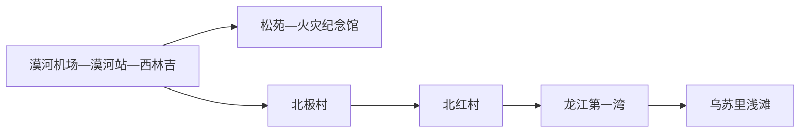
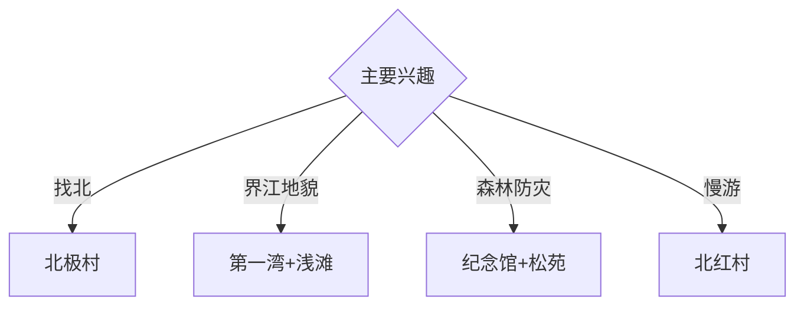

# 漠河旅行指南

漠河位于大兴安岭北部，西林吉城区、北极村、北红村和龙江第一湾形成分散的极地旅行结构。固定快照中的 **Mohe / GeoNames 2033822** 对应现行漠河市；“找北”需要在森林防火、边境管理和极寒天气框架内安排三至四天。

## 城市速览

| 项目 | 信息 |
|---|---|
| 主线 | 西林吉城区—北极村—龙江第一湾与乌苏里浅滩 |
| 停留 | 城区1天；北极村1天；西北环线1–2天 |
| 住宿 | 西林吉便于抵离；北极村适合夜景与清晨；北红村按路线选择 |
| 交通 | 航空、铁路抵达；远端使用正规包车、线路或具备冬季条件的自驾 |
| 风险 | 极寒、森林火险、边境冰面、长距离道路、通信与野生动物 |

## 城市格局与游览区域

西林吉城区承担航空、铁路、补给和防灾教育；北极村距城区约77公里，是成熟景区与住宿节点。北红村、龙江第一湾和乌苏里浅滩形成更长的西北环线，冬季日照短、手机信号与道路条件会压缩有效游览时间。

## 主要景点

| 景点 | 区域 | 类型 | 核心体验 | 用时 | 环境 | 体力 | 研究价值 | 拥挤 | 优先级 |
|---|---|---|---|---:|---|---|---|---|---|
| 北极村景区 | 北极镇 | 边境村落 | 最北地理、界江、村落与季节天象 | 1天 | 混合 | 中 | 很高 | 旺季高 | A |
| 大兴安岭“五·六”火灾纪念馆 | 西林吉 | 博物馆 | 森林火灾史、防灾与城市重建 | 2–3小时 | 室内 | 低 | 很高 | 团体时中 | A |
| 松苑原始森林公园 | 西林吉 | 城市森林 | 城中森林、火灾记忆与树种观察 | 1–2小时 | 室外 | 低中 | 高 | 旺季中 | A |
| 龙江第一湾景区 | 西北方向 | 界江地貌 | 黑龙江河曲、森林与高点视野 | 半天 | 室外 | 高 | 很高 | 旺季中高 | A |
| 乌苏里浅滩正式景区 | 西北方向 | 地理地标 | 中国北端地理与界江景观 | 2–3小时 | 室外 | 中 | 高 | 旺季中 | A |
| 北红村公开接待区 | 北极镇北部 | 边境村落 | 北方村落、森林与慢生活 | 半天至1天 | 混合 | 低中 | 中 | 旺季中 | B |
| 九曲十八弯正式观景区 | 图强方向 | 湿地森林 | 河湾、湿地与大兴安岭森林 | 2小时 | 室外 | 中 | 高 | 日出时中 | B |

## 美食与餐饮

铁锅炖、冷水鱼、蓝莓制品、木耳和东北家常菜适合寒地补给。野生菌、浆果和鱼类选择正规经营渠道；冬季随身准备高热量小食和保温饮水，酒精与户外御寒、驾车分开。

## 经典行程

### 一日城区基础线
**路线**：火灾纪念馆—松苑—午餐—城市公共空间—行程说明会。**逻辑**：先理解森林火险与极地城市，再进入远端路线。**预约锚点**：纪念馆开放和次日车辆。**休息**：西林吉城区。**删除条件**：极寒时缩短松苑步行。

### 北极村找北线
**路线**：城区—北极村游客中心—最北主题公开点—界江观景—村内住宿或返城。**逻辑**：把地理、边境和村落体验集中一天。**预约锚点**：门票、接驳和住宿。**休息**：景区服务区。**删除条件**：暴雪、极寒或边境临时管控时推迟。

### 第一湾浅滩线
**路线**：正规车辆—龙江第一湾—午间补给—乌苏里浅滩—返宿。**逻辑**：用完整一天完成西北界江地貌。**预约锚点**：车辆、道路、景区开放和日落时间。**休息**：沿线正规服务点。**删除条件**：道路结冰、能见度低或通信风险上升时取消。

### 北红村慢游线
**路线**：北极村或城区—北红村公开接待区—村落步行—正规住宿。**逻辑**：降低点位密度，观察边境村落生活。**预约锚点**：住宿、供暖和车辆。**休息**：民宿公共区。**删除条件**：接待暂停或道路管控时返回成熟景区。

### 森林地貌线
**路线**：西林吉—九曲十八弯观景区—图强方向正规生态点—返城。**逻辑**：集中观察湿地河湾和森林。**预约锚点**：景区开放、林火和返程。**休息**：游客服务点。**删除条件**：林火、雷雨或暴雪预警时取消。

### 亲子防灾线
**路线**：火灾纪念馆—午休—松苑近入口段—北极村室内展陈。**逻辑**：防灾教育配低体力森林观察。**预约锚点**：馆舍和景区接驳。**休息**：馆内与酒店。**删除条件**：低温超出儿童适应范围时只留室内。

### 极端天气线
**路线**：住宿地—就近室内展陈—正规餐饮—装备与路况复核。**逻辑**：把安全窗口留给后续远端行程。**预约锚点**：交通运营与预警。**休息**：供暖住宿。**删除条件**：道路恢复前持续留在安全地点。

## 住宿区域

西林吉城区适合航空铁路抵离、补给和天气缓冲；北极村适合成熟景区与夜间活动；北红村适合有可靠车辆的环线慢游。冬季住宿重点核对供暖、消防、热水、通信、备用电源和道路接送。

## 市内交通

漠河机场、漠河站与公路客运承担外部抵离。北极村和西北环线使用正规旅游线路、包车或具备寒区经验的自驾方案；车辆准备冬季轮胎、应急保暖、燃油和通信备份，并服从道路封控。

## 不同旅行者须知

地理旅行者给北极村与西北环线各一天；摄影者以安全接驳和天气窗口优先；亲子家庭控制极寒暴露时间；行动不便者确认观景台阶、雪地路面、车辆上下客和无障碍卫生间。

## 行前核对

- 核对北极村、第一湾、浅滩、九曲十八弯开放、车辆、住宿和返程。
- 核对森林防火期、极寒暴雪、道路、日照、通信、边境与拍摄提示。
- 黑龙江冰面、国境线、森林防火区、林业生产道和自然保护地按正式边界与现场指引进入。

## 来源与更新记录

| 来源 | 支持内容 | 核验日期 |
|---|---|---|
| [漠河市政府：北极村景区简介](https://mohe.gov.cn/mohe/c101210/202309/c13_258538.shtml) | 北极村位置、距离、资源与景区属性 | 2026-09-01 |
| [漠河市政府：旅游查询](https://mohe.gov.cn/mohe/c101203/lyxz.shtml) | 森林防火期与边境冰面管理 | 2026-09-01 |
| [GeoNames 2033822](https://www.geonames.org/2033822/) | Mohe 固定人口点与位置 | 2026-09-01 |

| 日期 | 更新 |
|---|---|
| 2026-09-01 | 首次完成漠河旅行研究；建立城区、北极村、西北环线与森林防灾路线。 |
