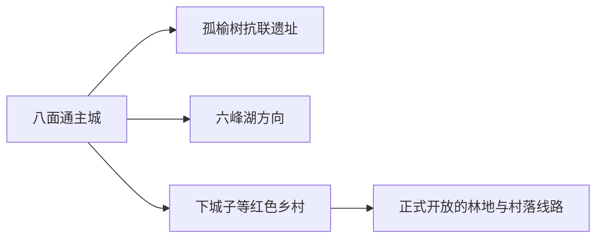
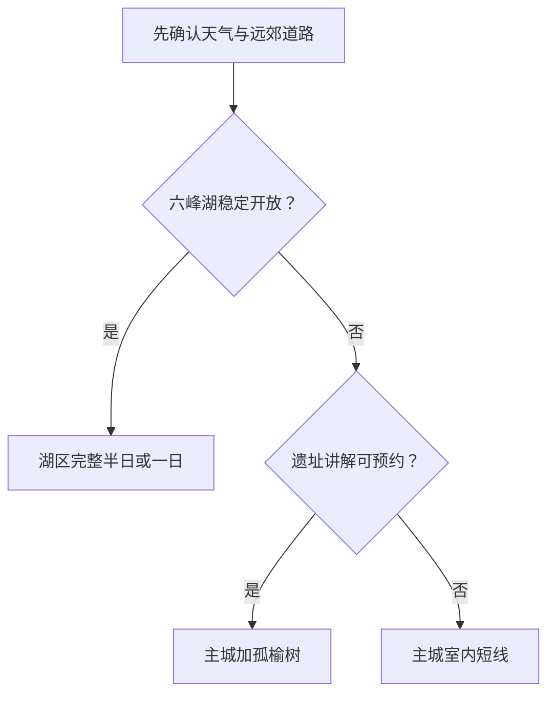

# 穆棱旅行指南

穆棱适合从八面通镇出发，把东北山地城市、抗联历史、森林湖泊和边境腹地乡村组合成一段慢旅行。第一次到访可用一天认识主城与孤榆树抗联遗址，再按开放和路况选择六峰湖或红色乡村线路。

## 城市速览

| 项目 | 信息 |
|---|---|
| 旅行主线 | 八面通主城、孤榆树抗联遗址、六峰湖、红色乡村与林区景观 |
| 建议停留 | 1 天主城与孤榆树；2 天加入六峰湖或一条正式乡村线 |
| 住宿基地 | 八面通镇补给和交通最稳；远郊住宿用于接待已确认的专项行程 |
| 步行强度 | 主城低至中等；遗址、湖区和林地中等，冰雪期明显上升 |
| 主要天气 | 严寒、暴雪、结冰、浓雾、夏季强降雨与森林火险 |
| 预约核心 | 场馆、抗联遗址讲解、远郊车辆、景区开放和返程 |
| 边界重点 | 林业生产区、自然保护空间、文保遗址和边境方向按公告进入 |
| 标识说明 | GeoNames 城市点是八面通驻地；法定旅行范围以穆棱市区划为准 |

## 城市格局与游览区域

穆棱市是牡丹江市代管的县级市，法定代码 `231085`。GeoNames `2038482` 是名为 Muling 的城市居民点，实际定位八面通主城；Wikidata `Q1231461` 的 `P1566` 指向较广的 `2035700`。本页用固定清单城市点建页，行政归属仍按法定穆棱市理解。

| 区域 | 旅行价值 | 怎么安排 |
|---|---|---|
| 八面通主城 | 到达、住宿、餐饮、公共文化与城市生活 | 抵达日或完整半日 |
| 孤榆树方向 | 东北抗联历史、遗址与纪念空间 | 与主城组成一日，优先预约讲解 |
| 六峰湖方向 | 湖泊、森林和季节景观 | 开放、道路和返程明确时留半日至一日 |
| 下城子及乡村方向 | 红色历史、村落与农业景观 | 采用官方线路或可靠车辆分段游览 |

## 主要景点

| 景点 | 所在区域 | 类型 | 核心看点 | 建议用时 | 室内/室外 | 体力 | 预约难度 | 天气敏感度 | 适合旅程 |
|---|---|---|---|---|---|---|---|---|---|
| 八面通公共文化场馆 | 主城 | 地方文化 | 穆棱地方史、城市生活与当期展陈 | 1–2 小时 | 室内 | 低 | 中 | 低 | A |
| 孤榆树东北抗联密营教育基地 | 孤榆树方向 | 红色遗址 | 抗联历史、遗址环境与纪念教育 | 2–3 小时 | 混合 | 中 | 高 | 高 | A |
| 六峰湖生态旅游区 | 六峰湖方向 | 湖泊与森林 | 水面、山林和季节性户外活动 | 3–5 小时 | 室外为主 | 中 | 高 | 极高 | B |
| 下城子红色文化公开点 | 下城子方向 | 红色文化与乡村 | 地方革命史和乡村空间 | 2–3 小时 | 混合 | 低至中 | 高 | 高 | B |
| 正式开放的乡村接待点 | 市域乡村 | 乡村体验 | 农业、村落生活与季节产品 | 2–4 小时 | 混合 | 中 | 高 | 高 | C |

遗址参观按文物保护和讲解路线进行。林业作业道、封育区、自然保护空间和未开放山沟维持原有管理用途；森林防火期以属地管控为准。

## 美食与餐饮

| 类型 | 适合场景 | 份量 | 过敏与饮食提示 | 怎么选 |
|---|---|---|---|---|
| 东北炖菜 | 主城多人正餐 | 通常较大 | 肉类、豆制品、菌菇与高盐 | 先问份量，两三人共享更合适 |
| 朝鲜族风味冷面与拌菜 | 主城简餐 | 单人友好 | 荞麦、小麦、芝麻、花生和辣椒 | 逐项确认面汤与拌料 |
| 山野菜与菌菇 | 季节正餐 | 视菜品而定 | 过敏与误食风险 | 选择正规餐馆和可追溯食材 |
| 本地大豆、杂粮与农产 | 早餐或伴手礼 | 易拆分 | 豆类和坚果过敏 | 看生产信息、保质期和携带条件 |

## 经典行程

### 一日经典路线

**路线**：八面通公共文化场馆 → 午餐 → 孤榆树抗联遗址 → 返回主城

- **串联逻辑**：先建立城市背景，再通过遗址理解穆棱的抗联记忆。
- **预约锚点**：场馆、遗址开放与讲解。
- **休息安排**：午餐长休，遗址入口确认卫生间和座椅。
- **时间不足时**：保留遗址和主城午餐。

### 两日城市路线

**第 1 天**：主城与孤榆树 
**第 2 天**：六峰湖正式开放区

- **串联逻辑**：历史和自然分日，减少远郊折返。
- **预约锚点**：六峰湖开放、车辆和返程。
- **休息安排**：第二日以游客服务点为固定休息点。
- **时间不足时**：删除第二日。

### 三日深度路线

**第 1 天**：八面通主城 
**第 2 天**：孤榆树抗联遗址 
**第 3 天**：下城子正式红色乡村线

- **串联逻辑**：把城市、核心遗址与乡村叙事分别展开。
- **预约锚点**：讲解、乡村接待、道路与往返车辆。
- **休息安排**：每天午间回到有餐饮和供暖或遮阴的接待点。
- **时间不足时**：优先删除第三日。

### 雨雪天气路线

**路线**：主城室内场馆 → 午餐 → 住宿休息或近距离城市观察

- **适用条件**：城市道路正常；暴雪、冻雨或强降雨预警时按公告收缩。
- **预约锚点**：场馆和城市交通运行。
- **休息安排**：全程用室内空间承接。
- **时间不足时**：只留一座场馆。

### 亲子路线

**路线**：主城场馆 → 午餐 → 孤榆树讲解短线

- **适用条件**：讲解和步行段适合儿童年龄。
- **预约锚点**：亲子讲解、卫生间与车辆。
- **休息安排**：遗址只走正式短线，中途安排室内休息。
- **时间不足时**：保留主城场馆。

### 低体力路线

**路线**：车辆抵达主城场馆 → 午餐长休 → 孤榆树入口附近核心展示

- **适用条件**：落客、坡度和地面状况已确认。
- **预约锚点**：无障碍入口、轮椅、座椅与卫生间。
- **休息安排**：每处只看核心单元。
- **时间不足时**：只留主城场馆。

### 六峰湖季节路线

**路线**：八面通出发 → 六峰湖游客入口 → 开放步道短段 → 午餐与休息 → 原路返回

- **适用条件**：景区、天气、森林防火和道路条件均明确。
- **预约锚点**：门票或接待、车辆、开放线和返程。
- **休息安排**：使用正式服务点，不把野外空地当固定补给点。
- **时间不足时**：整段改为主城线。

## 住宿区域

| 区域 | 优点 | 取舍 | 适合人群 | 核对项 |
|---|---|---|---|---|
| 八面通主城 | 餐饮、补给和临时改线方便 | 前往远郊仍需车辆 | 首访、独行、多日旅行 | 供暖、停车、电梯、早餐与夜间入住 |
| 远郊正规接待住宿 | 靠近专项自然或乡村路线 | 服务密度、通信和退改差异大 | 摄影、研学、已锁定车辆者 | 证照、消防、供暖热水、餐食与返程 |

## 市内交通

穆棱对外可经铁路和公路抵达八面通。主城用公交、出租车或短段步行；孤榆树、六峰湖和乡村线路更适合正规包车、自驾或当期旅游线路。铁路购票核对“八面通”与其他同名或相近站点，远线每天只选一个方向。

| 场景 | 怎么做 | 行前核对 |
|---|---|---|
| 铁路抵达 | 按票面站名转入八面通主城 | 车次、晚点、站前接驳 |
| 主城移动 | 公交与短程车辆连接场馆、餐饮和住宿 | 首末班、积雪与施工 |
| 远郊线路 | 使用已确认车辆并预留返程余量 | 道路、通信、加油、防火与封闭 |

## 不同旅行者须知

| 旅行者 | 推荐做法 | 重点核对 |
|---|---|---|
| 独行 | 住八面通，远郊使用正规线路或可靠车辆 | 司机资质、返程与通信 |
| 亲子 | 主城场馆加遗址讲解短线 | 年龄、卫生间、防寒防晒 |
| 长者与低体力 | 车辆串联主城与落客条件明确的核心展示 | 坡度、座椅、轮椅与医疗点 |
| 摄影 | 湖区和遗址分日，使用公共拍摄位 | 无人机、文保、林区与低温电池 |
| 冬季旅行 | 住主城并保留机动时段 | 暴雪、结冰、供暖和道路封闭 |

## 行前核对

- 穆棱市政府与文旅部门：景区、场馆、红色线路和活动动态。
- 黑龙江交通与交警：远郊道路、降雪、施工和临时管制。
- 中国铁路 12306：车次、完整站名和退改。
- 黑龙江省气象与林草部门：暴雪、寒潮、强降雨和森林防火。

## 来源与更新记录

| 来源 | 支持内容 | 核验日期 |
|---|---|---|
| [穆棱市人民政府：市情与区划](https://muling.gov.cn/mdjmlsrmzf/c103151/xzqh_tt.shtml) | 八面通驻地、法定区划与市域关系 | 2026-08-30 |
| [穆棱市人民政府：孤榆树东北抗联密营教育基地](https://www.muling.gov.cn/mdjmlsrmzf/c103174/202410/c03_980279.shtml) | 遗址、抗联历史与接待线索 | 2026-08-30 |
| [穆棱市人民政府：红色旅游线路](https://muling.gov.cn/mdjmlsrmzf/c103175/202405/c03_943564.shtml) | 红色乡村线路与节点关系 | 2026-08-30 |
| [穆棱市人民政府：六峰湖](https://www.muling.gov.cn/mdjmlsrmzf/c103174/202012/c03_480798.shtml) | 湖区位置、生态与旅游线索 | 2026-08-30 |
| [Wikidata Q1231461](https://www.wikidata.org/wiki/Q1231461) | 法定穆棱市与 GeoNames 标识关系 | 2026-08-30 |
| [GeoNames 2038482](https://www.geonames.org/2038482/) | 固定清单城市点与八面通定位 | 2026-08-30 |
| [中国铁路 12306](https://www.12306.cn/) | 列车、站名与购票动态 | 2026-08-30 |

| 日期 | 更新 |
|---|---|
| 2026-08-30 | 首次完成八面通、孤榆树、六峰湖、红色乡村与林区旅行研究。 |
