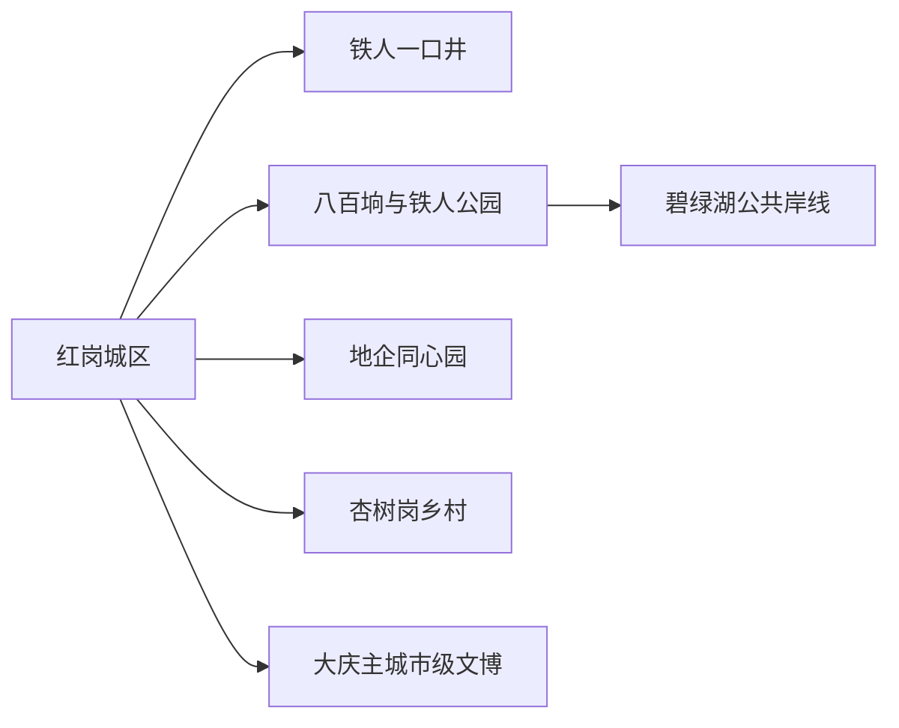
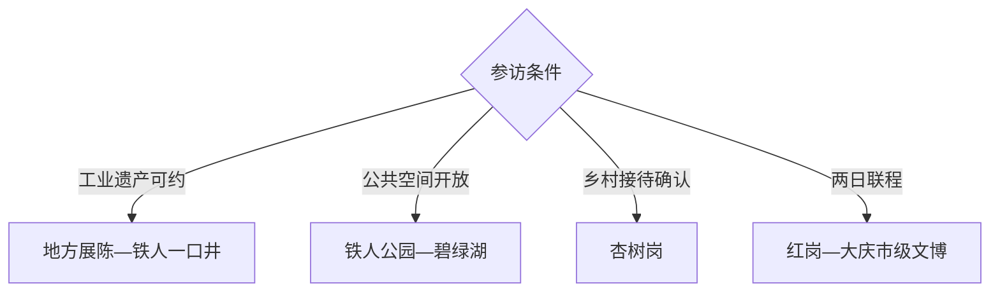

# 红岗旅行指南

红岗位于大庆南部，旅行价值集中在铁人一口井所代表的石油会战史、油田社区公共空间和百湖草原地貌。这里适合工业遗产专题的一日访问；把大庆市级博物馆与纪念馆加入联程，可形成两天完整的油城学习路线。

## 城市速览

| 项目 | 信息 |
|---|---|
| 主线 | 红岗城区—铁人一口井—八百垧—碧绿湖—杏树岗乡村 |
| 停留 | 区内专题1天；与大庆市级文博联程共2天 |
| 住宿 | 红岗城区适合早出，大庆主城适合更多场馆与交通 |
| 交通 | 从大庆主城沿公路进入，区内以公交、出租车或预约车为主 |
| 风险 | 严寒冰雪、油田生产车辆、湖岸湿地、工业点预约和乡村夜间返程 |
| 边界 | 在产油井、联合站、管线、化工园区和生态敏感湖岸按安全与生产边界进入 |

## 城市格局与游览区域

固定 `Honggang / GeoNames 2036876` 对应红岗区，本页以法定红岗区 `Q1332826` 组织。区内公共参观点分散在油田城镇与乡村之间；市级文博多位于其他区，明确作为跨区联程而非红岗景点计数。

## 主要景点

| 景点 | 区域 | 类型 | 核心体验 | 用时 | 环境 | 体力 | 预约风险 | 天气影响 | 优先级 |
|---|---|---|---|---:|---|---|---|---|---|
| 铁人一口井教育培训基地 | 解放村方向 | 国家工业遗产 | 萨55井、钻井架与石油会战现场史 | 2–4小时 | 室内外 | 低中 | 极高 | 高 | A |
| 红岗区地方文化展陈 | 红岗城区 | 地方文博 | 区史、石油社区与非遗活动 | 1.5–3小时 | 室内 | 低 | 极高 | 低 | A |
| 铁人公园公共区 | 八百垧 | 城市公园 | 油田城镇公共空间与休闲步行 | 1–3小时 | 室外 | 低 | 中 | 高 | B |
| 碧绿湖当期开放岸线 | 八百垧方向 | 湖泊生态 | 百湖城市、水岸与生态修复观察 | 2–4小时 | 室外 | 低中 | 很高 | 极高 | B |
| 地企同心园公共区 | 红岗中心城区 | 城市生态 | 植物景观、社区休闲与石油文化元素 | 1–3小时 | 室外 | 低 | 中 | 高 | B |
| 五把铁锹闹革命相关公开纪念点 | 区内油田片区 | 工业记忆 | 会战初期生产组织与集体记忆 | 1–2小时 | 室内外 | 低 | 极高 | 中 | B |
| 杏树岗正规乡村接待点 | 杏树岗镇 | 乡村农旅 | 黑土地农业、季节农产与村落生活 | 半日 | 室外 | 低中 | 极高 | 很高 | C |
| 红岗石油主题公共广场 | 城区 | 城市观察 | 抽油机意象、油田社区与城市空间 | 1–2小时 | 室外 | 低 | 中 | 中 | C |

## 美食与餐饮

可在城区选择东北炖菜、饺子、烧烤、铁锅炖鱼和大庆坑烤。多人共享更适合铁锅菜，点单先确认份量、淡水鱼来源、辣度和花生芝麻。乡村农餐与坑烤提前预约，冬季选择室内供暖稳定的正规餐饮。

## 经典行程

### 一日经典线
**路线**：红岗地方展陈—铁人一口井—铁人公园。**逻辑**：从区史背景进入原址遗产，再观察油田社区。**预约锚点**：铁人一口井与地方展陈。**休息**：红岗城区。**删除条件**：基地未开放时改公共空间线。

### 两日油城线
**路线**：首日红岗；次日跨区参观大庆油田历史陈列馆、铁人王进喜纪念馆或大庆博物馆。**逻辑**：原址与市级系统展陈互证。**预约锚点**：各馆时段与跨区车辆。**休息**：大庆主城。**删除条件**：时间不足时保留红岗原址和一座市级馆。

### 三日工业生态线
**路线**：前两日基础线；第三日碧绿湖—地企同心园—杏树岗正规接待点。**逻辑**：从生产史延伸到生态修复与当代乡村。**预约锚点**：湖岸、乡村接待与车辆。**休息**：城区。**删除条件**：冰雪或接待未确认时删除乡村段。

### 严寒天气线
**路线**：地方室内展陈—预约教育基地重点室内内容—城区用餐。**逻辑**：缩短室外停留并减少远距离步行。**预约锚点**：供暖、开放和道路。**休息**：城区。**删除条件**：暴雪或极寒预警时留在住宿地附近。

### 亲子工业科普线
**路线**：地方展陈—铁人一口井讲解—公共广场。**逻辑**：用实物、故事和城市景观解释石油工业。**预约锚点**：年龄、讲解与团体规则。**休息**：展陈空间。**删除条件**：基地不接待散客时改市级博物馆。

### 百湖社区线
**路线**：铁人公园—碧绿湖开放岸线—地企同心园。**逻辑**：串联三个公共休闲空间观察油城生态。**预约锚点**：岸线开放、天气与车辆。**休息**：八百垧或城区。**删除条件**：湖面冰况或大风不稳时保留城区公园。

### 低体力线
**路线**：车辆到地方展陈—铁人一口井主要公开点—城区午休。**逻辑**：车辆连接核心并控制户外距离。**预约锚点**：落客、座椅和无障碍。**休息**：城区。**删除条件**：冬季地面结冰时只留室内展陈。

## 住宿区域

红岗城区适合区内早出、实用餐饮和工业专题；萨尔图、让胡路或龙凤等大庆主城区适合铁路、机场和市级场馆联程。冬季预订重点确认供暖、夜间叫车、早餐和恶劣天气退改。

## 市内交通

红岗与大庆主城距离较远，先锁定参观点再安排车辆。公交适合时间宽松的城区移动，工业遗产和乡村点更适合预约合规车辆。沿油田道路留意大型生产车辆和管理标识，冬季预留制动与返程缓冲。

## 不同旅行者须知

工业遗产爱好者优先铁人一口井并配市级展馆；亲子家庭选择正式讲解；摄影者在公共道路和广场取景；低体力旅行者使用车辆连接。生产油井、联合站、化工园区、管线设施、未开放工业遗产和生态敏感湖岸保留明确限制。

## 行前核对

- 核对铁人一口井、地方展陈、纪念点、碧绿湖和乡村接待开放。
- 核对暴雪极寒、道路结冰、公交、预约车辆和跨区场馆时段。
- 工业遗产按正式接待路线参观；生产设施与作业道路依安全标识通行。

## 来源与更新记录

| 来源 | 支持内容 | 核验日期 |
|---|---|---|
| [工业和信息化部门资料：国家工业遗产名录](https://gxt.fujian.gov.cn/zwgk/xw/hydt/xydt/202409/P020240929569102741233.pdf) | 铁人一口井位于红岗区及核心物项 | 2026-09-01 |
| [黑龙江省文旅厅：大庆工业旅游](https://wlt.hlj.gov.cn/wlt/c114161/201907/c00_31096856.shtml) | 石油工业旅游体系与铁人一口井 | 2026-09-01 |
| [GeoNames 2036876](https://www.geonames.org/2036876/) | Honggang 固定城市点 | 2026-09-01 |
| [Wikidata Q1332826](https://www.wikidata.org/wiki/Q1332826) | 红岗区实体与跨库标识 | 2026-09-01 |

| 日期 | 更新 |
|---|---|
| 2026-09-01 | 首次完成红岗旅行研究，按石油会战、社区生态与大庆跨区文博联程组织。 |
