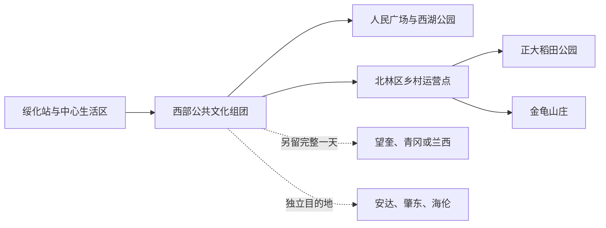
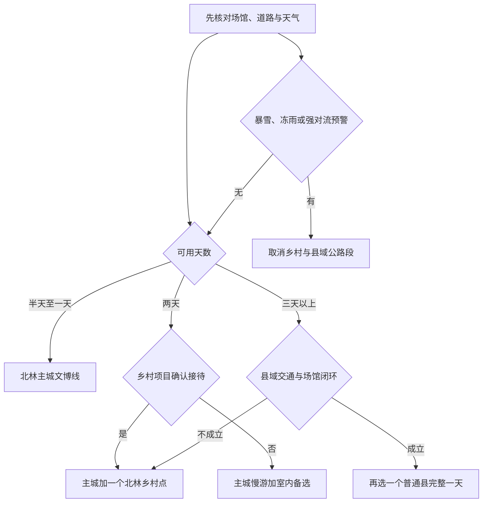

# 绥化旅行指南

绥化位于黑龙江省中部的松嫩平原，最鲜明的旅行线索不是密集古迹，而是寒地黑土、稻作农业、地方文博与北方季节生活。北林区主城适合作为交通和住宿基地：先在绥化市博物馆建立地方历史框架，再按季节选择人民广场、西湖公园或一处正式运营的乡村旅游点。地级市范围很大，望奎、青冈等普通县要按完整县域日安排；安达、肇东、海伦则是独立县级市，不属于本页的主城远郊路线。

> 建议停留：1–3 天；主城 1 天，北林乡村或一个普通县域方向各加 1 天 
> 旅行关键词：黑土地、寒地农业、地方文博、平原城市、严寒冰雪 
> 主要体力：低至中等步行；县域公路往返、冬季积雪与风寒会显著增加负担 
> 最近研究：2026-08-12

## 城市速览

| 项目 | 旅行信息 |
|---|---|
| 主要旅行价值 | 用绥化市博物馆串联第四纪古生物、东北抗联与地方民俗，在北林区正式开放的农业旅游点观察寒地稻作、黑土生产和乡村生活，再感受严寒季节如何改变城市公共空间 |
| 建议停留 | 半天可选博物馆与一处城市公共空间；1 天可完成北林主城；2 天可增加正大稻田公园或金龟山庄；3 天可再选望奎、青冈或兰西中的一个普通县域方向，不把多个县压在同一天 |
| 较舒适季节 | 5 月下旬至 9 月适合城市与乡村户外，但春耕、夏管和秋收首先是生产活动，开放内容依运营方安排；冬季具有冰雪氛围，代价是严寒、短日照、风吹雪和道路结冰 |
| 预算特点 | 主城公共场馆、公共空间和日常餐饮可组成低至中等预算行程；县域车辆、乡村接驳、冬季装备和季节活动是主要增量 |
| 步行强度 | 主城场馆和公园可分段步行，跨片区宜乘车；农业园区尺度、积雪路面和县域当天往返为中等负担 |
| 主要天气风险 | 冬季极寒、暴雪、风吹雪、低能见度、暗冰与失温；春融期昼化夜冻；夏季雷暴、大风、强降雨、内涝和局地洪涝 |
| 独行旅行 | 主城场馆、餐饮和短程叫车较易安排；乡村及县域返程选择少，宜预先落实正规车辆、运营时间和通信条件 |
| 亲子旅行 | 博物馆、科技类场馆和正规农业研学点有教育价值；农机、水体、冰雪项目、动物互动和生产作业必须持续看护并核对年龄与装备要求 |
| 长者与低体力旅行 | 可采用“博物馆＋车辆接驳＋短段公园”的一天；县域长车程、冬季户外和大尺度农业园区宜减少并增加室内休息 |
| 无障碍信息 | 未找到主城场馆、城市公园、乡村景区与县域车辆之间完整连续通行资料；下客点、门槛、坡道、电梯、轮椅卫生间及陪同要求需逐处向官方确认 |

## 城市格局与游览区域

绥化市法定范围包括北林区、六个县和安达、肇东、海伦三座县级市。普通旅行所说的“绥化市区”主要指北林区主城，而不是整个地级市；城市公共文化设施、铁路到发和多数住宿集中在这里。北林区乡村点位沿不同公路方向分散，正大稻田公园、金龟山庄与其他运营项目不是连成一片的郊野公园。望奎、青冈、兰西、庆安、明水、绥棱六县各有独立县城和乡镇交通，也不能当作主城边缘连续游览。

| 区域 | 主要内容 | 游览特点 | 与其他区域的关系 |
|---|---|---|---|
| 绥化站—中心商业生活区 | 铁路到发、住宿、餐饮和城市日常服务 | 适合抵达日、晚餐与补给，街区平缓；严寒和积雪会缩短适宜步行时间 | 可作为全程基地，前往公共文化组团和公园宜用公交或短程车辆 |
| 西部公共文化组团 | 绥化市博物馆所在的科技文化设施及周边公共服务 | 室内文博和科普内容集中，但不同机构的入口、闭馆日和活动安排各自独立 | 适合与人民广场或西湖公园组合为主城一天 |
| 人民广场—西湖公园城市公共空间 | 广场、绿地、步道和季节性城市活动 | 日常以开放公共空间为主；雪雕、人工冰场、灯光等只在当期公告明确时成立 | 可作场馆前后短段休息，不把季节项目当成全年固定景点 |
| 北林区农业旅游方向 | 黑土绿之源、正大稻田公园及当期公开接待的稻作、研学项目 | 农业观光与实际生产并存，开放时段、体验内容、道路和接待方式随农时变化 | 每次选一条正式运营线；不要沿乡村道路自行串入田块、仓储或养殖区 |
| 金龟山庄方向 | 东津镇福兴村的乡村景区、荷塘与当期冰雪活动 | 距主城约 33 千米，活动季与普通日差异大，通常占半天至一天 | 与主城文博可组成两日行程；不与望奎、青冈等县域远线同日 |
| 望奎、青冈、兰西等六县 | 县城公共文化场馆及经核实开放的属地项目 | 从主城往返和县内接驳需要完整交通链；同一县也可能有多个公路方向 | 本页只给少量有官方证据的备选，选一个县单独一天并优先联系属地 |
| 安达、肇东、海伦 | 绥化代管的三座法定县级市 | 各自有城市中心、交通、住宿与旅行范围，不属于北林区近郊 | 本页不预写三市的具体景点、餐饮、住宿或路线；跨城时另查属地资料 |

下面的关系图表达的是行程层级，不代表景点之间可以连续步行：

平原开阔不等于空间可以自由进入。绥化的旅行边界尤其需要落到具体地点：

- **农田首先是生产空间。** 黑土地、稻田、粮库、晒场、农机库、温室、养殖区和作业道路只有在经营或管理主体明确接待时才可进入；不跨田埂、不踩作物、不采摘、不取土，也不追逐作业农机拍摄。
- **乡村道路不只是观光道路。** 春耕秋收期会有宽幅农机、粮运重车和临时占道，雨雪后路肩与土路承载力下降。停车、会车和拍摄都要服从交通与生产，不在弯道、桥涵或铁路道口停留。
- **湿地与水源地不是无门槛荒野。** 只有管理机构或景区正式开放的入口、栈道、宣教线和观景点可供普通游览；核心保护空间、行洪区、灌排设施和自然水岸不能因地图可达而进入。
- **绥棱阁山水库不作为现成景点。** 该水库承担防洪、供水、灌溉等功能，饮用水水源保护边界优先；目前缺少稳定、可核实的公众游览入口和接待服务，因此不写入路线，也不在库岸游泳、垂钓、露营或驶上冰面。
- **自然冰面不等于冰雪项目。** 河流、水库、池塘、灌渠和农业设施水面只有在运营或管理单位检测、划界并正式开放时才能使用；人民广场等往年或当季冰上活动也以现场公告为准。
- **工业、物流和铁路空间不提供旅行穿行。** 粮食加工、仓储、化工、厂区、货场、铁路专用线和装卸区有重车、设备及保密要求，只在公共道路或正式开放的参观区活动。

## 主要景点

优先级用于安排时间：**A** 为首访核心，**B** 为按兴趣补充，**C** 为县域、季节性或通常需要独立半天以上的目的地。广场、公园和交通节点不计作必须完成的城市景点；同一运营园区内部的展馆、稻田、荷塘或冰雪项目合并为一个项目。

### 北林主城与城市公共空间

| 景点 | 区域 | 类型 | 主要看点 | 建议用时 | 室内外 | 体力 | 预约风险 | 天气影响 | 优先级 |
|---|---|---|---|---:|---|---|---|---|---|
| 绥化市博物馆 | 西部公共文化组团 | 综合地志博物馆 | 第四纪古生物、东北抗联、地方民俗与非遗线索，适合作为理解绥化市域的第一站 | 2–3 小时 | 室内 | 低 | 中 | 低 | A |
| 绥化科技馆 | 西部公共文化组团 | 科普场馆 | 以当期常设展和科普活动为准，可与博物馆组成室内半日 | 1.5–3 小时 | 室内 | 低 | 高 | 低 | B |
| 人民广场公共空间 | 北林主城 | 城市广场、季节活动 | 观察平原城市公共生活；2026 年冬季曾设置雪雕与免费人工冰场，但以后季节是否复办必须重新确认 | 0.5–1.5 小时 | 室外 | 低 | 低至高 | 极高 | 路线节点 |
| 西湖公园开放区域 | 北林主城西部 | 城市公园 | 水岸绿地与本地日常休闲，只使用维护中的公共步道和明确开放区域 | 1–2 小时 | 室外 | 低至中 | 低 | 高 | B |

2026 年北林区冬季公告曾给出绥化市博物馆 9:00—16:00、周一闭馆、免费且当期无需预约的信息。这些是特定时点的服务状态，不写成永久规则；节假日、展陈维护、团体活动和安全管理仍可能改变开放方式。

### 北林区农业与乡村运营点

| 景点 | 区域 | 类型 | 主要看点 | 建议用时 | 室内外 | 体力 | 预约风险 | 天气影响 | 优先级 |
|---|---|---|---|---:|---|---|---|---|---|
| 正大稻田公园 | 北林区双河镇西南村 | 农业观光、研学、乡村旅游 | 正式园区内的稻作展示、农事体验和三产融合内容；理解农业生产与旅游展示的边界 | 3–5 小时 | 户外为主 | 中 | 高 | 高 | B |
| 金龟山庄 | 北林区东津镇福兴村 | 乡村景区、荷塘、季节活动 | 水、林、田复合景观；夏季荷花和冬季冰雪活动均取决于当期运营 | 4–7 小时 | 混合 | 中 | 高 | 极高 | B |
| 黑土绿之源 | 北林区乡村方向 | 农业、绿色食品、研学 | 北林区官方线路中的黑土与绿色农业主题点；只参观运营方公布的接待空间 | 2–4 小时 | 混合 | 中 | 高 | 高 | C |

北林区官方线路曾同时列出稻田、村庄、食品加工与康养项目，但线路发布不等于其中每个点每天接待散客。不要照着旧名单逐点打卡；应先锁定一个仍在运营的核心接待方，再由其确认集合、车辆、讲解、用餐和可进入范围。

### 普通县域备选

| 景点 | 区域 | 类型 | 主要看点 | 建议用时 | 室内外 | 体力 | 预约风险 | 天气影响 | 优先级 |
|---|---|---|---|---:|---|---|---|---|---|
| 林枫同志故居纪念馆 | 望奎县 | 纪念馆、近现代史 | 故居建筑、林枫生平与革命历史；与望奎县城补给组成单县一日 | 2–3 小时 | 混合 | 低至中 | 高 | 中 | C |
| 青冈县第四纪古生物化石博物馆 | 青冈县 | 自然史博物馆 | 第四纪古生物化石和地方自然环境，与绥化市博物馆的古生物线索互相补充 | 2–3 小时 | 室内 | 低 | 高 | 低 | C |
| 兰西县锡伯族博物馆 | 兰西县 | 民族文化博物馆 | 锡伯族迁徙、生产生活与地方文化；参观以场馆开放和讲解安排为准 | 2–3 小时 | 室内 | 低 | 高 | 低 | C |

三个县域点只作为“选一处”的独立方向，不建议从北林主城一天连续跨县。庆安、明水和绥棱未在本页预设具体景点；这不表示没有旅行资源，而是当前证据不足以同时满足稳定开放、散客进入、交通闭环和本页研究日期的要求。

## 美食与餐饮

绥化主城餐饮以东北家常菜、炖菜、烧烤和面食为主，份量常适合共享。城市指南以菜品类型和用餐区域为线索，不把单家餐厅当成唯一目的地。乡村园区的农家餐或节庆长桌宴具有明显的预约和季节属性，不能替代主城的稳定用餐备选。

| 菜品或餐饮类型 | 常见区域 | 一个人用餐与常见份量 | 风味、过敏原与饮食限制 | 排队风险与替代方法 |
|---|---|---|---|---|
| 铁锅炖 | 主城生活街区、乡村正规餐饮 | 通常按锅点单，适合多人；独行先问最小锅、半份或拼桌规则 | 常见鱼、鸡、鹅、猪肉，酱油和酱料可能含大豆、小麦；锅贴饼含麸质 | 晚餐和节假日等位较多，可改点小份炖菜或同街区家常菜 |
| 酸菜白肉或酸菜汤 | 主城东北菜馆 | 可做单菜但总量常较大，配主食更适合两人以上 | 多用猪肉、动物油和腌渍酸菜，钠较高；素食版本需明确询问汤底 | 冬日晚餐时段较忙，可在菜单结构相近的日常菜馆替代 |
| 烧烤与电烤串 | 车站周边、中心生活区 | 易按串点单，适合独行；注意最低起点和主食份量 | 常见牛羊猪、鸡、内脏、孜然和辣椒；烤架交叉接触不适合严格过敏者 | 夜间热门店排队，可提前用餐或选择明码标价、通风良好的同类店 |
| 手拉面、豆腐与小菜 | 主城日常餐饮区 | 单人友好，适合作为抵达日或赶车餐 | 面条含麸质，汤底可能含牛羊肉；豆制品含大豆 | 通常翻台快，关店时可改饺子、馄饨或其他日常面食 |
| 寒地大米与杂粮主食 | 全城家常菜、正规农业园区 | 多作为套餐或多人菜的主食，可询问小份 | 米饭通常无麸质，但杂粮饼、黏豆包等可能含混合面粉；馅料可能含糖或豆类 | 不必追逐单一“网红产地”，以当天菜单和明示来源选择 |
| 黏豆包、玉米饼等东北主食 | 早餐店、市场周边、家常餐饮 | 适合少量尝试，独行容易控制份量 | 黏豆包常含豆馅和糖，玉米饼配方可能加入小麦、蛋奶 | 早餐后可能售罄，可用其他蒸食或粥类替代 |
| 乡村农家餐与节庆餐 | 金龟山庄、正大稻田公园等正式运营点 | 多为套餐或桌餐，单人可选性弱，需先确认是否接待散客 | 肉类、河鲜、豆制品、腌菜和共锅烹饪较常见；严格素食和过敏控制需提前沟通 | 运营与供餐受季节、团队和活动影响，应保留主城返程餐作为替代 |

点餐时可先问“几人份、是否含主食、能否半份”，再增加菜品。进入乡村点位前应确认是否提供热食、饮水和卫生间；未经许可不购买或食用田间、仓储及加工环节中的样品。

## 经典行程

路线选择先看开放条件和天气，再看可用天数。图中的“县域日”只指望奎、青冈、兰西等普通县备选，不包含安达、肇东、海伦。

### 一日北林主城路线

**路线**：绥化市博物馆 → 午餐与长休息 → 绥化科技馆或当期公共文化活动 → 人民广场短段 → 西湖公园开放区域

- **串联逻辑**：先用博物馆建立地方历史与自然环境框架，下午在相邻公共文化设施中只选一处，再乘车连接广场或公园；它是一条“室内为主、短段户外”的主城线。
- **预约锚点**：先确认博物馆与科技馆是否同日开放、入口是否相同及是否接待散客；2026 年某次公告中的免预约状态不能代替出发前核对。
- **休息安排**：午餐放在主城成熟生活区并留出完整室内休息；严寒或高温时只在广场、公园停留短段。
- **时间不足时**：先删西湖公园，再删人民广场；博物馆与科技馆二选一，不为完成列表压缩闭馆前的参观。

### 两日北林路线

**第 1 天**：绥化市博物馆 → 主城午餐 → 绥化科技馆或西湖公园 → 中心生活区晚餐
**第 2 天**：主城出发 → 正大稻田公园或金龟山庄二选一 → 园区内休息与用餐 → 天黑前返回主城

- **串联逻辑**：第一天完成稳定的城市文博骨架，第二天只进入一个已确认散客接待的乡村运营点，避免在不同乡镇间追赶旧线路。
- **预约锚点**：先锁定第二天运营方的开放、集合、车辆、讲解、供餐和返程，再反推第一天场馆；冬季活动还要确认项目检测和装备规则。
- **休息安排**：第二天把室内休息、热饮、卫生间和午餐都留在正式运营区，车上准备饮水及保暖备用层。
- **时间不足时**：第二天整段删除，保留主城；若乡村点临时停运，不以附近农田、村庄或水库替代。

### 三日城市与县域路线

**第 1 天**：绥化市博物馆 → 科技馆或城市公共空间 → 主城住宿
**第 2 天**：正大稻田公园或金龟山庄 → 主城住宿
**第 3 天**：望奎林枫同志故居纪念馆、青冈县第四纪古生物化石博物馆、兰西县锡伯族博物馆三选一 → 对应县城午餐与休息 → 返回主城或在该县合规住宿

- **串联逻辑**：三天分别承担“认识城市、理解农业、进入一个普通县”的功能；县域日不跨县，也不把安达、肇东、海伦混入绥化主城路线。
- **预约锚点**：第三天先让场馆、去程、县内接驳、返程和天气形成闭环；任何一项不成立就不出发。
- **休息安排**：县域日把午餐、室内休息和候车都放在县城成熟服务区，不在公路边、农田或水源地临时停留。
- **时间不足时**：先删除整个县域日，再删除第二天乡村段；不要压缩成长距离夜间返程。

### 雨雪与严寒路线

**路线**：绥化市博物馆 → 室内午餐与热饮 → 绥化科技馆或另一项已确认开放的公共文化活动 → 提前返回住宿地

- **适用条件**：适用于一般降雨、降雪或低温；出现暴雪、冻雨、大风、低能见度、道路结冰、强雷暴、内涝或官方预警时，取消乡村与县域段，必要时连主城移动也停止。
- **预约锚点**：核对两处场馆是否因天气、维护或活动调整开放，并同步查看铁路、公路和公交动态。
- **休息安排**：每次室外移动后安排室内回温、补水和衣物干燥；避免在屋檐坠冰、结冰坡面和积雪覆盖的路肩停留。
- **时间不足时**：只保留距离住宿最近且确认开放的一处室内场馆；不要用自然冰面、乡村道路或未经管理的温室替代停运项目。

### 亲子与低体力路线

**亲子路线**：绥化市博物馆 → 室内午餐 → 绥化科技馆 → 人民广场或西湖公园短段
**低体力路线**：车辆到达绥化市博物馆最近可用下客点 → 完整休息 → 人民广场平缓短段或直接返回住宿地

- **减负方式**：亲子线把自然史、地方史和科普分成两个短单元，公园仅在天气稳定、步道维护良好时加入；低体力线减少一次换乘和一处场馆，全程以车辆接驳、座椅和室内休息优先。两条路线都不默认推车或轮椅连续可达。
- **预约锚点**：亲子家庭核对儿童预约、互动设备、推车、寄存和卫生间；低体力旅行逐段确认下客点、门槛、电梯、座椅与轮椅卫生间。
- **休息安排**：午间回到成熟商业生活区，冬季每个户外段后立即进入供暖空间；不把乡村长车程当作轻松替代。
- **时间不足时**：亲子线先删公园、再在两馆中二选一；低体力线只保留博物馆，保持充足返程余量。

### 普通县域一日路线

**路线**：北林主城出发 → 望奎林枫同志故居纪念馆、青冈县第四纪古生物化石博物馆或兰西县锡伯族博物馆三选一 → 对应县城午餐与休息 → 原路返回或按预订住宿

- **适用条件**：只在场馆明确开放、去回程交通可核实、白天道路天气稳定且留有返程缓冲时执行；这是一条单县路线，不是“绥化全域打卡”。
- **预约锚点**：直接确认所选场馆的散客开放、讲解、证件和最晚入馆，再确认正规车辆、驾驶时长、县城上下车点与返程。
- **休息安排**：使用县城公共服务和正规餐饮，司机也应有独立休息时间；冬季携带额外保暖层、热饮和应急电源。
- **时间不足时**：县域整段删除，改做北林主城慢游；不临时换成道路旁农田、村庄、库区或导航软件上的未核实点位。

## 住宿区域

| 区域 | 优点 | 缺点 | 适合人群 | 交通特点 |
|---|---|---|---|---|
| 绥化站与中心生活区 | 铁路到发、日常餐饮、补给和叫车较方便，适合晚到早走 | 车站周边可能有噪声，前往西部文化设施仍需乘车 | 首次到访、独行、铁路抵离、预算有限或只住一晚者 | 先核对具体站口、公交末班和冬季清雪，不把“近车站”理解为步行可达所有景点 |
| 西部公共文化组团周边 | 接近博物馆、科技类设施和部分城市公共空间，主城日换乘较少 | 餐饮密度、夜间交通和不同价格档次需逐家比较 | 文博为主、亲子、长者、低体力或两晚慢游者 | 适合车辆短接驳；订房前确认到场馆入口而非建筑直线距离 |
| 主城成熟商业生活区 | 餐饮、药店、商场和冬季室内休息选择较多 | 节庆和周末可能拥挤，停车与临街噪声有差异 | 重视晚餐、供暖、补给和室内备选者 | 可作为乡村或县域日的稳定基地，清晨出发前先确认车辆停靠 |
| 北林区乡村正规运营点 | 某些项目可提供乡村住宿、餐食或活动，减少当日往返 | 季节性强，供暖、热水、消防、支付、通信和返程替代差异大 | 已由运营方确认接待、希望体验乡村夜晚的自驾或小团体 | 只订有明确经营主体和退改规则的住宿，不使用农田、库区、温室或生产设施中的非正规房源 |
| 望奎、青冈或兰西县城 | 可降低单县场馆早晚往返压力，补给比乡镇稳定 | 与北林主城分开，夜间交通和可替代景点较少 | 单县两日、需要缩短当天驾驶或次日继续合规联程者 | 仅按实际选择的一个普通县订房；本页不提供安达、肇东、海伦住宿建议 |

严寒期订房应确认供暖、热水、窗体密封、电梯、车辆能否停靠入口，以及暴雪或道路中断时的退改。无障碍需求要从下客点、门槛、前台、电梯、客房到卫生间逐段确认；“有电梯”不能证明整条住宿动线连续可达。

## 市内交通

绥化主城没有城市轨道交通，旅行移动依靠铁路、公交、出租车或网约车，前往北林乡村和普通县域则依赖公路交通。绥化站是当前应按票面核对的铁路门户；有关绥化南站、高速铁路和民用机场的规划或建设信息不等于已经形成可购票、可使用的抵达服务。

| 场景 | 建议与取舍 | 行前需要重查的内容 |
|---|---|---|
| 绥化站抵达 | 公交适合时间宽松且行李少的主城行程；严寒、晚到、多人或携带大件行李时可比较正规出租与网约车 | 票面站名、进出口、公交首末班、出租上客点、重点旅客服务、道路施工和冬季清雪 |
| 主城跨片区 | 场馆、车站、商业区与公园之间以公交或短程车辆为主，到达后再分段步行 | 线路调整、移动支付、活动封路、末班车、叫车范围和恶劣天气停运 |
| 北林区乡村运营点 | 先让运营方确认正式入口和接待，再选择自驾、正规包车或其公布的接驳；地图距离不代表道路与返程成立 | 开放日期、车辆资质、集合点、停车、农机与重车、施工、手机信号、供餐和返程 |
| 望奎、青冈、兰西等普通县 | 公路客运、自驾或正规车辆都要把县城到场馆的最后一段单独核实；宜单县完整日 | 客运站位置、班次、购票、最晚返程、县内接驳、道路天气和住宿替代 |
| 安达、肇东、海伦联程 | 三地是独立县级市，跨城时按实际铁路或公路票面、属地交通和住宿重新规划 | 到发站、换乘、属地开放信息；不沿用本页主城和县域建议 |
| 自驾 | 主城不是必须自驾；乡村和县域更灵活，但农机、粮运重车、铁路道口、风吹雪、暗冰与春融路损增加责任 | 国省县乡道路施工、预警、能见度、轮胎、救援、加油充电、停车和保险 |
| 航空与高速铁路规划 | 不把规划图、开工消息或中长期目标当作当前交通产品，抵离只采用实际可售票线路 | [中国铁路 12306](https://www.12306.cn/) 的实际车次、民航与运营单位正式开通公告、接驳和退改 |

平原公路视野开阔，但冬季风吹雪可能在短时间内形成低能见度和路面堆雪。遇预警、封路或清雪作业时，应取消乡村与县域段；不要跟随非正规车辆绕行村路、田间道或水库管理道。

## 不同旅行者须知

| 旅行维度 | 可行条件 | 主要取舍 | 需额外核对 |
|---|---|---|---|
| 独行旅行 | 主城文博、日常餐饮和短程叫车较易独自安排 | 乡村和县域单人车辆成本高、返程少，冬季夜间等待风险上升 | 场馆散客接待、正规车辆、末班交通、住宿前台和紧急联络 |
| 亲子旅行 | 博物馆、科技类场馆与正式农业研学点具有自然和生产教育价值 | 农机、温室、水体、动物互动、冰雪活动和长车程需要持续看护 | 儿童预约、推车、年龄身高、护具、卫生间、热食和休息区 |
| 长者或低体力旅行 | 主城一天只选一处核心场馆，车辆接驳并安排长午休可显著减负 | 农业园区尺度、积雪路面和县域往返负担较高 | 最近下客点、座椅、电梯、轮椅、供暖、卫生间和返程缓冲 |
| 无障碍需求 | 铁路重点旅客服务可预约，部分公共场馆可能有单点设施 | 单个坡道或电梯不能证明车站、车辆、场馆、园区和住宿全程可达 | 逐处确认坡度、门宽、电梯、卫生间、轮椅尺寸、陪同和车辆停靠；资料不足处均向官方确认 |
| 农业与产业观察 | 只在公开农业园区、展陈空间和运营方讲解范围内进行 | 春耕、农药、机械、仓储、食品加工和畜禽防疫服从生产安全，不能以拍摄要求干扰作业 | 散客接待、消毒、服装、摄影、食品品尝、无人机和可进入边界 |
| 湿地与自然观察 | 使用正式开放的入口、栈道、观景台和宣教活动 | 水源保护、行洪、繁殖期和生态敏感性优先，未开放湿地与库岸不进入 | 保护地公告、水位、火险、蚊虫、封闭线、讲解和返程 |
| 摄影旅行 | 博物馆外观、城市广场、正式园区和公共道路可形成城市与农业题材 | 不进入田块、仓储、铁路、工业和水源保护空间；冬季电池衰减、镜头结露明显 | 场馆摄影、三脚架、无人机、商业拍摄、人物授权与运营项目规则 |
| 预算有限 | 主城公共场馆、日常面食、公交和短段公共空间可组成低成本骨架 | 免费场馆仍可能限流，乡村车辆和县域往返是主要支出 | 免费开放、优惠证件、交通总价、寄存、供餐、退改和明码标价 |
| 晚出发或紧凑行程 | 只保留博物馆或一处城市公共空间即可形成半日 | 不临时加入正大稻田公园、金龟山庄或县域，冬季日落早 | 最晚入馆、公交末班、叫车、供暖空间和道路结冰 |
| 严寒、暴雪与春融 | 正常寒冷天气采用短户外、长室内节奏，分层保暖并穿防滑鞋 | 暴雪、冻雨、风吹雪和暗冰会同时影响铁路、公路、场馆和活动；自然冰面风险不可由低温推断 | 气象预警、列车、公路、闭园、供暖、冰雪项目检测和退改 |
| 暴雨、洪涝与强对流 | 天气稳定时才安排乡村户外，主城保留室内备选 | 强降雨、大风和雷电增加内涝、农田积水、树木倒伏、山洪及道路中断风险 | 气象、应急、道路、景区撤离、河流水位和活动取消 |
| 饮食限制 | 主城日常餐饮选择多于乡村套餐，可先询问配料与份量 | 炖菜、烧烤、共锅和预制酱料容易交叉接触；县域小店替代有限 | 肉类汤底、大豆、小麦、蛋奶、坚果、酒精、钠含量和独立厨具 |

## 行前核对

| 核对事项 | 为什么需要重查 | 建议核对时间 | 官方入口 |
|---|---|---|---|
| 绥化市博物馆与科技馆 | 闭馆日、入口、开放时段、团体活动、讲解、证件和预约方式会调整 | 排入路线时、到访前一日 | [北林区 2026 冬季文旅信息](https://www.hljbeilin.gov.cn/bl/blfgy/202601/c12_b3374cee382a4159a86f57109d8a8f44.shtml)；场馆官方渠道 |
| 人民广场、西湖公园与城市活动 | 广场和公园的可用步道、雪雕、人工冰场、灯光及活动具有季节性 | 出发前一周、前三日和当天 | [北林区政府](https://www.hljbeilin.gov.cn/)；现场管理公告 |
| 正大稻田公园 | 农事体验、展区、供餐、团队和道路随农时与运营变化，3A 等级不代表每天全区开放 | 订车辆前、到访前一日 | [北林区政府：正大稻田公园](https://www.hljbeilin.gov.cn/bl/blfgy/202412/c12_71a1e001e9b54efe8f2d2c41cbc9bb4d.shtml) |
| 金龟山庄 | 荷花、露营、冰雪、餐饮、住宿和节庆活动的日期与内容不同 | 订车辆或住宿前、当天 | [北林区政府：金龟山庄](https://www.hljbeilin.gov.cn/bl/blfgy/202412/c12_b10b78c8bef64d088fe8d3677c3cb9e7.shtml) |
| 北林区农业主题线路 | 官方曾发布多条线路，但各经营点散客接待、集合和项目可能变化 | 选择核心接待方后、到访前一日 | [北林区政府：旅游线路](https://www.hljbeilin.gov.cn/bl/blfgi/202601/c12_9c564a19f7de44b493d2baccb7c03fca.shtml) |
| 望奎、青冈或兰西县域场馆 | 场馆开放、讲解、县内接驳和返程必须同时成立 | 确定单县方向后、前一日和当天 | [绥化市政府：林枫同志故居](https://www.suihua.gov.cn/sh/rwsh/202306/b7240a7761da467882f99a2ea200f089.shtml)；[省政府：青冈县第四纪古生物化石博物馆](https://www.hlj.gov.cn/hlj/c108552/202404/c00_31726042.shtml)；[绥化市政府：兰西县锡伯族博物馆](https://www.suihua.gov.cn/sh/rwsh/202306/34e390ed3066466e902e04c4a4282f71.shtml) |
| 铁路、公交与县域客运 | 车次、站口、首末班、施工、票价和极端天气停运会变化；规划中的交通项目不能替代实际售票 | 购票时、前一日和乘车当天 | [中国铁路 12306](https://www.12306.cn/)；[黑龙江省交通运输厅](https://jt.hlj.gov.cn/) |
| 严寒、暴雪、风吹雪与暗冰 | 低温、大风和降雪会同时影响人员安全、铁路、公路、户外场所与冰雪项目 | 出发前三日滚动查看、每天早晨 | [黑龙江省气象局](https://hl.cma.gov.cn/)；[绥化市气象灾害应急预案](https://www.suihua.gov.cn/sh/qtlm/202405/c12_4f8f6b07769549ab8f65aefd5715fba0.shtml) |
| 强降雨、雷暴、洪涝和道路风险 | 夏季强对流、内涝、河流水位与道路中断具有局地性 | 出发前三日、乡村或县域出发当天 | [绥化市政府汛期风险提示](https://www.suihua.gov.cn/sh/yjgl/202606/c12_236512.shtml)；应急、交通和属地公告 |
| 湿地、水源地、农田与生产空间 | 保护范围、灌排、农时、消毒和机械作业会改变可进入边界 | 每次离开正式景区前 | [绥棱县阁山水库水源保护资料](https://www.suiling.gov.cn/sl/tzgg/202402/c12_177774.shtml)；现场围栏、管理单位和运营方要求优先 |
| 冰雪项目与自然冰面 | 低温不代表冰层安全，只有检测、划界和正式运营的项目可使用 | 到访前一日及现场 | [黑龙江省政府雨雪冰冻旅游安全提示](https://www.hlj.gov.cn/hlj/c107857/202512/c00_31898220.shtml)；运营方现场公告 |
| 无障碍连续路线 | 单点设施不能证明铁路、车辆、场馆、公园、园区和住宿全程可达 | 预约前逐处联系、当天确认 | [铁路 12306 重点旅客预约](https://kyfw.12306.cn/otn/view/icentre_qxyyInfo.html)；各场馆、景区、住宿和车辆运营方 |
| 具体餐厅、住宿与节庆 | 营业、供暖、食材、价格、活动、最低成团和退改变化快 | 排入路线前和当天 | 经营者、主办方或文旅部门官方渠道，以现场食品标签、许可信息和明示价格为准 |
| 入境与证件事务 | 海外旅行者的签证、停居留和证件要求取决于国籍、行程与当期政策 | 订票前、出发前 | [国家移民管理局](https://www.nia.gov.cn/) |

## 来源与更新记录

### 主要来源

| 来源 | 类型 | 支持内容 | 核验日期 |
|---|---|---|---|
| [绥化市行政区划](https://www.suihua.gov.cn/sh/xzqh/zjsh_list_3.shtml) | 市政府 | 北林区、六县和安达、肇东、海伦三座县级市的行政关系，支持主城与广域县市分层 | 2026-08-12 |
| [民政部行政区划代码服务：绥化市](https://dmfw.mca.gov.cn/xzqh/getList?code=231200&trimCode=false&maxLevel=3) | 国家行政区划数据服务 | 绥化市法定行政区划代码 `231200`、北林区及下辖县市层级 | 2026-08-12 |
| [绥化市国土空间总体规划批复](https://www.suihua.gov.cn/sh/szf/202407/c12_fb57dd3df7be4a658d7024ea7a0969f7.shtml) | 市政府、省政府规划 | 中心城区、县市层级、耕地与生态保护、城镇和交通空间关系 | 2026-08-12 |
| [北林区政府：冬季文旅攻略](https://www.hljbeilin.gov.cn/bl/blfgy/202601/c12_b3374cee382a4159a86f57109d8a8f44.shtml) | 区政府、文旅信息 | 绥化市博物馆展陈与特定时点服务状态、人民广场 2026 年冬季活动及金龟山庄季节内容 | 2026-08-12 |
| [北林区政府：旅游线路](https://www.hljbeilin.gov.cn/bl/blfgi/202601/c12_9c564a19f7de44b493d2baccb7c03fca.shtml) | 区政府、旅游线路 | 科技馆、博物馆、黑土绿之源、稻田公园和金龟山庄的线路关系；不用于固化散客开放 | 2026-08-12 |
| [北林区政府：金龟山庄](https://www.hljbeilin.gov.cn/bl/blfgy/202412/c12_b10b78c8bef64d088fe8d3677c3cb9e7.shtml) | 区政府、景区资料 | 3A 等级、东津镇福兴村属地、距市区约 33 千米及荷花、冰雪等季节主题 | 2026-08-12 |
| [北林区政府：正大稻田公园](https://www.hljbeilin.gov.cn/bl/blfgy/202412/c12_71a1e001e9b54efe8f2d2c41cbc9bb4d.shtml) | 区政府、景区资料 | 3A 等级、双河镇西南村属地、距市区约 35 千米及农业观光、农事体验、研学属性 | 2026-08-12 |
| [北林区政府：地方餐饮](https://www.hljbeilin.gov.cn/bl/blfgc/202601/c12_eb982ca9508f49ef81ef2b562409d5a9.shtml) | 区政府、餐饮推介 | 铁锅炖、酸菜汤、烧烤、手拉面和豆腐等北林餐饮线索 | 2026-08-12 |
| [绥化市政府：林枫同志故居](https://www.suihua.gov.cn/sh/rwsh/202306/b7240a7761da467882f99a2ea200f089.shtml) | 市政府、纪念场馆资料 | 望奎县属地、故居保护与纪念展陈属性 | 2026-08-12 |
| [黑龙江省政府：青冈县第四纪古生物化石博物馆](https://www.hlj.gov.cn/hlj/c108552/202404/c00_31726042.shtml) | 省政府、县域场馆资料 | 青冈县第四纪古生物化石展陈与自然史主题 | 2026-08-12 |
| [绥化市政府：兰西县锡伯族博物馆](https://www.suihua.gov.cn/sh/rwsh/202306/34e390ed3066466e902e04c4a4282f71.shtml) | 市政府、县域场馆资料 | 兰西县锡伯族历史文化与博物馆属性 | 2026-08-12 |
| [绥棱县政府：阁山水库饮用水水源保护](https://www.suiling.gov.cn/sl/tzgg/202402/c12_177774.shtml) | 县政府、水源地管理资料 | 水源保护范围及禁止活动，支持水库不作为无门槛旅行点 | 2026-08-12 |
| [绥化市气象灾害应急预案](https://www.suihua.gov.cn/sh/qtlm/202405/c12_4f8f6b07769549ab8f65aefd5715fba0.shtml) | 市政府、气象应急资料 | 暴雪、寒潮、大风、雷雨、暴雨等气象灾害的公共安全背景 | 2026-08-12 |
| [绥化市政府：2026 年汛期风险提示](https://www.suihua.gov.cn/sh/yjgl/202606/c12_236512.shtml) | 市政府、应急管理资料 | 强降雨、洪涝、道路和城乡安全风险，支持夏季路线取消条件 | 2026-08-12 |
| [黑龙江省政府：雨雪冰冻旅游安全提示](https://www.hlj.gov.cn/hlj/c107857/202512/c00_31898220.shtml) | 省政府、文旅安全资料 | 严寒、雨雪、道路结冰、户外与冰雪项目安全核对 | 2026-08-12 |
| [绥化市政府：气候概况](https://www.suihua.gov.cn/sh/qhgk/zjsh_list_3.shtml) | 市政府 | 中温带大陆性季风气候、寒冷冬季和温暖多雨夏季的长期背景 | 2026-08-12 |
| [GeoNames：Suihua](https://www.geonames.org/2034655/suihua.html) · [Wikidata：Q349985](https://www.wikidata.org/wiki/Q349985) | 开放结构化数据 | 城市居民点 GeoNames `2034655`；Wikidata 法定地级市实体 `Q349985` 的 P1566 精确对应 | 2026-08-12 |

### 更新记录

| 日期 | 更新内容 |
|---|---|
| 2026-08-12 | 首次完成城市研究与路线整理；核对 GeoNames `2034655`、Wikidata `Q349985`、法定行政区划代码 `231200`；以北林主城为基地，明确六县与安达、肇东、海伦三座独立县级市的层级，补充寒地农业、湿地水源、严寒冰雪、生产空间、道路交通和无障碍证据边界 |
