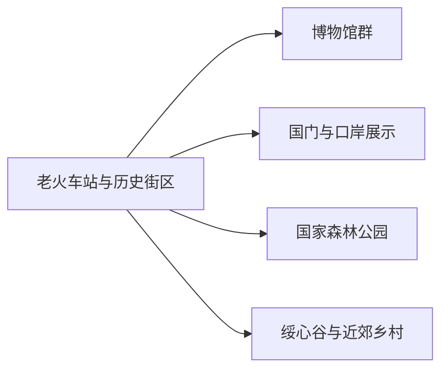
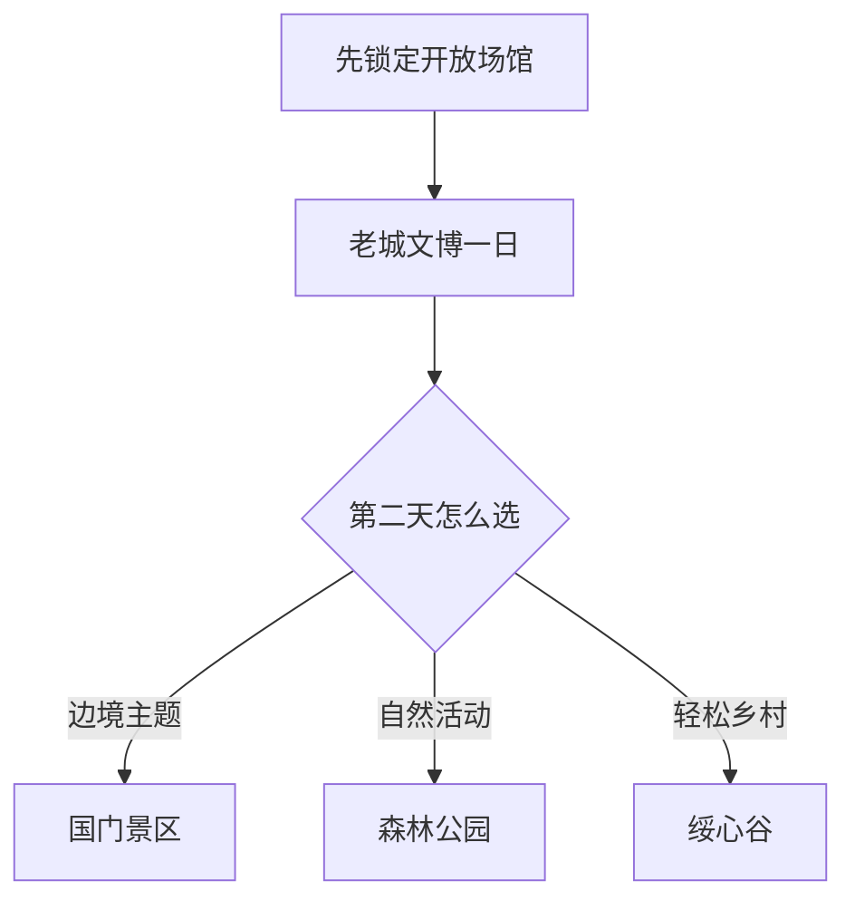

# 绥芬河旅行指南

绥芬河的行程可以从百年铁路口岸展开：先在历史文化街区和博物馆理解中东铁路、边贸与跨境交流，再按季节选择国门、森林公园或近郊农业文化园。市区不大，核心体验适合步行与短程车辆组合；真正跨境则另按证件、口岸与旅行社产品核对，和市内观光分开安排。

> 建议停留：1–2 天 
> 旅行关键词：百年口岸、中东铁路建筑、国门、博物馆、俄式餐饮、冰雪 
> 主要体力：低至中等；森林与冰雪活动较高 
> 最近研究：2026-08-13

## 城市速览

| 项目 | 旅行信息 |
|---|---|
| 主要旅行价值 | 用历史街区、文博场馆和国门认识铁路口岸城市，再体验中俄饮食、商品与季节活动 |
| 建议停留 | 1 天覆盖老城与文博；2 天加入国门或一条森林、农业远线 |
| 较舒适季节 | 夏秋适合步行与森林；冬季适合正式冰雪活动，但严寒、积雪和日照短增加成本 |
| 预算特点 | 市区中等；国门、滑雪、远线车辆和跨境产品是主要增量 |
| 步行强度 | 历史街区低至中等；森林、雪地与坡地为中至高 |
| 主要天气风险 | 极寒、暴雪、道路结冰、大风、森林火险与夏季强对流 |
| 独行旅行 | 市区容易安排；远线先锁定返程和正规接待 |
| 亲子旅行 | 博物馆、铁路建筑外观和正式冰雪项目较合适，活动年龄规则需逐项确认 |
| 长者与低体力旅行 | 以文博场馆、历史街区短段和车辆接驳为主 |
| 无障碍信息 | 现代场馆可提前咨询；老建筑、坡地和雪地设施连续性需向官方确认 |

## 城市格局与游览区域

绥芬河是牡丹江市代管的县级市，法定代码 `231081`。GeoNames `2034657` 与 Wikidata `Q1024736` 精确对应法定绥芬河市；点位用于核对主城位置，市域边界仍以现行行政资料为准。旅行空间可分为老火车站—历史街区、国门—口岸、森林与近郊乡村三组。

| 区域 | 主要内容 | 怎么安排 | 与其他区域的关系 |
|---|---|---|---|
| 老火车站—历史街区 | 百年站房、俄侨建筑、博物馆与日常商业 | 半日至一日步行加短程车 | 首访核心，也是餐饮住宿基地 |
| 国门—口岸方向 | 国门景区、口岸历史与边境观察 | 独立半日，按开放入口进入 | 与实际出入境流程分开理解 |
| 森林公园方向 | 林地、季节性滑雪和户外活动 | 半日至一日 | 天气、火险和运营决定可行性 |
| 绥东—绥心谷方向 | 农业文化园、采摘与乡村活动 | 按季节和接待安排半日 | 适合与市区组合，不与森林远线同日赶场 |
| 边境与铁路作业空间 | 国境线、货场、口岸查验和铁路生产区 | 使用正式景区与公共道路观察 | 按边境、海关、铁路和生产管理执行 |

## 主要景点

### 百年口岸与文博

| 景点 | 区域 | 类型 | 主要看点 | 建议用时 | 室内外 | 体力 | 预约风险 | 天气影响 | 优先级 |
|---|---|---|---|---:|---|---|---|---|---|
| 百年口岸历史文化街区 | 老城 | 历史街区 | 中东铁路时期建筑、站前路与口岸城市格局 | 2–4 小时 | 混合 | 低至中 | 低 | 中 | A |
| 绥芬河市博物馆 | 光华路 | 博物馆 | 口岸历史、自然资源与城市发展 | 1–2 小时 | 室内 | 低 | 中 | 低 | A |
| 中共六大历史资料馆 | 老城 | 红色文博 | 中共六大与中俄历史联系的专题资料 | 1–2 小时 | 室内 | 低 | 中 | 低 | A |
| 秘密交通线纪念馆等专题场馆 | 老城 | 纪念场馆群 | 红色交通线与沿边开放史，按当期开放场馆选择 | 1–3 小时 | 室内 | 低 | 高 | 低 | B |
| 百年火车站及铁路建筑外观 | 站前片区 | 铁路遗产 | 火车拉来的城市与历史建筑外观 | 1–2 小时 | 室外为主 | 低 | 低 | 中 | B |

### 国门、森林与近郊

| 景点 | 区域 | 类型 | 主要看点 | 建议用时 | 室内外 | 体力 | 预约风险 | 天气影响 | 优先级 |
|---|---|---|---|---:|---|---|---|---|---|
| 绥芬河国门景区 | 口岸方向 | 边境主题景区 | 国门、口岸发展与边境城市视角 | 2–4 小时 | 混合 | 中 | 高 | 中 | A |
| 绥芬河国家森林公园正式开放区 | 城郊 | 森林与冰雪 | 森林步道、季节雪景与正式运营项目 | 半日至一日 | 室外 | 中至高 | 高 | 很高 | B |
| 爱情谷及天长山、地久山公共游览区 | 城郊 | 城市山地公园 | 城市地标、坡地步道与季节景观 | 2–4 小时 | 室外 | 中 | 中 | 高 | B |
| 绥心谷农业文化园 | 绥东镇方向 | 农业与乡村 | 农业展示、正式采摘与乡村休闲 | 2–4 小时 | 混合 | 中 | 高 | 高 | B |
| 1903 创意产业园或当期开放更新空间 | 老火车站片区 | 城市更新 | 历史建筑活化与临时展演 | 1–2 小时 | 混合 | 低 | 高 | 低 | C |

国门景区提供的是境内边境主题游览，不等同于办理出入境。国境线、查验通道、铁路货场、仓储与装卸区按边境和生产管理进入；森林公园则沿正式步道和运营项目活动，火险、暴雪或闭园公告优先于原计划。

## 美食与餐饮

市区适合把东北菜、俄式餐饮和俄罗斯商品体验放在同一天。选择菜品与正规商业区即可，不必把跨境商品市场当作唯一景点。

| 菜品或餐饮类型 | 常见区域 | 一个人用餐与常见份量 | 风味、过敏原与饮食限制 | 排队风险与替代方法 |
|---|---|---|---|---|
| 俄式西餐、红菜汤与列巴 | 老城、商业区 | 套餐常适合一人 | 常含牛肉、奶油、小麦、甜菜和酒类调味 | 热门店排队时选同类正规餐厅 |
| 东北炖菜与锅包肉 | 主城家常菜馆 | 多为合餐，一人问小份 | 常含猪肉、糖、醋、小麦淀粉与大豆酱油 | 午晚高峰提前就餐 |
| 俄式香肠、奶制品和糖果 | 正规商场与口岸商品店 | 适合小包装试购 | 查看肉类、乳制品、坚果和酒精配料 | 比较中文标签、进口信息与保质期 |
| 烧烤与串类 | 市区餐饮街 | 一人容易点单 | 常含肉类、孜然、辣椒和大豆调味 | 选择明码标价、通风良好的店 |
| 东北饺子与面食 | 主城 | 一份适合一人 | 含小麦，馅料可能含猪牛羊肉、蛋或海鲜 | 可选清淡汤面或米饭菜 |

## 经典行程

### 一日经典路线

**路线**：百年火车站外观 → 历史文化街区 → 市博物馆 → 午餐 → 中共六大历史资料馆或另一座当期开放专题馆

- **串联逻辑**：集中在老城，用步行和短程车辆完成历史、铁路与城市生活。
- **预约锚点**：市博物馆和专题馆开放时段。
- **休息安排**：老城商业区午餐，下午场馆内休息。
- **时间不足时**：保留历史街区和一座博物馆。

### 两日城市路线

**第 1 天**：老城文博线。 
**第 2 天**：国门景区 → 市区俄式午餐 → 爱情谷或城市公园短段。

- **串联逻辑**：第一天认识城市，第二天补口岸视角并回到市区休息。
- **预约锚点**：国门景区与文博场馆。
- **休息安排**：两晚住老城或车站附近，午餐回市区。
- **时间不足时**：第二天只保留国门。

### 三日深度路线

**第 1 天**：老城文博。 
**第 2 天**：国门与口岸主题。 
**第 3 天**：国家森林公园或绥心谷二选一。

- **串联逻辑**：第三天按天气在户外与乡村轻线之间选择，不跨多个远点。
- **预约锚点**：森林或农业园运营、车辆与午餐。
- **休息安排**：连续住市区，远线当日往返。
- **时间不足时**：先删第三天。

### 雨雪天路线

**路线**：市博物馆 → 室内午餐 → 中共六大历史资料馆或当期室内展览

- **适用条件**：市区交通正常；暴雪、冻雨或极寒升级时改为住宿附近短线。
- **预约锚点**：场馆是否开放。
- **休息安排**：同一片区用餐与候车。
- **时间不足时**：只保留一座场馆。

### 亲子或低体力路线

**亲子路线**：市博物馆 → 午餐 → 历史街区短段 → 正式亲子活动。 
**低体力路线**：车辆到市博物馆 → 午休 → 百年建筑外观短段。

- **减负方式**：亲子线用场馆与短步行替代长雪地活动；低体力线控制上下坡和户外停留。
- **预约锚点**：儿童活动年龄、卫生间、电梯与座椅。
- **休息安排**：老城餐饮和场馆休息区。
- **时间不足时**：两类路线都保留博物馆与午餐。

### 远郊一日路线

**路线**：市区 → 国家森林公园或绥心谷二选一 → 正式服务点午餐 → 返回

- **适用条件**：开放、天气、道路与返程已确认。
- **预约锚点**：景区运营、活动、车辆和森林火险信息。
- **休息安排**：游客中心或乡村正式接待点。
- **时间不足时**：整段改为老城—博物馆线。

## 住宿区域

| 区域 | 优点 | 缺点 | 适合人群 | 交通特点 |
|---|---|---|---|---|
| 绥芬河站—老城 | 历史街区、餐饮与铁路抵达方便 | 老建筑周边房间和停车条件差异大 | 首访、独行、铁路抵达 | 步行加短程车覆盖核心 |
| 商业与国门大道方向 | 现代酒店、停车和口岸方向接驳较方便 | 到老城需乘车 | 自驾、家庭、商务与国门行程 | 适合次日去国门 |
| 森林公园或乡村正式住宿 | 靠近单一远线活动 | 运营季、供暖、餐饮和返程选择有限 | 已锁定景区活动者 | 先确认营业与车辆再预订 |

## 市内交通

| 场景 | 建议与取舍 | 行前需要重查的内容 |
|---|---|---|
| 铁路抵达 | 绥芬河站连接哈尔滨、牡丹江方向，抵达后可先入住老城 | 车次、口岸客流和站前上客点 |
| 市区移动 | 历史街区可分段步行，国门和城郊用公交、出租或正规车辆 | 线路、末班和景区接驳 |
| 自驾远线 | 森林与乡村方向更灵活，冬季需增加冰雪驾驶余量 | 路况、停车、火险和天气管制 |
| 跨境旅行 | 选择有资质旅行社和正式口岸产品，与境内景点票务分开 | 护照、签证或免签条件、团组、保险和海关要求 |

## 不同旅行者须知

| 旅行维度 | 可行条件 | 主要取舍 | 需额外核对 |
|---|---|---|---|
| 独行旅行 | 市区文博与餐饮容易组合 | 远线车辆成本较高 | 返程、夜间上客点和住宿前台 |
| 亲子旅行 | 场馆、街区短段和正式冰雪项目 | 雪地与边境主题活动按年龄选择 | 儿童票、保暖、救援和卫生间 |
| 长者或低体力旅行 | 车辆串联场馆与街区外观 | 老建筑台阶、坡道和冰雪路面 | 电梯、座椅和落客点 |
| 无障碍需求 | 现代场馆可提前咨询 | 历史建筑与雪地连续通行有限 | 设施连续性需向官方确认 |
| 摄影旅行 | 历史街区与公共观景区适合 | 口岸、铁路和边境拍摄受管理 | 摄影、无人机和商业拍摄规则 |
| 跨境旅行 | 证件与正式产品齐全 | 时间和退改成本高于市内游 | 外事、移民、海关与旅行社公告 |

## 行前核对

| 核对事项 | 为什么需要重查 | 建议核对时间 | 官方入口 |
|---|---|---|---|
| 景区与场馆 | 节庆、维护和季节运营会变化 | 排入路线前及到访前一日 | [绥芬河市人民政府](https://www.suifenhe.gov.cn/) |
| 国门与跨境 | 景区开放和实际出入境是两套规则 | 订票前及出发前 | [国家移民管理局](https://www.nia.gov.cn/) |
| 冰雪与森林 | 闭园、火险和道路状态具有时效性 | 出发前三日及当天 | [黑龙江省文化和旅游厅](https://wlt.hlj.gov.cn/) |
| 铁路 | 车次和停站按日期变化 | 出发前一周及当天 | [中国铁路 12306](https://www.12306.cn/) |
| 天气 | 极寒、暴雪和大风影响远线 | 出发前三日及当天 | [黑龙江省气象局](https://hl.cma.gov.cn/) |

## 来源与更新记录

### 主要来源

| 来源 | 类型 | 支持内容 | 核验日期 |
|---|---|---|---|
| [绥芬河基本市情](https://www.suifenhe.gov.cn/sfh/c100936/tt.shtml) | 属地政府 | 边境、铁路口岸、博物馆群与城市定位 | 2026-08-13 |
| [百年口岸](https://suifenhe.gov.cn/sfh/c100947/202301/c03_270733.shtml) | 属地政府 | 历史文化街区、建筑与市博物馆 | 2026-08-13 |
| [2026 年政府工作报告](https://suifenhe.gov.cn/sfh/c101156/202601/c03_1032472.shtml) | 属地政府 | 场馆更新、绥心谷与当期文旅状态 | 2026-08-13 |
| [2026 年春节文旅保障发布会](https://www.suifenhe.gov.cn/sfh/c100958/202602/c03_1036837.shtml) | 属地政府 | 国门、森林公园与季节活动核对入口 | 2026-08-13 |
| [绥芬河全域旅游发展规划](https://www.suifenhe.gov.cn/sfh/c101858/202003/293913/files/%E5%8E%9F%E6%96%87%E4%B8%8B%E8%BD%BD%EF%BC%88%E5%85%A8%E5%9F%9F%E6%97%85%E6%B8%B8%EF%BC%89.pdf) | 属地政府规划 | 旅游空间、历史建筑、森林与口岸关系 | 2026-08-13 |
| [GeoNames 2034657](https://www.geonames.org/2034657/) | 开放地名库 | 固定城市记录与坐标 | 2026-08-13 |
| [Wikidata Q1024736](https://www.wikidata.org/wiki/Q1024736) | 开放知识库 | 法定实体与 GeoNames 精确映射 | 2026-08-13 |

### 更新记录

| 日期 | 更新内容 |
|---|---|
| 2026-08-13 | 首次建立绥芬河独立指南；按老城、国门、森林与乡村四个旅行模块组织，并明确边境查验、铁路生产和森林管理边界。 |
