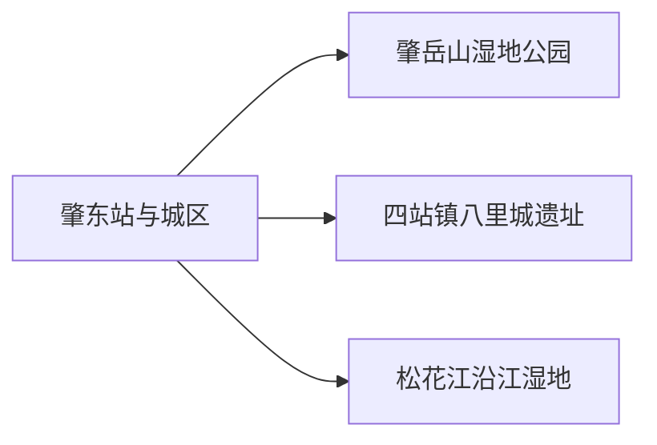
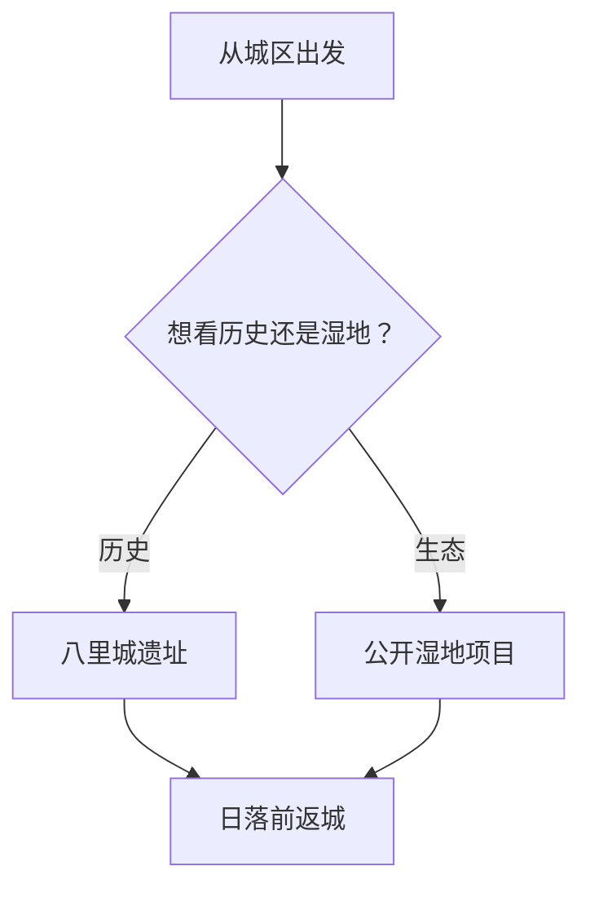

# 肇东市旅行指南

肇东位于哈尔滨与大庆之间，旅行线索主要是松嫩平原城市、金源历史和沿松花江湿地。最容易执行的方式是住城区，先看肇岳山和城市场馆，再从八里城遗址或已正式开放的湿地项目中选一条远线。

> 建议停留：1–2 天\
> 旅行关键词：湿地、金源历史、松嫩平原、城际铁路\
> 主要体力：低至中等\
> 最近研究：2026-08-12

## 城市速览

| 项目 | 旅行信息 |
|---|---|
| 主要旅行价值 | 在哈齐走廊中观察县级市生活、湿地生态与八里城遗址所代表的金代历史 |
| 建议停留 | 1 天做城区与肇岳山；2 天再选八里城或一处有正式接待的沿江湿地 |
| 较舒适季节 | 5–9 月适合湿地与城市户外；冬季适合冰雪活动，但风寒与道路结冰更强 |
| 预算特点 | 城区食宿相对平实；湿地和遗址方向的车辆成本更高 |
| 步行强度 | 城区公园低至中等；湿地栈道、积雪和遗址地面增加负担 |
| 主要天气风险 | 严寒、风寒、暴雪、雾、强对流与汛期水位 |
| 独行旅行 | 铁路到发和城区用餐简单；远郊宜提前确认司机与返程 |
| 亲子旅行 | 湿地观察和地方历史题材清晰；水边、冰面和公路停车需持续看护 |
| 长者与低体力旅行 | 可选肇岳山正式步道短段和城区场馆，湿地只走车辆可达的公开段 |
| 无障碍信息 | 车站、公园、场馆、湿地栈道与卫生间需分段确认；设施连续性需向官方确认 |

## 城市格局与游览区域

| 区域 | 主要内容 | 游览特点 | 与其他区域的关系 |
|---|---|---|---|
| 肇东站—城区 | 铁路、餐饮、城市场馆与日常生活 | 适合到达日和雨雪天 | 作为各条公路远线的食宿基地 |
| 肇岳山片区 | 湿地公园、城市绿地与观景 | 入口相对靠近城区，花半日较从容 | 可与城区场馆同日 |
| 四站镇 | 八里城遗址 | 以遗址格局与保护边界为主 | 需单独往返，不与沿江湿地拼成紧凑半日 |
| 南部沿江方向 | 沿江保护区、八里湖、千鹤岛等不同管理单元 | 只选已公布开放的项目与入口 | 适合整日，水位和道路是决策条件 |

## 主要景点

### 城区与历史线

| 景点 | 区域 | 类型 | 主要看点 | 建议用时 | 室内外 | 体力 | 预约风险 | 天气影响 | 优先级 |
|---|---|---|---|---:|---|---|---|---|---|
| 肇岳山国家湿地公园 | 城区西北 | 城市湿地公园 | 湿地景观、城市绿地与观景高点 | 2–4 小时 | 室外 | 中 | 中 | 高 | A |
| 肇东市博物馆或当期城市展陈 | 城区 | 博物馆 | 地方历史、民俗和松嫩平原生活，馆址与开馆需确认 | 1–2 小时 | 室内 | 低 | 高 | 低 | B |
| 八里城遗址 | 四站镇 | 全国重点文物保护单位、古遗址 | 金代城址格局与松嫩平原古代交通线索 | 1.5–3 小时 | 室外 | 中 | 高 | 高 | A |

### 湿地与乡野

| 景点 | 区域 | 类型 | 主要看点 | 建议用时 | 室内外 | 体力 | 预约风险 | 天气影响 | 优先级 |
|---|---|---|---|---:|---|---|---|---|---|
| 八里湖当期公开观景段 | 市域南部 | 湖泊、湿地 | 平原水网、芦苇和候鸟生境 | 半日 | 室外 | 中 | 高 | 很高 | B |
| 千鹤岛湿地公园 | 黎明—五站—涝洲方向 | 湿地项目 | 松花江流域湿地和水乡景观，运营状态行前重查 | 半日至 1 天 | 室外 | 中 | 高 | 很高 | C |
| 肇东沿江省级自然保护区公开科普段 | 松花江北岸 | 自然保护地 | 湿地生态系统与鸟类栖息地，以管理方明确的公开活动为准 | 2–4 小时 | 室外 | 中 | 高 | 很高 | C |

湿地观察以正式道路、栈道和观景点为行动范围。保护区核心、水面、芦苇滩和河道作业区属于明确边界；在指定位置远距离观察，更容易保留完整生态体验。

## 美食与餐饮

| 菜品或餐饮类型 | 常见区域 | 一个人用餐与常见份量 | 风味、过敏原与饮食限制 | 排队风险与替代方法 |
|---|---|---|---|---|
| 肇东小饼与东北面食 | 城区早餐店 | 适合单人，先按个购买 | 小麦、芝麻、油脂及可能的肉馅 | 早餐高峰就近换同类店 |
| 锅包肉、溜肉段与东北炖菜 | 城区餐馆 | 盘量偏大，独行选半份或套餐 | 猪肉、小麦挂糊、大豆、高油盐和共用炸油 | 选能说清克重的家常菜馆 |
| 鱼菜与沿江农家菜 | 沿江乡镇及城区 | 鱼常按条或锅，适合多人 | 淡水鱼刺、大豆、麦麸、野生菌菜和食品来源 | 以正规餐厅为主，一人改点小份鱼肉或普通热菜 |
| 鲜食玉米与乳制品 | 市场、商超 | 可按个或小包装购买 | 乳糖、牛奶蛋白和添加糖；散装冷链需留意 | 选标签完整和冷链正常的商超产品 |

## 经典行程

### 一日经典路线

**路线**：城区场馆 → 午餐 → 肇岳山湿地公园 → 城区晚餐

- **串联逻辑**：室内历史与城区边缘湿地同日组合，转场最少。
- **预约锚点**：场馆开放、公园入口与当期可通行步道。
- **休息安排**：城区午餐，公园服务区补水与防风。
- **时间不足时**：保留肇岳山短段，场馆改到雨天。

### 两日城市路线

**第 1 天**：城区场馆 → 肇岳山。\
**第 2 天**：四站镇 → 八里城遗址 → 镇区休息 → 城区。

- **串联逻辑**：城市湿地与金代遗址分日，第二天专注一条公路方向。
- **预约锚点**：八里城当期访问边界、讲解和往返车辆。
- **休息安排**：四站镇解决午餐与卫生间，户外停留按风力缩短。
- **时间不足时**：只保留第一天；对历史兴趣更高时则直接做八里城整日。

### 三日深度路线

**第 1 天**：城区与肇岳山。\
**第 2 天**：八里城遗址。\
**第 3 天**：八里湖、千鹤岛或沿江公开科普段三选一。

- **串联逻辑**：第三天只去一个有明确入口和返程的湿地单元。
- **预约锚点**：湿地开放、水位、观光项目、道路和返程。
- **休息安排**：使用乡镇正规餐饮点，随身带饮水、防晒与防风层。
- **时间不足时**：先删第三天，不把两处湿地压缩同日。

### 雨天路线

**路线**：已确认开馆的城市场馆 → 城区午餐 → 商业区休息

- **适用条件**：普通降雨可执行；暴雨、强对流或暴雪时减少户外移动。
- **预约锚点**：场馆开放和出租车可达性。
- **休息安排**：选同一商业区完成用餐、补给和等车。
- **时间不足时**：只保留一座场馆。

### 亲子或低体力路线

**亲子路线**：城市场馆 → 午餐 → 肇岳山正式步道短段。\
**低体力路线**：车辆抵达肇岳山游客区 → 城区午餐 → 场馆。

- **减负方式**：亲子线远离水边、薄冰和无护栏区；低体力线用车辆串联两处。
- **预约锚点**：落客点、坡道、轮椅、卫生间与冬季除雪状态。
- **休息安排**：每 60–90 分钟进入室内补水或取暖。
- **时间不足时**：删公园长步道，保留场馆和用餐。

### 远郊一日路线

**路线**：城区 → 四站镇 → 八里城遗址开放区域 → 镇区休息 → 城区

- **适用条件**：遗址边界、道路与返程交通均已确认。
- **预约锚点**：文物管理规则、讲解、停车与气象。
- **休息安排**：镇区用餐，户外按风力和体感温度分段停留。
- **时间不足时**：保留遗址主区，不追加湿地或沿江乡镇。

## 住宿区域

| 区域 | 优点 | 缺点 | 适合人群 | 交通特点 |
|---|---|---|---|---|
| 肇东站与城区商业区 | 铁路、餐饮、商超和车辆服务较集中 | 去沿江与四站镇仍需较长公路转场 | 首访、无车、晚到早走 | 便于往返哈尔滨、大庆和绥化 |
| 肇岳山附近 | 早晚散步与绿地体验方便 | 餐饮与铁路的便利性取决于具体地址 | 以公园与慢节奏为主 | 订房时核对实际车程与冬季步道 |
| 沿江乡镇合规住宿 | 可缩短特定湿地项目的早出 | 选择少，洪水、道路与退改风险高 | 已锁定正式项目和次日返程者 | 确认消防、热水、供暖、停车和应急联络 |

## 市内交通

- **铁路**：肇东站有普速与哈齐通道列车到发；车次、站台和无障碍协助以 12306 为准。
- **城区**：公交和出租车适合车站、商业区与肇岳山之间移动；冬季给叫车与步行留额外时间。
- **四站镇与沿江**：选农村客运、正规包车或自驾，先确认返程。通航机场的“全面通航”不等于有定期民航客运，跨城航程按民航主管部门与航司公告安排。

## 不同旅行者须知

| 旅行维度 | 可行条件 | 主要取舍 | 需额外核对 |
|---|---|---|---|
| 独行 | 城区基地加每天一个方向 | 远郊叫车和返程确定性 | 末班、司机信息、信号与夜间到店 |
| 亲子 | 城市湿地短段和场馆 | 寒冷、水边、冰面与公路安全 | 卫生间、座椅、取暖点、看护和儿童规则 |
| 长者或低体力 | 车辆门到门与短步道 | 长时间迎风和遗址不平地面 | 落客点、防滑、坡道、座椅与急救点 |
| 观鸟摄影 | 在正式平台远距离观察 | 物种出现受季节、水位与人为干扰影响 | 开放区、三脚架、无人机、森林防火与鸟类保护规则 |

## 行前核对

| 核对事项 | 为什么需要重查 | 建议核对时间 | 官方入口 |
|---|---|---|---|
| 肇岳山和城市场馆 | 入口、开馆、冬季步道和活动会变 | 前一日 | [肇东市政府](https://www.hljzhaodong.gov.cn/zd/c11/201708/c12_162824.shtml) |
| 八里城遗址 | 文保边界、可访区域、讲解和道路需当期确认 | 订车前 | [肇东市政府文保通知](https://www.hljzhaodong.gov.cn/zd/c38/201901/c12_58365.shtml) |
| 沿江湿地 | 不同湿地单元的开放、水位、项目和道路并不共用 | 前三日、前一日与当天 | [肇东市政府湿地资料](https://www.hljzhaodong.gov.cn/zd/c11/201708/c12_162823.shtml) |
| 铁路和道路 | 列车、农村客运、冰雪和汛期施工会变 | 开售时及出发当天 | [12306](https://www.12306.cn/)、[黑龙江省交通运输厅](https://jt.hlj.gov.cn/) |
| 天气和水情 | 严寒、风寒、暴雪、强对流与松花江水位影响行程 | 前三日起连续查 | [黑龙江省气象局](https://hl.cma.gov.cn/)、属地防汛公告 |

## 来源与更新记录

### 主要来源

| 来源 | 类型 | 支持内容 | 核验日期 |
|---|---|---|---|
| [黑龙江省民政厅](https://mzt.hlj.gov.cn/) | 省民政部门 | 肇东市县级市层级与行政代码 `231282` 核对入口 | 2026-08-12 |
| [Wikidata：Zhaodong（Q197495）](https://www.wikidata.org/wiki/Q197495) | CC0 开放数据 | 法定实体与 GeoNames `2033168` 精确交叉核对 | 2026-08-12 |
| [GeoNames：Zhaodong（2033168）](https://www.geonames.org/2033168/zhaodong.html) | CC BY 4.0 开放数据 | PPLA3 主城驻地点、坐标和名称；不用点位替代市域边界 | 2026-08-12 |
| [肇东市政府：市情概况](https://www.hljzhaodong.gov.cn/zd/c01/zjzd.shtml) | 市政府 | 区位、铁路公路、松花江、八里湖与湿地资源 | 2026-08-12 |
| [肇东市政府：肇岳山国家湿地公园](https://www.hljzhaodong.gov.cn/zd/c11/201708/c12_162824.shtml) | 市政府 | 肇岳山位置、功能分区、湿地与游客服务内容 | 2026-08-12 |
| [肇东市政府：八里城遗址保护范围](https://www.hljzhaodong.gov.cn/zd/c38/201901/c12_58365.shtml) | 市政府 | 八里城遗址位于四站镇、全国重点文物保护单位与保护边界 | 2026-08-12 |
| [肇东市政府：沿江湿地自然保护区](https://www.hljzhaodong.gov.cn/zd/c11/201708/c12_162823.shtml) | 市政府 | 保护区位置、面积、生态系统和保护对象 | 2026-08-12 |

### 更新记录

- 2026-08-12：建立首个完整版本；以 GeoNames `2033168`、Wikidata `Q197495` 和法定代码 `231282` 核对肇东市；按城区、肇岳山、八里城与沿江湿地分区，补齐湿地保护、冰雪、汛期、交通与无障碍决策。
