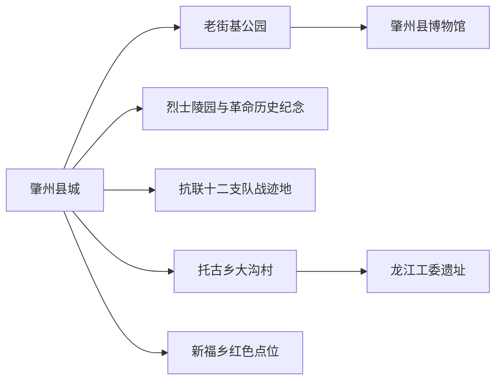
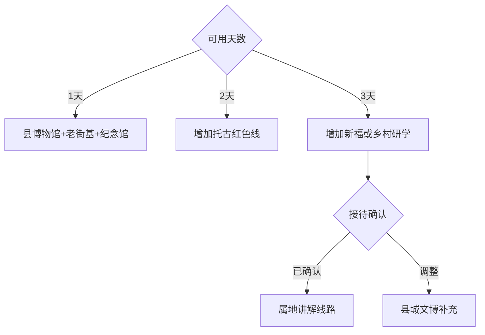

# 肇州旅行指南

肇州位于大庆东南部松嫩平原，适合从县城的博物馆与老街基切入，再按预约进入托古、新福等红色研学点。固定清单中的 **Zhaozhou / GeoNames 2033147** 对应肇州县城；这里的旅行价值集中在辽金与民俗展陈、东北抗联记忆、寒地农业和县城生活，适合一至三天慢慢展开。乡村点位接待条件差异明显，先确定讲解与车辆，再组合路线。

## 城市速览

| 项目 | 信息 |
|---|---|
| 主线 | 县博物馆—老街基公园—革命历史纪念—托古龙江工委遗址 |
| 停留 | 县城1天；红色研学或乡村方向各另留1天 |
| 住宿 | 县城适合餐饮、补给和连续包车；乡村住宿按正式接待选择 |
| 交通 | 从大庆、哈尔滨或松原方向经公路到达，县内以预约车辆为主 |
| 季节 | 夏秋适合乡村；冬季可看寒地生活，重点关注风雪与暗冰 |
| 边界 | 纪念场所、农业生产、油气设施、水域与自然冰面分别管理 |

## 城市格局与游览区域

县城集中博物馆、公共文化、住宿与餐饮，适合先读懂肇州的辽金、民俗和近现代历史。抗联十二支队战迹地位于县城以东，龙江工委遗址位于托古乡大沟村李道德屯，新福乡还有相关战斗记忆；三者分处乡村公路方向，以馆方或属地确认的研学线路进入。

肇州属于大庆市所辖普通县，但与大庆中心城区之间具有独立到发、住宿和乡村接驳尺度。县域油气、粮食、畜牧与食品加工首先是生产体系，旅行内容选择开放场馆、纪念设施、公共公园和正式乡村接待。

## 主要景点

| 景点 | 区域 | 类型 | 核心体验 | 用时 | 环境 | 体力 | 预约风险 | 天气影响 | 优先级 |
|---|---|---|---|---:|---|---|---|---|---|
| 肇州县博物馆 | 县城 | 综合博物馆 | 辽金文物、民俗、瓷器、抗联与民国地契 | 2–3小时 | 室内 | 低 | 很高 | 低 | A |
| 老街基公园 | 县城 | 城市公园 | 博物馆周边、县城生活与老街基文化 | 1–2小时 | 室外 | 低 | 中 | 高 | B |
| 肇州县革命历史纪念馆 | 烈士陵园 | 纪念馆 | 县域革命史与烈士事迹 | 1–2小时 | 室内外 | 低 | 极高 | 中 | A |
| 肇州县革命烈士陵园 | 县城 | 纪念空间 | 纪念塔、仪式空间与地方革命记忆 | 1小时 | 室外 | 低 | 高 | 高 | B |
| 抗联十二支队战迹地纪念碑 | 县城东 | 红色遗址 | “三肇”地区抗联游击斗争 | 1–2小时 | 室外 | 低中 | 极高 | 高 | A |
| 龙江工委遗址 | 托古乡大沟村 | 红色遗址 | 地下党组织与抗联十二支队指挥历史 | 2–3小时 | 室内外 | 低中 | 极高 | 高 | A |
| 大沟村红色研学接待点 | 托古乡 | 乡村研学 | 红色文化、村落与乡村振兴 | 2–4小时 | 混合 | 低中 | 极高 | 高 | B |
| “十三省”等战斗记忆点 | 新福乡 | 红色遗址 | 抗日英烈故事与乡村历史 | 半日 | 室外 | 中 | 极高 | 极高 | B |
| 伪满第三飞行队起义战迹地 | 县域 | 战迹地 | 东北抗战与起义历史 | 1–2小时 | 室外 | 低中 | 极高 | 高 | C |
| 肇州县第二中学校史馆 | 县城 | 校史与地方史 | 地方教育史和红色教育资料 | 1小时 | 室内 | 低 | 极高 | 低 | C |

红色点位多承担纪念、教育和村庄公共功能，适合预约讲解后成组参观。学校场馆以校方接待为准；乡村战迹地以正式标识和属地人员引导定位。将县博物馆作为基础锚点，即使远线因天气或接待调整，县城日仍可独立成立。

## 美食与餐饮

肇州可围绕糯玉米、大瓜子、东北炖菜、黏食、锅包肉、杀猪菜和本地粮食加工产品选择。老街基相关产品适合作为地方物产线索，购买时看生产主体、配料和日期。乡村团餐提前确认人数、时间、价格与过敏原；自驾人员把饮酒和驾驶分开，冬季携带热饮与应急食物。

## 经典行程

### 一日县城线
**路线**：肇州县博物馆—老街基公园—革命烈士陵园与革命历史纪念馆。**逻辑**：辽金民俗、县城生活和革命史在一天内形成时间线。**预约锚点**：两座场馆和陵园活动。**休息**：县城餐饮区。**删除条件**：纪念活动封场时保留博物馆与公园。

### 两日红色研学线
**路线**：首日县城；次日抗联十二支队战迹地—托古乡大沟村—龙江工委遗址。**逻辑**：先在馆内建立背景，再到乡村遗址理解组织与战斗空间。**预约锚点**：讲解、村内接待和全天车辆。**休息**：大沟村正式服务点。**删除条件**：接待未确认或乡路受风雪影响时改县城资料研读。

### 新福乡专题线
**路线**：县城—新福乡属地集合—“十三省”等正式纪念点—返程。**逻辑**：用一条乡镇线集中理解抗日英烈故事。**预约锚点**：属地联系人、准确点位、讲解和返程。**休息**：乡镇公共服务点。**删除条件**：缺少属地引导、道路积水或低能见度时取消。

### 县城慢行线
**路线**：老街基公园—县博物馆—县城餐饮—公共文化空间。**逻辑**：以低强度方式观察县城历史与日常生活。**预约锚点**：博物馆开放。**休息**：公园和场馆。**删除条件**：极寒、大风或高温时减少室外段。

### 乡村物产线
**路线**：县城—已确认接待的糯玉米或杂粮展示点—正规产品门店—返程。**逻辑**：把寒地农业放进可追溯、可接待的生产叙事。**预约锚点**：经营主体、参观范围、季节和车辆。**休息**：正式接待点。**删除条件**：农忙、动物防疫、生产检修或接待取消时只做门店选购。

### 冬季调整线
**路线**：县博物馆—革命历史纪念馆—县城餐饮。**逻辑**：以室内为主，压缩乡村道路暴露。**预约锚点**：场馆、供暖和县城交通。**休息**：两座场馆。**删除条件**：暴雪、风吹雪或道路结冰预警时留在住宿地。

### 低体力线
**路线**：车辆到县博物馆—午餐—革命历史纪念馆。**逻辑**：用两个室内锚点控制步数与户外时间。**预约锚点**：落客、座椅、卫生间和无障碍情况。**休息**：场馆。**删除条件**：团体研学客流过高时择一参观。

## 住宿区域

肇州县城是首选住宿区，可承接博物馆、餐饮、包车和次日乡村出发。连续红色研学优先在县城连住，减少搬运行李；乡村住宿只选证照、供暖、热水、消防、餐饮和通信均明确的经营点。冬季订房时重点确认夜间供暖、车辆冷启动与免费取消条件。

## 市内交通

肇州以公路到达，可从大庆、哈尔滨或松原方向组合，具体班次与上下车点随客运安排变化。县城内短程用出租车或步行，托古、新福等乡村方向适合预约全天车辆，并约定等待、返程和恶劣天气取消。冬季把风吹雪、暗冰和日落时间纳入路线长度。

## 不同旅行者须知

历史旅行者以县博物馆和龙江工委遗址为主；亲子与团队提前约讲解并尊重纪念场所秩序；摄影者在公共空间记录县城与平原季节；低体力旅行者保留两个室内场馆。学校教学区、烈士安葬区、油气井场、粮库、养殖场、作业田块、水利设施和自然冰面保留明确限制。

## 行前核对

- 核对县博物馆、革命历史纪念馆、学校场馆和乡村遗址接待。
- 核对县际客运、包车、乡村道路、讲解、餐饮和返程时间。
- 核对暴雪、风吹雪、雷暴、积水、暗冰、极寒和高温预警。
- 农业、油气、水利和校园空间按管理方确认的参观范围进入。

## 来源与更新记录

| 来源 | 支持内容 | 核验日期 |
|---|---|---|
| [黑龙江省文旅厅：肇州红色旅游](https://wlt.hlj.gov.cn/wlt/c114169/202208/c00_31391667.shtml) | 县博物馆、革命历史纪念馆、抗联十二支队战迹地、龙江工委遗址与乡村研学 | 2026-09-04 |
| [黑龙江省文旅厅：全省红色旅游线路](https://wlt.hlj.gov.cn/wlt/c114253/202212/c00_31506100.shtml) | 肇州八处红色景观与研学线路关系 | 2026-09-04 |
| [黑龙江省政府：大庆冰雪经济](https://www.hlj.gov.cn/hlj/c107858/202401/c00_31698751.shtml) | 肇州在大庆南部冬趣古城与乡村旅游带中的位置 | 2026-09-04 |
| [黑龙江省政府：大庆提振消费方案](https://www.hlj.gov.cn/hljzqc/c100118/202505/c00_31846789.shtml) | 肇州老街基旅游商品与地方消费品牌 | 2026-09-04 |
| [黑龙江省商务厅：服务业标准化案例](https://sswt.hlj.gov.cn/sswt/c103658/202408/c00_31764040.shtml) | 肇州糯玉米、大瓜子与老街基传统酿造 | 2026-09-04 |
| [GeoNames 2033147](https://www.geonames.org/2033147/) | Zhaozhou 固定人口点 | 2026-09-04 |

| 日期 | 更新 |
|---|---|
| 2026-09-04 | 首次完成肇州旅行研究；按县城文博、革命纪念、托古与新福乡村研学组织。 |
