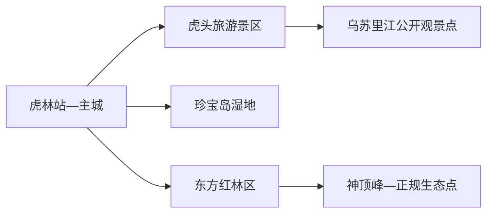
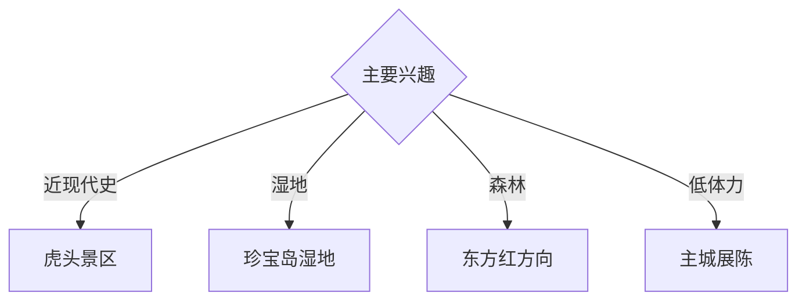

# 虎林旅行指南

虎林位于乌苏里江流域，城市旅行以虎头红色历史、珍宝岛湿地、东方红森林和边境农业景观为核心。固定快照中的 **Hulin / GeoNames 13450567** 对应现行虎林市；主城到虎头、珍宝岛和东方红距离较长，适合分方向留出三天。

## 城市速览

| 项目 | 信息 |
|---|---|
| 主线 | 虎林主城—虎头景区—珍宝岛湿地—东方红林区 |
| 停留 | 主城与虎头2天；湿地或森林各另加1天 |
| 住宿 | 虎林主城适合换乘；虎头与东方红按正式接待点选择 |
| 交通 | 铁路、公路抵达；远端景区以约车、自驾或正规线路为主 |
| 风险 | 边境管理、湿地保护、森林防火、野生动物与冬季冰雪 |

## 城市格局与游览区域

虎头镇位于乌苏里江畔，以近现代史与边境江景为主；珍宝岛湿地和珍宝岛相关点位受保护地、边境与交通条件共同约束。东方红林区是森林生态方向，与虎头并不顺路；主城承担住宿、补给和多方向换乘。

## 主要景点

| 景点 | 区域 | 类型 | 核心体验 | 用时 | 环境 | 体力 | 研究价值 | 拥挤 | 优先级 |
|---|---|---|---|---:|---|---|---|---|---|
| 虎头旅游景区 | 虎头镇 | 历史与边境 | 第二次世界大战终结地相关史迹、乌苏里江地理 | 1天 | 混合 | 中 | 很高 | 节假日中 | A |
| 虎头要塞博物馆公开区 | 虎头镇 | 博物馆与遗址 | 战争史、地下工事与和平教育 | 2–3小时 | 混合 | 中高 | 很高 | 团体时中 | A |
| 乌苏里江虎头公开观景段 | 虎头镇 | 边境江景 | 界江地理、湿地与日出 | 1–2小时 | 室外 | 低 | 高 | 日出时中 | A |
| 珍宝岛湿地景区公开区 | 东部 | 湿地 | 沼泽、河流、候鸟与生态科普 | 1天 | 室外 | 中 | 很高 | 旺季中 | A |
| 神顶峰正式游览区 | 东方红方向 | 山地森林 | 森林、日出与东部山地 | 半天至1天 | 室外 | 高 | 高 | 旺季中 | B |
| 东方红湿地与森林公开科普点 | 东方红方向 | 自然教育 | 森林—湿地生态系统 | 半天 | 混合 | 中 | 高 | 团体时中 | B |
| 虎林市博物馆或地方展陈 | 主城 | 博物馆 | 城市史、农业与边境文化 | 2小时 | 室内 | 低 | 高 | 团体时中 | B |

## 美食与餐饮

乌苏里江鱼、稻米、山野菜和东北炖菜最具地方特色。江鱼与野生食材选择正规餐馆和合法来源；森林采集、捕捞和农田体验按经营主体的公开项目参加。远端路线自备饮水和简餐，同时保留垃圾带离方案。

## 经典行程

### 一日虎头线
**路线**：主城—虎头旅游景区—要塞博物馆公开区—江畔观景—返城。**逻辑**：把战争史与边境地理放在同一天。**预约锚点**：景区开放、讲解和往返车辆。**休息**：虎头游客中心。**删除条件**：边境临时管控或道路结冰时改主城展陈。

### 历史深读线
**路线**：虎头历史展陈—地下工事开放段—纪念空间—和平主题展览。**逻辑**：按证据理解战争终结史。**预约锚点**：讲解、地下空间开放。**休息**：地面游客服务区。**删除条件**：地下空间维护时保留地面展陈。

### 珍宝岛湿地线
**路线**：主城—正式游客入口—湿地栈道或观鸟点—返城。**逻辑**：给东部湿地完整一天。**预约锚点**：保护区开放、接驳和返程。**休息**：游客服务点。**删除条件**：汛情、火险、候鸟保护或边境管控时取消。

### 东方红森林线
**路线**：主城—东方红正规接待点—森林科普—返程或当地住宿。**逻辑**：独立观察森林与湿地生态。**预约锚点**：接待资质、道路和返程。**休息**：林区公共服务点。**删除条件**：林火、暴雪或野生动物风险提示时取消。

### 神顶峰日出线
**路线**：正规住宿—景区接驳—神顶峰开放观景点—早餐—返程。**逻辑**：以受管理路线完成日出体验。**预约锚点**：夜间接驳、天气和开放。**休息**：游客中心。**删除条件**：低能见度、强风或道路结冰时取消早出。

### 亲子自然线
**路线**：主城地方展陈—午餐—近距离正规湿地科普点。**逻辑**：室内背景配低体力自然观察。**预约锚点**：展馆和科普活动。**休息**：主城。**删除条件**：蚊虫高峰或强对流时只留室内。

### 雨雪天气线
**路线**：地方展陈—午餐—室内红色史展—主城休整。**逻辑**：减少长距离道路风险。**预约锚点**：馆舍开放。**休息**：主城。**删除条件**：暴雪封路时留在住宿地。

## 住宿区域

虎林主城适合铁路抵离和多方向换乘；虎头适合日出与历史深读；东方红方向适合森林生态主题。边境与林区住宿按合法经营、供暖、消防、通信和天气响应能力选择。

## 市内交通

虎林站是主要铁路入口，主城用公交、出租车和网约车。虎头、珍宝岛湿地和东方红之间距离大，使用正规旅游线路、约车或自驾；冬季出车前核对路况、燃油、通信和救援条件。

## 不同旅行者须知

历史兴趣者给虎头完整一天；观鸟者服从季节性保护距离和静音要求；亲子家庭优先博物馆、虎头地面展陈与科普点；行动不便者确认地下工事台阶、湿地栈道、接驳与卫生间。

## 行前核对

- 核对虎头、珍宝岛湿地、东方红和神顶峰的开放、道路与返程。
- 核对边境证件、拍摄提示、森林防火期、蚊虫和极端天气。
- 国境线、界江冰面、保护区核心区、林业生产道、农田和军事管理设施按现场边界管理。

## 来源与更新记录

| 来源 | 支持内容 | 核验日期 |
|---|---|---|
| [黑龙江省农业农村厅：虎林精品线路](https://nynct.hlj.gov.cn/nynct/c115380/202511/c00_31888433.shtml) | 虎头、珍宝岛湿地、神顶峰与生态线路 | 2026-09-01 |
| [黑龙江省文旅厅：生态旅游专项规划](https://wlt.hlj.gov.cn/wlt/c114179/201709/c00_31076110.shtml) | 虎头—珍宝岛旅游格局与保护方向 | 2026-09-01 |
| [GeoNames 13450567](https://www.geonames.org/13450567/) | Hulin 固定人口点与位置 | 2026-09-01 |

| 日期 | 更新 |
|---|---|
| 2026-09-01 | 首次完成虎林旅行研究；建立虎头、湿地、森林与亲子路线。 |
