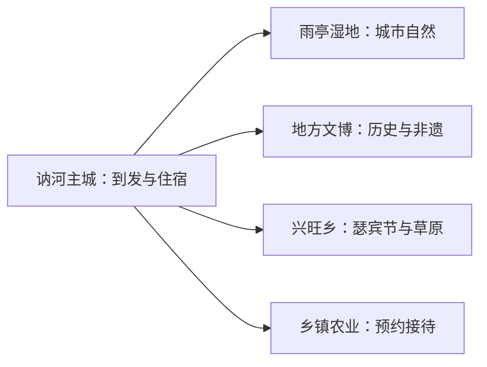
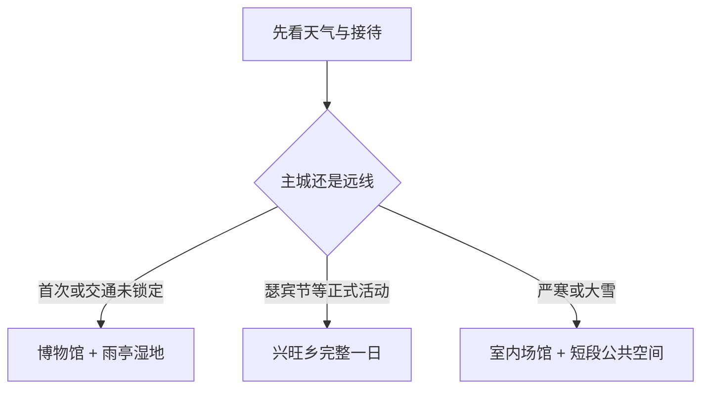

# 讷河旅行指南

讷河适合把嫩江平原城市生活、湿地公园和鄂温克族文化分成不同节奏：主城用一天看地方文博与雨亭湿地，兴旺鄂温克民族乡和嘎布喀草原按节庆与接待条件另排一天。这里的亮点更多来自季节、民俗和黑土地生产景观，先确认开放与交通，再选择一条远线会更从容。

> 建议停留：1–2 天 
> 旅行关键词：雨亭湿地、地方文博、瑟宾节、鄂温克文化、黑土地、严寒冰雪 
> 主要体力：低至中等 
> 最近研究：2026-08-13

## 城市速览

| 项目 | 旅行信息 |
|---|---|
| 主要旅行价值 | 在主城认识讷河地方史与湿地，再按节庆选择鄂温克文化或寒地乡村 |
| 建议停留 | 1 天主城；2 天增加一条有明确接待的乡村或民俗线 |
| 较舒适季节 | 夏秋适合湿地和乡村；冬季适合正式冰雪活动 |
| 预算特点 | 主城较低；远线车辆、活动和乡村接待增加成本 |
| 步行强度 | 主城低，湿地与草原中等 |
| 主要天气风险 | 严寒、暴雪、道路结冰、风吹雪、雷雨与洪涝 |
| 独行旅行 | 主城方便；远线先落实返程与接待联系人 |
| 亲子旅行 | 博物馆、湿地宣教与正式民俗活动较友好 |
| 长者与低体力旅行 | 主城以车辆连接室内场馆和短段公园 |
| 无障碍信息 | 现代公共场馆可逐处咨询；湿地、草原和乡村设施连续性需向官方确认 |

## 城市格局与游览区域

讷河市是齐齐哈尔市代管的县级市，法定代码 `230281`。GeoNames `2035610` 是主城居民点记录；Wikidata `Q1332600` 与法定讷河市共同用于名称和行政身份核对，点坐标不代替市域边界。主城承担铁路、住宿和公共文化服务，嘎布喀草原位于兴旺鄂温克民族乡，拉哈、老莱等方向则是独立乡镇交通尺度。

| 区域 | 主要内容 | 怎么安排 | 与其他区域的关系 |
|---|---|---|---|
| 主城公共文化片区 | 博物馆、文化馆与城市生活 | 半日至一天 | 与雨亭湿地同日最顺 |
| 雨亭国家城市湿地公园 | 林地、水面、城市生态 | 2–3 小时 | 按开放步道短游 |
| 兴旺鄂温克民族乡 | 嘎布喀草原、瑟宾节与民族文化 | 有活动时独立一天 | 先锁定往返和接待 |
| 拉哈及乡镇方向 | 历史镇区、农业与工业生产 | 选一个公开项目 | 不与草原线硬拼 |
| 嫩江平原生产空间 | 黑土地、粮食、畜牧与加工 | 参加正式研学 | 田间、仓储和厂区按生产管理 |

## 主要景点

### 主城与湿地

| 景点 | 区域 | 类型 | 主要看点 | 建议用时 | 室内外 | 体力 | 预约风险 | 天气影响 | 优先级 |
|---|---|---|---|---:|---|---|---|---|---|
| 讷河市博物馆及公共文化场馆 | 主城 | 博物馆 | 地方史、考古、民族与当期展览 | 1–2 小时 | 室内 | 低 | 很高 | 低 | A |
| 雨亭国家城市湿地公园开放区 | 主城 | 湿地与城市公园 | 林地、水面、古树与城市生态 | 2–3 小时 | 室外 | 低至中 | 低 | 高 | A |
| 主城冰雪与节庆公共空间 | 主城 | 季节活动 | 当期雪雕、群众文化和节庆 | 1–2 小时 | 室外 | 中 | 很高 | 很高 | B |

### 民俗与乡村

| 景点 | 区域 | 类型 | 主要看点 | 建议用时 | 室内外 | 体力 | 预约风险 | 天气影响 | 优先级 |
|---|---|---|---|---:|---|---|---|---|---|
| 嘎布喀大草原正式活动区 | 兴旺乡 | 草原与民俗 | 瑟宾节、抢枢等当期展演与草原景观 | 半日至一天 | 室外 | 中 | 很高 | 很高 | A |
| 勇进村红色文化公开点 | 乡村 | 红色文化 | 乡村展陈与红色文艺活动 | 半日 | 混合 | 中 | 很高 | 高 | B |
| 省级乡村旅游重点村公开项目 | 市域乡村 | 乡村旅游 | 寒地村落、农业和当期接待项目 | 半日至一天 | 混合 | 中 | 很高 | 高 | C |

湿地公园以公开步道和宣教范围为游览边界；草原、农田、养殖场、粮库和食品加工设施优先遵循生产与接待安排。瑟宾节是特定日期活动，适合以当年公告决定行程，而不是按固定日历预设。

## 美食与餐饮

| 菜品或餐饮类型 | 常见区域 | 一个人用餐与常见份量 | 风味、过敏原与饮食限制 | 排队风险与替代方法 |
|---|---|---|---|---|
| 东北炖菜与铁锅菜 | 主城 | 多为共享份量，一人先问半份 | 常含猪牛羊、豆制品、小麦和酱油 | 正餐高峰较忙，可选普通家常菜馆 |
| 嫩江鱼与河鲜 | 主城及乡镇 | 整鱼适合多人 | 鱼类过敏者需确认汤底与共锅 | 先问重量、时价和加工方式 |
| 黏豆包、玉米与杂粮 | 主城、乡村 | 小份易尝试 | 可能含豆类、糖和糯米 | 市场和早餐店可找同类替代 |
| 鄂温克节庆餐食 | 兴旺乡活动 | 常按活动或桌餐供应 | 肉类、乳制品和酒类需逐项确认 | 以活动承办方当期安排为准 |

## 经典行程

### 一日经典路线

**路线**：讷河市博物馆或公共文化场馆 → 主城午餐 → 雨亭湿地公园开放区 → 城区晚餐

- **串联逻辑**：室内地方史与城市湿地距离可控，适合作为首次到访主线。
- **预约锚点**：先确认博物馆开放，再按天气决定公园时长。
- **休息安排**：午餐和下午长休都放在主城。
- **时间不足时**：保留博物馆与湿地短段各一处。

### 两日城市路线

**第 1 天**：主城文博 → 雨亭湿地 
**第 2 天**：有明确接待的兴旺乡民俗活动或乡村项目

- **串联逻辑**：城市与乡村分日，减少当天远距离折返。
- **预约锚点**：第二天车辆、活动和接待必须先锁定。
- **休息安排**：主城住宿；远线在正式游客服务或村镇安排午休。
- **时间不足时**：删第二天远线，保留主城。

### 三日深度路线

**第 1 天**：主城文博与城市生活 
**第 2 天**：嘎布喀草原或瑟宾节主题 
**第 3 天**：一处正式乡村、红色文化或农业研学项目

- **串联逻辑**：三天分别对应城市、民族文化和生产生活。
- **预约锚点**：后两天均以运营或接待确认作为出发条件。
- **休息安排**：连续住主城，乡镇只安排白天往返。
- **时间不足时**：先删第三天，再把第二天改为主城补充。

### 雨雪天路线

**路线**：公共文化场馆 → 午餐 → 商业或室内休息 → 视路况短游城市公共空间

- **适用条件**：普通降雪可短游；暴雪、低能见度和道路结冰时留在主城。
- **预约锚点**：核对场馆临时闭馆和公交调整。
- **休息安排**：每段都以室内暖区衔接。
- **时间不足时**：只保留一个确认开放的场馆。

### 亲子或低体力路线

**亲子路线**：博物馆互动展项 → 午餐 → 雨亭湿地短段 
**低体力路线**：车辆到场馆 → 长休 → 公园平缓入口短游

- **减负方式**：亲子线控制户外时长；低体力线减少跨区步行并预留取暖或避暑。
- **预约锚点**：确认儿童活动、卫生间、电梯和入口距离。
- **休息安排**：主城餐饮和场馆休息区承担主要休息。
- **时间不足时**：两类路线都保留室内场馆。

### 远郊一日路线

**路线**：讷河主城 → 兴旺鄂温克民族乡正式活动区 → 乡镇午餐与休息 → 返回

- **适用条件**：活动公告、车辆、天气和返程都已确认。
- **预约锚点**：节庆日期、接待地点、参与规则和交通。
- **休息安排**：在明确接待点或乡镇室内空间安排。
- **时间不足时**：整段顺延，改做主城路线。

## 住宿区域

| 区域 | 优点 | 缺点 | 适合人群 | 交通特点 |
|---|---|---|---|---|
| 讷河站—主城 | 到发、餐饮与补给方便 | 与乡镇景点有距离 | 首访、无车和冬季旅行 | 便于铁路、公路与市内短途换乘 |
| 主城公共文化片区 | 环境相对安静，靠近公园场馆 | 夜间选择可能较少 | 亲子、低体力与慢游 | 以出租车和短途公交连接 |
| 乡镇接待点 | 便于参加早晚活动 | 供应与交通波动大 | 已落实活动的团队或自驾者 | 只选择有明确运营和返程方案的住宿 |

## 市内交通

讷河站承担主要铁路到发，主城可用公交、出租车和网约车连接。乡镇和草原线路距离较长，适合官方专线、旅行社接驳、自驾或合规包车；冬季把路况、日落和备用返程一起纳入选择。

| 场景 | 建议与取舍 | 行前需要重查的内容 |
|---|---|---|
| 铁路抵达 | 先住主城，再安排远线 | 车次、站前交通与夜间到达 |
| 主城移动 | 公交加短途车辆即可 | 首末班、积雪和道路施工 |
| 兴旺乡与乡村 | 有接待车辆时体验更稳定 | 集合点、返程、道路和活动取消 |
| 自驾 | 适合分散乡镇 | 冰雪路面、加油、通信和疲劳驾驶 |

## 不同旅行者须知

| 旅行维度 | 可行条件 | 主要取舍 | 需额外核对 |
|---|---|---|---|
| 独行旅行 | 主城住宿与交通已确认 | 远线选择有人接待的一条 | 夜间返程和通信 |
| 亲子旅行 | 室内场馆加短段户外 | 民俗活动控制参与强度 | 儿童规则与保暖防晒 |
| 长者或低体力旅行 | 车辆连接场馆和公园入口 | 草原与冰雪路面缩短步行 | 台阶、卫生间和休息座椅 |
| 无障碍需求 | 现代场馆可逐处咨询 | 湿地和乡村连续动线资料有限 | 设施连续性需向官方确认 |
| 摄影旅行 | 湿地、草原和冰雪题材丰富 | 尊重节庆仪式与人物肖像 | 无人机、三脚架和商业拍摄 |
| 特殊天气 | 主城室内路线可替换 | 暴雪、洪水和强对流时缩短户外 | 预警、道路和活动公告 |

## 行前核对

| 核对事项 | 为什么需要重查 | 建议核对时间 | 官方入口 |
|---|---|---|---|
| 博物馆与公共文化场馆 | 开放、展览和团体接待会变化 | 到访前一周及前一日 | [讷河市人民政府](https://www.nehe.gov.cn/) |
| 瑟宾节与嘎布喀草原 | 日期、地点和参与项目按年发布 | 订房前及出发前 | [黑龙江省文化和旅游厅](https://wlt.hlj.gov.cn/) |
| 铁路与乡镇交通 | 车次、专线和集合点会调整 | 出发前一周及当天 | [中国铁路12306](https://www.12306.cn/) |
| 天气、道路与湿地 | 严寒、洪涝和火险影响开放 | 出发前三日及当天 | [黑龙江省气象局](http://hl.cma.gov.cn/) |

## 来源与更新记录

### 主要来源

| 来源 | 类型 | 支持内容 | 核验日期 |
|---|---|---|---|
| [黑龙江省文旅厅：非遗与讷河旅游](https://wlt.hlj.gov.cn/wlt/c115584/202406/c00_31746470.shtml) | 省文旅厅 | 瑟宾节、抢枢与鄂温克文化 | 2026-08-13 |
| [黑龙江省文旅厅：2026瑟宾节报道](https://wlt.hlj.gov.cn/wlt/c114253/202606/c00_31951632.shtml) | 省文旅厅 | 嘎布喀草原活动地点与当期体验 | 2026-08-13 |
| [黑龙江省文旅厅：红色乡村线路](https://wlt.hlj.gov.cn/wlt/c114253/202411/c00_31787985.shtml) | 省文旅厅 | 勇进村红色文化线索 | 2026-08-13 |
| [中国政府网：全国博物馆名录](https://www.gov.cn/zhengce/zhengceku/2020-05/22/5513734/files/1b6a0d01bf584c20bf17d5801a3e3e6f.pdf) | 国家公开名录 | 讷河市博物馆机构存在 | 2026-08-13 |
| [最高人民法院环境资源案例](https://peixun.court.gov.cn/uploadfile/2020/1125/20201125035410897.pdf) | 国家司法机关 | 雨亭国家城市湿地公园及保护边界 | 2026-08-13 |
| [黑龙江省政府行政区划](https://www.hlj.gov.cn/hlj/c108499/redirect_firstChannel.shtml) | 省政府 | 讷河的县级市身份与齐齐哈尔代管关系 | 2026-08-13 |
| [GeoNames 2035610](https://www.geonames.org/2035610/nehe.html) | 开放地名数据 | 固定主城点标识 | 2026-08-13 |
| [Wikidata Q1332600](https://www.wikidata.org/wiki/Q1332600) | 开放结构化数据 | 法定城市实体交叉核对 | 2026-08-13 |
| [中国铁路12306](https://www.12306.cn/) | 铁路运营方 | 当期车次和售票 | 2026-08-13 |

### 更新记录

| 日期 | 更新内容 |
|---|---|
| 2026-08-13 | 首次完成讷河城市格局、湿地与民族文化、路线、交通、无障碍和来源研究 |
