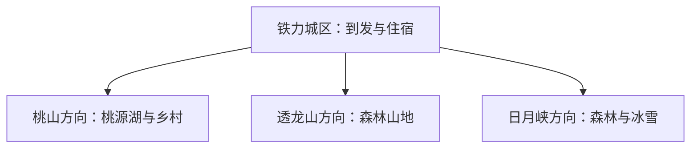
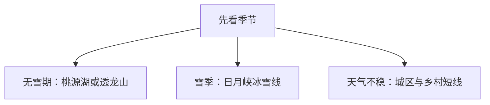

# 铁力旅行指南

铁力适合以城区为落脚点，在桃源湖、透龙山和日月峡三个森林方向中按季节选择。夏秋侧重森林、湖泊与轻户外，冬季可把正式运营的滑雪项目作为主线；先确认景区开放和往返交通，再决定当天走哪一条远线。

> 建议停留：2–3 天 
> 旅行关键词：小兴安岭、桃源湖、透龙山、日月峡、冰雪 
> 主要体力：城区低，森林景区中等至较高 
> 无障碍提醒：设施连续性需向官方确认；雪场、林区步道和接驳点分别核对

## 城市速览

| 项目 | 信息 |
|---|---|
| 主要旅行价值 | 以县级市为基地体验小兴安岭森林、湖泊、乡村民宿和冬季冰雪 |
| 建议停留 | 2 天选择两个方向；3 天再加乡村或另一处森林景区 |
| 较舒适季节 | 6–10 月适合森林与湖泊，冬季按雪况和运营安排 |
| 预算特点 | 城区消费平稳，景区接驳、自驾、门票和雪具是主要增量 |
| 步行强度 | 城区低；透龙山和森林步道中等至较高 |
| 独行旅行 | 城区容易安排，远线先锁定返程和通信条件 |
| 亲子旅行 | 桃源湖、乡村项目和短步道较易控制节奏 |
| 长者与低体力旅行 | 每天选择一个车辆可近达的项目，减少山地连续爬升 |
| 主要天气风险 | 低温、积雪结冰、山雾、雷雨、森林火险 |
| 行前关键动作 | 查开放、雪况、道路和接驳，再订住宿与车票 |

## 城市格局与游览区域

铁力是伊春市代管的县级市，法定代码 **230781**。城区承担铁路到发和住宿；桃源湖在桃山方向，透龙山与日月峡位于东部森林带，通常分别安排半日至一天。

| 区域 | 主要内容 | 建议节奏 | 选择提示 |
|---|---|---|---|
| 铁力城区 | 到发、餐饮、公共文化 | 半天 | 适合抵离日和雨雪天 |
| 桃山方向 | 桃源湖、乡村民宿与季节活动 | 半日至 1 天 | 适合亲子和低体力组合 |
| 透龙山方向 | 森林、山地与观景步道 | 1 天 | 按坡度、开放段和天气选线 |
| 日月峡方向 | 国家森林公园、滑雪与森林康养 | 1 天 | 冬季先查雪场运营和道路 |

林业生产道路、矿区和自然公园保护范围按管理要求使用；旅行路线沿正式景区入口和明确接待线路组织。

## 主要景点

| 景点 | 区域 | 类型 | 主要看点 | 建议用时 | 室内外 | 体力 | 预约风险 | 天气影响 | 优先级 |
|---|---|---|---|---:|---|---|---|---|---|
| 桃源湖景区 | 桃山方向 | 湖泊、森林 | 湖景、森林环境与季节活动 | 半日至 1 天 | 室外为主 | 低至中 | 中至高 | 高 | A |
| 透龙山景区 | 日月峡镇方向 | 山地、森林 | 森林步道、山地景观与自然教育 | 1 天 | 室外 | 中至高 | 中至高 | 很高 | A |
| 日月峡国家森林公园 | 日月峡方向 | 森林公园 | 小兴安岭森林、康养环境与正式步道 | 半日至 1 天 | 室外 | 中 | 高 | 高 | A |
| 日月峡滑雪场 | 日月峡方向 | 冰雪运动 | 冬季滑雪和雪上项目 | 半日至 1 天 | 室外 | 中至高 | 高 | 很高 | B |
| 酒章文创园及正式乡村接待项目 | 城郊 | 乡村、文创 | 乡村住宿、非遗和季节活动 | 2–4 小时 | 混合 | 低 | 中至高 | 中 | B |
| 铁力市公共文化场馆 | 城区 | 文博、地方史 | 以当期展览认识林业、城市与地方文化 | 2–3 小时 | 室内 | 低 | 中 | 低 | B |
| 依吉密河正式漂流项目 | 市域 | 水上活动 | 季节性漂流与河谷景观 | 半天 | 室外 | 中 | 很高 | 很高 | C |

透龙山、日月峡和桃源湖是三个不同方向；同一景区内部项目按一个完整目的地安排。

## 美食与餐饮

城区可按铁锅炖、羊汤、东北家常菜、烧烤、饺子和朝鲜族风味选择。铁锅炖和整鱼通常适合分享，一人可选汤饭、面食或小份家常菜。鱼类、大豆、小麦、芝麻、坚果和共锅烹饪是常见过敏原线索。

## 经典行程

### 一日经典路线
**路线**：铁力城区 → 桃源湖景区 → 城区晚餐
- **串联逻辑**：一个远点配城区收尾，减少跨方向移动。
- **预约锚点**：桃源湖开放、接驳或停车信息。
- **休息安排**：景区游客服务点与城区午晚餐。
- **时间不足时**：保留桃源湖核心开放区，删除乡村加点。

### 两日城市路线
**第 1 天**：城区 → 桃源湖；**第 2 天**：透龙山完整日。
- **串联逻辑**：两天各走一个方向，住宿固定在城区。
- **预约锚点**：透龙山入园和返程车辆。
- **休息安排**：每天午间在正式服务区休息。
- **时间不足时**：第二天改为城区公共文化半日。

### 三日深度路线
**第 1 天**：城区与桃源湖；**第 2 天**：透龙山；**第 3 天**：日月峡森林或雪场。
- **串联逻辑**：按桃山、透龙山、日月峡三个方向拆日。
- **预约锚点**：先锁定最受季节影响的第三天项目。
- **休息安排**：三晚均可住城区，减少搬运行李。
- **时间不足时**：先删第三天，再压缩城区段。

### 雨雪天路线
**路线**：城区公共文化场馆 → 午餐 → 当期开放的乡村室内项目。
- **串联逻辑**：先在城区完成稳定的室内内容，再按道路状态决定是否短途前往乡村项目。
- **适用条件**：普通雨雪且道路正常；预警天气以室内和休整为主。
- **预约锚点**：场馆和乡村项目开放。
- **休息安排**：城区商业区连续休息。
- **时间不足时**：只保留一个室内场馆。

### 亲子或低体力路线
**亲子路线**：桃源湖短线 → 乡村体验；**低体力路线**：城区场馆 → 车辆可达湖景点。
- **串联逻辑**：亲子方案由自然观察接乡村活动，低体力方案用车辆连接场馆和近达湖景。
- **减负方式**：亲子避开长山路；低体力方案减少换乘和坡道。
- **预约锚点**：亲子活动年龄规则及无障碍设施。
- **休息安排**：游客中心、民宿或城区餐饮点。
- **时间不足时**：两类路线都只留一个主项目。

### 远郊一日路线
**路线**：城区 → 日月峡国家森林公园或滑雪场 → 城区。
- **串联逻辑**：森林与雪场二选一，全天围绕一处正式运营目的地往返。
- **适用条件**：道路、天气和返程车辆均已确认。
- **预约锚点**：森林公园或雪场当期运营。
- **休息安排**：景区正式服务区。
- **时间不足时**：整段删除，改走城区短线。

## 住宿区域

| 区域 | 优点 | 缺点 | 适合人群 | 交通特点 |
|---|---|---|---|---|
| 铁力城区 | 到发、餐饮和补给最方便 | 往返景区需要时间 | 首访、无车与多日旅行 | 便于铁路和公路换乘 |
| 桃山方向 | 靠近桃源湖与乡村项目 | 夜间服务选择较少 | 自驾、亲子与慢旅行 | 依赖公路 |
| 日月峡方向 | 靠近森林和雪场 | 与城区距离较远 | 冰雪、森林主题旅行 | 先确认接驳或自驾 |

## 市内交通

铁力站承担主要铁路到发。城区适合步行、出租车或网约车；三个景区方向距离分散，优先使用官方当期专线、旅行社接驳、自驾或合规包车。冬季把路况、雪胎、日落和返程时间一起纳入选择。

## 不同旅行者须知

独行旅行先保存司机与住宿联系方式；亲子选择短步道和有游客中心的项目；长者与低体力旅行每天只排一个远点。森林防火期、强降雨和极寒时按主管部门与景区公告调整。设施连续性需向官方确认。

## 行前核对

| 核对事项 | 为什么需要重查 | 建议时间 | 官方入口 |
|---|---|---|---|
| 景区开放与交通 | 季节、维护和客流会改变运营 | 订房前及前一日 | [铁力市政府旅游栏目](https://www.tls.gov.cn/newtlsrmzf/c104572/list.shtml) |
| 冰雪项目 | 雪况、设备和适用人群会变化 | 出发前一周及当天 | [铁力冬游便民合集](https://www.tls.gov.cn/newtlsrmzf/c104564/202512/417334.shtml) |
| 天气、火险与道路 | 林区天气变化快 | 出发前三日及当天 | [铁力市人民政府](https://www.tls.gov.cn/) |
| 铁路班次 | 车次与售票状态会调整 | 订票时及出发当天 | [中国铁路12306](https://www.12306.cn/) |

## 来源与更新记录

### 主要来源

| 来源 | 类型 | 支持内容 | 核验日期 |
|---|---|---|---|
| [铁力市2026年政府工作报告](https://www.tls.gov.cn/newtlsrmzf/c104445/202601/419179.shtml) | 市政府 | 文旅项目、景区与乡村旅游发展 | 2026-08-13 |
| [铁力冬游便民合集](https://www.tls.gov.cn/newtlsrmzf/c104564/202512/417334.shtml) | 市文旅局 | 景区位置、冬季运营与交通线索 | 2026-08-13 |
| [铁力市生态环境保护“十四五”规划](https://www.tls.gov.cn/newtlsrmzf/c104422/202504/398528.shtml) | 市政府规划 | 湿地、自然保护区与生态修复空间 | 2026-08-13 |
| [GeoNames 2035669](https://www.geonames.org/2035669/lianhe.html) | 开放地名数据 | 固定城市点标识；法定铁力市另有行政记录2034440 | 2026-08-13 |
| [Wikidata Q1344820](https://www.wikidata.org/wiki/Q1344820) | 开放知识库 | 法定城市实体与P1566粒度交叉核对 | 2026-08-13 |

### 更新记录

| 日期 | 更新内容 |
|---|---|
| 2026-08-13 | 首次完成城市格局、景点选择、路线与动态核对 |
