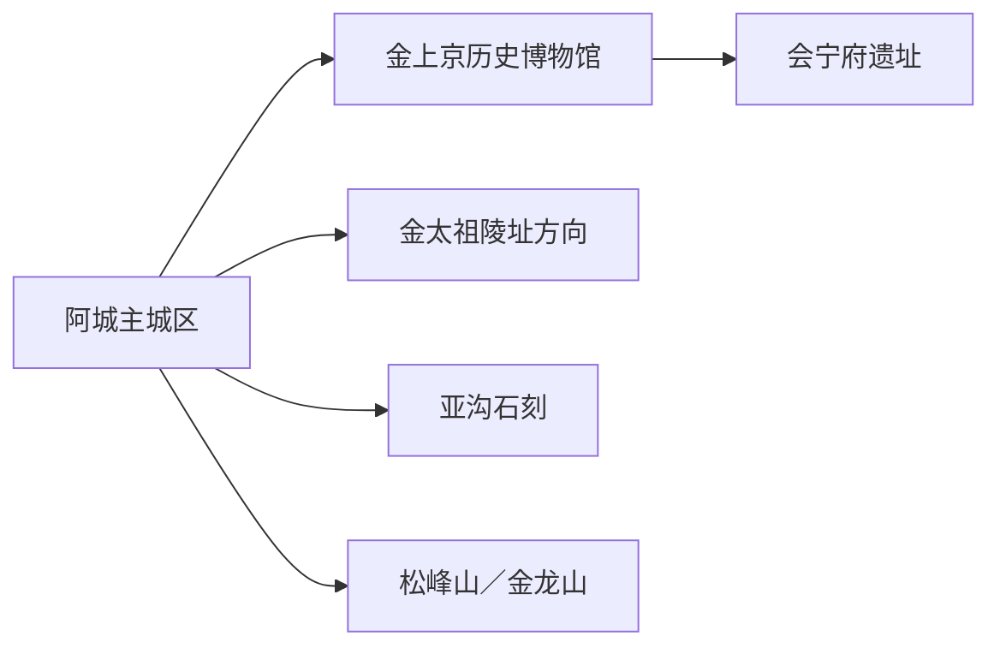
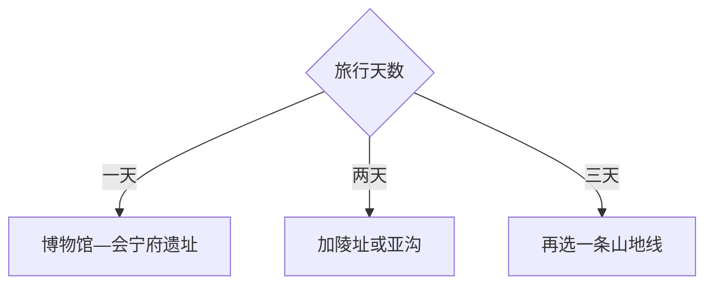

# 阿城旅行指南

阿城最鲜明的旅行线索是金代上京：先在金上京历史博物馆建立王朝与城市框架，再到金上京会宁府遗址、金太祖陵址公园和亚沟石刻理解文物现场。松峰山、金龙山等山地适合另留一天，雪季与森林防火期按当期开放选择。

> 建议停留：1–3 天 
> 旅行关键词：金上京、会宁府遗址、金代石刻、山地森林 
> 主要体力：文博线低至中等；山地线中高 
> 最近研究：2026-08-12

## 城市速览

| 项目 | 旅行信息 |
|---|---|
| 主要旅行价值 | 以博物馆和遗址群完整认识金朝早期都城，再用山地与近代冰雪史扩展阿城印象 |
| 建议停留 | 1 天金代主线；2 天增加亚沟或陵址；3 天选择一条山地远线 |
| 较舒适季节 | 春秋适合遗址；夏季山地注意雷雨；冬季按雪场、道路与低温条件安排 |
| 预算特点 | 城区文博成本较低，远点车辆、山地项目和冬季装备增加预算 |
| 步行强度 | 馆内低，遗址开阔且风大，山地有坡道和长距离步行 |
| 主要天气风险 | 严寒、积雪结冰、大风、雷雨、森林火险和山路湿滑 |
| 独行旅行 | 城区文博易安排，亚沟与山地先锁返程 |
| 亲子旅行 | 博物馆适合先建立年代线，遗址和山地控制停留长度 |
| 长者与低体力旅行 | 采用博物馆加陵址或遗址观景短线，车辆连接各点 |
| 无障碍信息 | 博物馆可先询问完整动线；遗址、陵址和山地的设施连续性需向官方确认 |

## 城市格局与游览区域

阿城主城区承担住宿和公共服务，金上京历史博物馆、会宁府遗址及陵址分布在城区及周边；亚沟石刻位于另一方向，松峰山、金龙山等山地需单独成日。阿城是哈尔滨市辖区，但旅行距离、景点密度和住宿交通足以形成独立指南。

| 区域 | 主要内容 | 游览特点 | 与其他区域的关系 |
|---|---|---|---|
| 阿城主城区 | 住宿、餐饮、铁路与公共文化 | 适合抵达、休息和雨天 | 连接各历史与山地片区 |
| 金上京片区 | 历史博物馆、会宁府遗址 | 馆藏与考古现场互补 | 首访优先同日组合 |
| 陵址与亚沟方向 | 金太祖陵址公园、亚沟石刻 | 文保现场，开放范围需核 | 可各用半日，不宜跨山地赶场 |
| 山地森林方向 | 松峰山、金龙山等 | 季节性强，需整日和车辆 | 放在第二或第三天 |

GeoNames `2038679` 与 Wikidata `Q145263` 的 `P1566` 精确对应阿城记录，现行行政代码为 `230112`。阿城区属于哈尔滨市辖区，本页只处理阿城范围；哈尔滨中心城区和其他区县另作联程。

## 主要景点

### 金代历史主线

| 景点 | 区域 | 类型 | 主要看点 | 建议用时 | 室内外 | 体力 | 预约风险 | 天气影响 | 优先级 |
|---|---|---|---|---:|---|---|---|---|---|
| 金上京历史博物馆 | 金上京片区 | 历史博物馆 | 金代建国、上京格局、考古与文物 | 2–3 小时 | 室内 | 低 | 中；预约、闭馆与讲解需核 | 低 | A |
| 金上京会宁府遗址 | 金上京片区 | 全国重点文物保护单位、遗址 | 都城格局、城垣与考古保护 | 1.5–2.5 小时 | 室外 | 中 | 高；开放区和考古作业需核 | 高 | A |
| 金太祖陵址公园 | 城区周边 | 陵址、纪念空间 | 金代开国历史与陵址环境 | 1.5–2 小时 | 混合 | 低至中 | 中；开放区需核 | 中高 | B |
| 亚沟石刻 | 亚沟方向 | 全国重点文物保护单位 | 金代摩崖石刻与山地文物环境 | 2–3 小时 | 室外 | 中 | 高；接待、道路和保护范围需核 | 高 | B |

### 山地与地方记忆

| 景点 | 区域 | 类型 | 主要看点 | 建议用时 | 室内外 | 体力 | 预约风险 | 天气影响 | 优先级 |
|---|---|---|---|---:|---|---|---|---|---|
| 松峰山旅游区 | 山地 | 山地、森林 | 山林景观、步道与季节自然体验 | 4–6 小时 | 室外 | 中高 | 高；开放、交通与火险需核 | 高 | C |
| 金龙山旅游区 | 山地 | 山地、森林 | 山景、秋色与户外路线 | 4–6 小时 | 室外 | 中高 | 高；运营与道路需核 | 高 | C |
| 亚沟近代冰雪文化方向 | 亚沟 | 地方体育史 | 近代滑冰历史与地方记忆 | 1–2 小时 | 混合 | 低至中 | 高；具体场馆和接待需核 | 中 | C |

博物馆和遗址是同一历史主题的两个独立参访单元：先馆后址更易理解。文物本体、考古区和山林保护区以标识路线为准；计划建设或尚无明确接待入口的项目留待未来核验。

## 美食与餐饮

| 菜品或餐饮类型 | 常见区域 | 一个人用餐与常见份量 | 风味、过敏原与饮食限制 | 排队风险与替代方法 |
|---|---|---|---|---|
| 东北炖菜 | 主城区 | 通常适合共享，一人问半份 | 肉类、大豆和盐分较高 | 选小锅或套餐 |
| 锅包肉与熘炒菜 | 主城区 | 一盘份量偏大 | 小麦、淀粉、糖、油和肉类 | 多人共享，一人改选盖饭 |
| 粘豆包、玉米等主食 | 市场、早餐店 | 可少量购买 | 糯米、豆馅和糖分需留意 | 选现制小份 |
| 山野菜与菌菇菜 | 正规餐馆 | 适合共享 | 只选可追溯熟制食材，个体过敏先说明 | 换常规蔬菜菜品 |

## 经典行程

### 一日经典路线

**路线**：金上京历史博物馆 → 午餐 → 金上京会宁府遗址 → 返回主城区

- **串联逻辑**：先以馆藏建立都城框架，再到遗址辨认空间。
- **预约锚点**：博物馆与遗址开放范围、讲解。
- **休息安排**：馆内和午餐各安排一次长休，遗址前补水。
- **时间不足时**：保留博物馆，遗址改为短线。

### 两日城市路线

**第 1 天**：博物馆 → 会宁府遗址。 
**第 2 天**：金太祖陵址公园 → 亚沟石刻或亚沟文化点。

- **串联逻辑**：第一天讲都城，第二天讲陵址与石刻。
- **预约锚点**：亚沟道路、开放和返程车辆。
- **休息安排**：两天都回主城区住宿，第二天午餐提前准备。
- **时间不足时**：第二天在陵址和亚沟中二选一。

### 三日深度路线

**第 1 天**：金上京主线。 
**第 2 天**：陵址与亚沟。 
**第 3 天**：松峰山或金龙山整日。

- **串联逻辑**：历史两日完成后用山地补充阿城自然环境。
- **预约锚点**：山地运营、交通、火险和天气。
- **休息安排**：山地游客服务点午休，预留返城缓冲。
- **时间不足时**：删除第三天，不压缩历史主线。

### 雨雪天路线

**路线**：金上京历史博物馆 → 午餐 → 正式开放的城区文化场馆

- **适用条件**：普通降雨或降雪；暴雪、结冰和大风时减少移动。
- **串联逻辑**：以室内展陈替代遗址和山地。
- **预约锚点**：场馆开放与道路状态。
- **休息安排**：馆内和主城区餐饮区。
- **时间不足时**：只保留博物馆。

### 亲子或低体力路线

**亲子路线**：博物馆重点展厅 → 午餐 → 会宁府遗址短线。 
**低体力路线**：博物馆 → 车辆直达金太祖陵址开放核心 → 返回。

- **减负方式**：亲子线用地图和文物建立线索；低体力线减少开阔遗址长距离步行。
- **预约锚点**：儿童讲解、下客点、座椅与卫生间。
- **休息安排**：每个主点后坐休，冬季减少室外等待。
- **时间不足时**：两类路线均保留博物馆。

### 远郊一日路线

**路线**：主城区 → 松峰山或金龙山 → 返回主城区

- **适用条件**：景区开放、天气、森林防火和返程交通稳定。
- **串联逻辑**：只选一座山，完整走一条官方开放路线。
- **预约锚点**：门票、接驳、停车和步道开放。
- **休息安排**：游客服务区午休并携带保暖／防晒物品。
- **时间不足时**：整段改为陵址或亚沟半日。

## 住宿区域

| 区域 | 优点 | 缺点 | 适合人群 | 交通特点 |
|---|---|---|---|---|
| 阿城主城区 | 餐饮、铁路、叫车和服务集中 | 到山地仍需车辆 | 首访、文博旅行、公共交通 | 适合作为两至三日基地 |
| 金上京片区附近 | 靠近博物馆与遗址 | 夜间服务选择较少 | 历史专题、自驾 | 订房时核冬季供暖和交通 |
| 山地景区周边 | 便于清晨进入自然线 | 季节性强，餐饮和返程选择有限 | 户外、自驾 | 以正式运营住宿为准 |

## 市内交通

| 场景 | 建议与取舍 | 行前需要重查的内容 |
|---|---|---|
| 哈尔滨联程 | 铁路、公路连接阿城，按实际始发地选车 | 车次、施工、末班和到站接驳 |
| 历史主线 | 出租、网约或公交连接博物馆与遗址 | 上客点、开放入口和停车 |
| 亚沟与山地 | 自驾或预约车辆更易控制返程 | 道路、信号、火险、积雪和末班 |
| 冬季出行 | 留出除雪、低温和车辆等待余量 | 气象预警、道路封闭和装备 |

## 不同旅行者须知

| 旅行维度 | 可行条件 | 主要取舍 | 需额外核对 |
|---|---|---|---|
| 独行旅行 | 城区文博线清晰 | 远点先约返程 | 夜间交通与山地信号 |
| 亲子旅行 | 博物馆叙事完整 | 遗址风大、距离长 | 儿童讲解、卫生间与保暖 |
| 长者或低体力旅行 | 单馆加一处车辆直达点 | 山地和开阔遗址减量 | 下客点、座椅、坡道 |
| 无障碍需求 | 博物馆优先咨询 | 文保与山地动线连续性有限 | 设施连续性需向官方确认 |
| 摄影旅行 | 遗址、石刻与森林题材丰富 | 文物、考古和林区规则优先 | 三脚架、无人机、商业拍摄 |
| 冬季旅行 | 有完整保暖和可退改交通方案 | 日照短、结冰与低温增加体力 | 开放、道路、气温和救援 |
| 保护地旅行 | 沿正式步道和开放区活动 | 林火期和考古区边界优先 | 火险等级、封闭区、明火规则 |

## 行前核对

| 核对事项 | 为什么需要重查 | 建议核对时间 | 官方入口 |
|---|---|---|---|
| 博物馆与遗址 | 闭馆、预约、考古和保护工程影响开放 | 排路线前及前一日 | [黑龙江省文旅厅：金代历史线路](https://wlt.hlj.gov.cn/wlt/c114169/202504/c00_31833218.shtml) |
| 山地开放 | 防火、雨雪、检修和接驳会变化 | 出发前三日及当天 | [黑龙江省文化和旅游厅](https://wlt.hlj.gov.cn/) |
| 铁路 | 车次与到站时刻变化 | 购票前及当天 | [中国铁路12306](https://www.12306.cn/) |
| 天气与火险 | 严寒、积雪、雷雨和林火影响远线 | 出发前三日及当天 | [黑龙江省气象局](http://hl.cma.gov.cn/) |
| 文物参观边界 | 遗址与石刻开放区随保护工作调整 | 到访前 | [金上京考古与保护资料](https://wlt.hlj.gov.cn/wlt/c114169/202402/c00_31711765.shtml) |

## 来源与更新记录

### 主要来源

| 来源 | 类型 | 支持内容 | 核验日期 |
|---|---|---|---|
| [金代历史主题线路](https://wlt.hlj.gov.cn/wlt/c114169/202504/c00_31833218.shtml) | 黑龙江省文化和旅游厅 | 博物馆、遗址、陵址、石刻和线路关系 | 2026-08-12 |
| [阿城文化与乡村旅游资料](https://wlt.hlj.gov.cn/wlt/c114169/202508/c00_31868921.shtml) | 黑龙江省文化和旅游厅 | 阿城文旅资源与区域方向 | 2026-08-12 |
| [阿城春季户外资料](https://wlt.hlj.gov.cn/wlt/c114169/202503/c00_31818268.shtml) | 黑龙江省文化和旅游厅 | 山地与季节活动的动态属性 | 2026-08-12 |
| [金上京历史博物馆](https://wlt.hlj.gov.cn/wlt/c114172/202503/c00_31822580.shtml) | 省级文旅部门 | 博物馆属性与展陈 | 2026-08-12 |
| [Wikidata Q145263](https://www.wikidata.org/wiki/Special:EntityData/Q145263.json) | 开放结构化数据 | 阿城与 GeoNames 精确交叉核验 | 2026-08-12 |
| [GeoNames 2038679](https://sws.geonames.org/2038679/about.rdf) | 开放地名数据 | 固定阿城城市记录 | 2026-08-12 |
| [民政部行政区划代码查询](https://dmfw.mca.gov.cn/xzqh/getList?code=230112&trimCode=false&maxLevel=3) | 国家行政区划数据 | 现行代码 230112 | 2026-08-12 |

### 更新记录

| 日期 | 更新内容 |
|---|---|
| 2026-08-12 | 首次完成阿城指南，核验金上京主线、山地选择、文保与区级边界 |
