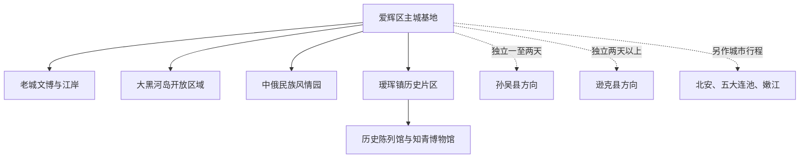
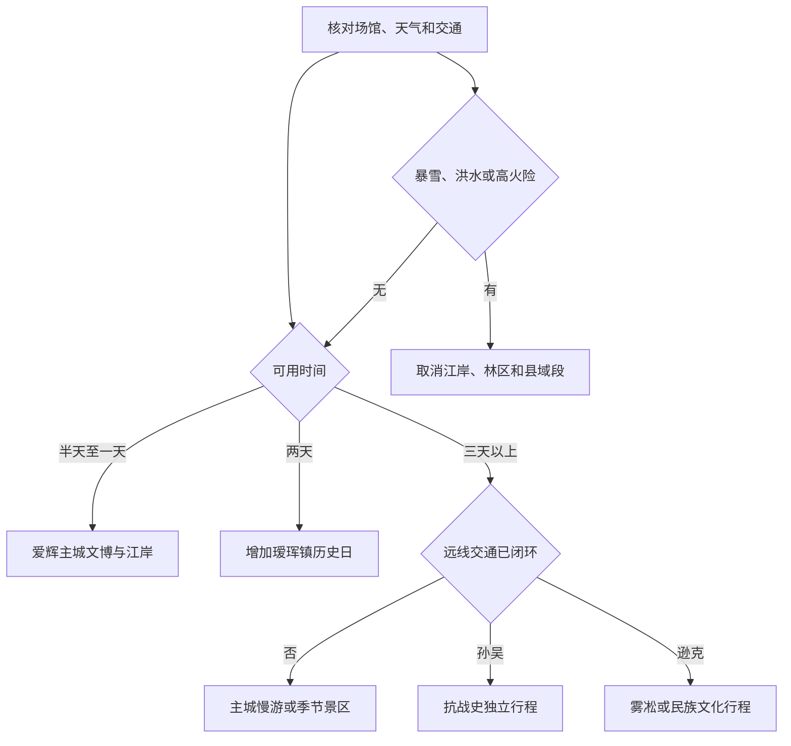

# 黑河旅行指南

黑河位于黑龙江中游右岸，中心城区与俄罗斯布拉戈维申斯克隔江相望。它最适合用三条线索理解：在爱辉区主城看界江、口岸城市生活与旅俄华侨史；到瑷珲镇理解黑龙江流域和中俄东部关系史；再按季节选择一处冰雪、民族文化或县域远线。江对岸的城市是另一个国家的独立目的地，看到对岸不等于已经完成出境手续；大黑河岛公共活动区、口岸旅检区、货运码头和自然江冰也不是同一种空间。

> 建议停留：2–4 天；爱辉主城 1 天、瑷珲镇 1 天，孙吴或逊克方向分别另留完整行程 
> 旅行关键词：界江边城、口岸生活、瑷珲历史、旅俄华侨、民族文化、极寒冰雪 
> 主要体力：主城低至中等步行；瑷珲镇和县域远线依赖车辆，冬季风寒与结冰会显著增加负担 
> 最近研究：2026-08-13

## 城市速览

| 项目 | 旅行信息 |
|---|---|
| 主要旅行价值 | 在黑龙江公园与大黑河岛开放区域观察界江边城生活，在旅俄华侨纪念馆理解跨境迁徙与留学史，再到瑷珲历史陈列馆和知青博物馆建立边疆历史框架 |
| 建议停留 | 半天可选旅俄华侨纪念馆与江岸；1 天可完成主城文博和公共岸线；2 天增加瑷珲镇；3–4 天可增加中俄民族风情园、正式冰雪项目或一个县域方向。孙吴、逊克各自需要独立安排，不能同日串游 |
| 较舒适季节 | 6–9 月适合江岸、瑷珲镇和公路远线，仍要防强降雨、洪水与雷暴；冬季可体验雪景和正式运营项目，但极寒、短日照、暴雪、风吹雪、流冰与道路结冰会改变全部交通计划 |
| 预算特点 | 主城公共文博、江岸和日常餐饮可组成中低预算骨架；瑷珲往返、滑雪、县域住宿以及跨境证件、交通和保险是主要增量 |
| 步行强度 | 主城老城与江岸可分段步行，黑河站、大黑河岛和不同场馆之间宜结合公交或短程车辆；瑷珲镇距主城约 32 公里，县域更远，不按城市步行线路估算 |
| 主要天气风险 | 冬季严寒、失温、暴雪、风吹雪、暗冰与航班列车延误；春季流冰和昼化夜冻；夏季强对流、暴雨、江河涨水、低洼岸线封闭及林区地质与火险 |
| 边境与口岸 | 公共江岸可观景，口岸限定区域、查验现场、货运码头、边防设施和临时管控区不能作为观景平台。出境必须从开放口岸通行并持当期有效证件，不能从江岸、江冰或非开放渡口越界 |
| 独行旅行 | 主城白天文博、江岸、早夜市和叫车较易独立安排；瑷珲末班、县域返程、严寒夜间和跨境通关必须预先形成闭环，不临时搭乘无资质车辆 |
| 亲子与长者 | 主城纪念馆、瑷珲两馆和正式景区适合分段参观；纪念场所保持安静，冰面、码头、口岸、滑雪、旧址台阶和远途公路需增加看护、休息或删减 |
| 无障碍信息 | 公开资料不能证明车站、车辆、老建筑、江岸、瑷珲两馆、县域场馆与口岸之间连续无障碍；即使景区提供轮椅，也应逐段确认下客点、坡道、门宽、电梯、卫生间、陪同和返程 |

## 城市格局与游览区域

黑河市法定行政区划代码为 `231100`，现辖爱辉区、逊克县、孙吴县，以及北安、五大连池、[嫩江](./嫩江市.md)三座县级市。普通旅行语境中的“黑河市区”主要指爱辉区中心城区。市、区同城使主城成为全市交通、住宿和口岸服务中心，但市域南北跨度大，前往县级市时按跨城交通和属地指南重新规划。

GeoNames 固定清单另以 `2038670` 记录瑷珲镇这一城市内部点，Wikidata `Q4696879` 的 P1566 与之精确对应。它不是爱辉区行政面的替代记录，也不是另一座“爱辉市”。规划瑷珲镇时，可直接使用本页的区域说明、具体景点、完整历史路线、镇区住宿和城乡交通；无需把同一镇级片区误作另一座城市。

| 区域 | 主要内容 | 游览特点 | 与其他区域的关系 |
|---|---|---|---|
| 中央街—王肃街老城文博 | 旅俄华侨纪念馆、商业生活、早夜市与老城街道 | 文博、餐饮和补给较集中，适合抵达日或全天步行加短程车辆 | 可接黑龙江公园；到黑河站、大黑河岛仍按实际入口换乘 |
| 黑龙江公园—王肃公园公共岸线 | 界江景观、城市公园、纪念设施和日常公共生活 | 只使用维护中的岸线步道、广场与明确开放区域；风大、结冰和水位变化会缩短可用岸线 | 对岸布拉戈维申斯克只可远观；口岸、码头和自然江面另有管理边界 |
| 大黑河岛开放区域 | 经公告开放的公共空间、营地、会展或季节活动 | 同一岛上同时存在公共活动、口岸旅检及其他管理空间，入口和用途不能混用 | 前往口岸办事按指定交通、通道和查验流程，不从营地或岸边穿行 |
| 中俄民族风情园方向 | 民族风情展示、影视拍摄场景、户外与季节项目 | 是独立运营景区，内部项目、票制和冬夏内容可能不同 | 位于主城外围，可用半天至一天；不等同俄罗斯境内景点，也不替代瑷珲历史线 |
| 瑷珲镇历史片区 | 瑷珲新城遗址范围、瑷珲历史陈列馆、黑河知青博物馆与镇区公共服务 | 距主城约 32 公里，两馆内容厚重且闭馆、讲解和最晚返程需同时核对 | 适合独立一天；与主城口岸不是同一处，与江北旧城遗址也不是同一地点 |
| 爱辉区乡村、森林与民族乡 | 坤河、新生、四嘉子等乡镇的民族文化、乡村活动与林地 | 只有政府或经营主体明确接待的场馆、节庆和线路可进入；村庄首先是居民与生产空间 | 每次选择一个确认运营的核心点，不沿 G331 或林业道路随意串入抵边村、林场和湿地 |
| 孙吴县方向 | 孙吴县城、日本侵华罪证陈列馆、胜山要塞等抗战史线索 | 县城场馆与胜山要塞并不在同一小片区，需落实县内车辆、讲解和住宿 | 孙吴是普通县，可纳入黑河市域研究，但应单独留 1–2 天，不当作爱辉主城近郊 |
| 逊克县方向 | 奇克镇、鄂伦春文化、俄罗斯族村落及古纳温大平台雾凇等季节资源 | 雾凇点、县城与民族乡分处不同方向，冬季受低温、道路和自然条件强烈影响 | 适合至少 2 天并在逊克或景区附近合规住宿；不与孙吴压进同一天 |
| 北安、五大连池、[嫩江](./嫩江市.md) | 三座由黑河代管的法定县级市 | 各有独立城市中心、交通、住宿与旅行体系 | 嫩江已有独立指南；北安、五大连池按属地资料规划 |

主城、瑷珲和县域远线之间的层级可以这样理解：

### 界江、口岸和跨境边界

黑河水运旅检现场、公路口岸和步行口岸是不同设施。官方资料显示，公路口岸已于 2024 年 12 月开通旅客运输；水运口岸会随明水、流冰和冰封期使用不同运输方式。这个描述说明运输体系具有季节差异，不等于任意一种方式每天都对所有旅客开放。购票、口岸选择、通关时段、承运方式、行李限制和俄方入境条件必须在出发前逐项确认。

布拉戈维申斯克位于俄罗斯境内，不计作黑河国内景点。中国游客是否可免签、适用目的、停留期限和政策截止日会变化；即使签证要求简化，护照有效期、出境边检、俄方入境审查、保险、通信、支付、未成年人文件与返程票仍需满足。跨境段一旦加入行程，应另留完整时间，不能夹在黑河博物馆闭馆前后“顺便往返”。

公共江岸也不是口岸候检区。未经许可不要在边检检查现场、候检区域拍照摄像，不跨越隔离设施，不进入货运码头、引桥、联检楼工作区或边防设施周边。自然江冰不因有人行走、车辆通过或曾举办赛事而成为日常开放通道；只有当期由主管或运营单位检测、划界并明确开放的活动区才可进入。

### 森林、乡村与拍摄边界

爱辉区森林覆盖广，瑷珲、坤河、新生等方向还交织林地、农田、村屯、湿地和抵边管理空间。旅游线路或规划名录只说明发展方向，不代表林业道路、保护地核心空间、居民院落、农场、矿区、仓储和河滩全部开放。防火期进入森林草原防火区，人员和车辆可能接受检查、实名登记和火种管理；高火险或恶劣天气时，林区路线可以整体取消。

无人机必须先完成实名登记并查询民航综合管理平台中的适飞空域；管制空域未经批准不得飞行。黑河同时具有机场、口岸、界江、城市人群和边境管理等多重限制，不能因为起飞点在公园或公路边就推定可飞。抵边、口岸、纪念场馆、军事或交通设施周边还要服从现场禁飞、禁拍和临时管制；没有清晰许可链时，使用手持相机在公共开放位置拍摄是更稳妥的选择。

## 主要景点

优先级用于安排时间：**A** 为首访核心，**B** 为按兴趣补充，**C** 为季节性、县域或通常需要独立半天以上的目的地。“路线节点”只承担观景、休息或换乘功能，不与正式场馆数量叠加。同一运营景区内部的建筑、表演和游乐设施合并为一项。

### 爱辉主城文博与界江公共空间

| 景点 | 区域 | 类型 | 主要看点 | 建议用时 | 室内外 | 体力 | 预约风险 | 天气影响 | 优先级 |
|---|---|---|---|---:|---|---|---|---|---|
| 黑河旅俄华侨纪念馆 | 王肃街老城 | 专题纪念馆、历史建筑 | 依托通济当铺旧址展示旅俄华侨、旅苏俄留学生及跨境历史；适合作为理解边城身份的第一站 | 2–3 小时 | 室内为主 | 低 | 中 | 低 | A |
| 黑龙江公园—王肃公园开放岸线 | 主城江岸 | 城市公园、界江观景与纪念空间 | 黑龙江右岸公共生活、王肃纪念及对岸城市天际线；只使用开放步道和广场 | 1.5–3 小时 | 室外 | 低至中 | 低 | 极高 | A |
| 大黑河岛公共开放区域 | 主城东北侧 | 岛屿公共空间、会展与季节活动 | 经当期公告开放的营地、活动和观景空间；口岸旅检、货运及封闭区不计入 | 1–3 小时 | 户外为主 | 低至中 | 中至高 | 极高 | B |
| 中俄民族风情园 | 爱辉主城外围 | 民族文化、影视与综合景区 | 鄂伦春等民族文化展示、影视拍摄场景及当期开放的户外娱乐；不把“俄罗斯风情”误解为出境 | 3–6 小时 | 混合 | 中 | 中至高 | 高 | B |

旅俄华侨纪念馆位于王肃街 72 号，和瑷珲镇的知青博物馆不是同一馆。江岸公园适合补充城市日常，但不应遮蔽纪念设施的肃穆性质。大黑河岛在不同季节可能承担会展、露营、冰雪活动和口岸功能；旅行者只能按当期开放入口使用公共部分，不能从“岛已开放”推定整岛可自由穿行。

### 瑷珲镇历史片区

| 景点 | 区域 | 类型 | 主要看点 | 建议用时 | 室内外 | 体力 | 预约风险 | 天气影响 | 优先级 |
|---|---|---|---|---:|---|---|---|---|---|
| 瑷珲历史陈列馆 | 瑷珲镇、瑷珲新城遗址内 | 遗址博物馆、国家一级博物馆 | 黑龙江流域考古、民族与中俄东部关系史，以遗址、建筑和陈列共同理解边疆历史 | 2.5–4 小时 | 混合 | 低至中 | 中至高 | 中 | A |
| 黑河知青博物馆 | 瑷珲镇 | 专题博物馆 | 中国知青历史、实物与艺术展陈；与历史陈列馆主题不同，应分别留出完整参观时间 | 2–3.5 小时 | 室内为主 | 低至中 | 中 | 低 | A |
| 瑷珲镇开放街区与遗址公共空间 | 瑷珲镇 | 历史街区、镇区公共空间 | 在不进入居民院落、未开放遗址和江岸管控区的前提下理解古城空间与当代镇区生活 | 1–2 小时 | 室外 | 低至中 | 低至中 | 高 | B |

瑷珲新城遗址是需要保护的历史空间，不是可随意翻越或挖掘的“古城废墟”。两馆闭馆日、身份证件、团队讲解和入场截止时间可能不同。官方服务资料曾发布主城国际客运站至瑷珲古城的班车与票价，但班次属于动态服务；只能用来证明曾有公共交通，不应把旧时刻直接写入未来行程。

### 冰雪、乡村与县域远线

| 景点 | 区域 | 类型 | 主要看点 | 建议用时 | 室内外 | 体力 | 预约风险 | 天气影响 | 优先级 |
|---|---|---|---|---:|---|---|---|---|---|
| 红河谷国际滑雪场 | 卧牛湖省级风景名胜区方向 | 正式滑雪场、季节项目 | 经当季开放的雪道、教学和雪具服务；不同能力雪道及娱乐项目分别确认 | 4–8 小时 | 室外为主 | 高 | 高 | 极高 | C |
| 孙吴日本侵华罪证陈列馆 | 孙吴县城东侧 | 抗战纪念馆、遗址陈列 | 依托军人会馆二战遗址呈现日本侵华罪证，适合与孙吴县城补给组合 | 2–3 小时 | 室内为主 | 低 | 高 | 低 | C |
| 孙吴胜山要塞旅游景区 | 孙吴县胜山方向 | 抗战遗址、森林景区 | 日军边境要塞遗迹及战争史；只走景区开放参观线，不进入洞体、林区或遗迹非开放段 | 4–7 小时 | 混合 | 中至高 | 高 | 极高 | C |
| 古纳温大平台雾凇景区 | 逊克县克林镇方向 | 自然气象景观、冬季景区 | 库尔滨河沿岸雾凇与当季民俗活动；自然形成条件、道路与低温决定可见性 | 半天至 1 天 | 室外 | 中至高 | 高 | 极高 | C |
| 新鄂鄂伦春族乡非遗文化方向 | 逊克县新鄂乡 | 民族文化、乡村与季节活动 | 非遗传承、鄂伦春族文化及经属地确认开放的场馆或活动 | 半天至 1 天 | 混合 | 中 | 高 | 高 | C |

红河谷 2025—2026 雪季曾有正式开板和设施升级记录，只能作为该雪季运营证据，下一雪季必须重新核对。滑雪票、教练、护具、保险和项目适龄规则应分别确认，不以“景区开放”概括全部雪道和娱乐设施。

孙吴两处抗战史点位具有纪念与遗址性质。胜山要塞处于森林环境，积雪、雷暴、落石、洞体封闭和防火会改变开放线；不离开讲解路线寻找地下工事。逊克雾凇是气象景观，即使住宿和车辆已经支付也不能保证出现；低温、车辆状况和回温空间比拍摄机位更重要。新鄂乡是居民生活与文化传承空间，肖像、仪式、服饰、歌舞和手工艺拍摄应先征得同意。

## 美食与餐饮

黑河主城的餐饮特色来自东北日常菜、黑龙江鱼、爱辉满族与达斡尔族风味，以及长期跨境交流形成的俄式西餐。国际化大早市和大夜市适合观察城市生活，但属于经营时间和摊位变化都很快的市场，不应把某个摊位写成永久目的地。以下按菜品与就餐场景选择，不推荐未经持续核验的单家餐厅。

| 菜品或餐饮类型 | 常见区域 | 一个人用餐与常见份量 | 风味、过敏原与饮食限制 | 排队风险与替代方法 |
|---|---|---|---|---|
| 黑龙江鱼与冷水鱼 | 主城江鱼馆、正规地方菜馆 | 炖鱼或全鱼常适合多人；独行先问鱼重、做法和能否半份 | 需注意鱼刺；酱炖可能含大豆、小麦和较高钠，过敏者确认锅具交叉接触 | 开江、节庆和周末需求高，可改点小份鱼段或有明码标价的其他本地菜，不购买来源不明野生鱼 |
| 满族八大碗与桌餐 | 爱辉主城、四嘉子等预约民俗活动 | 多为多人桌餐，不适合临时单人全套点单；可选择其中单菜 | 常见猪肉、禽肉、菌菇、粉条和浓味汤汁；素食、清真及过敏需求须提前说明 | 民俗宴常与团队或节庆绑定，未预约时改主城东北家常菜，不进入村民家中临时要求供餐 |
| 达斡尔族柳蒿芽与地方山野菜 | 正规民族餐饮、季节活动 | 多为小炒、馅食或炖菜，可与主食组合 | 山野菜风味明显，可能与肉汤、蛋或面粉同烹；不自行采集、辨认或食用野生植物 | 季节外或来源不明时不强求，以正规包装或当日菜单为准 |
| 俄式西餐 | 中央街及主城商业区 | 红菜汤、沙拉和主菜可单点，适合独行；罐焖、烤肉份量差异大 | 常见牛肉、奶油、酸奶油、蛋、小麦和甜菜；严格乳制品或麸质限制需逐项询问 | 热门时段可能等位，可换同商圈其他明码标价餐厅，不以俄式装潢替代食品和经营资质 |
| 大列巴、红肠、格瓦斯与俄式点心 | 早市、商店、烘焙店和俄品店 | 适合少量购买，但包装规格可能较大 | 面包含麸质，红肠可能含肉类和添加物，格瓦斯及巧克力需查看酒精、糖与过敏原标签 | 跨境包装不等于可无限携带出入境；只买有中文标签或合规进口信息、在保质期内的商品 |
| 东北烧烤与俄式大串 | 大夜市、主城生活区 | 容易按串点单，独行友好；先问最低起点和称重规则 | 牛羊猪肉、海鲜、孜然、辣椒常见；同炉交叉接触不适合严重过敏者 | 夜市旺季排队且受天气影响，可提前用餐或转入室内正规烧烤店 |
| 酸菜炖肉、铁锅炖与东北家常菜 | 主城成熟生活区 | 大锅菜适合共享，一人可找砂锅、小碗炖菜或套餐 | 肉汤、动物油、腌菜和大豆酱常见，钠和脂肪较高；素食要确认汤底 | 饭点等位时可在生活街区找菜单结构相近的日常菜馆，不为单家店跨城 |
| 桦树汁、蓝莓与寒地农林产品 | 正规商超、展销点与有资质商店 | 小包装适合作伴手礼，液体和冷链产品要考虑运输 | 查看配料、糖、储存温度、生产许可和认证范围；天然名称不代表适合所有慢性病或过敏人群 | 不在林地自行取汁或采果；跨境、航空和长途运输前核对液体、检疫及冷链规则 |
| 国际化大早市与大夜市小吃 | 爱辉主城当期市场 | 可少量多样尝试，独行方便 | 油炸、烧烤、海鲜、坚果、乳制品和共用器具较多，严格过敏者谨慎 | 时间、位置、休市和摊位随季节变化；市场未开时转成熟商圈，不围堵摊位或购买无标签高风险食品 |

点江鱼和大锅菜时，先问净重、计价单位、加工费、配菜、是否含主食及预计份量。购买俄货或跨境食品要区分“俄罗斯风味”“俄罗斯品牌”和依法进口商品，查看中文标签、进口商、配料和保存方式。饮酒后不要驾车、滑雪、进入冰面项目或办理需要清晰判断的跨境事务。

## 经典行程

路线先按“国内主城—瑷珲历史—季节或县域远线”递进。布拉戈维申斯克不放进下列国内路线；若另行出境，应把证件、口岸、承运、俄方入境和返程组成独立模块。

### 半日边城入门路线

**路线**：黑河旅俄华侨纪念馆 → 主城室内休息与用餐 → 黑龙江公园开放岸线短段 → 中央街生活区

- **串联逻辑**：先用纪念馆理解旅俄华侨与跨境历史，再到公共江岸观察当代边城空间，避免只把黑河理解成“看对岸”的拍照点。
- **适用条件**：适合下午抵达、次日转车或只有 4–6 小时者；需确保纪念馆开放且江岸无封闭、强风、雷暴或结冰风险。
- **预约锚点**：先锁定纪念馆最晚入场和讲解，再按天气决定江岸；江岸不作为必须完成项。
- **休息安排**：纪念馆后在成熟商业区完整休息，冬季每次户外停留控制在可及时回温的范围。
- **时间不足时**：保留纪念馆，江岸只看距离住宿最近的一段；不临时加入大黑河岛、口岸或瑷珲镇。

### 一日爱辉主城路线

**路线**：国际化大早市当期开放区域 → 黑河旅俄华侨纪念馆 → 午餐与长休息 → 黑龙江公园—王肃公园开放岸线 → 大黑河岛公共开放区域或大夜市二选一

- **串联逻辑**：早市呈现跨境消费和城市日常，纪念馆补足历史，下午江岸与岛上公共空间解释城市如何面向界江发展；市场、纪念馆、岸线和口岸始终按不同用途理解。
- **适用条件**：适合首次到访且天气稳定者；大黑河岛只有明确公共开放和可达交通时加入，口岸候检区不属于路线。
- **预约锚点**：以纪念馆开放为主锚点，以岛上活动或市场当日公告为次锚点；不要用社交媒体旧时间替代官方状态。
- **休息安排**：午间安排至少一小时室内休息；夏季避开强日照和雷暴时段，冬季在每段江岸后立即回到供暖空间。
- **时间不足时**：先删大黑河岛，再删早市或夜市；保留纪念馆与一段公共江岸，不在闭馆前赶往外围景区。

### 两日主城与瑷珲历史路线

**第 1 天**：黑河旅俄华侨纪念馆 → 主城午餐 → 黑龙江公园开放岸线 → 主城住宿 
**第 2 天**：主城出发 → 瑷珲历史陈列馆 → 镇区午餐与休息 → 黑河知青博物馆 → 按确认班次返回主城

- **串联逻辑**：第一天从近现代旅俄华侨和主城口岸生活切入，第二天回到瑷珲新城与知青历史；两日主题连续，又避免把两座博物馆压成走马观花。
- **适用条件**：瑷珲两馆同日开放、去返交通和最晚回程均已确认；暴雪、冻雨、洪水或道路管控时第二天整体取消。
- **预约锚点**：先以瑷珲历史陈列馆预约或讲解时段为锚点，再确认知青博物馆闭馆与主城返程；交通时刻要在出发前一天复核。
- **休息安排**：第二天午餐留在瑷珲镇有稳定供暖、卫生间和候车条件的公共服务区，不在遗址、江岸或路边临时休息。
- **时间不足时**：两馆只能二选一时优先瑷珲历史陈列馆；不要缩短成主城往返加两个馆各半小时，也不在天黑后沿陌生道路赶返。

### 三日城市、历史与季节景区路线

**第 1 天**：旅俄华侨纪念馆 → 黑龙江公园—王肃公园 → 主城生活区 
**第 2 天**：瑷珲历史陈列馆 → 黑河知青博物馆 → 主城住宿 
**第 3 天**：中俄民族风情园；或冬季红河谷国际滑雪场二选一

- **串联逻辑**：前两天完成城市与历史骨架，第三天只选一个运营景区，把民族影视主题和高体力滑雪分开，避免同日跨方向追赶。
- **适用条件**：适合不出境且有三整天者；民族风情园按当日项目开放，滑雪场仅在当季正式开板、雪道和装备服务确认后执行。
- **预约锚点**：先订第三天核心景区、车辆和返程，再排前两天场馆；滑雪者还要单独确认教练、护具、保险及适用雪道。
- **休息安排**：景区日预留完整午餐和室内回温；滑雪不连续超出个人能力，初学者把教学和休息计入用时。
- **时间不足时**：第三天整段删除，保留主城与瑷珲；景区部分项目停运时不自行转入卧牛湖冰面、林地或影视区非开放建筑。

### 严寒、暴雪或强对流替代路线

**路线**：距离住宿最近且确认开放的一处室内场馆 → 室内午餐、补水与回温 → 另一处主城室内公共文化设施或直接返回住宿地

- **串联逻辑**：把移动距离和户外等待压到最低，让一处可达场馆成为当天完整内容，而不是用危险交通维持原计划。
- **适用条件**：普通降雪或降雨且官方未要求停止出行时可执行；暴雪、冻雨、强风、低能见度、雷电、洪水或交通管制时只保留必要移动。
- **预约锚点**：同步核对场馆是否临时闭馆、公交出租是否运行、铁路航班和住宿退改；不能只看景区账号。
- **休息安排**：每次出门前完成分层保暖、防滑和电量检查，抵达后先处理湿衣与结露；长者儿童增加热饮和静坐时间。
- **时间不足时**：只保留一处场馆；取消江岸、大黑河岛、瑷珲镇、滑雪、林区和县域，不用自然江冰或商场外冰场替代正式项目。

### 亲子、长者与低体力路线

**路线**：车辆到达旅俄华侨纪念馆最近可用下客点 → 完整参观或精简讲解 → 室内午餐与长休息 → 黑龙江公园平缓开放段短停；第二天视能力选择瑷珲两馆中的一馆

- **串联逻辑**：把历史理解拆成短单元，用车辆连接和室内休息替代连续岸线步行；不以景点数量衡量完成度。
- **减负方式**：每天只设一个核心馆，取消早市拥挤时段、大黑河岛长距离、滑雪和县域；轮椅或推车需求逐段确认，不能默认老建筑和雪后步道连续可达。
- **预约锚点**：向场馆确认最近下客点、门槛、坡道、电梯、轮椅、座椅、无障碍卫生间、儿童讲解与陪同规则；瑷珲还需确认车辆能否在入口附近停靠。
- **休息安排**：上午核心馆后安排完整午休；冬季每个户外段后立刻进入供暖空间，携带常用药、保温饮水和备用保暖层。
- **时间不足时**：当天只留旅俄华侨纪念馆；瑷珲只选历史陈列馆或知青博物馆一处，不为完成两馆压缩休息和返程缓冲。

### 孙吴抗战史独立行程

**路线**：黑河主城 → 孙吴县城住宿或补给 → 孙吴日本侵华罪证陈列馆 → 次日胜山要塞正式开放线 → 返回孙吴或按已确认交通返黑河

- **串联逻辑**：先在县城室内场馆建立侵华史背景，再以完整白天进入胜山要塞开放遗址线；两处不是主城当天顺路打卡点。
- **适用条件**：建议 1–2 天，只在两处接待、县内车辆、住宿和天气全部闭环时执行；林区高火险、暴雪、强降雨或景区封闭时取消胜山段。
- **预约锚点**：优先确认胜山要塞开放、讲解、入口和返程车辆，再安排县城场馆；司机资质和等待时间也要写入约定。
- **休息安排**：在孙吴县城完成用餐、住宿和补给；遗址日携带饮水、防风防雨层并按景区休息点活动，不在洞体或林道单独停留。
- **时间不足时**：只保留县城陈列馆并在孙吴住宿或原路返回；不缩短为黑河—胜山—逊克的夜间连续驾驶。

### 逊克雾凇或民族文化独立行程

**路线**：黑河主城 → 逊克奇克镇住宿与补给 → 古纳温大平台雾凇景区；或新鄂鄂伦春族乡正式接待项目二选一 → 逊克住宿 → 按确认交通返回

- **串联逻辑**：以奇克镇作为交通和住宿基地，每次只选择雾凇或民族文化一个远点；两者分处不同方向且对季节、接待和道路要求不同。
- **适用条件**：至少 2 天；雾凇线以冬季景区开放、低温条件和车辆保障为前提，民族乡线以场馆或活动明确接待、文化许可和返程为前提。
- **预约锚点**：雾凇先锁定景区与司机并接受“可能看不到”的自然不确定性；民族文化先联系属地正式接待方，确认活动、拍摄、供餐和可进入范围。
- **休息安排**：雾凇日设置持续可用的车辆或暖房回温点，摄影者轮换电池并防镜头结露；民族乡日使用公共场馆或正规经营空间休息，不进入居民院落。
- **时间不足时**：远点整段删除，只在奇克镇休息或返回；不以超速、夜间冰雪驾驶、非正规车辆或私闯林区换取拍摄时间。

## 住宿区域

| 区域 | 优点 | 缺点 | 适合人群 | 交通特点 |
|---|---|---|---|---|
| 中央街—王肃街老城 | 靠近旅俄华侨纪念馆、餐饮、市场与江岸，边城生活感强 | 旺季、早夜市和活动期可能嘈杂；到新站、机场及外围景区仍需车辆 | 首次到访、文博和饮食为主、希望步行看江岸者 | 老城内部可分段步行；冬季根据清雪状况缩短步行，不拖行李走结冰岸线 |
| 黑河站周边 | 铁路抵离与行李换乘方便，适合早晚列车 | 不是全部景点的步行中心；站前餐饮、夜间服务和噪声因具体位置不同 | 铁路中转、短住一晚、携带大件行李者 | 核对住宿到站房实际入口、出租上客区和公交，不穿越铁路或施工区抄近路 |
| 主城成熟商业生活区 | 餐饮、药店、商场、供暖与叫车选择较多 | 与江岸和核心馆的距离取决于具体街段，节庆期价格和停车可能波动 | 家庭、长者、慢住和重视室内备用者 | 适合作为瑷珲或县域出发基地；订房前确认清晨车辆能否到门口 |
| 大黑河岛及江岸正规营地、住宿 | 当期运营时接近会展、露营或界江活动 | 汛期、冬季、活动、口岸管理和运营季影响大，替代餐饮与交通有限 | 已确认运营的自驾、房车或活动参与者 | 只使用正式营地和公共入口；不能因住宿在岛上就进入旅检、码头或封闭岸线 |
| 瑷珲镇正规住宿 | 便于把两馆拆成从容两日，减少当日往返 | 选择、供暖、餐饮、夜间前台和退改不如主城稳定 | 深入看两馆、自驾或已落实镇区接送者 | 订房前确认真实位置、消防、热水、车辆接送及次日返程，不使用遗址或居民院落中的非正规房源 |
| 孙吴或逊克县城 | 为县域场馆、雾凇或森林远线提供稳定补给和司机休息 | 与爱辉主城分离，下一日交通和替代景点较少 | 已确定单一县域方向、愿意住 1–2 晚者 | 按实际选择的一个县订房；不为节省一晚在冰雪或林区道路连续夜驾 |

严寒期订房要确认供暖、热水、窗体密封、停电停暖应对、车辆能否到门口和恶劣天气退改。无障碍旅行应从下客点、门槛、前台、电梯、客房到卫生间逐段确认；“有电梯”或“可借轮椅”不能证明整条住宿动线可达。跨境前一晚还要确认住宿能否寄存不能出境的行李，并给口岸变动保留续住方案。

## 市内交通

黑河的到达门户包括黑河站和黑河瑷珲机场，主城内部依靠公交、出租车、网约车和步行。前往瑷珲镇、民族乡及县域方向则依赖城乡客运、自驾或正规预约车辆。黑河城区公交已经调整整合，但规划图和旧线路表不能替代当天运营信息。

| 场景 | 建议与取舍 | 行前需要重查的内容 |
|---|---|---|
| 铁路抵达 | 黑河站是主城铁路门户，先按票面站名和到达时间安排接驳；冬季列车与站前道路均可能受强降雪影响 | 12306 车次、站房入口、重点旅客服务、公交首末班、出租上客点、晚点和住宿前台 |
| 航空抵达 | 黑河瑷珲机场是运输机场，不要与瑷珲镇历史景区混为一处；航线和地面交通按当期航班核对 | 航班、值机、行李、除冰延误、机场巴士或正规车辆、服务电话和末班接驳 |
| 主城跨片区 | 老城文博与江岸可分段步行，其余用公交或短程车辆；严寒、行李、儿童和低体力者优先减少换乘 | 最新公交线路、支付、首末班、活动封路、清雪、叫车范围和无障碍车辆 |
| 大黑河岛 | 只前往明确开放的公共活动入口；口岸办事按票证和指定交通进入旅检流程 | 岛上活动、汛情、停车、公交、露营地运营、旅检入口、通关时段和禁止进入区域 |
| 瑷珲镇 | 可比较当期城乡班车、正规出租或包车；旧官方服务页中的班次和票价只作为历史参考 | 两馆开放、去返班次、上车点、购票、最晚返程、道路天气、儿童与轮椅空间 |
| 中俄民族风情园或滑雪场 | 先锁定景区入口、项目和返程，再订车辆；滑雪日不安排驾驶者饮酒 | 当季开闭园、票制、停车、雪道、教练、装备、道路结冰和返程叫车 |
| 孙吴、逊克 | 当作独立县域行程，可用铁路、公路客运或正规车辆到县城，再落实最后一段 | 实际停站、客运站位置、县内车辆、住宿、景区接待、最晚返程、林区和冰雪道路 |
| 北安、五大连池、[嫩江](./嫩江市.md) | 三地为独立县级市，按各自票面到发、属地交通和住宿重新规划 | 到发站、机场、换乘与属地开放；嫩江直接查独立指南 |
| 自驾 | 对瑷珲和县域较灵活，但边境公路、农机、林区、防火检查、暗冰、风吹雪和动物穿行增加责任 | 路况、施工、管制、轮胎、防冻液、救援、加油充电、通信、停车和驾驶人休息 |
| 跨境通关 | 只使用当期开放口岸和承运方式，预留双边查验及交通波动时间 | 护照与签证或免签条件、口岸、票务、俄方入境、保险、未成年人文件、行李、支付、通信与返程 |

水运口岸的船舶、气垫船或固冰通道汽车是主管部门按季节组织的口岸运输，不是游客可以自行选择的普通水上项目。公路口岸可四季通关也不等于班次、票额和双边开放永远不变。不要把正在建设或计划中的步行口岸、跨境索道、铁路桥等项目当作已经可买票使用的交通产品。

## 不同旅行者须知

| 旅行维度 | 可行条件 | 主要取舍 | 需额外核对 |
|---|---|---|---|
| 独行旅行 | 主城白天文博、江岸、市场和正规叫车容易独立安排 | 瑷珲末班、县域远线、林地和严寒夜间不宜临时出发，不乘无资质车辆 | 场馆散客接待、末班、正规包车、通信、住宿前台和夜间上客点 |
| 亲子旅行 | 旅俄华侨纪念馆、瑷珲两馆和正式景区可组成历史与地理学习 | 纪念场所保持安静；江岸水边、冰雪、滑雪、口岸和人群密集市场需持续看护 | 儿童证件、讲解、推车、寄存、卫生间、滑雪年龄身高、护具和救护 |
| 长者或低体力旅行 | 每天一馆、车辆门到门、长午休和短段江岸可显著减负 | 瑷珲往返、旧址台阶、冰雪路面和县域车程仍会增加负担 | 最近下客点、台阶、座椅、电梯、轮椅、供暖、卫生间和返程缓冲 |
| 无障碍需求 | 公共规划鼓励景区完善无障碍与便民配套，但尚无足够证据证明各入口形成连续动线 | 历史建筑、江岸、冰雪路面、城乡车辆和口岸查验可能形成连续断点 | 逐处确认坡道、门宽、电梯、卫生间、轮椅借用、无障碍车辆、陪同和俄方设施 |
| 摄影旅行 | 公共开放江岸、城市街道、正式景区和雾凇运营区可形成丰富题材 | 口岸候检、货运码头、边防、机场、铁路、纪念场馆和居民肖像都有拍摄边界 | 场馆摄影、三脚架、商业拍摄、人物授权、冰雾防护、日出时段与现场禁拍标识 |
| 无人机拍摄 | 只有完成实名登记、查询适飞空域并满足审批和现场规则后才评估起飞 | 边境、口岸、机场、城市人群和临时管制叠加，很多理想机位并不适飞 | UOM 适飞空域、飞行申请、景区许可、公安或空管要求、天气与失联返航风险 |
| 跨境旅行 | 持有效旅行证件、满足当期中俄入境政策并买到合规交通票时可单独规划 | 出境不是黑河国内半日游的附加景点，双边查验、支付、网络、保险与语言均需准备 | 政策截止日、护照、入境目的、口岸、承运、未成年人文件、住宿登记和返程 |
| 预算有限 | 主城纪念馆、公共岸线、市场和公交可构成低成本骨架 | 瑷珲车辆、滑雪、县域住宿和跨境交通会显著增加支出 | 免费开放、预约、交通总价、等候费、雪具、保险、寄存、退改和明码标价 |
| 严寒与冰雪旅行 | 正常冬季可在正式运营项目内体验，分层保暖并保留回温点 | 暴雪、风吹雪、低能见度、自然冰面与失温可以同时取消交通和户外活动 | 气象预警、列车航班、公路、项目检测、供暖空间、电池和医疗救援 |
| 夏季江岸与森林旅行 | 天气稳定、岸线和景区开放时适合避暑、步行或正式活动 | 暴雨、雷电、江水上涨、泥泞、蚊虫和林火会改变路线，非开放河滩与林路不进入 | 水情、气象、景区封闭、驱虫、防晒、森林防火和正规救援联络 |
| 饮食限制 | 主城选择多，提前说明可在俄餐和东北菜中调整 | 共锅、酱料、奶油、面粉、鱼刺和夜市共用器具增加过敏与限制难度 | 大豆、小麦、乳、蛋、鱼、坚果、酒精、肉汤、独立厨具与标签 |

冬季服装要按“可能在户外等车”而非“下车拍一张照片”准备：贴身排汗层、保暖中层、防风外层、帽子、手套和防滑保暖鞋缺一不可。手机、相机和充电宝低温续航会下降，进入室内前先把设备放入密封袋或相机包缓慢回温，降低结露风险。任何自然江冰、湖冰和水库冰面都不能凭气温、脚印或车辆痕迹判断安全。

森林草原防火期内，不携带火种和易燃易爆物进入防火区，不吸烟、野炊、点火取暖、燃放烟花或孔明灯。出现检查站、封闭线或实名登记要求时服从管理；看见林道和导航轨迹不等于获得通行许可。发现火情应撤离并按当地要求报警，不为拍摄靠近烟点或占用救援道路。

## 行前核对

| 核对事项 | 为什么需要重查 | 建议核对时间 | 官方入口 |
|---|---|---|---|
| 黑河旅俄华侨纪念馆 | 开放日、最晚入馆、讲解、团体活动、摄影和历史建筑维护会变化 | 排入路线时、到访前一日 | [黑河市文旅局人文景观](https://www.heihe.gov.cn/hhs/c102674/202207/c11_199615.shtml)、[龙江机关党建场馆资料](https://www.ljjgdj.gov.cn/system/202311/123738.html) |
| 瑷珲历史陈列馆 | 预约、证件、安检、讲解、闭馆日和遗址开放范围可能调整 | 订瑷珲交通前、到访前一日 | [场馆服务指南](https://www.aihuihistorymuseum.org.cn/serve)、[爱辉区政府景区资料](https://www.aihui.gov.cn/ahq/c101109/202502/c11_320739.shtml) |
| 黑河知青博物馆 | 两馆并非共用一套开放时间，临展、团队和维护会改变接待 | 排入瑷珲日时、前一日 | [黑河市文旅局人文景观](https://www.heihe.gov.cn/hhs/c102674/202207/c11_199615.shtml)、[龙江机关党建场馆资料](https://www.ljjgdj.gov.cn/system/202312/123797.html) |
| 黑龙江公园、大黑河岛与江岸活动 | 水位、流冰、结冰、会展、施工和口岸管理会改变公共开放线 | 出发前三日、当天 | [黑河市政府自然景观](https://www.heihe.gov.cn/hhs/c102673/tt.shtml)、[黑河市人民政府](https://www.heihe.gov.cn/) |
| 中俄民族风情园 | 内部景区、演出、水上、营地和冬季项目并非全年同时开放 | 购票或订车前、当天 | [爱辉区政府景区资料](https://www.aihui.gov.cn/ahq/c101109/202502/c11_320747.shtml) |
| 红河谷国际滑雪场 | 每雪季开板、雪道、教练、雪具、票制、保险和天气均不同 | 雪季出发前一周滚动查看、当天 | [2025—2026 雪季开板资料](https://www.heihe.gov.cn/hhs/c100748/202511/c11_342928.shtml)、当季运营方公告 |
| 孙吴县抗战史点位 | 县城陈列馆与胜山要塞的开放、讲解、县内车辆和林区线路需分别确认 | 订县域住宿和车辆前、出发当天 | [黑河市文旅局人文景观](https://www.heihe.gov.cn/hhs/c102674/202207/c11_199615.shtml)、[孙吴文旅发展动态](https://www.heihe.gov.cn/hhs/c100749/202501/c11_318689.shtml) |
| 逊克雾凇与民族文化方向 | 雾凇依赖自然条件，民族乡活动与接待具有日期和许可边界 | 订房订车前、前一日和清晨 | [逊克县概况](https://xunke.gov.cn/xkx/c100941/202502/c11_155403.shtml)、[逊克 2026 年政府工作报告](https://www.xunke.gov.cn/xkx/c100756/202603/c11_349998.shtml) |
| 铁路、航空、公交与城乡客运 | 车次、航班、站口、公交整合、瑷珲班车、县域末班和恶劣天气停运变化快 | 购票时、前一日和当天 | [中国铁路 12306](https://www.12306.cn/)、[黑龙江机场集团服务电话资料](https://www.cah.com.cn/content/2022/12-29/31393.html)、[黑河市交通运输](https://www.heihe.gov.cn/hhs/c102691/202207/c11_199606.shtml) |
| 口岸开放与跨境运输 | 水运、公路、步行口岸状态、承运方式、票务和双边查验并非一项服务 | 订跨境行程前、前一日、出发当天 | [黑河市政府口岸建设](https://www.heihe.gov.cn/hhs/c102688/tt.shtml)、[国家移民管理局](https://www.nia.gov.cn/) |
| 俄罗斯入境政策 | 免签适用对象、目的、停留期限和截止日会变化，且不替代入境审查 | 订票前、出发前一周和当天 | [中国驻哈巴罗夫斯克总领馆通知](https://khabarovsk.china-consulate.gov.cn/lsfw/ZYTZ/202512/t20251202_11764651.htm)、俄罗斯官方渠道 |
| 口岸摄影与限定区域 | 检查现场、候检区和限定区域有通行与拍摄规则，现场标志和边检指令优先 | 进入口岸前及现场 | [出境入境边防检查条例](https://www.nia.gov.cn/n794014/n1050181/n1050479/c1014256/content.html)、[国家移民管理局执法认定](https://www.nia.gov.cn/n741440/n741587/n1316094/n1459245/c1593719/content.html) |
| 无人机 | 实名登记、适飞空域、飞行申请和边境现场规则可能同时适用 | 携机前、每次起飞前 | [黑龙江适飞空域通告](https://www.heihe.gov.cn/hhs/c100750/202601/c11_346506.shtml)、[民航无人机综合管理平台公告](https://www.caac.gov.cn/big5/www.caac.gov.cn/PHONE/XXGK_17/XXGK/TZTG/202312/t20231231_222550.html) |
| 严寒、暴雪、道路结冰与强对流 | 天气会同时影响人员安全、铁路、公路、航空、场馆、江岸和口岸 | 出发前三日滚动查看、每天早晨 | [黑龙江省气象局](https://hl.cma.gov.cn/)、[黑河气候概况](https://www.heihe.gov.cn/hhs/c102658/tt.shtml)、[强降雪应对资料](https://www.heihe.gov.cn/hhs/c100748/202503/c11_323335.shtml) |
| 森林草原防火 | 防火期、高火险期、实名入山、禁火和临时封闭按年度更新 | 进入林区、胜山、乡村或户外景区前 | [黑河市 2026 年森林草原防火命令](https://www.heihe.gov.cn/hhs/c102608/202603/c11_350034.shtml)、当年最新命令 |
| 自然江冰与正式冰雪项目 | 低温和他人足迹不能证明冰层安全，赛事开放也不延伸到日常全江面 | 每次进入项目前、现场 | 运营单位检测与开放公告、现场围栏和救援规则；无明确开放即不上冰 |
| 无障碍连续路线 | 单点轮椅、坡道或电梯不能证明交通、场馆、岸线、住宿和口岸全程可达 | 预约前逐处联系、当天确认 | 各场馆、景区、铁路、航空、住宿、车辆和口岸服务方；[黑河残疾人保障规划](https://www.heihe.gov.cn/hhs/c102608/202208/c11_229210.shtml) |
| 具体餐厅、市场、住宿与节庆 | 营业、摊位、价格、供暖、活动、最低人数和退改变化频繁 | 排入路线或支付前、当天 | 爱辉区与黑河市当期公告、经营者正式渠道、市场监管公示和现场明码标价 |

## 来源与更新记录

### 主要来源

| 来源 | 类型 | 支持内容 | 核验日期 |
|---|---|---|---|
| [黑河市人民政府：行政区划](https://www.heihe.gov.cn/hhs/c102669/tt.shtml) | 地级政府 | 黑河辖爱辉区、逊克县、孙吴县及北安、五大连池、嫩江三座县级市，支持主城、普通县与独立城市分层 | 2026-08-12 |
| [民政部行政区划代码服务：黑河市](https://dmfw.mca.gov.cn/xzqh/getList?code=231100&trimCode=false&maxLevel=3) | 国家行政区划数据服务 | 法定行政区划代码 `231100`、爱辉区与下辖县市层级 | 2026-08-12 |
| [爱辉区政府：爱辉旅游简介](https://www.aihui.gov.cn/ahq/c101109/201803/c11_95934.shtml) | 区政府 | 爱辉区作为唯一市辖区、市区同城、边境与多民族旅行背景 | 2026-08-12 |
| [爱辉区政府：瑷珲镇简介](https://www.aihui.gov.cn/ahq/c101102/201710/c11_96110.shtml) | 镇政府、区政府 | 瑷珲镇距市区约 32 公里、行政与历史背景，支持主城和古城分开安排 | 2026-08-12 |
| [黑河市文化广电和旅游局：人文景观](https://www.heihe.gov.cn/hhs/c102674/202207/c11_199615.shtml) | 政府文旅机构 | 瑷珲历史陈列馆、知青博物馆、旅俄华侨纪念馆、中俄民族风情园及孙吴抗战点位的性质 | 2026-08-12 |
| [瑷珲历史陈列馆：服务指南](https://www.aihuihistorymuseum.org.cn/serve) | 场馆 | 地址、参观规则及曾发布的主城—瑷珲公共交通；动态时刻不固化 | 2026-08-12 |
| [爱辉区政府：瑷珲历史陈列馆](https://www.aihui.gov.cn/ahq/c101109/202502/c11_320739.shtml) | 区政府、景区资料 | 场馆位于瑷珲新城遗址、展陈主题及景区属性 | 2026-08-12 |
| [龙江机关党建：黑河旅俄华侨纪念馆](https://www.ljjgdj.gov.cn/system/202311/123738.html) | 政府机构、场馆资料 | 王肃街 72 号、通济当铺旧址和旅俄华侨专题展陈 | 2026-08-12 |
| [爱辉区政府：中俄民族风情园](https://www.aihui.gov.cn/ahq/c101109/202502/c11_320747.shtml) | 区政府、景区资料 | 影视、民族文化和综合景区属性；内部项目仍以当期运营为准 | 2026-08-12 |
| [黑河市人民政府：自然景观](https://www.heihe.gov.cn/hhs/c102673/tt.shtml) | 地级政府、文旅资料 | 黑龙江公园、王肃公园及界江城市公共空间的基本关系 | 2026-08-12 |
| [黑河市政府：口岸建设](https://www.heihe.gov.cn/hhs/c102688/tt.shtml) | 地级政府、口岸资料 | 水运、公路与步行口岸分工；公路口岸客运开通及水运季节方式 | 2026-08-12 |
| [黑河市交通运输新闻发布会](https://www.heihe.gov.cn/hhs/c102584/202512/c11_0dce626545bd4d18b726742f204b52e9.shtml) | 地级政府、交通部门 | 铁路、公路、港口、机场和公交体系现状，支持不同门户与县域交通分层 | 2026-08-12 |
| [黑河城区公共交通发展规划](https://www.heihe.gov.cn/hhs/c103095/202412/c11_312930.shtml) | 地级政府规划 | 主城公交服务对象与城市节点；规划线路不作为当天班次 | 2026-08-12 |
| [黑河瑷珲机场运营资料](https://www.heihe.gov.cn/hhs/c100748/202511/c11_342442.shtml) | 地级政府、机场动态 | 瑷珲机场为实际运营的运输机场及服务升级；航线仍需实时核对 | 2026-08-12 |
| [逊克县人民政府：逊克概况](https://xunke.gov.cn/xkx/c100941/202502/c11_155403.shtml) | 县政府 | 大平台雾凇、鄂伦春族乡和县域生态文化背景 | 2026-08-12 |
| [逊克县 2026 年政府工作报告](https://www.xunke.gov.cn/xkx/c100756/202603/c11_349998.shtml) | 县政府 | 古纳温雾凇景区当期建设运营方向、边境与民族文化旅行背景 | 2026-08-12 |
| [黑河市政府：孙吴文旅融合](https://www.heihe.gov.cn/hhs/c100749/202501/c11_318689.shtml) | 地级政府、县域动态 | 孙吴日本侵华罪证陈列馆和胜山要塞作为独立抗战史节点 | 2026-08-12 |
| [黑河市 2026 年夏季避暑旅游行动](https://www.heihe.gov.cn/hhs/c103096/202607/c11_356007.shtml) | 地级政府、当期文旅方案 | 爱辉、孙吴、逊克的当期文旅方向及黑河鱼、俄餐、民族饮食线索；计划项目不直接等于常态开放 | 2026-08-12 |
| [黑河市气候概况](https://www.heihe.gov.cn/hhs/c102658/tt.shtml) | 地级政府、气候资料 | 中温带大陆性季风气候、长冬、极端低温和季节风险背景 | 2026-08-12 |
| [黑河市 2026 年森林草原防火命令](https://www.heihe.gov.cn/hhs/c102608/202603/c11_350034.shtml) | 地级政府、安全命令 | 当年防火期、高火险期、禁火、检查和实名入山要求；以后年度须重查 | 2026-08-12 |
| [国家移民管理局：出境入境边防检查条例](https://www.nia.gov.cn/n794014/n1050181/n1050479/c1014256/content.html) | 国家法规 | 开放口岸通行、边防检查与口岸限定区域管理边界 | 2026-08-12 |
| [国务院、中央军委：无人驾驶航空器飞行管理暂行条例](https://www.gov.cn/zhengce/content/202306/content_6888799.htm) | 国家行政法规 | 无人机实名、空域、飞行活动和安全责任的总体要求 | 2026-08-12 |
| [黑龙江省无人驾驶航空器适飞空域通告](https://www.heihe.gov.cn/hhs/c100750/202601/c11_346506.shtml) | 交通部门、当期空域资料 | 黑龙江适飞空域查询与管制空域未经批准不得飞行 | 2026-08-12 |
| [GeoNames：Heihe 2036973](https://www.geonames.org/2036973/heihe.html) | 开放地名数据，CC BY 4.0 | 黑河居民点记录、PPLA2 要素分类与坐标 | 2026-08-12 |
| [Wikidata：Q349983](https://www.wikidata.org/wiki/Q349983) | 开放结构化数据，CC0 | 黑河地级市实体、法定层级与 GeoNames `2036973` 的 P1566 精确交叉核验 | 2026-08-12 |
| [GeoNames：Aihui 2038670](https://www.geonames.org/2038670/aihui.html) | 开放地名数据，CC BY 4.0 | 实际对应瑷珲镇的城市内部点、PPLA4 要素分类与坐标 | 2026-08-12 |
| [Wikidata：Q4696879](https://www.wikidata.org/wiki/Q4696879) | 开放结构化数据，CC0 | 瑷珲镇实体与 GeoNames `2038670` 的 P1566 精确交叉核验 | 2026-08-12 |

### 更新记录

| 日期 | 更新内容 |
|---|---|
| 2026-08-12 | 首次完成黑河旅行资料与可执行路线；核对法定代码 `231100`、GeoNames `2036973` 和 Wikidata `Q349983` 的 P1566。明确爱辉主城、瑷珲镇、孙吴县、逊克县及北安、五大连池、嫩江三座独立县级市的层级；把布拉戈维申斯克仅作为需要完整出入境手续的境外目的地边界，区分公共江岸、大黑河岛开放区、口岸限定区域、货运码头与自然江冰，并补充极寒交通、森林防火、边境拍摄、无人机和无障碍资料边界。 |
| 2026-08-13 | 嫩江具体旅行内容由独立城市页承接；本页补充法定代管关系、换城选择与相对链接。 |
| 2026-08-12 | 补充 GeoNames `2038670` 实际对应瑷珲镇而非爱辉区行政面的标识说明，并把镇区的景点、完整路线、住宿与交通统一放在黑河指南中。 |
