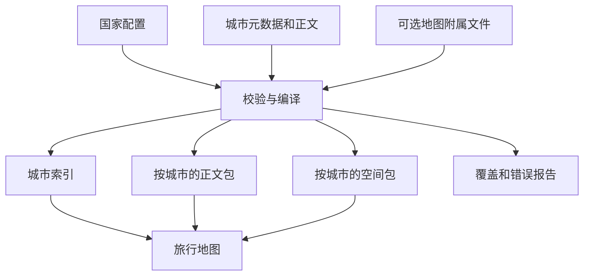
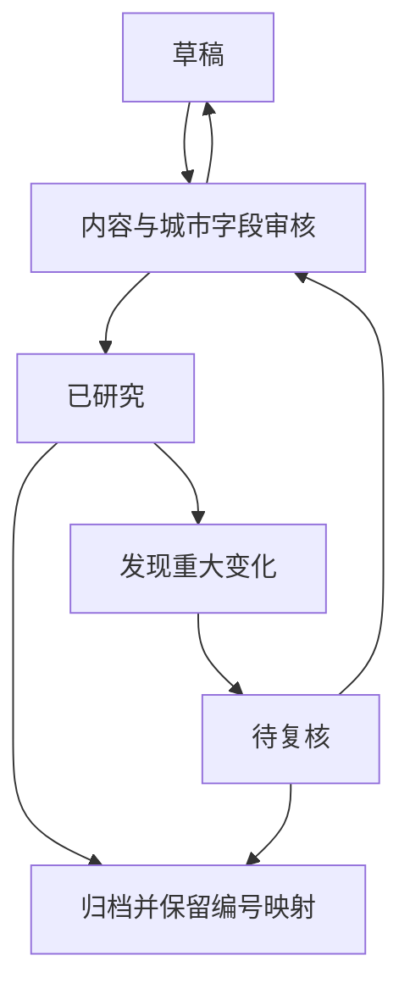

# 技术设计：旅行地图攻略数据契约

## 背景与目标

维护者新增一篇境外攻略后，应能得到正确的城市点、国家分组和可读正文。调整正文用词应不会改变城市身份或使已有主题悄然消失。继续建设景点和路线功能时，同一地点应能被多条路线复用，并与攻略内容相互定位。

本文件定义 **v2 目标契约**，不是当前程序已实现的接口。验收目标是：四城跨国样板可导入、既有中国 ID 保持稳定、所有公开地图对象来源可追溯、对象引用无悬空、缺失数据有明确降级表现。

本文从原工作区选择性带入，文中的 793 城基线及个人稿盘点保留为设计输入记录。2026-09-06 台湾批次实际采用 v1 兼容、独立覆盖账本和三城公开全文；当前数量与验收以[本批记录](../../coverage/CN/taiwan-2026-09-06/README.md)为准，不从提案推断能力已经上线。

本契约按[产品、设计与开发并行协作约定](../working-agreement.md)持续演进。下文的阶段和试点描述当前交付建议，产品、交互、内容研究和开发可以并行调整；改变字段含义或功能范围时同步兼容方式与验收样例。

“目的地”指一份攻略覆盖的旅行范围，可以是城市、城区、小镇或区域；“地图入口”指用来找到它的中心点；“地点”指景点、游客入口等具体对象。这三者可以具有不同的空间范围。

## 关键场景

| 场景 | 触发和前提 | 期望结果 | 阶段 |
|---|---|---|---|
| 新增境外城市 | 作者完成来源研究，填入 v2 字段及正文 | 无需修改中国专用代码即可按国家显示、检索和阅读 | 城市级 |
| 查找同名城市 | 两城显示名相同，国家或行政归属不同 | 搜索呈现候选及国家地区，按稳定 ID 选择 | 城市级 |
| 修改攻略目录或译名 | 文件移动或展示名称改变 | 地图、已保存 ID 和关联保持有效 | 城市级 |
| 查看广域目的地 | 攻略范围大于中心城区 | 显示范围说明及可选默认视野，远郊可识别 | 城市级 |
| 选择片区和路线 | 该城有经过校验的地图附属文件 | 地点高亮、路线节点与正文相互定位 | 空间级 |
| 数据核验到期 | 来源或时变事实需要更新 | 显示核验日期与待复核状态，不自动视为地点关闭 | 两阶段 |

## 范围与约束

城市级交付基线包括城市身份、国家配置、地图入口、检索摘要、正文和来源。片区、地点、路线和图片按各自功能增量接入，所需数据只对启用该能力的对象成为必需项；缺少可选模块的城市仍可成为合格的城市级攻略。

沿用 `destinations/` 作为下一版规范源目录；现存四国根目录个人攻略与 Git 快照中的规范源在迁移时逐一合并。路径只是文件组织，不用于判定身份或行政归属。正文保留既有十节骨架，国家和地区概览是导航内容，不伪装成城市点导入。

构建应读取明确的工作区或不可变 Git 提交。常规校验和构建不自动更新远端或请求坐标；坐标研究和库存更新是单独步骤。发布继续采用项目现有 GitHub 方式。数据库、账户、实时导航、实时营业判断和自动行程优化不属于这一版的交付范围。

上述范围可随具体功能决定调整，不作为禁止路线规划等新需求的长期约束。新功能应补充适用场景、数据/服务条件、用户记录责任和旧能力替代体验，而不直接扩大现有字段的含义。

## 方案选择

采用“有限的结构化元数据＋Markdown 正文＋可选地图附属文件”。元数据是 Markdown 顶部 `---` 包围的 YAML 字段；附属文件与正文同名，后缀为 `.map.yml`。

城市元数据负责身份和卡片信息，正文负责解释、取舍和旅行策略，附属文件负责片区、地点与路线关系。这样可以按产品阶段逐步增加录入成本。继续依赖中文标题和表头猜测结构只用于兼容旧文；把全部地图对象塞进文档头会增加重复维护，暂不采用。

字段类型建议以 [JSON Schema 2020-12](https://json-schema.org/draft/2020-12) 固化，YAML 解析后再做模式和业务引用校验。本文尚未提供机器可执行的 Schema 或新校验器；实施时必须补齐，不能用“文档已存在”代替验证。对象关系、日期真实性、引用存在性还需业务检查。

## 系统组成

下一版由国家配置、攻略源、编译器和网页组成。国家配置列明纳入范围、当地行政类型与数据来源；编译器负责读取、校验、转换和生成报告；网页消费编译后的城市及空间数据。



建议文件布局如下，除 docs 模板外均为实施时的目标布局：

```text
config/countries.yml
destinations/<国家>/<维护分组>/<目的地>.md
destinations/<国家>/<维护分组>/<目的地>.map.yml   # 进入空间级后添加
coverage/<国家代码>/<批次>/decisions.csv
site/生成目录/manifest.json
site/生成目录/国家索引与按城数据包
```

产品、设计、开发共同维护同一变更的场景、能力条件和验收样例。产品负责用户目标、覆盖及公开范围，设计负责交互、视觉和缺数据/失败时的体验，工程负责读取、实现及兼容，内容维护者负责攻略与来源；同一人可兼任，各项工作可并行。生成目录的确切落点由 GitHub 构建适配决定；作者编辑源文件，生成结果由编译器统一更新。

## 接口与交互

### 源格式和网页格式分别版本化

源文件以 `schema_version` 选择 v1/v2 适配器。网页产物使用单独的 `data_version: 1`；源格式升级不必强迫网页同步修改。未知核心版本直接报错，不能按当前版本猜测。可选模块独立管理版本；未支持的新模块通过明确的兼容投影省略或按约定忽略，不能阻断已支持的基础能力。

新增可选字段须定义缺省行为并验证旧读取端；先更新校验器和读取能力，再让源文件产出新字段。改名、改单位、增加全局必填值或改变已有语义属于破坏兼容的变化，须带版本与迁移方案。视觉布局调整无需升级数据格式。具体演进步骤见核心协作约定。

城市索引记录至少输出：`id`、`name`、`names`、`countryCode`、`adminLabel`、`aliases`、`center`、`summary`、`suggestedStay`、`tags`、`lastResearched`、`capabilities`、`bodyPath` 和可选 `mapPath`。`name` 取当前内容语言的名称，搜索合并 `names` 的所有值和 `aliases` 后去重。字段来自显式元数据；`bodyPath` 由发布策略决定，没有公开正文时为 `null`，页面提供对应说明。

`capabilities` 的当前基础集合为 `readable`、`cityMap`、`placeMap`、`routes` 四个布尔值。`readable` 表示当前目标用户可访问正文；其他三项由地理和引用校验推导。`routes` 只表示存在引用闭合的推荐路线，不代表路线编辑、交通计算或自动规划可用。

路线编辑、图片展示等新能力各自定义数据条件、读取端支持、开放范围和替代体验，新增可选标记缺失时按不可用处理；旧标记保持原含义。在支持的核心版本内，客户端忽略未知可选能力，不把它显示为已支持；入口实际开放还须满足程序实现、访问授权和本次启用范围。主题卡未提取成功时记录编译告警；只有 `readable=true` 才提供该节正文入口，否则展示允许公开的摘要及“该主题未提供”说明，不能以回退为由额外公开正文。

第一阶段正文按固定 H2 映射到稳定主题键：`overview / areas / attractions / food / itineraries / stay / transport / travelers / pretrip / sources`。这是十个内容区，不要求界面显示十个卡片标签；现有八标签可以选择展示子集。v2 空间对象关联 `body_section` 使用这些键，子节定位留到有实际双向定位需求时扩展。

### 加载与错误

城市索引先加载，正文和空间包按城加载。对公开静态资源不增加认证；私有资源采用另行选定的访问方式。读取失败保留城市索引并给出重试，超时建议 10 秒、自动重试最多 1 次，用户切换城市后取消旧请求，迟到响应不覆盖当前城市。

包内版本不匹配时拒绝加载该包并提示刷新，不混合显示两个发布版本。整个发布使用同一个清单版本，正文路径和空间路径也属于该版本。

## 数据与状态

### 城市级必备元数据

以下完整约束针对进入地图的页面。所有 v2 源文件都必须有合法的 `schema_version`、`document_type`、`guide_id`、`country_code`、`content_status` 和 `publication`，以便分流和全库去重。`draft` 的其他研究字段可以填写 `null` 和空数组，但草稿不得进入“已覆盖”统计和正式地图。v1 先按旧格式校验，再由适配器、持久化 ID 对照表和明确的发布配置补齐统一身份与输出策略；后文全库身份检查针对适配后的对象，不能要求 v1 原文已经具有 v2 字段。字段名大小写固定；日期使用带引号的 `YYYY-MM-DD`，ID 始终为字符串。

| 字段 | 类型和要求 | 用途 |
|---|---|---|
| `schema_version` | 整数，固定 `2` | 选择读取契约 |
| `document_type` | 固定 `destination_guide` | 与国家/地区导航页区分 |
| `guide_id` | 全局唯一字符串，格式见下文 | 地图、来源及将来收藏的稳定关联 |
| `destination_type` | `city / district / town / metro / region / island / park` | 描述旅行目的地尺度，不替代当地行政类型 |
| `title` | 非空字符串 | 文档标题 |
| `country_code` | 国家配置中的大写两字母代码 | 聚合和消歧；英国配置使用 `GB` |
| `content_language` | 当前固定 `zh-CN` | 正文语言；多语言正文另行设计 |
| `names` | 语言键到名称的映射，至少有 `zh-CN` 及当地常用名称 | 展示和检索；相同语言不重复写键 |
| `aliases` | 字符串数组，允许空 | 通行译名、拉丁转写、旧称；不决定身份 |
| `admin_path` | 从上到下的行政归属数组，结构见下文 | 展示当地行政结构；没有中间层级时可为空 |
| `scope` | `summary`、`includes[]`、`excludes[]` | 区分中心城区、近郊和不包含的延伸范围 |
| `map` | `center`、`precision`、`source_id`，可选 `bbox` | 城市地图入口及来源 |
| `timezone` | 有效 IANA 时区字符串 | 城市默认时区；不据此提供实时营业判断 |
| `currencies` | 非空币种代码数组 | 解释本地预算；没有金额也要明确货币语境 |
| `summary` | 人工短摘要，建议 60–180 中文字 | 城市卡，避免抽取首段偶然命中 |
| `suggested_stay` | `min_days`、`max_days`、`note` | 正数，最多一位小数，最小值不大于最大值 |
| `travel_tags` | 1–8 个受控标签 | 城市比较，说明文字放正文 |
| `content_status` | `draft / researched / needs_review / archived` | 研究工作进度 |
| `last_researched` | 最近一次实质研究日期 | 不能因格式迁移而改成当天 |
| `sources` | 非空来源数组，结构见下文 | 坐标、范围和旅行事实的证据 |
| `publication` | `visibility: public / private`；`body: full / summary_only` | 声明期望输出，仍需编译器实施 |
| `map_data_file` | 可省略；存在时为同目录 `./<同名>.map.yml` | 空间级数据入口 |

### 身份、行政链和范围

既有 `cn-<GeoNames编号>` 原样作为 `guide_id`，保证已有链接稳定。新 ID 使用国家小写前缀加人工固定 slug，例如 `jp-tokyo`、`fr-paris`、`gb-london`，匹配 `^[a-z]{2}-[a-z0-9]+(?:-[a-z0-9]+)*$`。同名冲突在首次分配时加入地区或编号区分，分配后不随名称、路径和外部 ID 改变。GeoNames 并非新国家必填条件。

外部标识放在可选 `external_refs` 中，键为 `geonames`、`wikidata`、`admin_code`；行政代码另带 `admin_code_system`，例如该国选定的代码体系。无编号时省略，不能用 `0`、城市名或猜测的编号代替。`legal_admin_code` 与 `administrative_code` 在迁移时合并；同时存在且值冲突必须人工消解。

`admin_path[]` 每项为 `{id, name, type, level, source_id}`：`id` 是带国家/体系命名空间的稳定键；`name` 是展示名称；`type` 保留“都、府、大区、构成国”等当地称谓；`level` 表示该国家配置内从外到内的排序。它不意味着不同国家的同一 level 具有同等权力或尺度。无法确定某层时先研究，不能为了凑三级目录虚构行政单位。

东京攻略可以选择中心城区为旅行范围，行政链仍记录选定实体的真实归属；多摩与离岛的纳入方式写在 `scope`。伦敦应明确实际旅游范围，不能仅因放在“英格兰”文件夹便把它当成与中国省完全同类的行政层。`scope.includes/excludes` 是解释文本，不自动用于空间过滤。

### 坐标与来源

源文件内的 `map.center`、`bbox`、地点 `location`、片区 `center/geometry` 一律保存已核验的 WGS84 十进制度坐标。`map.center` 固定写 `{longitude, latitude}`。经度范围为 -180 到 180，纬度为 -90 到 90，必须为有限数值；数值 `0` 可以是真坐标，不能用作缺失值。`precision` 为 `city_center / approximate`，表示旅行地图定位语义，不表示游客入口精度。`source_id` 必须能在本页来源中找到。

可选 `bbox` 为 `[west, south, east, north]`，四项均为有限数值，west/east 使用经度范围、south/north 使用纬度范围，且南不大于北。横跨日期变更线时允许 east 小于 west，加载端须处理这种情况；未实现时只用中心点并提示范围，不能生成覆盖全球的错误视野。边界框是展示范围，不宣称为法定边界。

输出 GeoJSON 使用 WGS84 十进制度坐标，顺序是 `[longitude, latitude]`；边界和跨日期变更线处理遵循 [RFC 7946](https://www.rfc-editor.org/rfc/rfc7946)。来自其他坐标体系的数据，在来源的可选 `coordinate_note` 字符串中记录原体系、原坐标、转换依据和核对结果；完成核验后才填入地图坐标字段。

`sources[]` 每项为 `{source_id, title, url, checked_at, supports, rights_note}`。`source_id` 在本篇攻略内唯一。`admin_path.source_id`、`map.source_id`、空间对象 `source_ids` 和 `location.source_id` 全部引用该表；附属文件不另建同名来源表，正式空间对象的 `source_ids` 非空。`supports` 是该来源实际支持的字段或主题键列表，`checked_at` 是确实访问并核验的日期，`rights_note` 说明引用方式或数据授权依据。URL 与日期存在只证明记录完整，不证明来源支持某个事实；人工验收要打开对应页面核对。

开放时间、票价、交通中断等仍在行前核对中维护。未来若存精确金额，应包含数值、币种、适用对象和有效期；若存精确营业规则，应包含地点时区、例外日和核验日期。当前不由城市研究日期推导“现在营业”。

### 标签和正文

第一版 `travel_tags` 使用：`history, museums, architecture, city_walk, waterfront, food, nature, art, nightlife, family`。标签表示内容特征；体力、季节、预算等尚未形成跨城可靠量表时保留解释，不从“独旅适合”推断为所有人适合。新增标签在同一变更记录中同步契约和前端字典，先准备读取端兼容，再让内容使用；源校验仍拒绝尚未注册的值，旧客户端未支持的新标签按明确的投影或展示回退规则处理。

正文沿用既有 v1 的十个 H2，精确顺序见[模板](../templates/city-guide-v2.md)。表格推荐使用统一列名，仍允许有信息价值的自然段；正文解析器应提供段落回退和抽取报告。H3 可以按目的地特点组织。Mermaid 用于解释空间关系，地图坐标和路线引用放在结构化数据中。

编辑呈现采用[Lonely Planet 参照研究](../research/guide-presentation-lonely-planet.md)中本项目的选择：城市导语与首访精选帮助决策，片区和核心地点导读解释体验，表格保留比较与查阅。新增导读先属于正文，不增加 frontmatter 字段，不改变 A/B/C 或对象身份；“体验”可能关联片区、地点和路线，不能一律作为坐标点。逐项卡片定位与精选模块须在具体功能中另定契约，当前 `body_section` 仍只关联主题区。

### 空间级附属文件

附属文件只有在要启用地点/路线地图时添加。第一版使用 `map_schema_version: 1`、`guide_id` 和 `areas / places / routes` 三个数组；数组可以为空，能力按有效对象推导。以下是下一阶段最小对象约束，不要求所有城市立即填写。

| 对象 | 必备字段 | 约束 |
|---|---|---|
| 片区 `areas[]` | `area_id, name, summary, body_section, source_ids` | `body_section=areas`；可有 `center` 或 GeoJSON `geometry`，无位置时只显示列表 |
| 地点 `places[]` | `place_id, name, area_id, role, priority, visit_minutes, count_group_id, source_ids` | `area_id` 可为 null；其余引用必须存在；可选 `parent_place_id, location, body_section` |
| 路线 `routes[]` | `route_id, name, stops, legs, conditions, source_ids` | 至少两站；可选 `body_section=itineraries`；引用本页地点 |

对象 ID 采用 `guide_id:area:<slug>`、`guide_id:place:<slug>`、`guide_id:route:<slug>`。对象删除或合并要记录旧新 ID 映射；跨城市共享地点和跨国长线留待单独关系层，本版先在单份攻略内闭合引用。

`role` 为 `attraction / transit / rest / food`；`priority` 为 `A / B / C / none`。`visit_minutes` 为 `{min,max}`，非负整数且最小不大于最大，未知时整个值为 null，界面显示“待核验”。`location` 可为 null；有位置时包含 `longitude, latitude, precision, source_id`，精度为 `entrance / site / approximate`。只有经核验的入口才显示为入口点。

`count_group_id` 表示完成率中的同一组父景区；其值为本页一个 `role=attraction` 地点的 ID，父项引用自己，子项引用父项。`transit/rest/food` 使用 null。`parent_place_id` 不得产生循环。若以后显示清图率，分母按选定范围内不同组计数；一组的等级以父项为准，父子不重复。用户完成记录另存，不写入公共攻略。

`stops[]` 为有序 `{place_id, optional, reservation_anchor}`。`legs[]` 与相邻站点一一对应，为 `{from, to, mode, duration_minutes, evidence}`；`mode` 为 `walk / transit / drive / ferry / mixed / unknown`，时长为 `{min,max}` 或 null，`evidence` 为 `editorial_estimate / verified / unknown`。条件 `conditions` 为 `{suitable, weather_fallback, drop_order, exit_note}`，前三者为数组，`drop_order` 引用本路线 optional 站点，`exit_note` 为文字退出方式。

第二阶段只画节点和明确标注的顺序示意线，不包含道路级几何。缺坐标路线仍可显示站点清单，缺交通证据的路段显示“待核验”，不启用精确用时或自动顺路判断。

### 编辑状态与能力

研究完成不自动表示地图数据完成。作者将 `draft` 提交审核，内容和城市级字段通过后成为 `researched`；发现影响旅行判断的变化时转 `needs_review`，复核后回到 `researched`；合并或停止维护后为 `archived`，保留重定向和历史 ID。



`researched` 且城市字段通过时可首次进入城市地图；`needs_review` 的当前城市字段仍须通过校验才可保留点位并显示待复核标记，但不算本批新增合格攻略。若采用历史坐标，须显式固定并记录来源快照，不读取机器上偶然残留的产物。`placeMap` 需要至少一个有效可定位地点；`routes` 需要至少一条引用闭合的路线，是否能画线另按节点位置判断。

## 正常执行路径

以下描述一次交付的检查依赖，不规定各项工作的启动顺序。场景、交互原型、真实内容样本、契约样例和兼容实现可以并行推进，并在小步预览中反复校准。

1. 内容维护者在国家配置中确定候选范围和来源，给目的地分配稳定 ID。
2. 从模板创建草稿，填写城市级元数据和十节正文；按实际核验记录来源。
3. 编译器从明确输入版本读取 v1/v2，解析 YAML、校验字段与引用，再输出国家和城市质量报告。
4. 内容维护者检查范围、坐标、来源以及主题卡与正文对应情况，通过后标为 `researched`。
5. 编译器在暂存目录生成完整发布包，引用相同清单版本，校验后一次替换目标输出。
6. 本地预览通过后，按项目明确的提交与发布操作进入 GitHub 流程。

## 失败与恢复

| 失败 | 处理和用户表现 | 恢复方法 |
|---|---|---|
| 全库注册身份非法或 ID 冲突，或纳入本次构建的核心版本不支持、拟输出页的研究必填值缺失 | 本次正式构建失败，旧发布包保持可用；可选模块按明确的输出选择与校验规则处理 | 修复源文件后重新构建，错误报告定位文件和字段 |
| 草稿未完成 | 统计为草稿，正式索引排除 | 补内容并经过审核后纳入 |
| 无合法城市坐标 | 城市地图准入失败，保留本地文档 | 补充来源或库存映射，禁止用 0 填空 |
| 主题解析失败 | 报告未提取主题；可读正文提供入口，否则只给许可摘要与说明 | 补兼容规则或显式主题数据，再比较覆盖报告 |
| 地点无坐标 | 仍显示名称及说明，关闭该地点地图点 | 核验位置后启用 |
| 附属文件语法或引用错误 | 新发布包构建失败，不只截去坏对象继续发布 | 修复附属文件；若暂缓空间功能，应显式移除引用并重新验收城市级输出 |
| 新包生成中断 | 不切换清单，继续使用上一完整包 | 清理本次暂存目录后重试；核对目录位于输出范围内 |
| 远端或来源网站不可用 | 已固定本地输入的构建不受影响 | 研究阶段记录访问失败，不更新核验日期 |

## 并发与一致性

一次发布的索引、正文、空间包和清单必须属于同一输入集合。生成排序固定为 ID 排序；同一输入与编译器版本的内容哈希一致。生成时间放在单独构建记录中，不参与内容哈希。

为每个输入记录相对路径、字节哈希和格式版本；清单记录根仓库提交、是否有工作区修改、编译器版本及产物哈希。工作区模式用文件哈希补充提交号，不能只用 HEAD 冒充未提交内容版本。嵌套网站仓库需要单独记录代码提交。

多个作者并行编写时按国家批次分工，ID 和候选清单在合入前全库去重。目录改名保持 ID；同一事实不在正文、地图元数据和多个国家配置中独立维护为不同权威值。正文可解释数值，改动时核对元数据同步。

## 安全与隐私

公共攻略使用可复用的旅行条件，如低体力、亲子或独行；个人画像、出行日期、已去过状态和私人复盘单独保管。个人适配规则（原工作区历史材料 `../../02-个人化标注规则.md`，本批未带入）继续用于个人资料，不自动并入公开网页。

`publication.visibility=private` 的文档及其所有派生数据都不得进入公开目录。`body=summary_only` 只导出允许公开的城市字段和明确可公开的空间内容。声明本身不提供保护：导出器、公共 Git 内容、静态资源及源映射都要符合选定策略。当前网站有全文加载，历史提案曾采用摘要公开；最终选择由产品负责人在实现前决定。

数据源只读取声明目录中的文件，相对附属路径不得逃出正文目录。来源和正文链接仅允许预期 URL 协议，正文脚本不执行。来源授权仍按来源策略（原工作区历史材料 `../../04-来源与引用策略.md`，本批未带入）逐项核对，本规范不代替许可审查。

## 可观测与运维

每次编译至少报告：各国家候选数、草稿数、研究完成数、待复核数、城市地图可用数、地点地图可用数、路线可用数、主题抽取遗漏数，以及缺失引用和坐标问题。分母来自已声明的候选清单，不宣称全球所有城市覆盖率。

正式构建的阻断条件为：任一纳入本次构建的源身份字段非法、未知核心版本、重复 ID，或拟输出页面的研究必填字段错误、来源/对象悬空、产物不一致。草稿研究字段为空不阻断其他合格页面。正文主题遗漏第一阶段可告警；仅在当前目标用户可读正文时回退全文，相同测试样本的遗漏数不得增加。工程维护者处理结构错误，内容维护者处理来源和范围错误；本次拟交付范围的阻断项解决后才可验收，无依赖的其他批次研究、设计和开发继续推进。

实验模块暂不交付时，在可复现的构建输入/输出选择中显式排除它及相关引用，再校验剩余包；已纳入输出却非法的可选模块仍阻断该包。源身份与 ID 注册维持全库检查，实验范围不能成为重复分配 ID 的理由。

## 容量与性能

按当前约 800 城作为基线，以 2,000 城作为下一轮验证规模。索引按国家分包，正文与空间对象按城加载；第一阶段无需全站 POI 一次进入浏览器。

建议验收预算为：单城正文及空间数据合计压缩后不超过 250 KiB；有缓存时切城反馈在 200 ms 内；在明确记录的普通移动网络条件下，单城内容显示的第 95 百分位不超过 2 秒。这些是待测目标，不是现有表现；超出时先检查大文件和加载范围，不据此删掉必要攻略内容。图片资源单独设置首屏、缩略图和原图加载预算，不混入正文预算，也不整国预载。

跨国试点记录设备、浏览器、网络条件、包体和实际耗时。规模增长时优先分包和缓存，是否引入数据库由真实检索和用户状态需求再决定。

## 发布、迁移与回滚

1. **先固定基线。** 记录源攻略集合和网站代码版本，确认当前删除状态的取舍。现有 793 城 ID 及公开路径进入迁移对照表。
2. **先兼容后改文。** v1 适配器沿用已核验的外部库存补城市点，v2 读取显式字段；城市卡输出统一为网页格式。建立持久化迁移对照表，以源国家和外部实体编号关联固定 `guide_id`，现有中国保留旧 ID，境外 v1 东京和巴黎首次进入地图即分配 `jp-tokyo`、`fr-paris`；随后迁移 v2 仍使用同一 ID。v1 不自动生成 POI 或路线。
3. **跨国试点。** 先采用 Git 中已有规范东京、巴黎作为参照，再处理京都和伦敦的旧格式；同城旧版与规范版合并为一篇权威正文。
4. **保持研究日期。** 格式迁移只改格式；旧状态没有直接等价的新状态时先记 `draft` 并复核，不一律提升为研究完成。
5. **小批量放量。** 四城样板用于决定扩大正式接入的范围，10–20 城是可调整的交付粒度，其他国家研究、设计及功能试验可同时进行。至少一个完整批次内保留 v1 兼容，直到剩余 v1 清单归零后再计划删除适配器。
6. **整体回滚。** 新包内容丢失、ID 变更或读取失败时切回上一完整清单及资源。源文件迁移以独立可回退变更保存；用户记录使用 ID 映射，不能靠退回目录名恢复。

正式提交、推送和发布按当前任务的明确授权执行。本文不创建新的托管平台或自动发布流程。

## 验证计划

| 验证对象 | 样本或方法 | 通过条件 |
|---|---|---|
| v1 兼容 | 选定的完整中国基线＋东京、巴黎规范源 | 既有城市 ID 不变；排除项有明确原因 |
| 跨国检索 | 东京、京都、巴黎、伦敦；合成同名城市测试夹具 | 国家和行政区可消歧；当地名称、译名均命中 |
| 空值和边界 | 缺日期、假日期、坐标空串、合法 0 经度、经纬颠倒、负纬度、跨日期线范围 | 非法值阻断；合法边界有预期显示 |
| 正文变体 | 宁国段落、巴黎“景点或体验”表头、中文标题变体 | 内容有回退入口；不出现静默丢失 |
| 空间引用 | 父子景区、地点缺坐标、悬空路线节点、循环父关系 | 组计数不重复；非法引用阻断 |
| 状态 | 草稿、已研究、待复核、归档 | 覆盖统计和界面能力符合各自条件 |
| 生成一致性 | 固定输入连续两次构建，中途失败注入 | 内容哈希一致，失败后旧包完整可用 |
| 输出范围 | 私有标记测试句、summary_only 页面 | 禁止字段不出现在公开 HTML、JSON、正文、索引和源码映射 |
| 实际网页 | 地图选城、主题切换、全文、返回、移动端、网络失败重试 | 关键路径可用，测试断言针对旅行地图 |
| 可选新能力 | 已有城市、新国家、无模块和未启用功能样本 | 旧能力保持可用；路线/图片等只在条件满足时开放 |

内容审阅与机器校验共同通过才可标记完成。新增规范文本的检查不代表上述产品验证已经通过。

## 风险与未决事项

| 事项 | 影响 | 责任角色及期限 | 默认处理 |
|---|---|---|---|
| 源文件删除与嵌套仓库策略 | 影响可重复构建与迁移基线 | 仓库维护者，P0 | 只读记录；在确认的版本上开始实现 |
| 正文公开范围 | 影响产物与阅读入口 | 产品负责人，发布实现前 | v2 草稿标私有，现有程序行为单独记录 |
| 国家配置及 ID 注册位置 | 影响多作者扩展 | 工程与内容维护者，v2 开工时 | 采用仓库文件管理，配置可审阅 |
| 多国家区域、多时区范围 | 影响区域型长线 | 产品与内容维护者，出现首个真实样本时 | 本版单国、单默认时区；跨国长线另立契约 |
| 多语言正文 | 影响同目的地多文档身份 | 产品负责人，有明确阅读需求时 | 一篇中文正文＋多语言名称 |
| 字段录入过重 | 影响研究效率 | 内容维护者，四城试点验收时 | 先交城市级；只为实际启用功能补空间对象 |
