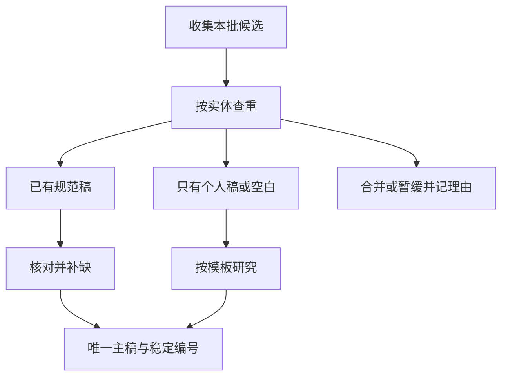
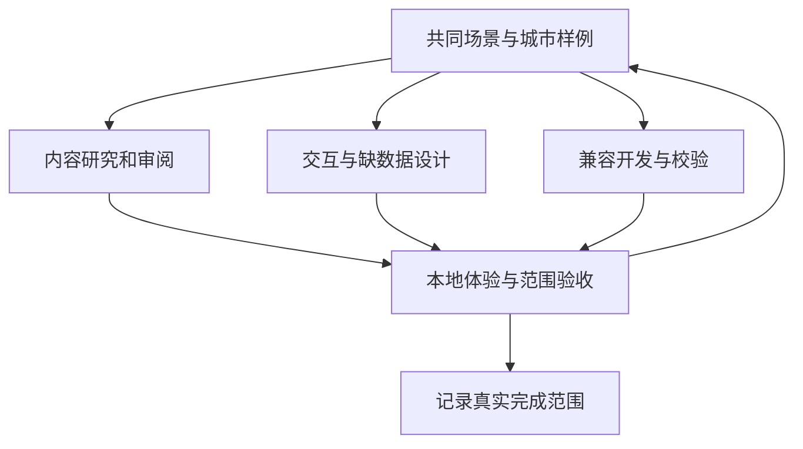

# 新国家攻略扩展流程

扩展一个国家的成功标志是：选定范围内的目的地有可读攻略，能在地图正确出现，来源和覆盖状态可核对。文件数量只用于盘点，不能单独代表覆盖完成。

本流程配合[数据契约](designs/travel-guide-data-contract.md)和[v2 模板](templates/city-guide-v2.md)使用。**当前同步器只读中国 v1 攻略，v2 读取、国家配置和新校验器尚未实现。** 现在可以研究和编写 v2 草稿；正式纳入地图前须通过下文的程序准入检查。

工作方式遵循[并行协作约定](working-agreement.md)：国家研究、产品场景、界面原型和兼容开发可以同时推进。下面的验收条件约束本次正式交付范围，不要求所有城市先完成同一个阶段；路线、图片等可按功能独立试点。

## 先固定本批的范围

每个国家先写一份当前批次说明，放入目标 `coverage/<国家代码>/<批次>/README.md`，记录以下内容。范围可随研究和产品反馈调整，并更新候选决定及验收样例。该目录是下一版目标布局，采用时按实际批次创建。

| 项目 | 要写清的内容 |
|---|---|
| 旅行目标 | 首访经典、未来一年高概率目的地、区域网络或专项主题 |
| 候选集合 | 明确城市/目的地清单及数量；声明这是本批范围 |
| 地理尺度 | 城市、城区、小镇、海岛或区域；行政范围与旅行范围分别说明 |
| 数据来源 | 官方旅游/政府、公共交通、核心场馆及定位来源；记录访问或库存版本 |
| 国家规则 | 名称写法、行政链、默认语言、币种、时区及坐标来源的处理方式 |
| 输出目标 | 城市地图、完整阅读；是否有空间级试点，以及公开范围 |
| 质量门槛 | 必填元数据、十节正文、来源、范围、点位和阅读验证 |

按旅行价值选择候选，人口清单可以帮助发现地点，但不能自动当成旅行目的地全集。群岛、国家公园门户、广域区域可能需要独立说明，也可能更适合并入一份区域攻略。

## 先核对已有内容和来源版本

当前库同时存在四国根目录个人攻略、`destinations/` 规范源和网站生成正文。先按身份找到已有内容，给同一目的地建立一行合并记录：

| 字段 | 说明 |
|---|---|
| `candidate_id` | 本批候选的稳定编号 |
| `display_name` | 供人工阅读的名称 |
| `country_code` | 国家配置代码 |
| `guide_id` | 新分配或沿用的目的地 ID，未决定时留空 |
| `source_path` | 选定权威正文的仓库相对路径，尚无正文时留空 |
| `status` | `selected / writing / researched / merged / excluded / deferred` |
| `target_guide_id` | 合并到哪个目的地，非合并项留空 |
| `reason` | 合并、排除或暂缓的具体理由 |
| `evidence` | 来源链接或版本证据 |
| `updated_at` | 本行实际变更日期 |

记录保存为本批 `decisions.csv`。`researched` 必须对应已经通过内容和城市级验收的正文；`merged/excluded/deferred` 不计为新完成攻略。合并引用必须指向现存目标。相同实体的多个旧名字可对应同一 ID，同名但不同实体保留不同 ID。

Git 快照中的东京、巴黎已有 v1 规范稿；工作区根目录另外有个人稿。两者需要比较后确定主稿，旧稿中有价值的旅行判断可以回填。英国伦敦当前只有个人稿，不能与已有标准化稿同样处理。生成目录中的 Markdown 是展示产物，研究日期和来源等应从选定源版本核对。

## 用四城样板验证跨国规则

| 样板 | 使用的现有材料 | 验证重点 |
|---|---|---|
| 东京 | Git 中规范稿＋[个人稿](../destinations/日本/东京都/东京.md) | 日文/中文名称、行政实体与中心城区范围、多摩和离岛边界 |
| 京都 | 个人稿（原工作区历史材料 `../日本/京都府/京都市.md`，本批未带入） | 同一国家不同目的地复用规则；城市和府的层级 |
| 巴黎 | Git 中规范稿＋[个人稿](../destinations/法国/法兰西岛大区/巴黎.md) | 大区/城市归属、近郊延伸、表头变体与正文回退 |
| 伦敦 | 个人稿（原工作区历史材料 `../英国/英格兰/伦敦.md`，本批未带入） | 构成国和都市范围、GB 代码、英语名称与多结果消歧 |

样板的目的地范围与坐标须在研究时核实，不能从文件夹名称直接复制结论。使用当地官方名称，再保留常用中文译名和别名供搜索。第一批仍以中文正文为主，不需要同时翻译四套攻略。

## 按城市级模板完成研究

1. 复制模板到 `destinations/<国家>/<维护分组>/<目的地>.md`。填写合法的身份字段，状态保留 `draft`。本地尚未决定源目录整理方式时，先把草稿放在批次工作目录并在清单记录路径。
2. 确定攻略范围，再核验地图中心点。中心点应帮助用户进入攻略，不能用景点入口替代整座城市定位，也不能把城市点解释成行政面。
3. 写城市价值、片区关系、景点、美食、路线、住宿、交通、不同旅行者、行前核对和来源。沿用模板十个 H2，H3 随内容组织。
4. 明确首访主线、天气或体力替代线、预约锚点、休息和退出方式。小目的地无需机械凑三日行程，但仍要提供与规模相称的替代方案。
5. 填写人工摘要、停留数值和受控标签；对照正文解释，消除“元数据写两天、正文说只适合半天”等矛盾。
6. 将坐标、行政归属和关键内容绑定来源。来源必须注明支持什么、何时实际核验；研究作者自行组织解释和取舍。

新稿按[内容呈现研究](research/guide-presentation-lonely-planet.md)及当前模板先写城市印象、首访取舍和片区体验，再提供完整查阅表。审阅时检查：读者能否说出这座城市的特点、优先片区和可删减路线；导读是否与事实、用时及等级一致；是否保留实际影响游览的边界；是否出现虚构亲历。格式检查通过后还要完成这一步内容审阅。

正文保持适用于公众的旅行条件。个体旅行画像、已去过经历、私人身体状况或固定作息偏好不进入公共主稿；必要时写成“低体力”“偏好摄影”“独行”等明确场景。

票价、开放、罢工、预约和具体餐厅营业等放入行前核对清单，说明核对入口和时点。写作时间不代表每一项来源都刚刚核验，格式迁移更不应刷新整篇研究日期。

## 通过程序准入和内容验收

实施 v2 导入时，应提供独立的只读校验入口与显式生成入口；正式命令以实现后的项目说明为准。当前 `npm run dev/build/test` 都会触发同步，同步器读取当前工作区并重写生成目录，不能将其当作只读文档检查。

| 门槛 | 检查方法 | 通过标准 |
|---|---|---|
| 源版本 | 对照源目录、提交及工作区哈希 | 本地编辑确实进入本次输入，来源可复现 |
| 身份 | 全库 ID、外部实体和候选记录比较 | 重名可消歧，重复实体已合并，旧 ID 不变化 |
| 字段 | YAML/Schema 与业务校验 | 日期、枚举、数值、来源引用合法；草稿不纳入地图 |
| 国家 | 加载国家配置并预览 | 国家面包屑、行政标签、当地名检索正确 |
| 地理 | 对照可靠定位来源，查看地图默认视野 | 中心点、经纬顺序与范围说明一致 |
| 正文 | 对照十节、表格和有信息量的自然段 | 能完成旅行选择，未留示例或空壳；主题抽取有回退 |
| 来源 | 逐项检查主要事实的支撑页 | URL、用途、核验日期匹配，不把技术访问失败直接当失效 |
| 公开范围 | 检查 HTML、索引、正文包、空间包及源映射 | 只出现选定输出；摘要模式不因回退而带出全文 |
| 产品 | 地图选城、检索、主题、阅读、返回及移动端检查 | 内容可访问且不会因切换显示错城 |

草稿阶段就可以持续核对来源、范围、数据条件和界面表现，由另一位维护者或独立审阅步骤提供反馈。内容审阅和对应的城市级检查通过后才将状态改为 `researched`，正式接入地图另需验证程序支持；两类状态分别记录。

## 从样板扩展到常规批次

四城样板用于验证共同规则后扩大正式接入，默认按每批 10–20 个目的地交付，可按产品反馈调整；其他国家的研究和试验可以同时进行。每批交付主稿、来源、候选决定、生成质量报告和本地验收记录。国家、地区及全局索引从相同清单生成，避免手工维护多个总数。

覆盖报告分开列出“本批候选、合格主稿、地图可用、空间级可用、合并、排除、暂缓”。例如一批有 12 个候选，其中 8 篇通过、2 个并入已有城市、1 个排除、1 个暂缓，应报告这六个数量，不能称为新增 12 篇完整攻略。

按真实功能选取代表城市开展空间级试点，添加同名 `.map.yml`，优先录入核心片区、A 级地点及两条路线。检查景区父子计数、地点引用、缺坐标降级和路线删减条件后，再决定正式开放范围。图片可以独立试点，按功能契约补资源关联、替代文本和使用授权；无图城市保留原有体验。这些工作无需等待全部城市级批次结束。

## 持续维护和交接

每次实地回来优先修正用时、串联关系、休息与退出点、景点等级和候补；官方规则变化则更新对应来源和核验项。`needs_review` 表示需要重新研究，不能直接解释为整个城市不可旅行。

批次交接记录尚未解决的事实冲突、技术访问失败、待核验坐标和后续范围。后续作者从已选定主稿继续，避免重新从生成正文或个人旧稿分叉。提交与发布仍按照当次任务明确授权执行，验收通过与已经上线分别记录。
