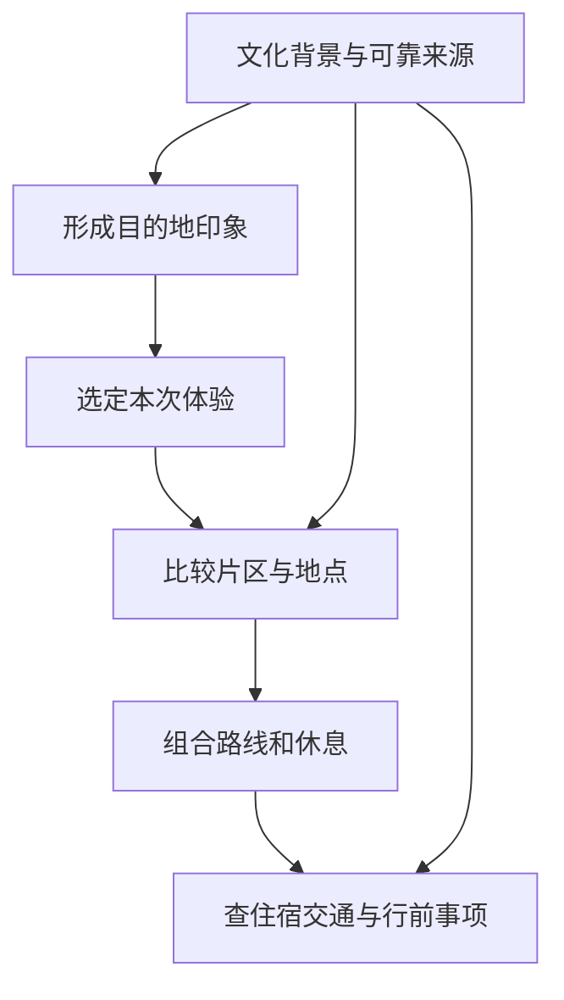
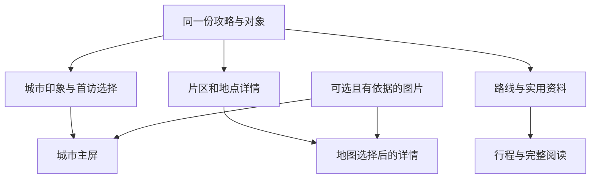

# 调研：借鉴 Lonely Planet 的攻略内容呈现

## 调研目标

判断新版攻略是否需要调整阅读顺序，以及怎样将 Lonely Planet 的编辑方法用于旅行地图。读者应能先做旅行选择，再进入片区、地点、路线和实用资料；后续更换页面布局时，已积累的攻略与地图对象仍可复用。

本次产出是新版模板的编辑调整及其依据。产品主屏、卡片和地图联动的建议仍需设计与开发验证，不能把模板更新当成网页已经改版。

## 范围与方法

本文为原工作区 2026-09-06 研究的选择性带入版本，以下样章渲染与个人稿观察记录来自原研究；台湾批次没有重新执行该历史实验。当前仓库仅保留对应的东京、巴黎规范稿链接，个人稿未带入。台湾三城的实际编辑应用与程序验证见[本批记录](../../coverage/CN/taiwan-2026-09-06/README.md)。

研究日期为 2026-09-06。检查当前 v2 模板、数据契约、并行协作约定，抽样阅读德阳规范稿及东京、巴黎个人稿。外部参照使用 Lonely Planet 官方产品说明、公开样章和网站文章，不使用非授权整本书下载或二手模板介绍。

官方《Paris》第 12 版公开样章的版权页标明 **2018 年 11 月**。本次读取其目录，并渲染查看 PDF 第 2 页目录与第 4 页行程版面；只研究信息层次，不使用其中的旧票价、营业情况或具体行程建议。官方 Tokyo 产品页当时列出 2026 年版的新结构，说明 Lonely Planet 自身也在调整形式，不能把某一旧版目录当成永久范式。

网站原宿和巴黎行政区文章通过搜索返回的官方正文核对；直接打开页面时发生技术读取错误。本文据已返回内容讨论标题、区域判断和叙事组织，不对未见部分作完整性判断，也不把该错误记作链接失效。

## 资料与证据

| 参照 | 可确认的编辑方式 | 对本项目的意义 |
|---|---|---|
| [Lonely Planet Tokyo 官方产品说明](https://shop.lonelyplanet.com/products/tokyo) | 当前产品强调体验、可组合的一日安排、地图及实用建议；页面说明使用新结构 | 学习以旅行体验组织选择，保留随版本变化的空间 |
| [Paris 第 12 版官方公开样章](https://media.lonelyplanet.com/shop/pdfs/paris-12-preview.pdf) | 目录区分出发规划、分区探索、城市理解和实用查阅；行程页用区域、时段和餐饮停靠组织一天 | 分开“帮助选择”和“现场查阅”，让路线容纳休息与生活体验 |
| [原宿初访指南](https://www.lonelyplanet.com/articles/guide-to-harajuku-tokyo) | 从街区性格进入，组织体验、饮食、到访时机，并标明作者身份 | 用具体细节解释为什么去；区分研究判断与亲身经验 |
| [巴黎行政区指南](https://www.lonelyplanet.com/articles/guide-paris-arrondissements) | 区域有针对旅行目的的适合理由，随后给街区和地点内容 | 片区既是空间分组，也是旅行选择入口 |
| [东京行前须知](https://www.lonelyplanet.com/articles/things-to-know-tokyo) | 将规划、当地习惯和实用提醒按任务组织 | 实用信息放在读者需要采取行动的位置 |
| 本地[德阳](../../destinations/中国/四川省/德阳市.md)、[东京](../../destinations/日本/东京都/东京.md)、[巴黎](../../destinations/法国/法兰西岛大区/巴黎.md) | 已有范围说明、路线锚点、替代线、餐饮取舍和来源记录 | 现有事实与旅行判断值得保留，重点改善编辑层次 |

以上概括是对有限样本的观察。本项目下面的栏目数量、字数建议、地图分层和数据处理方式属于自己的设计选择，不是 Lonely Planet 官方规范。

## 已确认的事实

### 新版模板更擅长收齐资料

新版模板具备稳定的十个 H2、结构化元数据和来源要求，能帮助作者检查遗漏。但开篇后很快进入速览表、片区表和十列景点表；首次到访者需要自己从这些行列中归纳哪些内容最适合本次旅行。

德阳样本的开篇已经点出城市性格和可选路线，随后是密集速览与边界说明，首访主线和兴趣取舍容易被埋在长文中。东京、巴黎旧稿的片区关系、休息、预约和删减写得较鲜明，但“对你的匹配”“与妈妈同行”等个人表达需要转成公开的旅行条件。

当前内容问题是精选与查阅的层次不足，不是缺少全部旅行事实。表格仍有价值，特别适合比较用时、区域和条件；承担介绍与判断的部分应有可独立阅读的短段落。

### 参照样本在不同阅读任务间切换

样章目录提供规划、分区探索、背景理解和实用查阅几种入口。其行程版面将游览与用餐安排在一天的不同位置，读者看到的是可执行的生活节奏，而非只见一串景点名。当前 Tokyo 产品说明和原宿文章也说明，体验与目的地性格可以先于完整资料清单出现。

从这些样本可以推导出适合本项目的阅读路径：

这是一条内容组织建议，不要求读者顺序通读；地图可以让人从一个地点或路线直接进入对应内容。

### 纸书结构需要转译到地图界面

纸书适合翻页与索引，手机地图则需要在当前位置、片区、地点和路线之间切换。复制双栏版面或把所有表格压进侧栏，会增加阅读负担；可以复用其“先选、再深入”的层次，重新设计页面入口。

“体验”也不总是一个点。沿湖散步可能是一段路线，了解工业城市可能关联一处场馆和多个公共空间。当前 schema 没有独立体验对象，应先写成正文并关联已有片区、地点和路线，不能为了显示一张体验卡虚构精确坐标。

## 方案比较

| 方案 | 新攻略写作 | 地图承接 | 维护代价 |
|---|---|---|---|
| 继续只按表格填全 | 容易检查完整度，选择仍靠读者总结 | 城市阅读可用，体验入口不鲜明 | 最低，但阅读问题继续存在 |
| 整套改成纸书目录 | 叙事空间充足，旧章节需迁移 | 仍需重新设计地图交互 | 较高，且不直接解决对象关联 |
| 保留十节，强化精选、片区性格和路线导读 | 复用事实与表格，增加少量编辑判断 | 先改善正文，再按能力做地图入口 | 可逐篇采用，符合并行演进方式 |

本次采用第三种方式。十节是当前兼容骨架，今后若产品需要改变栏目，可同步调整契约与读取方式；本次无需为编辑改进先做全库迁移。

## 建议

### 新攻略先帮助读者做选择

模板增加或强化以下表达，数量和字数均为写作参考，不作为凑字数的硬门槛：

| 位置 | 编辑要求 | 读者得到什么 |
|---|---|---|
| 开篇 | 一段约 120–180 字、最多 200 字的城市简介：城市身份、地理文化与日常特征，历史适量；时间分配和取舍理由放在行程章节 | 认识这座城市并记住它的特点 |
| 城市速览 | 2–4 项首访选择及有条件的停留建议；速览表保持紧凑 | 知道本次优先选什么、舍什么 |
| 片区 | 主要区域写性格、适合体验、组合方式和远郊边界 | 能按区域选择，减少无效跨区 |
| 景点 | 保留比较表；少量核心地点增加短导读，说明看什么细节和怎样安排 | 理解为什么值得分配时间 |
| 餐饮 | 给出地方饮食背景、用餐场景、觅食片区和替代方式 | 能吃进当地生活，而非只收集菜名 |
| 路线 | 用体验命名，并说明顺序、预约、休息、删减与退出 | 能按当天条件调整行程 |
| 实用内容 | 先给选择原则，随后提供查阅表和核验入口 | 临行时容易找到行动信息 |

表格中的用时、级别和来源以现有数据为准；导读提供理由，避免把每个字段再抄一次。季节和天气写条件，不制造固定最佳日期。A/B/C 保留原旅行优先级含义；首访精选只是当前场景的选择，不增加全体用户的必做清单或完成率分母。

### 让文化和边界各就其位

文化背景应帮助理解正在看的建筑、艺术、城市生活或饮食。给一处地点补充一个有来源的关键背景，通常比开头堆一页城市沿革更有用；不需要每座小城都填成长篇百科。

把重要范围限制留在选线之前；具体活动约束贴近对应景点或路线。合并重复提醒时保留真正影响开放、生产空间、自然风险和行动安全的条件，不能为了“更像旅行杂志”删掉关键边界。

借鉴编辑方法并使用自己的表达。没有实地经验时使用“根据资料”“适合……的旅行者”等可说明依据的判断，不冒充当地作者，不编造气味、声音、店主对话和个人最爱。书中正文、照片、地图与版面不进入本项目复用素材库。

### 德阳首访段落的原创示范

现有[德阳正文](../../destinations/中国/四川省/德阳市.md)已经包含文庙、石刻公园、旌湖、工业史及县域延伸。以下只是根据本地既有事实重组的编辑示例，未重新核验营业与交通，也没有改动正式攻略的研究日期：

> 留一天给德阳，可以从文庙院落开始，在文庙街吃午饭，再去看石刻艺术墙，最后沿旌湖走一小段。古建、公共艺术和湖岸生活，把这座装备制造城市的另一面连在一起。多留一天，对工业史感兴趣的人可以加入已确认接待的工业与三线建设展览馆；想走白马关或中江，则分别留出县域行程。时间不够时先省去湖岸步行，让文庙和石刻公园各自有完整的停留。

这里保留了地点、顺序、条件和删减逻辑，增加的是读者能理解的体验主线。场馆开放和跨片区移动仍需回到相应来源与交通说明。

## 对当前项目的影响

### 本次完成的文档调整

已更新[v2 城市模板](../templates/city-guide-v2.md)的导语、首访选择、片区与核心地点导读、餐饮场景、路线和实用内容提示；元数据字段、十个 H2、ID 规则和标准表头继续兼容原目标契约。同步更新数据契约及扩展流程的编辑与验收要求。

本次未批量改写已有攻略，未生成图片或修改前端。现有同步器仍不支持 v2，主题解析仍可能遗漏段落；新导读目前改善完整正文，不能声称新增的精选已经自动显示在网站卡片中。

### 地图呈现的下一步设计

建议城市主屏先提供城市印象、少量首访选择和片区入口；地点详情再展开看点、用时和相关路线；完整正文提供背景及实用查阅。这些视图复用同一批内容和对象。

每张图片应帮助识别地点、理解空间或说明具体体验，有图注、对象关联和使用依据。无图城市继续显示完整的文字与地图体验。没有已实现的图片模块时，编辑不擅自往 frontmatter 增加图片字段或贴入不明来源资源。

精选导读的逐项定位是后续功能：当前 `body_section` 仅指向主题区；若需要点击地图即打开某一段导读，应独立增加稳定段落定位或内容块契约，不把 H3 文案当作 ID。作者先完成正文，设计和开发可用少量真实样本并行试验。

## 待验证事项

| 事项 | 责任与时点 | 方法和通过条件 |
|---|---|---|
| 编辑方法能否跨城市复用 | 内容维护者，下一篇试稿 | 德阳及一座境外城市各试一篇；有明确首访取舍、片区关系和可删减路线，无虚构体验 |
| 新导读在手机上的阅读负担 | 设计维护者，下一轮原型 | 短时间内能说出城市特色、想选的片区和大致停留，不必横向翻查整张景点表 |
| 精选与既有字段是否重复或冲突 | 内容与工程维护者，试稿验收时 | 导读解释理由，数值与元数据/表格一致，A/B/C 不被重新定义 |
| 主题抽取与段落回退 | 工程维护者，接入模板前 | 自然段不静默消失；无逐项定位时提供主题或全文入口 |
| 规模较小的目的地是否过度模板化 | 产品与内容维护者，出现小城样例时 | 栏目有实际信息量，精选与路线按规模调整，空壳不计完成 |

这些检查约束相关试稿和功能交付，其他国家研究与独立功能开发按[并行协作约定](../working-agreement.md)继续进行。
