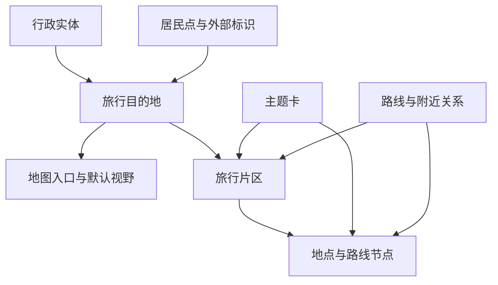
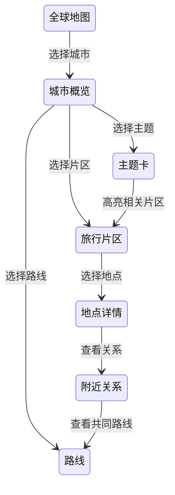
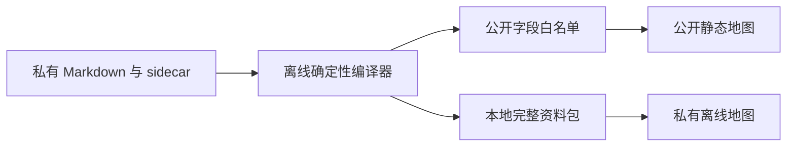

# 调研：城市攻略结构与旅行地图适配性

## 调研目标

本文评估城市攻略如何稳定支持旅行地图，并给出可分阶段实施的数据与发布方案。需要回答四个问题：

1. 哪些攻略信息适合公开结构化呈现，哪些应保留在私有原文；
2. 城市点、主题卡、片区、路线和附近关系应如何联动；
3. Markdown schema 需要怎样演进，才能稳定自动生成网页；
4. 在不使用在线 AI、也不公开完整攻略的前提下，地图如何继续与攻略深入结合。

本文的直接决策对象是地图内容契约，而不是视觉样式。建议先把公开边界和数据接口稳定下来，再扩展更深的地图交互。

## 范围与方法

### 评估基线

评估基于远端 `main` 的提交 `950752f`，该版本已经合入结构化地图界面。基线中共有 525 个城市页，其中中国 523 个、法国 1 个、日本 1 个；所有城市页均为 `schema_version: 1` 和 `content_status: researched`。

本次检查覆盖：

- 城市模板、城市页 frontmatter、固定 H2、H3、Markdown 表格、路线和 Mermaid；
- 中国 GeoNames 固定清单及合并、重复和范围外决定；
- 地图的同步、公开投影、主题卡解析、附近计算和 Pages 构建流程；
- 酒泉、林芝、呼伦贝尔、北京、苏州、大理、塔城等不同空间形态与敏感边界样本。

### 方法与限制

检查以仓库、Git 历史、自动校验和构建记录为证据，不把其他工作树中的未提交改动计入稳定现状。本文不评估实时交通、票价或具体 POI 坐标的正确性，也不提出在线推荐或实时路线服务。

## 资料与证据

### 内容与校验契约

- [城市模板](../../templates/city.md)定义了十个固定 H2，以及速览、片区、景点、路线、住宿、交通和来源的推荐表达。
- [仓库校验器](../../scripts/validate_repository.py)检查 `researched` 页面元数据、H2 顺序、表格列数、本地链接和覆盖账本，但不检查页首引用块、表头语义、字段枚举或跨对象引用。
- [项目说明](../../README.md)明确 Markdown 是主要内容产品，并区分稳定旅行事实与需要行前复核的动态信息。
- [许可证说明](../../LICENSE.md)将既有原创 Markdown 置于 CC BY 4.0；GeoNames、OpenStreetMap、Wikidata 和媒体具有各自的许可边界。

### 当前网页链路

- [攻略同步脚本](../../site/scripts/sync-guides.mjs)读取中国城市 Markdown，按 `geonames_id` 联接固定清单坐标，提取摘要、建议停留、关键词和章节信息。
- [公开投影脚本](../../site/scripts/export-public-guides.ts)把攻略解析为结构化 JSON，并在导出后删除临时 `public/guides` 原始 Markdown。
- [主题卡解析器](../../site/app/components/guideBrowse.ts)仍通过 H2、H3、表头别名和文本标签识别八类内容。
- [地图主界面](../../site/app/components/TravelMap.tsx)提供城市聚类、视野目录、搜索、主题卡和按直线距离排序的附近城市。

提交 `950752f` 的 Pages 构建已经成功，说明“建议停留只读取页首引用块”的已知构建故障得到兼容处理；但兼容解析仍然依赖自然语言结构，不构成稳定地图 schema。

## 已确认的事实

### 城市级索引已经可稳定生成

523 个中国城市页都可以通过 `geonames_id` 与本地固定清单联接经纬度。城市名称、行政区、研究日期、内容状态和地图锚点足以生成城市聚类、目录、搜索入口和基础卡片。

GeoNames 点只代表城市或驻地的定位记录，不代表攻略范围或行政边界。酒泉页面的城市点位于肃州主城，而攻略范围覆盖多个县域；林芝页面同时区分法定行政实体与巴宜落脚点；呼伦贝尔页面以海拉尔为旅行核心，却不能把多个独立县级市视为附近景点。

### 一级章节稳定，章节内部并不稳定

所有城市页的十个 H2 完全一致，适合导航和人工阅读；但标准表头只覆盖部分页面：

| 章节 | 使用标准模板表头的页面 | 总页面 |
|---|---:|---:|
| 城市速览 | 431 | 525 |
| 城市格局与游览区域 | 353 | 525 |
| 主要景点 | 481 | 525 |

更深的统计表明，景点、片区和路线仍使用大量自由文本：等级字段常把规范值和解释句写在同一单元格；景点的“区域”文本也不能稳定关联片区表。路线主要由 H3、粗体标签、箭头和自然语言组成，没有稳定路线 ID 或节点引用。

因此，当前 Markdown 是优秀的编辑源，却不是可靠的地图数据接口。网页可以继续做容错展示，但不能把启发式解析结果当作长期数据契约。

### 原始 Markdown 已移除，攻略语义仍大量公开

当前构建会删除公开目录中的原始 Markdown，这是已经完成的重要止漏措施。不过结构化 JSON 仍包含“城市速览、片区、主要景点、美食、经典行程、住宿、交通、行前核对”八类内容，其中包括路线顺序、住宿取舍、交通建议和动态核对入口。

这意味着当前版本实现的是“不公开原始 Markdown 文件”，尚未完全实现“不公开完整攻略语义”。如果目标是只公开摘要地图，公开投影需要从“解析几乎全部正文后再输出”改为“只读取显式白名单字段”。

### 附近和路线还只是展示原型

当前附近城市按球面直线距离排序，并已在界面标注“直线距离”。这种结果适合发现城市，但不能推导顺路、交通便利或适合同日。

路线图层仍是隐藏的示例线路，不读取攻略路线。现有攻略也没有可靠的 POI 坐标、片区几何、路线节点 ID 和交通段数据，因此不能安全地从正文直接画出道路级线路。

### 地图对象需要独立身份

行政实体、居民点、旅行目的地和地图入口并不总是一一对应。建议采用以下关系：



旅行目的地应使用项目自有稳定 ID；GeoNames、Wikidata 和行政代码只是外部引用。多中心、环湖、走廊和广域目的地应支持默认包围框，不能让单个城市点暗示整个攻略都集中在点附近。

## 方案比较

| 方案 | 优点 | 主要问题 | 适用范围 |
|---|---|---|---|
| 继续启发式解析正文 | 迁移成本最低，可马上展示大量卡片 | 构建契约随文案漂移；难以控制公开范围；无法稳定关联片区、POI 和路线 | 只适合作为过渡展示层 |
| 强制所有正文表格完全统一 | 可减少部分解析分支 | 会损害攻略可读性；仍缺少稳定 ID、坐标、敏感级别和引用关系 | 不建议作为主方案 |
| Frontmatter 内嵌全部地图数据 | 单文件携带全部信息 | frontmatter 会变得庞大，编辑冲突和人工错误增加 | 仅适合地图对象很少的页面 |
| 文档信封加地图 sidecar | 保留自由叙事；地图契约可严格校验；公开投影可独立控制 | 需要双栈解析和逐步迁移 | 推荐方案 |

推荐保留 Markdown 正文作为私有、人类可读的内容源，使用 `schema_version: 2` 描述文档身份、地图入口和发布策略；把片区、地点、路线与关系放进相邻的 `*.map.yml`。网页只消费经过白名单编译的版本化 JSON 或 GeoJSON。

## 建议

### 公开与私有分层

| 层级 | 内容 |
|---|---|
| 可公开 | 城市公开 ID、名称、行政区、城市地图锚点、研究日期、人工短摘要、少量主题标签、停留区间和通用等级 |
| 条件公开 | 经人工确认的游客入口、精选 POI、粗粒度片区和路线骨架；每项必须声明位置精度、开放状态、敏感级别和许可 |
| 私有原文 | 完整导语、主要看点长文、路线串联逻辑、预约锚点、休息与删减策略、住宿交通权衡、完整来源和更新记录 |
| 禁止发布 | 审核者、内部审计、边境或生产空间精确路书、未公开设施、用户画像和个人健康或证件信息 |

私有化不能隐藏必要的安全边界。公开卡片仍应保留短而保守的提示，例如“仅进入正式游客区，开放、证件与摄影规则需向官方核验”。

### 文档信封

建议 v2 frontmatter 只保存身份、范围、地图入口和发布策略：

```yaml
schema_version: 2
document_type: city_guide
guide_id: "dest:cn:shanghai"
display_name: "上海"

country: "中国"
country_code: "CN"
admin_area: "上海市"
city: "上海市"

external_refs:
  geonames: "1796236"
  wikidata: "Q8686"
  legal_admin_code: "310000"

content_status: researched
last_researched: "2026-08-12"
languages: ["zh-CN"]

map_anchor:
  source: geonames
  source_id: "1796236"
  precision: city

publication:
  visibility: public
  expose_body: false
  public_summary: "人工编写的公开短摘要"
  public_tags: [history, architecture, museums]

map_data_file: "./上海市.map.yml"
```

详细地图对象使用 sidecar：

- `areas[]`：`area_id`、名称、类型、几何精度、父片区和公开摘要；
- `places[]`：`place_id`、`area_id`、角色、坐标、开放状态、优先级、用时、标准等级和敏感级别；
- `routes[]`：`route_id`、路线类型、有序步骤、交通段、适用条件和可选节点；
- `relations[]`：步行可达、同片区、需换乘、适合同日、独立一日和不建议同日等关系；
- `rights`：来源、许可证、署名和核验日期。

所有等级字段都应拆成规范值和备注，例如 `effort_code: medium` 与 `effort_note: "含长距离滨江步行"`。

### 地图交互



城市概览默认显示核心片区，远郊用“完整一日”或“建议过夜”的方向卡表示。路线默认只画节点顺序或示意线；只有具备来源、核验日期和许可的几何才能显示精确线路。附近城市继续保留直线距离，同时增加人工关系，不能从距离自动推导可达性。

### 双静态构建



公开构建只读取显式 `publication` 和可公开对象，生成静态 JSON/GeoJSON；私有构建生成完整 Markdown、章节索引、全文搜索索引和空间关系。两边共享 `guide_id / area_id / place_id / route_id`，从而实现地图和攻略双向定位。

搜索、主题筛选、附近计算、路线组合和收藏均可在本地完成，不需要在线 AI、向量数据库或在线地理编码。严格离线模式可按地区加载底图包；若继续使用第三方瓦片，则应明确其仍可获得访问 IP 与地图视野信息。

## 对当前项目的影响

### 分阶段实施

| 阶段 | 工作 | 验收标准 |
|---|---|---|
| P0：发布门禁 | 明确既有公开历史；将公开投影改为字段白名单；增加泄漏扫描 | 私有测试句不出现在 HTML、JS、JSON、搜索索引、源码映射或构建日志 |
| P1：城市点 | 保留当前城市聚类、目录和搜索；明确城市点不是行政边界 | 输出城市与合格决策逐项一致，无重复、合并或范围外点位 |
| P2：v2 试点 | 选择上海、大理、文昌、延吉、酒泉、林芝、东京和巴黎建立 v2 与 sidecar | 不读取正文即可生成城市卡；零未知枚举、零悬空引用 |
| P3：片区与地点 | 先迁移核心片区、A 级地点和路线节点 | 主题、片区和地点高亮一致；每个几何都有精度、开放和敏感声明 |
| P4：路线与附近 | 增加有序路线、交通段和显式旅行关系 | 不从距离推导可达性；未经核验路线不绘制道路级几何 |
| P5：私有离线版 | 生成完整本地资料包和章节双向联动 | 断网可完成选城市、看路线、打开完整攻略、返回地图 |

### 构建与维护

解析器应使用真正的 YAML 解析和 JSON Schema，统一字符串 ID、ISO 日期、语言列表，以及 `legal_admin_code` 和 `administrative_code` 的历史别名。v1 页面没有显式地图数据时，只生成城市点和最小基础卡，不再静默猜测片区、POI 与路线。

发布过程应固定排序并生成版本清单；同一提交连续构建两次应得到相同哈希。公开产物扫描应覆盖 Markdown 原文、来源表、内部审核字段、绝对路径、原始清单、源码映射和构建日志。

## 待验证事项

| 事项 | 验证方法 | 通过条件 |
|---|---|---|
| 既有公开许可范围 | 审计 Git 历史、Pages 产物、Release 和贡献者权利 | 明确哪些历史版本已经在 CC BY 4.0 下公开，哪些未来内容可以转入私有源 |
| 公开投影是否仍可重构完整攻略 | 对八类结构化 JSON 与源 Markdown 做字段和文本重合审计 | 公开包只包含批准字段，不能恢复完整路线策略、来源链和内部判断 |
| v2 对差异化城市是否足够 | 用紧凑城市、多中心城市、环湖目的地、广域县域和境外城市做 golden tests | 所有样本零未知枚举、零悬空引用、零位置精度歧义 |
| POI 与片区坐标许可 | 逐对象记录来源、许可、署名和核验日期 | 缺少权利或敏感审核的对象不进入公开包 |
| 离线底图边界 | 比较在线瓦片、按城市下载包和完全离线底图的体积与许可 | 选择的方案可离线使用或明确披露网络与 ODbL 责任 |
| 构建失败后的降级 | 人为制造单城 sidecar 校验失败 | 只关闭该城的深层地图数据，城市点和上一版公开包仍可用 |
