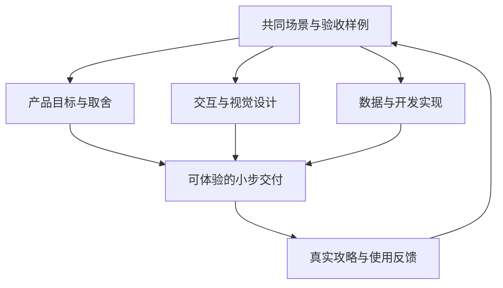
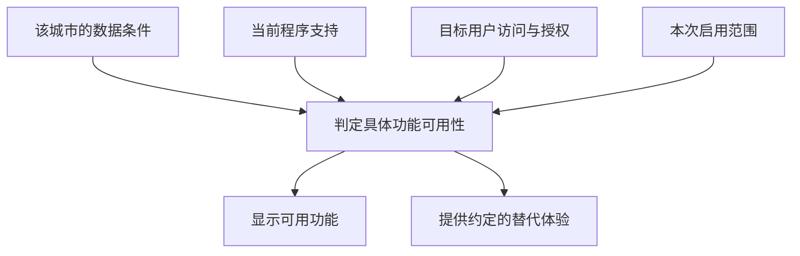

# 产品、设计与开发并行协作约定

**本项目采用产品、设计、开发并行推进的同步敏捷方式。需求、交互和实现会在真实使用中持续调整；攻略与数据规范必须支持这种变化。** 每次迭代共同交付一个可验证的旅行体验，并说明它在不同国家、城市和数据条件下的表现。

状态：当前项目协作约定，自 2026-09-06 起采用。本文规定工作方式和兼容责任；文中的路线、图片扩展要求不表示这些功能已经实现。[数据契约](designs/travel-guide-data-contract.md)仍为待接入的 v2 设计提案。

## 围绕同一个体验并行工作

每次从具体场景出发，例如“用户在东京选择几个地点，调整游览顺序，再查看沿途图片”。产品明确用户要完成什么，设计明确用户怎样操作和理解结果，开发明确系统凭哪些数据实现并可靠保存结果。攻略研究为三者提供真实内容、空间关系和证据。

三种工作可以由同一位维护者或代理承担，也可以并行分工。各方从第一版场景和样例开始合作，随着证据更新彼此调整；完整产品文档、定稿设计和全量数据都不是开始探索的前提。

设计试验可以使用明确标记的示例数据；正式体验使用有来源的真实数据。示例地点、模拟路程和占位图片不能成为正式覆盖量或已实现能力的证据。

## 每次变化共用一份轻量记录

影响行为、数据或兼容性时，使用[功能变更记录模板](templates/feature-change.md)记录当前决定。记录可以放在 `docs/changes/<日期>-<主题>.md`，也可以直接写入已有功能文档；同一决定只维护一个权威位置，其他材料链接到它。

| 共同需要知道的内容 | 最少写到的程度 |
|---|---|
| 用户场景 | 谁在什么情况下要完成什么，以及本次做到哪里 |
| 产品取舍 | 本次包含、不包含和仍在验证的行为 |
| 设计表现 | 正常、数据不全、空白、加载失败时的界面；适用时包含移动端和键盘操作 |
| 数据及实现 | 复用什么对象，新增什么字段或模块，哪些代码支持尚未具备 |
| 兼容范围 | 旧攻略、无新增数据城市、其他国家、已保存用户记录怎样继续使用 |
| 验收与证据 | 代表样例、验证结果、实际版本和未完成事项 |

纯文案、颜色、间距等不改变行为和数据含义的小改动，可以直接在任务或差异说明中记录。涉及身份、字段含义、交互状态或发布范围时，必须同步对应契约；无需为每个小改动重写整套文档。

记录当前选择、选择依据和替代了哪个旧决定。产品意图、设计方案、开发实现、数据覆盖分别标记状态；“设计可用”“本地验证通过”和“已发布”各有证据。一个功能在东京可用，不意味着所有城市已经支持。

需求中途变化时，先更新本次目标、受影响状态和验收样例，再同步涉及的设计、契约与实现。已经验证且不受影响的部分保留，独立工作继续推进。需要用户决定且无法从当前指令判断的取舍应明确提出；可逆且已获授权的探索不增加额外审批环节。

## 保持稳定的身份和可组合的能力

目的地、地点、路线、图片和用户行程使用稳定 ID。名称翻译、目录移动、卡片样式、排序和展示范围改变时保留对象身份。确需合并或拆分实体时记录映射，并处理旧链接、收藏和行程引用。

攻略正文表达旅行判断，结构化数据表达可计算的关系，界面按场景组织这些内容。同一地点可以被地图、路线、图片和攻略共同引用；更换布局不要求复制一套国家或城市内容。

新功能作为独立能力增量接入。基础阅读、城市地图、地点地图、路线站点、路线编辑、图片展示可以处于不同成熟度，也可以分别试点。**新能力所需字段只对启用该能力的对象成为必需项，不自动升级为全库必填字段。**

一个入口能够开放，需要同时满足：该对象的数据已准备好、当前程序能读取和实现、相关内容允许向目标用户提供、当前交付范围已启用这项功能。能力标记按契约表达数据条件及适用的访问条件，不能单凭标记推定当前程序已实现或本次已启用。

可用性按目的地、功能和必要的具体对象判断。未知、未录入、不适用、加载失败要在数据或校验报告中区分；界面使用用户能理解的说明。不能用空数组、零时长或假的坐标把未知包装成完整。

## 让数据和功能逐步升级

源文件格式、网页读取格式、地图和图片等可选模块分别管理版本。只改变图片布局不改变源格式；新增图片模块不强迫全部城市重写正文。现有 `schema_version`、`data_version`、`map_schema_version` 的具体含义由数据契约负责，新增模块的版本名和字段在对应功能设计中确定。

| 变化 | 默认兼容方式 | 验收重点 |
|---|---|---|
| 调整名称、布局、文案 | 复用现有 ID 和语义，更新展示逻辑 | 原入口、内容和操作仍可用 |
| 新增可选字段或模块 | 定义缺省行为，先让读取端兼容，再让写入端产生新数据 | 有数据和无数据样例均可用 |
| 新增国家差异 | 优先增加配置、来源映射或适配器，输出共同对象 | 原国家行为稳定，差异有明确解释 |
| 增加必填值或改变单位、含义 | 作为破坏兼容的变化处理，提供版本、迁移和退出旧版条件 | 原数据可转换或保留读取，错误有定位 |
| 合并地点、删除路线或图片 | 保留旧 ID 映射或失效记录，处理已有引用 | 收藏和行程不静默指向错误对象 |

同步更新是同一变更中把责任和兼容方案配齐，不要求所有读写端同时上线。通常先扩展读取能力，再发布新数据，再逐批迁移；旧读取方式的删除由已记录的覆盖和兼容结果决定。

编译输入仍严格检查声明的字段和引用。支持的核心版本内，客户端按约定忽略不理解的新增可选字段，缺失新能力按不可用处理；未知核心版本不能猜测读取。一个新可选模块若旧客户端尚不支持，应由兼容投影省略或按已定义机制忽略，保留旧能力。

可选模块缺失可以降级；存在但语法错误、引用失效或授权不符的模块应明确报错。实验模块若本次不交付，须在构建输入/输出选择中明确排除该模块及其引用，再验证剩余发布包；不能只隐藏按钮而仍发布非法数据或资源。

回滚优先关闭本次新能力或切回上一完整发布包。涉及用户记录时，同时说明旧程序如何读取新记录、需不需要保留快照或迁移；不能只回退页面代码却丢掉用户已编辑的行程。

## 新国家和城市按能力接入

国家代码、当地名称、行政归属、时区、币种、空间尺度和来源差异通过显式数据与适配处理。文件夹和中文名称不能承担实体判定。新增国家默认复用共同产品能力；确实无法共用的部分记录原因、适用范围和退出条件，避免在页面中不断堆积国家名称判断。

每个城市先达到本次选定的交付基线，再按功能需要增加数据。完整城市攻略仍须遵守当前内容质量要求；图片、结构化路线等是独立增量，不会因缺少图片就把已研究的正文降回草稿。

测试样本按变化风险选择：至少覆盖已有城市、新国家样本和缺少新模块的城市；涉及地理或身份时增加同名、多中心、缺坐标等边界。涉及图片时增加缺图、加载失败和授权不足；涉及路线时增加缺用时、缺坐标和已保存行程。

四城样板和每批 10–20 城是当前建议的验证组合与交付粒度，可以按反馈调整。新国家研究、设计试验、路线或图片原型可并行开展；正式开放范围仍受本次真实数据和验收结果约束。

## 路线规划的扩展示例

路线能力应逐步命名并分别验收。当前数据契约中的 `routes=true` 只表示存在引用闭合的结构化推荐路线，不能延伸解释为可编辑、已算出交通或能够导航。

| 用户体验 | 所需数据和实现 | 数据不足时的体验 |
|---|---|---|
| 阅读推荐行程 | 可访问的攻略正文 | 保留正文阅读 |
| 查看站点清单 | 稳定地点 ID、有序节点、有效引用 | 缺坐标仍可读清单 |
| 查看顺序示意 | 节点坐标及顺序，标明示意含义 | 不跨过未知节点伪造连续线路，回退清单 |
| 手动组合行程 | 可复用地点、可保存的用户草稿、顺序和编辑交互 | 缺用时仍可编辑，标明尚未计算 |
| 计算交通或优化顺序 | 明确的服务/算法、交通方式、时长、时区和预约约束 | 保留手动调整或推荐路线，不把直线显示成导航 |

推荐路线属于公共知识；用户选点、删减和重新排序形成独立行程记录。地点更新不能覆盖用户顺序。规划功能的设计要明确保存、撤销、失效地点提示和迁移方式；具体存储方案由该功能的实际需求决定。

如果产品从“浏览推荐路线”转向“自由组合”，可继续复用地点和来源，再增加用户行程对象、编辑状态和验收样例。新的交互不要求重写所有城市路线。

## 图片展示的扩展示例

图片是可选内容模块，以稳定媒体 ID 关联目的地或地点。先定义关联对象和资源来源，再设计封面、画廊、轮播等展示；裁剪、焦点、顺序和主图选择作为展示配置，复用同一媒体资产。

| 数据责任 | 最小需要记录的内容 |
|---|---|
| 身份及关联 | 媒体 ID、关联目的地/地点 ID、资源引用 |
| 内容表达 | 替代文本、必要的图注；拍摄时间未知时明确留空 |
| 来源及使用范围 | 作者、来源页、授权或许可依据、署名要求、核验状态 |
| 展示和加载 | 宽高、主图/顺序，按需增加缩略图、裁剪焦点和资源版本 |

图片详情字段、模块存储位置和机器校验在图片功能提案中确定，上表是该提案必须覆盖的责任。正文来源策略不自动代表有权再发布页面上的图片；无授权依据的图片可以记录为研究线索，正式资源包和界面都不得包含它。

无图城市保留地图、摘要和攻略；资源加载失败显示稳定的替代布局和合适的说明。图片数量与线路计算能力相互独立，不能用一张通用风景图冒充该目的地的真实照片。设计预览中的占位图要明确标注。

图片按需加载并单独计算体积、缩略图和缓存预算，避免把整国原图带入首屏。图片功能变更同时验收有图、无图、长宽比例差异、加载失败和使用权限不足；更新视觉布局后检查替代文本、阅读顺序和归属链接仍然正确。

## 同步文档和验证交付

每次交付说明用户现在能做什么、在哪些对象和条件下能做，以及尚缺什么。产品意图、设计状态、数据条件和程序行为应对得上同一组样例。

| 本次实际改变 | 同步的权威材料 |
|---|---|
| 用户目标、交互、空状态或移动端行为 | 当前功能记录及设计材料 |
| 字段、单位、身份、引用或版本 | 数据/功能契约、样例、校验与迁移说明 |
| 新国家来源和适配规则 | 国家配置、候选决定及覆盖记录 |
| 缺数据表现或功能开放范围 | 能力定义、产品说明和验收样例 |
| 实现完成、暂缓或上线 | 对应状态、版本及验证证据 |

进入本地验收时，相关代码、样例和规范一起可审阅。验证包括本次正常路径、缺数据路径及受影响旧行为；按风险扩大范围，不为纯样式改动添加一套数据迁移测试。

阻断问题约束依赖它的交付范围。其他无依赖的研究、设计和开发继续推进，延期项写明影响对象与恢复条件。功能做了一半时如实记录各部分进度，不用“完成”掩盖数据或交互仍缺的部分。

## 约定的维护方式

用户当前明确的方向和约束优先；本约定规定协作与兼容原则，当前采用的功能决定规定具体行为，契约规定数据含义，模板提供写作默认值，带日期的调研保存历史证据。冲突应修订到对应权威材料，不能靠在多个文档末尾追加相反说明解决。

产品目标、设计和数据契约都允许修改。本约定也可以随真实经验调整，但修改时要说明影响哪些已有承诺、如何兼容或迁移、用什么样例验证。阶段、四城样板和当前不包含的功能都可以重新取舍，不能被用作永久禁止新需求的理由。

后续维护者和代理开始涉及产品、设计、攻略格式或功能扩展的工作时，应先阅读本页，再读取本次涉及的契约与记录。避免从历史截图、旧报告或模板推断当前完整产品方向。

代码是当前实现的证据，文档中的“采用”是目标决定，两者不一致时标记差距并在本次授权范围内处理。GitHub 发布方式及本地修改、提交、推送的授权范围继续遵守 [AGENTS.md](../AGENTS.md)。
